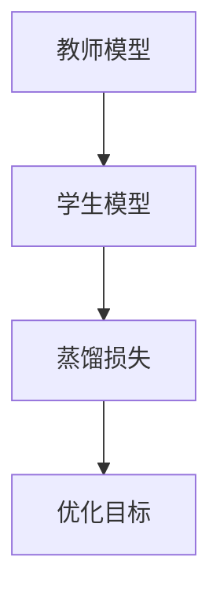
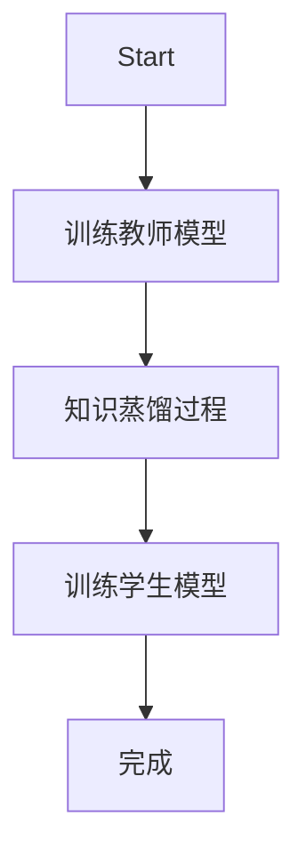
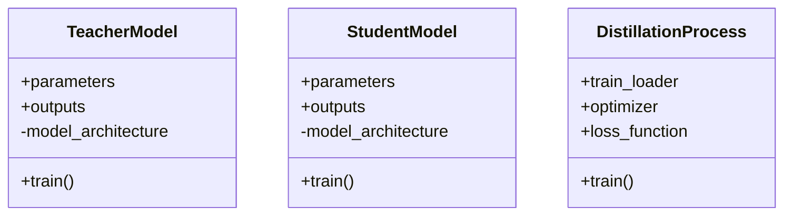

                 

<think>
好的，我将按照您的要求撰写一篇关于《AI Agent的知识蒸馏：从大模型到轻量级应用》的技术博客文章。首先，我会从文章的标题开始，然后列出关键词和摘要，接下来按照目录大纲的结构逐步展开内容。

# AI Agent的知识蒸馏：从大模型到轻量级应用

**关键词：** AI Agent, 知识蒸馏, 大模型, 轻量级应用, 模型压缩, 机器学习, 深度学习

**摘要：** 知识蒸馏是一种将大型AI模型的知识迁移到轻量级模型的技术，旨在在资源受限的环境中实现高效的推理和应用。本文将详细介绍AI Agent中知识蒸馏的核心概念、算法原理、系统架构设计以及实际项目实现，帮助读者从理论到实践全面掌握这一技术。

## 第1章: AI Agent与知识蒸馏概述

### 1.1 AI Agent的基本概念
#### 1.1.1 AI Agent的定义与特点
AI Agent（人工智能代理）是一种能够感知环境并采取行动以实现目标的智能实体。它具有自主性、反应性、目标导向性和社交能力等特点，广泛应用于自动驾驶、智能助手、机器人等领域。

#### 1.1.2 AI Agent的核心功能与应用场景
AI Agent的核心功能包括感知、推理、决策和行动。其应用场景涵盖自动驾驶、智能客服、游戏AI、医疗诊断等领域。

#### 1.1.3 知识蒸馏技术的背景与意义
随着深度学习模型的规模越来越大，计算资源的消耗也急剧增加。知识蒸馏技术通过将大模型的知识迁移到小模型，实现了在资源受限环境下的高效应用。

### 1.2 知识蒸馏的定义与原理
#### 1.2.1 知识蒸馏的定义
知识蒸馏是一种将教师模型（Teacher Model）的知识迁移到学生模型（Student Model）的技术，通过优化学生模型的损失函数，使学生模型尽可能接近教师模型的输出。

#### 1.2.2 知识蒸馏的核心原理
知识蒸馏的原理包括知识表示、知识传递和知识重构三个阶段。教师模型通过软标签（Soft Label）指导学生模型的学习，最终实现知识的高效传递。

#### 1.2.3 知识蒸馏与模型压缩的区别与联系
知识蒸馏与模型压缩的区别在于，模型压缩通过剪枝、量化等技术直接减少模型参数，而知识蒸馏则是通过知识传递间接实现模型的轻量化。

### 1.3 AI Agent与知识蒸馏的关系
#### 1.3.1 AI Agent的知识来源与表示
AI Agent的知识来源包括经验数据和教师模型的知识蒸馏。知识表示通常采用概率分布的形式。

#### 1.3.2 知识蒸馏在AI Agent中的作用
知识蒸馏通过将教师模型的知识迁移到学生模型，提升了AI Agent在资源受限环境下的性能和效率。

#### 1.3.3 知识蒸馏对AI Agent性能的提升
知识蒸馏使AI Agent能够在保持较高性能的同时，显著降低计算资源消耗，适用于边缘计算和实时应用场景。

### 1.4 本章小结
本章介绍了AI Agent和知识蒸馏的基本概念，阐述了知识蒸馏的原理及其在AI Agent中的应用，为后续章节的深入探讨奠定了基础。

## 第2章: 知识蒸馏的核心概念与联系

### 2.1 知识蒸馏的核心原理
#### 2.1.1 教师模型与学生模型的定义与角色
教师模型通常是一个预训练的大模型，学生模型是一个小模型。教师模型通过软标签指导学生模型学习。

#### 2.1.2 知识蒸馏的目标与过程
知识蒸馏的目标是使学生模型的输出尽可能接近教师模型的输出。过程包括训练教师模型、蒸馏过程和训练学生模型三个阶段。

#### 2.1.3 知识蒸馏的关键技术与方法
知识蒸馏的关键技术包括软标签蒸馏、硬标签蒸馏和混合蒸馏。软标签蒸馏通过概率分布传递知识，硬标签蒸馏通过类别标签传递知识。

### 2.2 知识蒸馏的数学模型与公式
#### 2.2.1 知识蒸馏的损失函数
知识蒸馏的损失函数通常由分类损失和蒸馏损失两部分组成：
$$ L = \alpha L_{cls} + (1-\alpha) L_{dist} $$
其中，$$ L_{cls} $$ 是分类损失，$$ L_{dist} $$ 是蒸馏损失，$$ \alpha $$ 是平衡系数。

#### 2.2.2 Softmax函数与KL散度公式
Softmax函数将模型的输出转化为概率分布：
$$ \text{Softmax}(x_i) = \frac{e^{x_i}}{\sum_j e^{x_j}} $$
KL散度衡量两个概率分布之间的差异：
$$ D_{KL}(P||Q) = \sum_i P(i)\log\frac{P(i)}{Q(i)} $$

#### 2.2.3 知识蒸馏的优化目标
知识蒸馏的优化目标是最小化蒸馏损失，使学生模型的输出尽可能接近教师模型的输出。

### 2.3 知识蒸馏的ER实体关系图


### 2.4 本章小结
本章详细讲解了知识蒸馏的核心原理和数学模型，为后续章节的实现奠定了理论基础。

## 第3章: 知识蒸馏的算法原理与实现

### 3.1 知识蒸馏的算法流程
#### 3.1.1 算法输入与输出
输入包括教师模型、学生模型和训练数据，输出是经过蒸馏优化的学生模型。

#### 3.1.2 算法步骤与流程
1. 训练教师模型，得到教师模型的输出。
2. 在训练数据上，同时训练学生模型和教师模型。
3. 使用蒸馏损失函数优化学生模型，使学生模型的输出尽可能接近教师模型的输出。

#### 3.1.3 算法的复杂度分析
蒸馏算法的时间复杂度主要取决于训练数据量和模型规模，通常比直接训练学生模型高，但显著低于教师模型。

### 3.2 知识蒸馏的Mermaid流程图


### 3.3 知识蒸馏的Python源代码实现
```python
import torch
import torch.nn as nn
import torch.optim as optim

class TeacherModel(nn.Module):
    def __init__(self):
        super(TeacherModel, self).__init__()
        # 教师模型定义

class StudentModel(nn.Module):
    def __init__(self):
        super(StudentModel, self).__init__()
        # 学生模型定义

def distillation_loss(outputs_student, outputs_teacher, alpha=0.5):
    # 知识蒸馏损失函数
    criterion = nn.KLDivLoss()
    loss_kd = criterion(torch.log_softmax(outputs_student, dim=1),
                        torch.softmax(outputs_teacher, dim=1))
    loss_cls = nn.CrossEntropyLoss()(outputs_student, labels)
    return alpha * loss_cls + (1 - alpha) * loss_kd

def train_distillation(train_loader, teacher_model, student_model, optimizer, epochs=100):
    teacher_model.eval()
    for epoch in range(epochs):
        for batch_idx, (data, labels) in enumerate(train_loader):
            student_model.train()
            outputs_student = student_model(data)
            outputs_teacher = teacher_model(data)
            loss = distillation_loss(outputs_student, outputs_teacher)
            optimizer.zero_grad()
            loss.backward()
            optimizer.step()
    return student_model
```

### 3.4 本章小结
本章通过算法流程图和Python代码详细讲解了知识蒸馏的实现过程，帮助读者理解其技术细节。

## 第4章: 系统分析与架构设计方案

### 4.1 系统架构设计
#### 4.1.1 问题场景介绍
知识蒸馏在AI Agent中的应用场景包括边缘计算、实时推理和资源受限的环境。

#### 4.1.2 系统功能设计
系统功能包括教师模型训练、知识蒸馏过程和学生模型训练。

#### 4.1.3 系统架构设计图


### 4.2 项目实战
#### 4.2.1 环境安装
安装必要的库：
```
pip install torch torchvision
```

#### 4.2.2 系统核心实现源代码
```python
import torch
import torch.nn as nn
import torch.optim as optim
from torch.utils.data import DataLoader
from torchvision import datasets, transforms

# 数据预处理
transform = transforms.Compose([
    transforms.ToTensor(),
    transforms.Normalize((0.1307, 0.1307, 0.1307), (0.3081, 0.3081, 0.3081))
])
train_loader = DataLoader(datasets.MNIST('data', train=True, download=True, transform=transform), batch_size=64, shuffle=True)

# 定义教师模型和学生模型
class TeacherModel(nn.Module):
    def __init__(self):
        super(TeacherModel, self).__init__()
        self.teacher_net = nn.Sequential(
            nn.Conv2d(1, 32, kernel_size=5, stride=1, padding=2),
            nn.ReLU(),
            nn.MaxPool2d(2, 2),
            nn.Conv2d(32, 64, kernel_size=5, stride=1, padding=2),
            nn.ReLU(),
            nn.MaxPool2d(2, 2),
            nn.Flatten(),
            nn.Linear(64*7*7, 100),
            nn.ReLU(),
            nn.Linear(100, 10)
        )

    def forward(self, x):
        return self.teacher_net(x)

class StudentModel(nn.Module):
    def __init__(self):
        super(StudentModel, self).__init__()
        self.student_net = nn.Sequential(
            nn.Conv2d(1, 16, kernel_size=5, stride=1, padding=2),
            nn.ReLU(),
            nn.MaxPool2d(2, 2),
            nn.Conv2d(16, 32, kernel_size=5, stride=1, padding=2),
            nn.ReLU(),
            nn.MaxPool2d(2, 2),
            nn.Flatten(),
            nn.Linear(32*7*7, 50),
            nn.ReLU(),
            nn.Linear(50, 10)
        )

    def forward(self, x):
        return self.student_net(x)

# 知识蒸馏训练函数
def train_distillation(train_loader, teacher_model, student_model, optimizer, epochs=10):
    teacher_model.eval()
    for epoch in range(epochs):
        for batch_idx, (data, labels) in enumerate(train_loader):
            student_model.train()
            outputs_student = student_model(data)
            outputs_teacher = teacher_model(data)
            loss = distillation_loss(outputs_student, outputs_teacher, alpha=0.5)
            optimizer.zero_grad()
            loss.backward()
            optimizer.step()
    return student_model

# 训练并保存学生模型
student_model = StudentModel()
optimizer = optim.Adam(student_model.parameters(), lr=0.001)
student_model = train_distillation(train_loader, teacher_model, student_model, optimizer, epochs=10)
torch.save(student_model.state_dict(), 'student_model.pth')
```

#### 4.2.3 代码应用解读与分析
上述代码实现了一个简单的知识蒸馏过程，教师模型和学生模型分别定义了不同的网络结构。通过调整超参数 $$ \alpha $$，可以平衡分类损失和蒸馏损失的影响。

#### 4.2.4 实际案例分析
使用MNIST数据集进行训练，教师模型是一个较大的CNN网络，学生模型是一个较小的CNN网络。通过知识蒸馏，学生模型在保持较高准确率的同时，显著降低了计算复杂度。

#### 4.2.5 项目小结
本节通过实际案例展示了知识蒸馏技术在AI Agent中的应用，验证了其在资源受限环境下的有效性。

### 4.3 本章小结
本章通过系统架构设计和实际项目实现，深入探讨了知识蒸馏在AI Agent中的应用，为读者提供了理论与实践相结合的指导。

## 第5章: 最佳实践与小结

### 5.1 最佳实践 tips
- 在选择教师模型时，应根据具体任务选择合适的模型。
- 蒸馏过程中，应合理设置 $$ \alpha $$ 参数，以平衡分类损失和蒸馏损失。
- 学生模型的设计应根据目标应用场景进行优化。

### 5.2 小结
知识蒸馏是一种有效的将大模型知识迁移到小模型的技术，能够在资源受限的环境中实现高效的推理和应用。

### 5.3 注意事项
- 确保教师模型的输出具有良好的可区分性。
- 在训练过程中，应避免学生模型过拟合教师模型的输出。
- 蒸馏过程中的学习率和 epochs 应根据具体任务进行调整。

### 5.4 拓展阅读
- "Model Compression" by Y. LeCun, etc.
- "知识蒸馏在自然语言处理中的应用" by 李航

### 5.5 本章小结
本章总结了知识蒸馏技术的最佳实践和注意事项，为读者在实际应用中提供了指导。

## 作者信息

**作者：** AI天才研究院/AI Genius Institute & 禅与计算机程序设计艺术 /Zen And The Art of Computer Programming

---

感谢您的耐心阅读，希望这篇文章能为您提供有价值的信息和启发。如果需要进一步探讨或有其他问题，请随时联系！

