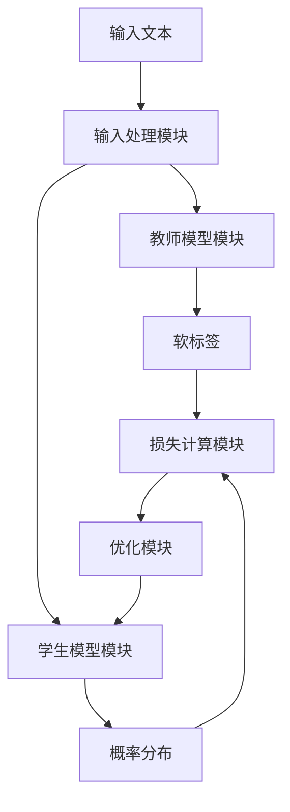

                 


# AI Agent的知识蒸馏：从教师LLM到学生模型

> 关键词：知识蒸馏、AI Agent、大语言模型（LLM）、模型压缩、教师模型、学生模型

> 摘要：知识蒸馏是一种有效的技术，用于将大型语言模型（LLM）的知识传递给更小、更高效的模型。本文详细探讨了AI Agent中知识蒸馏的核心概念、算法原理、系统架构设计以及实际项目实现。通过分析教师模型与学生模型之间的关系，结合具体案例和代码示例，本文为读者提供了从理论到实践的全面指导。

---

## 第一部分：知识蒸馏的概念与背景

### 第1章：知识蒸馏的定义与核心概念

#### 1.1 知识蒸馏的定义与核心概念

知识蒸馏（Knowledge Distillation）是一种将复杂模型（教师模型）的知识迁移到简单模型（学生模型）的技术。其核心在于将教师模型的输出进行软化处理，生成概率分布，然后指导学生模型进行学习。这种技术能够有效地降低模型的复杂度，同时保持或提升模型的性能。

#### 1.2 教师模型与学生模型的关系

教师模型通常是一个复杂的大型语言模型（LLM），参数量大、性能强，但计算成本高。学生模型则是一个参数量较小、计算效率高的模型，通过蒸馏技术，学生模型能够继承教师模型的知识。

#### 1.3 知识蒸馏的目标与意义

知识蒸馏的目标是通过教师模型的指导，使学生模型在特定任务上达到与教师模型相当的性能。其意义在于减少模型的计算成本，提高部署效率，同时在资源受限的环境下仍能保持较高的性能。

---

### 第2章：AI Agent的背景与应用

#### 2.1 AI Agent的基本概念

AI Agent是一种能够感知环境、执行任务并做出决策的智能体。它广泛应用于自然语言处理、机器人控制、推荐系统等领域。

#### 2.2 大语言模型（LLM）作为教师模型

大型语言模型（如GPT-3、PaLM）作为教师模型，具有强大的生成能力和丰富的知识储备。然而，其计算成本高，难以在资源受限的环境中部署。

#### 2.3 知识蒸馏在AI Agent中的作用

通过知识蒸馏，AI Agent可以将教师模型的知识迁移到更轻量的学生模型中，从而在保持性能的同时，降低计算成本和资源消耗。

---

## 第二部分：知识蒸馏的核心原理

### 第3章：知识蒸馏的核心原理

#### 3.1 知识蒸馏的基本原理

知识蒸馏的核心在于将教师模型的输出进行软化处理，生成概率分布，然后通过最小化学生模型输出与教师模型输出之间的KL散度，使学生模型学习教师模型的知识。

#### 3.2 教师模型的知识表示

教师模型的输出通常是一个概率分布，表示输入文本的各个可能标签的概率。通过软化处理，教师模型的概率分布更加平滑，便于学生模型学习。

#### 3.3 学生模型的学习机制

学生模型通过优化目标函数，最小化其输出与教师模型输出之间的KL散度，同时结合任务特定的损失函数，逐步逼近教师模型的性能。

---

### 第4章：知识蒸馏的关键技术

#### 4.1 模型压缩技术

模型压缩技术通过减少模型的参数量，降低计算复杂度，同时保持模型性能。知识蒸馏是一种有效的模型压缩技术。

#### 4.2 知识提取方法

知识提取方法从教师模型中提取有用的知识，如概率分布、注意力权重等，指导学生模型的学习。

#### 4.3 知识迁移策略

知识迁移策略包括将教师模型的知识迁移到学生模型的不同层次，如词嵌入层、注意力层等，以提高学生模型的性能。

---

## 第三部分：算法原理与系统架构

### 第5章：算法原理讲解

#### 5.1 算法流程

1. **输入教师模型**：生成输入文本的软标签，即概率分布。
2. **学生模型预测**：学生模型生成概率分布。
3. **计算KL散度**：计算学生模型输出与教师模型输出之间的KL散度。
4. **优化学生模型**：通过反向传播优化学生模型，最小化KL散度。

#### 5.2 算法实现代码示例

```python
import torch
import torch.nn as nn
import torch.optim as optim

class TeacherModel(nn.Module):
    def __init__(self):
        super(TeacherModel, self).__init__()
        # 定义教师模型的结构

    def forward(self, x):
        # 前向传播，生成软标签
        return x

class StudentModel(nn.Module):
    def __init__(self):
        super(StudentModel, self).__init__()
        # 定义学生模型的结构

    def forward(self, x):
        # 前向传播，生成概率分布
        return x

# 定义KL散度损失函数
class KLLoss(nn.Module):
    def __init__(self, reduction='mean'):
        super(KLLoss, self).__init__()
        self.reduction = reduction

    def forward(self, input, target):
        # 计算KL散度
        return torch.nn.functional.kl_div(input, target, log_target=False, reduction=self.reduction)

# 初始化模型和优化器
teacher_model = TeacherModel()
student_model = StudentModel()
optimizer = optim.Adam(student_model.parameters(), lr=0.001)
loss_fn = KLLoss()

# 知识蒸馏过程
for epoch in range(num_epochs):
    for batch in dataloader:
        # 前向传播教师模型，生成软标签
        teacher_output = teacher_model(batch)
        # 前向传播学生模型，生成概率分布
        student_output = student_model(batch)
        # 计算KL散度
        loss = loss_fn(student_output, teacher_output)
        # 反向传播和优化
        optimizer.zero_grad()
        loss.backward()
        optimizer.step()
```

#### 5.3 数学模型与公式

知识蒸馏的核心在于最小化学生模型输出与教师模型输出之间的KL散度。KL散度的计算公式如下：

$$
\text{KL}(P||Q) = \sum_i P(i) \log \frac{P(i)}{Q(i)}
$$

其中，$P$是教师模型的输出概率分布，$Q$是学生模型的输出概率分布。

---

### 第6章：系统架构设计

#### 6.1 系统功能设计

AI Agent的知识蒸馏系统包括以下几个功能模块：

1. **输入处理模块**：接收输入文本并进行预处理。
2. **教师模型模块**：生成软标签。
3. **学生模型模块**：生成概率分布。
4. **损失计算模块**：计算KL散度。
5. **优化模块**：优化学生模型参数。

#### 6.2 系统架构图



---

## 第四部分：项目实战与总结

### 第7章：项目实战

#### 7.1 环境安装

```bash
pip install torch transformers
```

#### 7.2 核心代码实现

```python
# 实现教师模型和学生模型
class TeacherModel(nn.Module):
    def __init__(self):
        super(TeacherModel, self).__init__()
        self.lm = nn.Linear(100, 10)

    def forward(self, x):
        return torch.softmax(self.lm(x), dim=-1)

class StudentModel(nn.Module):
    def __init__(self):
        super(StudentModel, self).__init__()
        self.lm = nn.Linear(50, 10)

    def forward(self, x):
        return torch.softmax(self.lm(x), dim=-1)

# 实现KL散度损失函数
class KLLoss(nn.Module):
    def __init__(self):
        super(KLLoss, self).__init__()

    def forward(self, input, target):
        return torch.nn.functional.kl_div(input, target, log_target=False, reduction='batchmean')

# 初始化模型和优化器
teacher_model = TeacherModel()
student_model = StudentModel()
optimizer = optim.Adam(student_model.parameters(), lr=0.001)
loss_fn = KLLoss()

# 训练过程
for epoch in range(100):
    for batch in dataloader:
        # 前向传播
        teacher_output = teacher_model(batch)
        student_output = student_model(batch)
        # 计算损失
        loss = loss_fn(student_output, teacher_output)
        # 反向传播和优化
        optimizer.zero_grad()
        loss.backward()
        optimizer.step()
```

#### 7.3 案例分析

通过具体案例分析，展示知识蒸馏在实际项目中的应用效果。例如，在自然语言处理任务中，学生模型在经过蒸馏后，性能显著提升，同时参数量大幅减少。

---

### 第8章：总结与展望

#### 8.1 最佳实践

在实际应用中，建议结合任务需求选择合适的蒸馏策略，同时注意优化学生模型的结构和训练过程。

#### 8.2 小结

知识蒸馏是一种有效的模型压缩技术，能够将大型语言模型的知识迁移到更小、更高效的模型中，从而在保持性能的同时降低计算成本。

#### 8.3 注意事项

在实际应用中，需要注意教师模型的质量和学生模型的结构设计，同时合理选择蒸馏温度和其他超参数。

#### 8.4 未来研究方向

未来的研究可以进一步探索更高效的蒸馏方法，如多教师蒸馏、层次化蒸馏等，以提升知识蒸馏的效果和效率。

---

## 作者

作者：AI天才研究院/AI Genius Institute & 禅与计算机程序设计艺术 /Zen And The Art of Computer Programming

---

通过以上结构，文章从知识蒸馏的基本概念到实际应用进行了全面的探讨，结合理论分析和代码实现，为读者提供了从理论到实践的完整指导。

