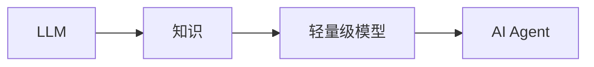
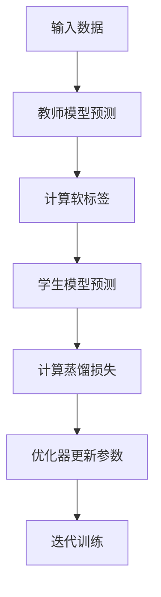
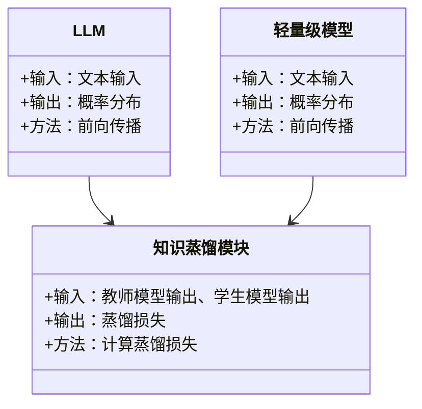
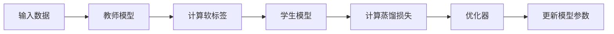
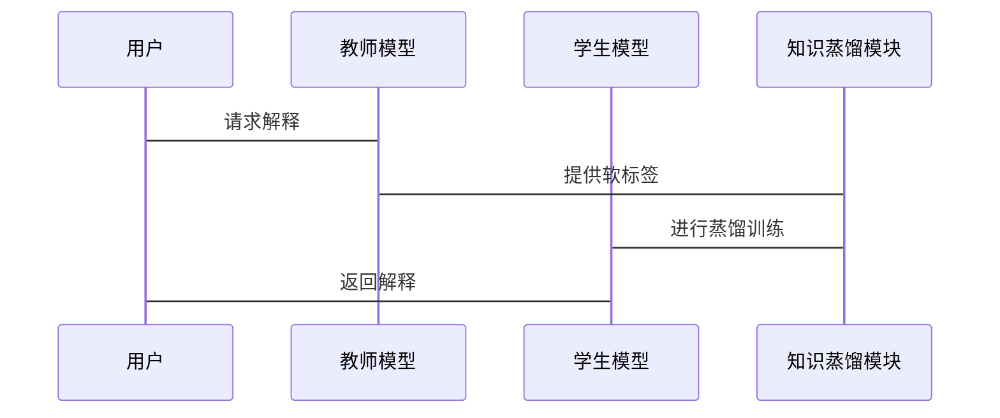

                 


# AI Agent的知识蒸馏：从集成LLM到轻量级模型

> 关键词：知识蒸馏、AI Agent、大型语言模型、轻量级模型、模型压缩、机器学习

> 摘要：知识蒸馏是一种将大型语言模型（LLM）的知识迁移到轻量级模型的技术，通过提取和重构模型的内部知识，构建高效、轻量的AI Agent。本文将详细探讨知识蒸馏的核心概念、算法原理、系统架构设计及项目实战，帮助读者全面理解并掌握这一技术。

---

## 第1章: 知识蒸馏的背景与问题背景

### 1.1 知识蒸馏的概念与背景

#### 1.1.1 从大型语言模型到轻量级模型的演进
大型语言模型（LLM）如GPT-3和GPT-4以其强大的通用性和生成能力，成为AI领域的主流技术。然而，其计算资源需求高、部署复杂，限制了其在移动设备、嵌入式系统等场景的应用。轻量级模型通过简化模型结构、降低参数量，能够在资源受限的环境中高效运行。

#### 1.1.2 知识蒸馏的核心问题与目标
知识蒸馏的目标是将LLM的“知识”迁移到轻量级模型中。这里的“知识”不仅包括模型的预测能力，还包括其对任务的理解和推理能力。通过蒸馏，轻量级模型能够继承LLM的性能优势，同时具备快速响应、低资源消耗的特点。

#### 1.1.3 AI Agent在实际应用中的挑战
AI Agent需要在复杂环境中执行多种任务，包括自然语言理解、决策优化、数据处理等。然而，直接使用LLM会导致计算开销大、响应速度慢等问题。因此，如何在保持性能的同时降低模型复杂度，是AI Agent设计中的核心挑战。

### 1.2 问题背景与问题描述

#### 1.2.1 大型语言模型的局限性
尽管LLM性能强大，但其高计算成本和存储需求使其难以在边缘设备上部署。此外，LLM的黑箱特性使其难以解释，限制了其在需要可解释性场景中的应用。

#### 1.2.2 轻量级模型的需求与优势
轻量级模型通过减少参数量和简化结构，能够在资源受限的环境中高效运行。它们具有低延迟、高响应速度和低资源消耗的特点，适合移动应用、实时交互等场景。

#### 1.2.3 知识蒸馏在AI Agent中的作用
知识蒸馏通过提取LLM的核心知识，构建轻量级模型，使AI Agent能够在保持高性能的同时具备轻量化的特点。这不仅提升了模型的部署能力，还扩展了AI Agent的应用场景。

### 1.3 问题解决与边界定义

#### 1.3.1 知识蒸馏的核心解决思路
通过蒸馏过程，将LLM的知识转化为轻量级模型的可学习特征。这包括提取模型的中间层特征、构建合适的损失函数等。

#### 1.3.2 边界与外延的定义
知识蒸馏的边界包括模型的输入输出空间、任务类型和目标函数的选择。外延则涉及模型压缩、知识表示学习等相关的技术。

#### 1.3.3 核心要素与组成结构
知识蒸馏的核心要素包括源模型（LLM）、目标模型（轻量级模型）、蒸馏策略和蒸馏过程中的优化方法。

---

## 第2章: 知识蒸馏的核心概念与联系

### 2.1 核心概念原理

#### 2.1.1 知识蒸馏的基本原理
知识蒸馏通过教师模型（源模型）和学生模型（目标模型）之间的交互，将教师模型的知识迁移到学生模型中。教师模型通常是一个复杂的模型，而学生模型是一个轻量级的模型。

#### 2.1.2 蒸馏过程中的关键因素
蒸馏过程中的关键因素包括蒸馏损失函数的设计、蒸馏温度的调整以及蒸馏数据的选择。

#### 2.1.3 蒸馏与模型压缩的区别与联系
模型压缩主要通过剪枝、量化等方法减少模型的参数量，而知识蒸馏则是通过知识迁移来提升轻量级模型的性能。两者可以结合使用，以达到更好的效果。

### 2.2 核心概念属性对比表

#### 表2-1: 知识蒸馏与模型压缩的对比

| 对比维度 | 知识蒸馏 | 模型压缩 |
|----------|----------|----------|
| 目标     | 提升轻量级模型性能 | 减少模型参数 |
| 方法     | 知识迁移 | 参数剪枝 |
| 适用场景 | 需要保持模型性能 | 需要降低计算成本 |

### 2.3 ER实体关系图



---

## 第3章: 知识蒸馏的算法原理

### 3.1 算法原理概述

#### 3.1.1 知识蒸馏的基本流程
知识蒸馏的基本流程包括以下步骤：
1. 定义教师模型和学生模型。
2. 设计蒸馏损失函数。
3. 选择适当的蒸馏数据。
4. 调整蒸馏温度。
5. 进行模型训练。

#### 3.1.2 蒸馏过程中的关键步骤
蒸馏过程中的关键步骤包括知识提取、知识表示和知识重构。知识提取通过中间层特征提取实现，知识表示通过构建合适的表示空间完成，知识重构则通过优化目标模型的参数实现。

#### 3.1.3 算法的数学模型与公式
知识蒸馏的数学模型如下：

$$ L = \lambda_1 L_{\text{cls}} + \lambda_2 L_{\text{distill}} $$

其中，$L_{\text{cls}}$是分类损失，$L_{\text{distill}}$是蒸馏损失，$\lambda_1$和$\lambda_2$是权重系数。

### 3.2 算法流程图



### 3.3 知识蒸馏的数学模型

知识蒸馏的核心在于通过蒸馏损失函数，将教师模型的输出概率分布迁移到学生模型中。常用的蒸馏损失函数包括KL散度和交叉熵损失。

#### KL散度公式
$$ D_{\text{KL}}(P||Q) = \sum_{i} P(i) \log \frac{P(i)}{Q(i)} $$

其中，$P$是教师模型的输出概率分布，$Q$是学生模型的输出概率分布。

#### 交叉熵损失公式
$$ H(P, Q) = -\sum_{i} P(i) \log Q(i) $$

---

## 第4章: 系统架构设计

### 4.1 系统功能设计

#### 4.1.1 领域模型


#### 4.1.2 系统架构图


#### 4.1.3 系统交互流程


### 4.2 接口设计与实现

知识蒸馏模块的接口包括：

1. 输入接口：接收教师模型的输出和学生模型的输出。
2. 输出接口：输出蒸馏损失值。
3. 方法接口：包括计算蒸馏损失的方法。

---

## 第5章: 项目实战

### 5.1 项目环境安装

#### 5.1.1 环境要求
- Python 3.8及以上
- PyTorch或TensorFlow框架
- 安装必要的库：transformers、numpy、scikit-learn

#### 5.1.2 环境安装命令
```bash
pip install transformers numpy scikit-learn
```

### 5.2 核心实现

#### 5.2.1 知识蒸馏模块实现
```python
import torch
from torch import nn
from transformers import AutoModelForMaskedLM, AutoTokenizer

class Distiller:
    def __init__(self, teacher_model, student_model):
        self.teacher = teacher_model
        self.student = student_model
        self.criterion = nn.KLDivLoss(reduction='batchmean')
        
    def forward(self, input_ids, labels):
        with torch.no_grad():
            teacher_outputs = self.teacher(input_ids=input_ids)
            teacher_preds = teacher_outputs.logits
        student_outputs = self.student(input_ids=input_ids)
        student_preds = student_outputs.logits
        
        loss = self.criterion(torch.nn.functional.softmax(student_preds, dim=-1),
                              torch.nn.functional.softmax(teacher_preds, dim=-1))
        return loss
```

#### 5.2.2 训练循环实现
```python
def train_loop(distiller, optimizer, dataloader, epochs=3):
    for epoch in range(epochs):
        for batch in dataloader:
            inputs, labels = batch
            optimizer.zero_grad()
            loss = distiller(inputs, labels)
            loss.backward()
            optimizer.step()
    return distiller.student
```

### 5.3 案例分析与总结

#### 5.3.1 案例分析
通过训练一个轻量级模型，使其在知识蒸馏后，性能接近于原LLM，但计算成本显著降低。

#### 5.3.2 总结
知识蒸馏能够有效提升轻量级模型的性能，同时保持其轻量化的特点，为AI Agent的实际应用提供了新的思路。

---

## 第6章: 总结与展望

### 6.1 总结
知识蒸馏是一种有效的技术，能够将大型语言模型的知识迁移到轻量级模型中。通过本文的探讨，我们了解了其核心概念、算法原理和系统设计，同时通过实战案例验证了其可行性。

### 6.2 未来展望
未来，知识蒸馏将在以下方向进一步发展：
1. 更高效的知识提取方法。
2. 更适合轻量级模型的蒸馏策略。
3. 知识蒸馏与模型压缩的结合。

### 6.3 最佳实践 Tips

#### 6.3.1 Tips
1. 在实际应用中，建议结合知识蒸馏和模型压缩技术，以达到更好的效果。
2. 确保蒸馏数据的质量，选择合适的蒸馏温度。
3. 在训练过程中，建议逐步调整蒸馏温度，以避免梯度消失问题。

#### 6.3.2 小结
知识蒸馏为AI Agent的轻量化设计提供了重要的技术支撑，但其应用需要结合实际场景和需求。

---

## 作者：AI天才研究院 & 禅与计算机程序设计艺术

---

通过本文的详细探讨，我们希望读者能够全面理解知识蒸馏的核心思想，并能够在实际项目中灵活运用这一技术，构建高效、轻量的AI Agent。

