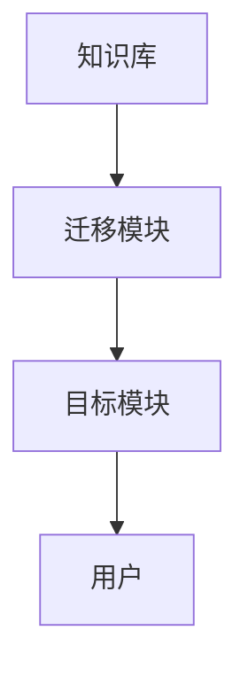

                 


# AI Agent的知识迁移：跨领域应用LLM的能力

> **关键词**: AI Agent, 知识迁移, 大语言模型, 跨领域应用, 机器学习

> **摘要**: 本文探讨AI Agent在跨领域应用中如何利用大语言模型（LLM）进行知识迁移。通过分析知识迁移的背景、理论基础、算法原理、系统架构和项目实战，本文详细阐述了AI Agent在不同领域间的知识共享与复用能力，展示了LLM在跨领域应用中的巨大潜力。

---

## 引言

随着人工智能技术的飞速发展，AI Agent（智能体）在各个领域的应用越来越广泛。然而，AI Agent在单一领域的能力往往受限于其训练数据和应用场景。为了实现跨领域的高效应用，知识迁移技术显得尤为重要。知识迁移允许AI Agent将一个领域的知识和经验应用到另一个领域，从而提升其在不同场景下的适应性和效率。本文将深入探讨AI Agent的知识迁移，特别是其在跨领域应用中的能力，结合大语言模型（LLM）的特性，分析其技术实现和实际应用。

---

## 第1章: AI Agent与知识迁移概述

### 1.1 AI Agent的基本概念

#### 1.1.1 AI Agent的定义
AI Agent是一种智能实体，能够感知环境、执行任务并采取行动以实现目标。它可以是一个软件程序，也可以是物理设备，具备自主决策和问题解决能力。

#### 1.1.2 AI Agent的核心特点
- **自主性**: 能够独立决策，无需外部干预。
- **反应性**: 能够实时感知环境并做出反应。
- **目标导向**: 以目标为导向，优化决策过程。

#### 1.1.3 知识迁移的基本原理
知识迁移是指将从一个领域学到的知识和经验应用到另一个领域。其核心在于识别和利用跨领域共享的知识特征，从而降低学习新任务的成本。

---

### 1.2 大语言模型（LLM）的概述

#### 1.2.1 LLM的定义与特点
大语言模型是一种基于深度学习的自然语言处理模型，具有强大的文本生成和理解能力。LLM的核心特点包括：
- **大规模数据训练**: 通过大量数据预训练，掌握了丰富的语言知识。
- **上下文理解**: 能够理解文本的上下文关系，生成连贯的文本。
- **多任务能力**: 可以通过微调适应不同的任务和领域。

#### 1.2.2 LLM在AI Agent中的作用
LLM作为AI Agent的核心模块，负责处理自然语言输入、生成输出，并支持知识表示和推理。通过LLM，AI Agent能够理解和生成人类语言，实现与用户的高效交互。

#### 1.2.3 知识迁移在LLM中的实现
知识迁移在LLM中主要通过以下方式实现：
- **微调（Fine-tuning）**: 在特定领域数据上对LLM进行微调，使其适应新任务。
- **提示工程（Prompt Engineering）**: 通过设计合适的提示，引导LLM在特定领域生成所需内容。
- **跨领域知识图谱**: 构建跨领域的知识图谱，帮助LLM在不同领域之间共享和复用知识。

---

## 第2章: 知识迁移的理论基础

### 2.1 迁移学习与知识迁移

#### 2.1.1 迁移学习的基本原理
迁移学习是一种机器学习技术，通过将从一个任务或领域学到的知识应用到另一个任务或领域，减少新任务的学习成本。其核心思想是利用两个任务之间的共同特征。

#### 2.1.2 知识迁移的核心要素
- **源领域**: 已经学习过知识的领域。
- **目标领域**: 需要迁移知识的领域。
- **共享特征**: 源领域和目标领域之间的共同特征，是知识迁移的基础。

#### 2.1.3 迁移学习的分类与特点
- **跨任务迁移**: 不同任务之间的知识迁移，例如将图像分类模型迁移到目标检测。
- **跨领域迁移**: 不同领域之间的知识迁移，例如将医疗领域的知识迁移到教育领域。
- **自适应迁移**: 根据目标领域的数据调整模型参数。

---

### 2.2 知识迁移的理论框架

#### 2.2.1 知识迁移的定义
知识迁移是通过共享特征，将源领域的知识应用到目标领域，以提高目标领域任务的性能。

#### 2.2.2 知识迁移的核心思想
知识迁移的核心思想在于识别和利用源领域和目标领域之间的共同特征，从而减少目标领域的学习数据需求。

#### 2.2.3 知识迁移的实现路径
1. **特征提取**: 从源领域提取特征，构建知识表示。
2. **知识共享**: 将提取的特征共享到目标领域。
3. **模型调整**: 根据目标领域的数据微调模型，以适应新任务。

---

### 2.3 LLM中的知识迁移

#### 2.3.1 LLM的知识表示
LLM通过大规模预训练掌握了丰富的语言知识，能够将文本表示为向量形式，捕捉语言的语义信息。

#### 2.3.2 LLM的知识迁移机制
LLM的知识迁移机制包括：
- **参数共享**: 将源领域的参数迁移到目标领域。
- **提示设计**: 通过设计提示引导模型在目标领域生成所需内容。

#### 2.3.3 LLM与传统迁移学习的对比
- **数据需求**: LLM需要较少的目标领域数据即可完成迁移，而传统迁移学习通常需要大量目标领域数据。
- **任务适应性**: LLM可以轻松适应多种任务，而传统迁移学习需要针对不同任务进行专门调整。

---

## 第3章: LLM的知识表示与迁移机制

### 3.1 知识表示的基本概念

#### 3.1.1 知识表示的定义
知识表示是将知识以某种形式表示出来，以便计算机能够理解和处理。常见的知识表示方法包括符号表示、向量表示和图结构表示。

#### 3.1.2 LLM的知识表示特点
- **向量表示**: LLM将文本表示为高维向量，捕捉语义信息。
- **语义理解**: LLM能够理解文本的上下文关系，生成连贯的语义表示。

### 3.2 LLM的知识存储与检索

#### 3.2.1 知识存储的机制
LLM通过预训练掌握了丰富的知识，知识以向量形式存储在模型参数中。

#### 3.2.2 知识检索的原理
知识检索是通过查询向量空间，找到与查询最相关的知识表示。

#### 3.2.3 知识存储与检索的优化
- **向量索引**: 使用向量索引技术优化知识检索效率。
- **模型压缩**: 通过模型压缩技术减少知识存储的空间需求。

### 3.3 知识迁移中的表示学习

#### 3.3.1 表示学习的定义
表示学习是通过学习数据的低维表示，捕捉数据的语义信息。

#### 3.3.2 表示学习在知识迁移中的应用
- **特征提取**: 通过表示学习提取源领域的特征，用于目标领域任务。
- **跨领域表示**: 学习跨领域的共同表示，支持知识迁移。

#### 3.3.3 表示学习的数学模型
表示学习的数学模型可以表示为：
$$ f(x) = Wx + b $$
其中，$W$ 是权重矩阵，$x$ 是输入数据，$b$ 是偏置项。

---

## 第4章: 系统架构与设计

### 4.1 AI Agent的知识迁移系统架构

#### 4.1.1 系统模块划分
AI Agent的知识迁移系统架构通常包括以下几个模块：
- **知识库**: 存储源领域的知识和数据。
- **迁移模块**: 负责知识迁移的实现，包括特征提取和模型调整。
- **目标模块**: 处理目标领域的任务，生成输出。

#### 4.1.2 系统功能设计
- **知识迁移**: 从源领域迁移知识到目标领域。
- **任务处理**: 在目标领域执行特定任务。
- **结果输出**: 将任务处理结果输出给用户。

#### 4.1.3 系统架构的实现
以下是系统的架构图：



### 4.2 数据流与知识迁移流程

#### 4.2.1 数据流的定义
数据流是指系统中数据的流动路径，包括输入、处理和输出。

#### 4.2.2 知识迁移流程
1. **知识提取**: 从源领域提取特征和知识。
2. **知识共享**: 将提取的知识共享到目标领域。
3. **模型调整**: 根据目标领域的数据微调模型，适应新任务。

---

## 第5章: 项目实战

### 5.1 环境安装

#### 5.1.1 安装Python
```bash
python --version
```

#### 5.1.2 安装必要的库
```bash
pip install numpy
pip install transformers
```

### 5.2 核心代码实现

#### 5.2.1 知识迁移的实现
```python
from transformers import AutoModelForMaskedLM, AutoTokenizer

# 加载预训练模型
model_name = "bert-base-uncased"
model = AutoModelForMaskedLM.from_pretrained(model_name)
tokenizer = AutoTokenizer.from_pretrained(model_name)

# 微调模型
model.train()

# 生成提示
def generate_prompt(task):
    return f"Perform {task}:"
```

#### 5.2.2 知识表示的实现
```python
import numpy as np

def compute_embeddings(text):
    inputs = tokenizer(text, return_tensors="np")
    embeddings = model(inputs.input_ids).last_hidden_state[:, 0, :]
    return np.mean(embeddings, axis=1)
```

### 5.3 实际案例分析

#### 5.3.1 应用场景
将医疗领域的知识迁移到教育领域，帮助教育机构生成学习材料。

#### 5.3.2 案例分析
通过微调模型，AI Agent能够将医疗领域的术语和知识应用到教育领域，生成适合学生的学习内容。

---

## 第6章: 总结与展望

### 6.1 总结
本文详细探讨了AI Agent在跨领域应用中利用大语言模型进行知识迁移的能力。通过分析知识迁移的背景、理论基础、算法原理和系统架构，本文展示了知识迁移在不同领域中的巨大潜力。

### 6.2 未来展望
随着技术的发展，知识迁移在AI Agent中的应用将更加广泛和深入。未来的研究方向包括：
- **更高效的迁移学习算法**: 提高知识迁移的效率和效果。
- **跨领域知识图谱**: 构建更全面的跨领域知识图谱，支持更复杂的知识迁移任务。
- **多模态知识迁移**: 结合图像、音频等多种模态的信息，实现更强大的知识迁移能力。

---

## 作者

作者：AI天才研究院/AI Genius Institute & 禅与计算机程序设计艺术 /Zen And The Art of Computer Programming

---

希望这篇文章能够帮助读者深入了解AI Agent的知识迁移能力及其在跨领域应用中的潜力。通过理论分析和实际案例，展示了知识迁移在提升AI Agent性能中的重要性。

