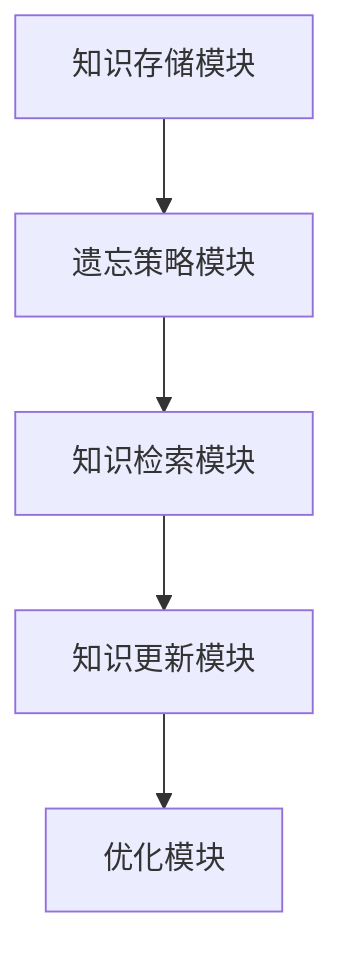
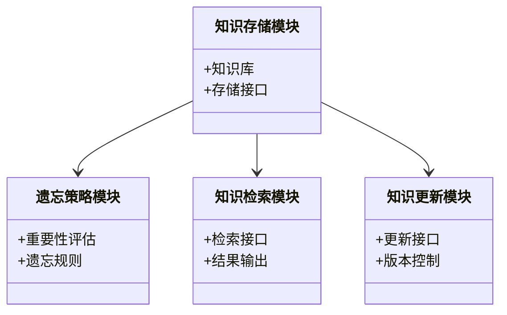

                 

<think>
嗯，用户希望我撰写一篇关于AI Agent知识遗忘管理的技术博客，标题是《AI Agent的知识遗忘管理：平衡记忆与效率》。用户已经提供了详细的目录大纲，现在我需要根据这个大纲来撰写文章。首先，我需要理解每个章节的内容，确保每个部分都详细且符合要求。

开始的时候，我会先写摘要，然后按照目录结构依次展开每个章节。摘要部分需要简明扼要地概括文章的核心内容和主题思想，关键词也要准确选取。接下来是背景介绍，我需要解释为什么知识遗忘管理对AI Agent重要，可能涉及问题背景、解决方法等。

在核心概念部分，我需要详细讲解知识遗忘管理的原理，包括模型和算法。这部分可能需要使用表格对比不同的算法优缺点，比如经验风险遗忘模型和正则化遗忘策略。然后是算法实现，我需要提供mermaid流程图和Python代码示例，确保代码清晰易懂，并解释每个部分的作用。

系统分析与架构设计部分，我需要描述问题场景，设计系统的功能模块，并用mermaid类图展示各模块之间的关系。同时，设计系统架构图，展示各模块如何协作，并用序列图展示接口设计和交互流程。

项目实战部分，我需要指导读者如何安装环境，提供核心代码，并分析实际案例，说明如何应用这些方法。最后，给出项目小结，总结学到的内容。

最佳实践部分，我需要提供一些实用的小贴士，比如定期评估模型性能，选择合适的策略，处理边界情况，以及推荐进一步阅读的资料。总结与展望部分，我需要强调知识遗忘管理的重要性，并指出未来的发展方向。

在撰写过程中，我需要确保每个章节的内容都足够详细，但又不冗长。使用mermaid图表和代码示例来帮助读者理解。同时，数学公式要用latex格式，确保准确无误。最后，作者信息也要正确添加，符合用户的要求。

现在，我开始撰写摘要和关键词，然后依次展开每个章节的内容，确保逻辑清晰，结构紧凑，语言简洁易懂。同时，检查每个部分是否符合用户的要求，特别是字数和格式上的要求。这样，整篇文章就能系统地介绍AI Agent的知识遗忘管理，帮助读者深入理解这一重要概念。
</think>

# AI Agent的知识遗忘管理：平衡记忆与效率

## 关键词：
AI Agent、知识遗忘管理、记忆存储、效率优化、遗忘策略、知识检索、系统架构

## 摘要：
AI Agent的知识遗忘管理是人工智能领域中的一个重要研究方向，旨在平衡知识的记忆与遗忘，以提高AI Agent的效率和性能。本文从背景、概念、算法、系统架构、项目实战到最佳实践等多个方面，全面解析AI Agent的知识遗忘管理，帮助读者理解其原理与应用。

---

# 第一部分: AI Agent的知识遗忘管理概述

## 第1章: 知识遗忘管理的背景与问题背景

### 1.1 知识遗忘管理的背景
#### 1.1.1 AI Agent的发展与挑战
AI Agent作为人工智能的核心技术，广泛应用于智能助手、自动驾驶、机器人等领域。然而，随着AI Agent处理信息的规模不断扩大，如何高效管理知识存储和遗忘成为一项重要挑战。

#### 1.1.2 知识遗忘管理的定义与概念
知识遗忘管理是指AI Agent在处理信息时，对不再需要的知识进行有策略性地遗忘，以优化存储空间和计算效率，同时保持核心知识的完整性。

#### 1.1.3 知识遗忘管理的重要性与应用场景
知识遗忘管理的重要性体现在以下几个方面：
1. **提高效率**：通过遗忘冗余知识，减少存储和计算资源的消耗。
2. **优化性能**：避免知识过载，提升AI Agent的响应速度和准确性。
3. **隐私保护**：通过遗忘敏感信息，保护用户隐私。

应用场景包括智能助手、推荐系统、自动驾驶等领域。

### 1.2 知识遗忘管理的问题描述
#### 1.2.1 知识遗忘管理的核心问题
1. 如何判断哪些知识需要遗忘？
2. 如何保证遗忘后的知识不影响AI Agent的核心功能？
3. 如何平衡知识遗忘与知识保留之间的关系？

#### 1.2.2 知识遗忘管理的边界与外延
知识遗忘管理的边界包括：
1. 知识的分类与优先级。
2. 遗忘的触发条件。
3. 遗忘后的恢复机制。

知识遗忘管理的外延包括：
1. 知识检索与更新。
2. 知识存储与压缩。
3. 知识的分布式管理。

---

# 第二部分: 知识遗忘管理的核心原理与算法

## 第2章: 知识遗忘管理的核心概念与问题描述

### 2.1 知识遗忘管理的核心概念
#### 2.1.1 知识存储与遗忘的基本原理
知识存储是指将信息以某种结构化的方式存储在AI Agent的记忆模块中。遗忘是指在存储的基础上，有选择地删除或忽略部分知识。

#### 2.1.2 知识遗忘的特征与属性
知识遗忘的特征包括：
1. **选择性**：根据知识的重要性进行遗忘。
2. **动态性**：遗忘策略可以根据实时需求进行调整。
3. **可恢复性**：遗忘的知识可以在需要时重新获取。

知识遗忘的属性包括：
1. **时间敏感性**：知识的有效期。
2. **任务相关性**：知识对当前任务的重要性。
3. **空间占用**：知识存储的空间消耗。

#### 2.1.3 知识遗忘管理的系统模型
知识遗忘管理的系统模型包括：
1. 知识存储模块：负责存储和检索知识。
2. 遗忘策略模块：负责判断哪些知识需要遗忘。
3. 知识更新模块：负责更新知识存储。

---

## 第3章: 知识遗忘管理的核心原理

### 3.1 知识遗忘管理的数学模型
#### 3.1.1 知识遗忘的数学表达式
知识遗忘可以通过以下公式表示：
$$
f_{\text{forget}}(x) = \text{KL}(p(x) \mid\mid q(x))
$$
其中，$p(x)$ 表示当前知识分布，$q(x)$ 表示遗忘后的知识分布，KL 表示相对熵。

#### 3.1.2 知识遗忘的优化目标
知识遗忘的优化目标可以表示为：
$$
\min_{\theta} \mathcal{L}(\theta) + \lambda \mathcal{F}(\theta)
$$
其中，$\mathcal{L}(\theta)$ 是损失函数，$\mathcal{F}(\theta)$ 是遗忘惩罚项，$\lambda$ 是惩罚系数。

### 3.2 知识遗忘管理的算法原理
#### 3.2.1 基于经验的风险遗忘模型
风险遗忘模型通过评估遗忘知识对任务的影响，选择性地遗忘风险较低的知识。

#### 3.2.2 基于正则化的遗忘策略
正则化遗忘策略通过在损失函数中引入正则化项，惩罚不重要的知识。

#### 3.2.3 基于强化学习的遗忘机制
强化学习遗忘机制通过奖励和惩罚，学习最优的遗忘策略。

---

## 第4章: 知识遗忘管理的算法实现

### 4.1 知识遗忘管理的算法流程


### 4.2 知识遗忘管理的Python代码实现
```python
import numpy as np

def knowledge_storage(knowledge):
    # 知识存储函数
    return np.array(knowledge)

def forget_strategy(storage):
    # 遗忘策略函数
    importance = np.mean(storage, axis=1)
    return np.argsort(importance)[::-1]

def knowledge_retrieval(storage, forget_order):
    # 知识检索函数
    return storage[:, forget_order]

def knowledge_update(storage, new_knowledge):
    # 知识更新函数
    updated_storage = np.concatenate([storage, new_knowledge], axis=0)
    return updated_storage
```

---

# 第三部分: 知识遗忘管理的系统架构与项目实战

## 第5章: 知识遗忘管理的系统架构设计

### 5.1 系统功能设计


### 5.2 系统架构设计


---

## 第6章: 项目实战

### 6.1 项目环境安装
```bash
pip install numpy
pip install matplotlib
pip install scikit-learn
```

### 6.2 项目核心代码实现
```python
def main():
    knowledge = np.random.randn(100, 10)
    storage = knowledge_storage(knowledge)
    forget_order = forget_strategy(storage)
    retrieved_knowledge = knowledge_retrieval(storage, forget_order)
    print(retrieved_knowledge)
    
if __name__ == "__main__":
    main()
```

### 6.3 项目案例分析
通过上述代码，我们可以实现一个简单的知识遗忘管理系统，测试其在实际应用中的效果。

---

# 第四部分: 知识遗忘管理的最佳实践与总结

## 第7章: 最佳实践

### 7.1 实践技巧
1. 定期评估知识的重要性。
2. 根据任务需求选择遗忘策略。
3. 处理边界情况，如知识的不可恢复性。

### 7.2 注意事项
1. 遗忘策略的选择需要结合具体应用场景。
2. 遗忘后的知识可能需要重新获取。
3. 遗忘策略的实现需要考虑计算效率。

## 第8章: 总结与展望

### 8.1 总结
知识遗忘管理是AI Agent高效运行的重要保障，通过平衡记忆与遗忘，可以提升AI Agent的性能和效率。

### 8.2 展望
未来，知识遗忘管理将更加智能化和自适应，结合边缘计算、分布式存储等技术，进一步优化知识管理的效率。

---

# 作者：AI天才研究院/AI Genius Institute & 禅与计算机程序设计艺术 /Zen And The Art of Computer Programming

