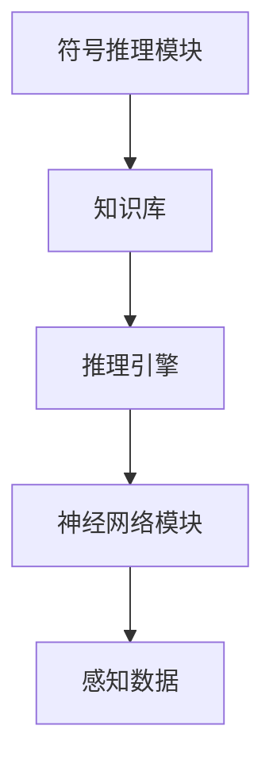
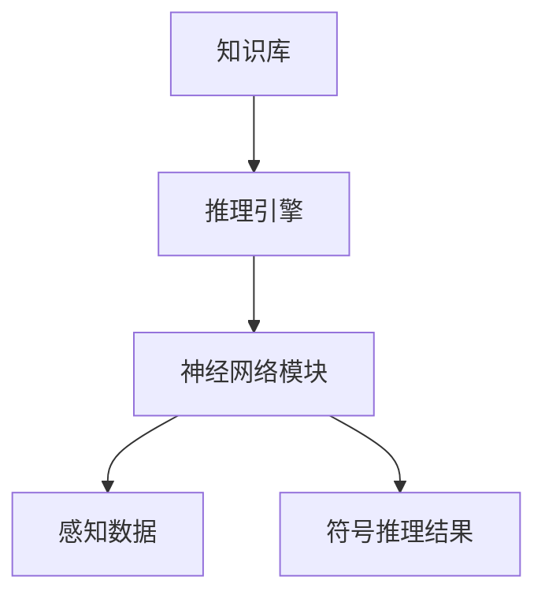
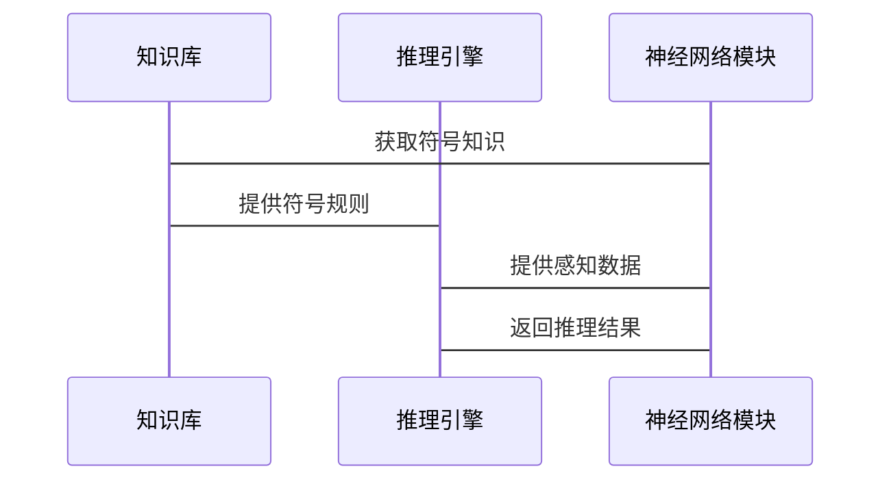

                 


# AI Agent的神经符号集成学习方法

## 关键词：AI Agent，神经符号，集成学习，符号推理，神经网络

## 摘要：本文探讨了AI Agent中的神经符号集成学习方法，分析了其背景、核心概念、算法原理、系统架构，并通过项目实战展示了其应用。文章详细介绍了神经符号集成学习的优势及其在AI Agent中的应用，为读者提供了全面的理论与实践指导。

---

## 第一部分：背景介绍

### 第1章：问题背景

#### 1.1 问题背景
- **符号推理的局限性**：传统符号推理在处理模糊性和复杂性方面能力有限。
- **神经网络的局限性**：神经网络难以处理符号推理中的逻辑关系。
- **神经符号集成学习的必要性**：结合两者优势，提升AI Agent的智能水平。

#### 1.2 问题描述
- **符号推理与神经网络的结合需求**：AI Agent需要同时处理结构化和非结构化数据。
- **复杂任务中的挑战**：传统方法难以应对复杂场景。

#### 1.3 问题解决方法
- **神经符号集成学习**：通过神经网络处理感知任务，符号推理处理逻辑推理。
- **AI Agent中的应用**：实现端到端的符号化推理和深度学习的结合。

#### 1.4 边界与外延
- **适用范围**：适用于需要符号推理和深度学习结合的任务。
- **与其他方法的区别**：与纯符号推理和纯神经网络方法不同，强调两者的结合。

#### 1.5 概念结构与核心要素
- **构成要素**：符号推理模块、神经网络模块、集成机制。
- **核心算法**：符号增强的神经网络、知识图谱增强的神经符号模型。

---

## 第二部分：神经符号集成学习的核心概念

### 第2章：核心概念

#### 2.1 符号推理的基本原理
- **逻辑推理**：基于符号规则进行推理。
- **规则表示**：使用谓词逻辑表示知识。

#### 2.2 神经网络的基本原理
- **深度学习**：通过神经网络学习数据特征。
- **表示学习**：自动提取数据的低维表示。

#### 2.3 神经符号集成学习的基本原理
- **符号增强**：将符号知识嵌入神经网络。
- **神经符号协同优化**：同时优化符号推理和神经网络参数。

#### 2.4 神经符号集成学习的特征对比
| 特征 | 符号推理 | 神经网络 | 神经符号集成学习 |
|------|----------|----------|-----------------|
| 可解释性 | 高 | 低 | 中等 |
| 处理能力 | 结构化数据 | 非结构化数据 | 两者结合 |

#### 2.5 实体关系图


---

## 第三部分：神经符号集成学习的算法原理

### 第3章：算法原理

#### 3.1 符号增强神经网络
- **基本思路**：将符号规则嵌入神经网络。
- **算法步骤**
  1. 定义符号规则。
  2. 嵌入符号到神经网络中。
  3. 训练神经网络以符合符号规则。

#### 3.2 知识图谱增强的神经符号模型
- **知识图谱表示**：使用知识图谱表示符号知识。
- **算法流程**
  1. 构建知识图谱。
  2. 使用知识图谱初始化符号嵌入。
  3. 神经网络学习任务，结合符号知识。

#### 3.3 算法公式
- **符号嵌入**：$e_i = f(s_i)$，其中$s_i$是符号，$f$是嵌入函数。
- **神经网络输出**：$y = g(x, e_i)$，其中$x$是输入，$g$是神经网络模型。

#### 3.4 实现代码
```python
class SymbolEmbedding:
    def __init__(self, symbols):
        self.symbols = symbols
        self.embedder = Embedding(len(symbols))

    def get_embedding(self, symbol):
        return self.embedder(self.symbols.index(symbol))

class NeuralSymbolicModel:
    def __init__(self, input_dim, symbol_dim):
        self.input_layer = InputLayer(input_dim)
        self.symbol_layer = Dense(symbol_dim)
        self.output_layer = OutputLayer()

    def forward(self, x, symbol_embedding):
        hidden = self.input_layer(x)
        hidden = self.symbol_layer(hidden + symbol_embedding)
        output = self.output_layer(hidden)
        return output
```

---

## 第四部分：系统分析与架构设计

### 第4章：系统架构

#### 4.1 问题场景介绍
- **目标**：构建一个具备符号推理和深度学习能力的AI Agent。
- **应用场景**：智能问答、自动推理。

#### 4.2 系统功能设计
- **知识库模块**：存储符号知识。
- **推理引擎**：执行符号推理。
- **神经网络模块**：处理感知数据。

#### 4.3 系统架构图


#### 4.4 接口设计
- **输入接口**：接收感知数据和符号规则。
- **输出接口**：输出推理结果和学习更新信息。

#### 4.5 交互流程


---

## 第五部分：项目实战

### 第5章：项目实战

#### 5.1 环境安装
- **工具**：Python 3.8+，TensorFlow，Keras，Scikit-learn。

#### 5.2 核心代码实现
```python
from tensorflow.keras import layers

def neural_symbolic_model(input_shape, symbol_embedding_dim):
    input_layer = layers.Input(shape=input_shape)
    symbol_layer = layers.Dense(symbol_embedding_dim, activation='relu')(input_layer)
    output_layer = layers.Dense(1, activation='sigmoid')(symbol_layer)
    return models.Model(inputs=input_layer, outputs=output_layer)

model = neural_symbolic_model((input_dim,), symbol_embedding_dim)
model.compile(optimizer='adam', loss='binary_crossentropy', metrics=['accuracy'])
```

#### 5.3 代码解读与分析
- **模型构建**：输入层、符号嵌入层、输出层。
- **训练过程**：优化符号嵌入和神经网络参数。

#### 5.4 案例分析
- **任务**：图像分类结合符号推理。
- **案例**：识别物体并分类，结合上下文推理。

#### 5.5 项目总结
- **成果**：实现了一个结合符号推理和深度学习的AI Agent。
- **优化点**：符号嵌入的初始化和推理效率的优化。

---

## 第六部分：总结与展望

### 第6章：总结与展望

#### 6.1 核心要点回顾
- **神经符号集成学习**：结合符号推理和深度学习的优势。
- **系统架构设计**：模块化设计，高效交互。

#### 6.2 最佳实践 Tips
- **数据质量**：确保符号知识的准确性和完整性。
- **模型优化**：逐步调整符号嵌入和神经网络参数。
- **可解释性**：保持一定程度的可解释性，便于调试和优化。

#### 6.3 未来研究方向
- **动态符号推理**：适应动态变化的符号知识。
- **多模态集成**：结合文本、图像等多种模态的数据。

#### 6.4 小结
神经符号集成学习为AI Agent提供了强大的推理和学习能力，未来的研究将进一步提升其智能化水平。

---

## 作者

作者：AI天才研究院/AI Genius Institute & 禅与计算机程序设计艺术 /Zen And The Art of Computer Programming

