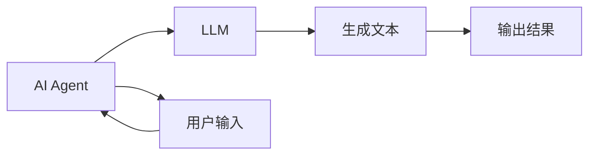
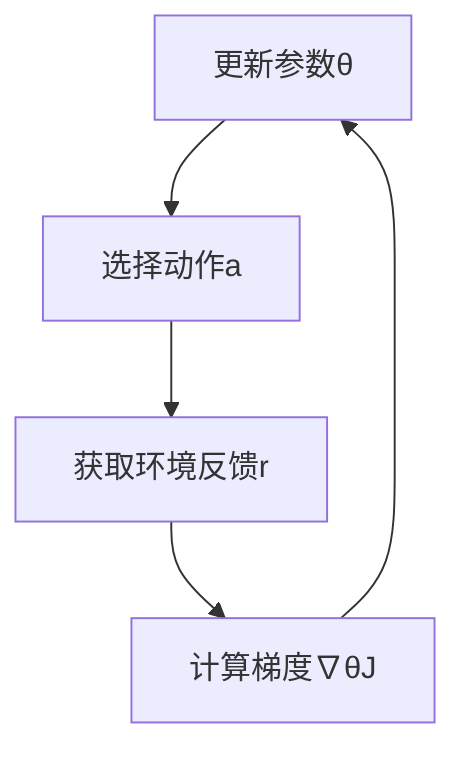
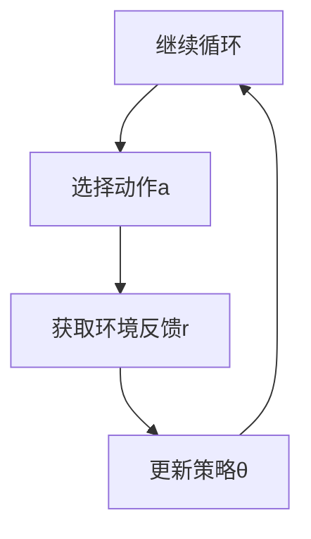

                 


# AI Agent的精确语言生成：细粒度控制LLM的输出质量

---

## 关键词：
AI Agent，LLM，自然语言生成，细粒度控制，语言模型优化，强化学习

---

## 摘要：
本文深入探讨AI Agent在自然语言生成中的角色，特别是如何通过细粒度控制来优化大语言模型（LLM）的输出质量。文章从背景介绍、核心概念、算法原理、系统设计到实际案例，全面分析了AI Agent对LLM输出的控制机制，包括策略梯度优化、强化学习、系统架构设计等关键环节。通过具体实现和案例分析，展示了如何构建高效的AI Agent系统，确保生成内容的精确性和适用性。

---

# 第一部分: AI Agent与LLM概述

## 第1章: AI Agent与精确语言生成的背景介绍

### 1.1 问题背景与问题描述
#### 1.1.1 当前自然语言生成的挑战
自然语言生成（Natural Language Generation, NLG）的目标是让计算机能够生成符合人类语言习惯的文本。然而，现有的大语言模型（LLM）在生成质量上仍然存在以下挑战：
- **内容准确性不足**：模型可能会生成与事实不符的信息。
- **语境理解有限**：在特定场景下，模型可能无法准确捕捉语境。
- **生成多样性不足**：模型生成的内容可能缺乏创意或多样性。

#### 1.1.2 AI Agent在语言生成中的角色
AI Agent（人工智能代理）是一种能够感知环境并采取行动以实现目标的智能实体。在语言生成领域，AI Agent的作用是：
- **接收输入并解析需求**：理解用户意图，生成符合需求的文本。
- **优化生成过程**：通过策略调整，提升生成内容的质量。
- **动态适应环境**：根据反馈不断优化生成策略。

#### 1.1.3 细粒度控制的需求与目标
细粒度控制的目标是实现对LLM生成过程的精准调节，以满足具体场景的需求。这种控制需要：
- **实时反馈机制**：根据生成结果调整策略。
- **多维度优化**：在准确性、流畅性、相关性等多个维度上进行优化。
- **个性化生成**：根据用户需求生成个性化内容。

### 1.2 问题解决与边界定义
#### 1.2.1 细粒度控制的实现路径
细粒度控制的实现路径包括：
1. **模型优化**：改进LLM的生成算法，使其更符合特定需求。
2. **策略调整**：通过强化学习等方法，优化生成策略。
3. **结果评估**：建立评估指标，对生成结果进行量化评估。

#### 1.2.2 边界与外延分析
- **边界**：细粒度控制的边界在于生成内容的质量和相关性，而不是生成内容的原始创新性。
- **外延**：细粒度控制可以应用于多种场景，如客服对话、内容创作、教育辅助等。

#### 1.2.3 核心概念与关键要素
- **生成模型**：如GPT、BERT等模型，是生成文本的基础。
- **控制策略**：用于调整生成过程的策略，如温度调节、重复抑制等。
- **评估指标**：如BLEU、ROUGE等，用于量化生成结果的质量。

## 第2章: AI Agent与LLM的核心概念与联系

### 2.1 AI Agent的基本原理
#### 2.1.1 AI Agent的定义与分类
AI Agent是一种能够感知环境并采取行动以实现目标的智能实体。根据智能水平，AI Agent可以分为：
- **反应式AI Agent**：根据当前输入采取行动。
- **认知式AI Agent**：具有推理、规划能力，能够主动解决问题。

#### 2.1.2 LLM在AI Agent中的应用
LLM（Large Language Model）通过其强大的语言理解能力，为AI Agent提供了生成自然语言文本的能力。AI Agent可以利用LLM进行：
- **对话生成**：在客服、聊天机器人等场景中生成自然对话。
- **内容创作**：生成文章、邮件等文本内容。
- **信息提取**：从文本中提取关键信息。

#### 2.1.3 AI Agent与LLM的关系图解
以下是一个AI Agent与LLM关系的Mermaid图：



### 2.2 LLM的生成机制与控制策略
#### 2.2.1 LLM的生成模型概述
生成式模型的核心是解码器（decoder）部分，通常采用Transformer架构。生成过程如下：
1. **输入处理**：将输入文本编码为向量。
2. **解码生成**：通过自注意力机制生成后续文本。
3. **输出优化**：通过温度、Top-k等参数调整生成结果。

#### 2.2.2 细粒度控制的实现方式
细粒度控制可以通过以下方式实现：
- **温度调节（Temperature）**：通过调整温度参数控制生成的多样性和确定性。
- **Top-k采样（Top-k Sampling）**：在生成过程中只选择Top-k可能的词汇，减少随机性。
- **重复抑制（Repetition Penalty）**：防止生成重复内容。

#### 2.2.3 AI Agent对LLM输出的干预机制
AI Agent可以通过以下方式干预LLM的输出：
- **实时反馈**：根据生成结果调整后续生成策略。
- **多轮对话**：通过多次交互优化生成内容。
- **上下文记忆**：利用记忆机制保持对话的连贯性。

## 第3章: 细粒度控制的数学模型与算法原理

### 3.1 基于策略梯度的优化算法
#### 3.1.1 策略梯度算法的数学推导
策略梯度（Policy Gradient）是一种强化学习算法，用于优化策略函数。数学推导如下：

$$
\nabla_{\theta} J(\theta) = \mathbb{E}_{\tau \sim \pi_\theta} [\nabla_{\theta} \log \pi_\theta(a|s)]
$$

其中，$\theta$是参数，$J(\theta)$是目标函数，$\tau$是轨迹，$\pi_\theta$是策略函数。

#### 3.1.2 算法流程图（Mermaid）
以下是一个策略梯度算法的Mermaid流程图：



#### 3.1.3 示例代码实现
以下是一个简单的策略梯度算法的Python代码示例：

```python
import torch
import torch.nn as nn

# 定义策略网络
class PolicyNetwork(nn.Module):
    def __init__(self, input_size, output_size):
        super(PolicyNetwork, self).__init__()
        self.fc = nn.Linear(input_size, output_size)
    
    def forward(self, x):
        return self.fc(x)

# 初始化网络
input_size = 10
output_size = 5
policy_net = PolicyNetwork(input_size, output_size)
optimizer = torch.optim.Adam(policy_net.parameters(), lr=0.001)

# 策略梯度更新
def policy_gradient_loss(policy_net, optimizer, batch_size):
    inputs = torch.randn(batch_size, input_size)
    labels = torch.randint(0, output_size, (batch_size,))

    # 前向传播
    outputs = policy_net(inputs)
    # 计算损失
    loss = nn.CrossEntropyLoss()(outputs, labels)
    # 反向传播
    optimizer.zero_grad()
    loss.backward()
    optimizer.step()

policy_gradient_loss(policy_net, optimizer, batch_size=32)
```

### 3.2 强化学习在生成控制中的应用
#### 3.2.1 强化学习的基本原理
强化学习（Reinforcement Learning, RL）通过智能体与环境的交互，学习最优策略。核心概念包括：
- **状态（State）**：环境的当前情况。
- **动作（Action）**：智能体采取的行动。
- **奖励（Reward）**：环境对智能体行为的反馈。

#### 3.2.2 奖励函数的设计与实现
奖励函数的设计是强化学习的关键。以下是一个简单的奖励函数示例：

```python
def reward_function(generated_text, expected_output):
    # 计算生成文本与预期输出的相似度
    similarity = calculate_similarity(generated_text, expected_output)
    # 奖励基于相似度
    return similarity
```

#### 3.2.3 算法流程图（Mermaid）
以下是一个强化学习算法的Mermaid流程图：



---

## 总结

本文详细探讨了AI Agent在自然语言生成中的作用，特别是如何通过细粒度控制优化LLM的输出质量。通过背景介绍、核心概念、算法原理、系统设计到实际案例的分析，展示了AI Agent如何通过策略梯度优化、强化学习等方法实现对生成过程的精准控制。未来，随着技术的不断发展，AI Agent在语言生成中的应用将更加广泛，细粒度控制也将成为提升生成质量的关键技术。

