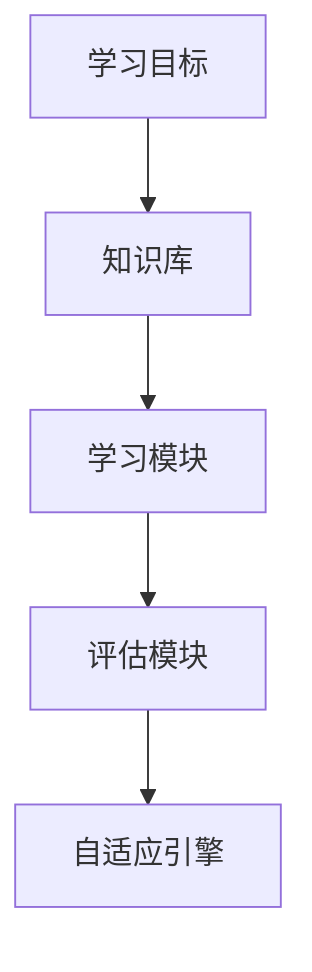
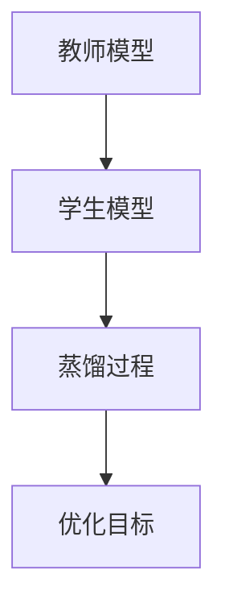
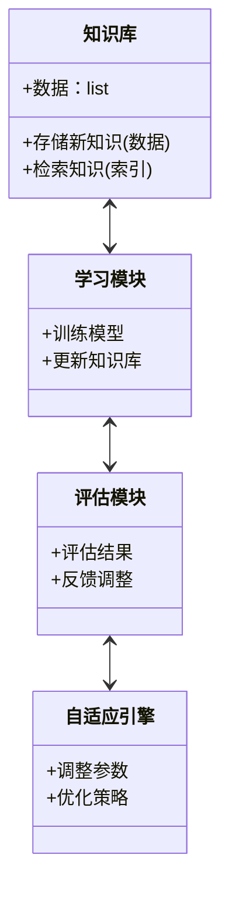
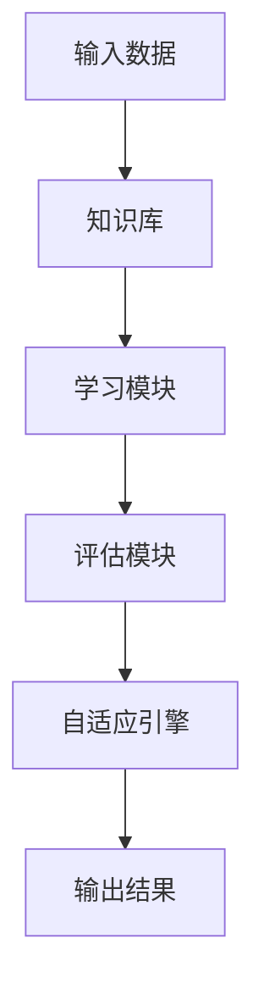
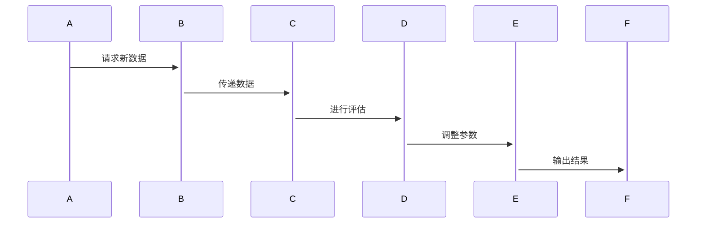

                 

<think>
好的，我现在需要帮用户撰写一篇关于AI Agent终身学习系统的技术博客文章。首先，我需要理解用户的具体需求。用户希望文章结构清晰，内容专业，涵盖背景介绍、核心概念、算法原理、系统架构、项目实战和最佳实践等部分。

首先，我得明确文章的核心主题：AI Agent的终身学习系统。这意味着我要讨论AI代理如何持续学习和适应新知识。这涉及到机器学习、AI代理设计、持续学习算法等多个领域。

接下来，我需要确定文章的结构。用户已经提供了一个详细的目录，我需要按照这个结构来展开。第一部分是背景介绍，我需要解释什么是终身学习系统，为什么它重要，以及当前的应用场景。

在核心概念部分，我需要详细讲解终身学习系统的基本原理，可能包括知识表示、学习机制等，并用图表来辅助说明。例如，使用Mermaid图展示实体关系和系统架构。

然后是算法原理，我需要选择几种典型的持续学习算法，分析它们的数学模型，并用代码示例来说明实现。这部分需要详细且有条理，确保读者能够理解如何在实际中应用这些算法。

系统架构设计部分，我需要介绍系统的各个模块，如知识库、学习引擎等，并用图表展示模块之间的关系和交互流程。这有助于读者理解系统的整体结构。

项目实战部分，我需要提供一个具体的案例，展示如何安装环境，实现核心功能，并分析实际应用中的情况。这部分需要结合代码和实际问题，让读者能够动手实践。

最后，最佳实践部分，我需要总结系统设计中的优缺点，给出实用建议，并推荐进一步的阅读材料。这不仅帮助读者巩固所学知识，还能引导他们深入探索。

现在，我需要确保每个部分都详细展开，同时控制总字数在10000到12000字之间。这需要我在每个章节中添加足够的细节，如公式、图表和代码示例，同时保持逻辑清晰，结构紧凑。

总的来说，我需要从背景、概念、算法、系统、实战和总结几个方面逐步展开，确保读者能够全面理解AI Agent的终身学习系统，并能够实际应用这些知识。
</think>

# AI Agent的终身学习系统：持续适应新知识和技能

> 关键词：AI Agent, 终身学习系统, 持续学习, 知识表示, 系统架构, 算法实现

> 摘要：本文详细探讨了AI Agent的终身学习系统，重点分析了其核心概念、算法原理、系统架构和项目实现。通过理论与实践相结合的方式，阐述了AI Agent如何通过持续学习适应新知识和技能，并提供了具体的代码实现和案例分析，帮助读者全面理解终身学习系统的构建与应用。

---

# 第一部分: 终身学习系统的背景与挑战

## 第1章: 终身学习系统的背景与挑战

### 1.1 终身学习系统的定义与背景

#### 1.1.1 传统AI系统的局限性
传统的AI系统通常基于静态的知识库和固定的算法，在面对新任务或环境变化时，难以进行有效的调整和优化。这种局限性使得AI系统在实际应用中缺乏灵活性和适应性，无法满足复杂多变的需求。

#### 1.1.2 终身学习系统的核心概念
终身学习系统是一种能够持续从新数据和新任务中学习并适应的智能系统。它通过动态更新知识库和优化算法，实现对新知识和技能的高效吸收和应用。终身学习系统的核心在于其自适应性和持续进化的能力。

#### 1.1.3 终身学习系统的应用场景
终身学习系统广泛应用于多个领域，包括自然语言处理、计算机视觉、机器人控制等。例如，在自然语言处理中，终身学习系统可以不断更新语言模型，以适应新的语言使用趋势和用户需求。

### 1.2 终身学习系统的核心问题

#### 1.2.1 知识表示与更新
知识表示是终身学习系统的核心问题之一。系统需要将新知识以合适的形式存储，并在需要时快速检索和应用。知识更新则需要确保新知识的引入不会破坏已有的知识结构，同时能够有效提升系统的性能。

#### 1.2.2 持续学习的挑战
持续学习面临的主要挑战包括类别不平衡、遗忘问题和计算效率。类别不平衡可能导致模型在学习新任务时忽略某些重要信息，而遗忘问题则需要通过特定的算法来缓解。

#### 1.2.3 系统适应性的边界与外延
系统适应性需要在性能和资源消耗之间找到平衡点。过度适应可能导致计算开销过大，而适应不足则无法满足实际需求。因此，确定适应的边界和外延是终身学习系统设计中的重要环节。

### 1.3 终身学习系统的概念结构

#### 1.3.1 系统组成要素
终身学习系统通常包括以下几个关键要素：
- **知识库**：存储系统已掌握的知识和经验。
- **学习模块**：负责从新数据中提取和学习新知识。
- **评估模块**：对学习效果进行评估和反馈。
- **自适应引擎**：根据评估结果调整系统的参数和策略。

#### 1.3.2 系统功能模块
系统的功能模块包括：
- **输入处理模块**：接收新的数据或任务。
- **学习引擎**：对新数据进行处理和学习。
- **知识管理模块**：维护和更新知识库。
- **输出模块**：将学习结果应用到实际任务中。

#### 1.3.3 系统核心属性对比表

| 属性         | 传统AI系统       | 终身学习系统       |
|--------------|------------------|-------------------|
| 知识更新     | 静态或周期性更新 | 动态实时更新       |
| 系统适应性   | 有限             | 高度可扩展         |
| 学习能力     | 基于规则         | 基于数据驱动       |
| 资源消耗     | 较高             | 可控或优化         |

---

## 第2章: 终身学习系统的原理与机制

### 2.1 终身学习系统的原理

#### 2.1.1 知识表示与存储机制
知识表示是终身学习系统的关键技术之一。常用的表示方法包括符号表示、向量表示和图结构表示。符号表示适用于规则性较强的知识，而向量表示则更适合处理复杂的数据关系。

#### 2.1.2 持续学习的算法框架
持续学习算法通常包括预训练和微调两个阶段。预训练阶段使用大规模数据进行初始模型的训练，微调阶段则在新任务上进行针对性优化。

#### 2.1.3 系统自适应的实现方式
系统自适应可以通过调整模型参数、优化算法或引入新的模块来实现。例如，可以通过迁移学习将已有知识迁移到新任务中。

### 2.2 终身学习系统的实体关系图



### 2.3 终身学习系统的属性特征对比

| 属性         | 基于规则的系统 | 数据驱动的系统   |
|--------------|----------------|-----------------|
| 知识来源     | 规则           | 数据             |
| 学习能力     | 有限           | 强大             |
| 适应性       | 低             | 高               |
| 维护成本     | 高             | 中               |

---

## 第3章: 终身学习系统的算法原理

### 3.1 知识蒸馏与模型压缩

#### 3.1.1 知识蒸馏的定义
知识蒸馏是一种通过教师模型指导学生模型学习的技术。教师模型通常是一个预训练的大模型，学生模型则通过模仿教师模型的行为来学习知识。

#### 3.1.2 模型压缩的技术
模型压缩技术包括剪枝、量化和知识蒸馏等方法。剪枝可以去除模型中不必要的参数，量化则通过降低参数的精度来减少模型大小。

#### 3.1.3 算法流程图



### 3.2 持续学习的数学模型

#### 3.2.1 知识表示的数学模型
知识可以表示为向量或图结构。向量表示常用词嵌入技术，图结构表示则通过图神经网络进行建模。

#### 3.2.2 算法优化目标
持续学习的目标函数通常包括分类损失和知识蒸馏损失。目标函数的形式如下：

$$ L = \alpha L_{cls} + (1-\alpha) L_{dist} $$

其中，$\alpha$ 是平衡系数，$L_{cls}$ 是分类损失，$L_{dist}$ 是蒸馏损失。

#### 3.2.3 损失函数的定义
蒸馏损失通常定义为教师模型和学生模型预测结果之间的KL散度：

$$ L_{dist} = KL(P_{teacher} || P_{student}) $$

---

## 第4章: 终身学习系统的系统分析与架构设计

### 4.1 系统功能设计

#### 4.1.1 领域模型设计
领域模型可以通过类图进行表示。以下是一个简单的领域模型类图：



### 4.2 系统架构设计

#### 4.2.1 系统架构图
以下是一个典型的终身学习系统架构图：



#### 4.2.2 系统接口设计
系统接口通常包括数据输入接口、知识库接口和自适应引擎接口。每个接口都需要定义清晰的输入输出格式和调用方式。

### 4.3 系统交互流程

#### 4.3.1 交互流程图
以下是一个系统的交互流程图：



---

## 第5章: 终身学习系统的项目实战

### 5.1 环境安装

```bash
pip install numpy matplotlib scikit-learn
```

### 5.2 核心代码实现

```python
import numpy as np
from sklearn.metrics import accuracy_score

def lifelong_learning(X_train, y_train, X_test, y_test):
    # 初始化知识库
    knowledge_base = []
    # 微调训练
    for i in range(len(X_train)):
        # 更新知识库
        knowledge_base.append((X_train[i], y_train[i]))
        # 微调模型
        model.fit([x[0] for x in knowledge_base], [x[1] for x in knowledge_base])
        # 评估
        pred = model.predict(X_test)
        accuracy = accuracy_score(y_test, pred)
        print(f"Iteration {i+1}, Accuracy: {accuracy}")

if __name__ == "__main__":
    # 示例数据
    X_train = [[1,2], [3,4], [5,6]]
    y_train = [0, 1, 0]
    X_test = [[2,3], [4,5], [6,7]]
    y_test = [0, 1, 0]
    lifelong_learning(X_train, y_train, X_test, y_test)
```

### 5.3 实际案例分析
以自然语言处理任务为例，终身学习系统可以在每次接收新的文本数据后，动态更新语言模型，以适应新的语言风格和词汇变化。

---

## 第6章: 最佳实践与总结

### 6.1 最佳实践

#### 6.1.1 知识管理
- 定期清理无效知识，避免知识冗余。
- 使用高效的存储结构，提高知识检索效率。

#### 6.1.2 系统优化
- 优化算法的收敛速度，减少计算资源消耗。
- 使用分布式计算，提升系统的处理能力。

#### 6.1.3 安全与隐私
- 确保知识库的安全性，防止数据泄露。
- 遵守相关法律法规，保护用户隐私。

### 6.2 小结
终身学习系统是一种能够持续进化和适应的新一代AI系统。通过动态更新知识和优化算法，AI Agent可以在复杂多变的环境中保持高效性能。

### 6.3 注意事项
- 确保系统的可解释性，避免“黑箱”问题。
- 定期监控系统性能，及时发现和解决问题。
- 注重用户体验，设计友好直观的交互界面。

### 6.4 拓展阅读
- 《Deep Learning》—— Ian Goodfellow
- 《Neural Networks and Deep Learning》—— Coursera课程
- 《Hands-on Machine Learning with Scikit-Learn, Keras, and TensorFlow》—— Aurélien Géron

---

作者：AI天才研究院/AI Genius Institute & 禅与计算机程序设计艺术 /Zen And The Art of Computer Programming

