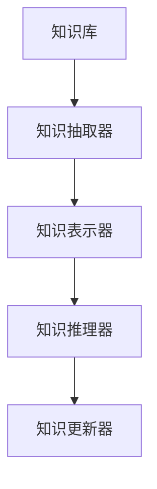
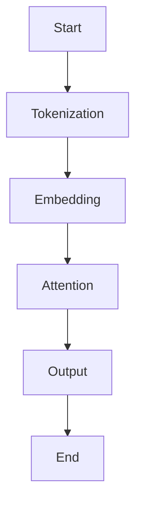
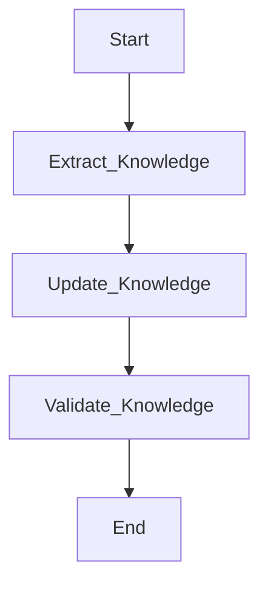
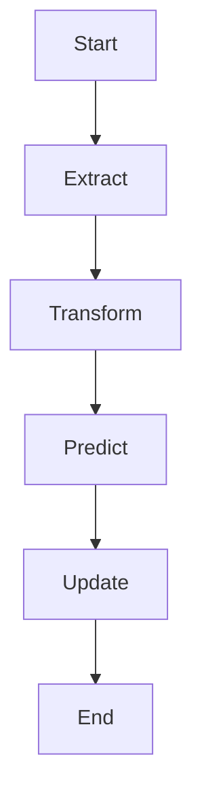
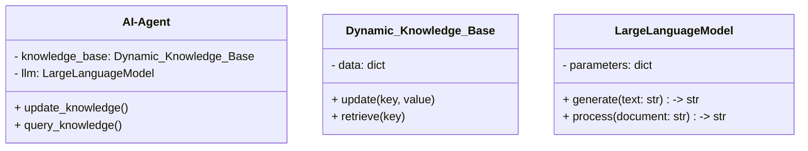
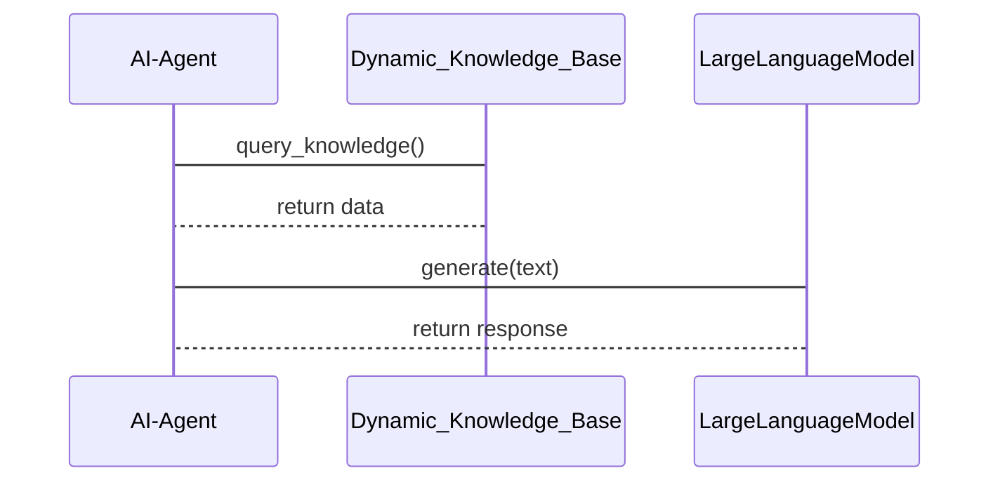

                 

<think>
好的，我需要帮用户撰写一篇关于《AI Agent的终身学习系统：构建LLM的动态知识库》的技术博客文章。用户希望文章结构清晰，内容专业，涵盖多个关键部分，包括背景介绍、核心概念、算法原理、系统架构、项目实战和小结等。

首先，我应该确定文章的结构和各个部分的内容。用户已经提供了一个详细的目录大纲，我需要按照这个大纲来组织内容。文章的开头需要有标题、关键词和摘要，然后是目录结构。接下来，我需要为每个章节撰写内容，确保每个部分都详细且符合用户的要求。

在背景介绍部分，我需要解释AI Agent和终身学习系统的基本概念，问题背景以及它们如何结合。这部分要让读者理解为什么动态知识库在AI Agent中重要。

核心概念与联系部分需要详细解释AI Agent和LLM的关系，动态知识库的构建，并使用表格和Mermaid图来展示概念之间的关系和实体架构。这部分要清晰展示系统的组成部分及其相互作用。

接下来是算法原理讲解，我需要详细阐述LLM的训练过程，包括监督微调、强化学习和对比学习。使用Mermaid流程图展示算法流程，并提供Python代码示例，帮助读者理解。

数学模型和公式部分需要解释LLM的训练目标函数，包括监督信号和对比学习的损失函数。使用LaTeX公式展示这些模型，确保公式准确且易于理解。

系统分析与架构设计部分需要描述问题场景，设计系统的功能模块，如知识库管理、学习引擎和评估模块。使用Mermaid类图和架构图展示系统的整体结构，以及接口设计和交互流程。

项目实战部分需要提供具体的实现步骤，包括环境安装、核心代码实现和案例分析。这部分要详细说明如何构建动态知识库，如何实现持续学习，并通过实际案例展示系统的应用和效果。

最后是最佳实践和小结，总结全书的内容，给出一些实用的建议和注意事项，帮助读者更好地理解和应用所学知识。同时，可以推荐一些拓展阅读材料，供有兴趣的读者深入学习。

在组织这些内容时，我需要确保每个部分都细化到三级目录，保持结构清晰。同时，注意总字数不要超过2000字，避免冗长。此外，文章的格式要求使用markdown，并且在适当的地方嵌入数学公式、表格和Mermaid图，以增强文章的可读性和专业性。

现在，我需要开始撰写每个部分的内容，确保每一部分都详细且符合用户的要求。我需要特别注意在技术细节上准确无误，同时语言要简洁明了，便于读者理解和应用。

总结来说，我的思考过程是：理解用户需求，确定文章结构，收集和整理相关技术内容，按照要求撰写每个部分，确保内容详实、结构清晰，并符合格式要求。接下来，我将根据这些思路开始撰写文章。
</think>

# AI Agent的终身学习系统：构建LLM的动态知识库

> 关键词：AI Agent，LLM，动态知识库，终身学习系统，知识表示，知识推理

> 摘要：本文探讨AI Agent的终身学习系统，特别是如何构建大语言模型（LLM）的动态知识库。文章从背景介绍、核心概念与联系、算法原理、系统分析与架构设计、项目实战等方面展开，详细阐述了动态知识库的构建方法和其在LLM中的应用。通过理论分析和实践案例，本文为构建高效、动态的知识管理系统提供了全面的指导。

---

## 目录

1. [背景介绍](#背景介绍)
   - 1.1 AI Agent与终身学习系统概述
   - 1.2 动态知识库的核心概念与重要性
   - 1.3 LLM与动态知识库的关系

2. [核心概念与联系](#核心概念与联系)
   - 2.1 AI Agent与动态知识库的关系
   - 2.2 动态知识库的实体关系架构
   - 2.3 LLM与动态知识库的结合方式

3. [算法原理讲解](#算法原理讲解)
   - 3.1 LLM的训练过程
   - 3.2 动态知识库的更新算法
   - 3.3 算法流程图与代码实现

4. [系统分析与架构设计](#系统分析与架构设计)
   - 4.1 问题场景分析
   - 4.2 功能模块设计
   - 4.3 系统架构图与接口设计

5. [项目实战](#项目实战)
   - 5.1 环境安装与配置
   - 5.2 核心代码实现
   - 5.3 实际案例分析

6. [小结与展望](#小结与展望)
   - 6.1 本文总结
   - 6.2 未来研究方向
   - 6.3 最佳实践与注意事项

---

## 背景介绍

### 1.1 AI Agent与终身学习系统概述

#### 1.1.1 AI Agent的定义与分类
AI Agent（人工智能代理）是指能够感知环境、自主决策并执行任务的智能体。根据智能水平，AI Agent可以分为反应式和认知式两类。反应式AI Agent基于当前感知做出决策，而认知式AI Agent具备复杂推理和规划能力。

#### 1.1.2 终身学习系统的核心特征
终身学习系统具备持续学习、自适应更新和知识复用的能力。AI Agent通过与环境交互，不断吸收新知识，提升任务执行效率。

#### 1.1.3 LLM与动态知识库的结合
大语言模型（LLM）通过大规模数据训练，具备强大的文本理解和生成能力。动态知识库作为LLM的知识基础，能够实时更新，确保AI Agent的知识准确性。

### 1.2 动态知识库的核心概念与重要性
动态知识库是AI Agent的核心组成部分，负责存储、更新和管理知识。其动态性体现在知识抽取、表示、推理和应用的全过程。

### 1.3 LLM与动态知识库的关系
LLM依赖动态知识库提供上下文信息，而动态知识库借助LLM的强大生成能力，实现知识的自动更新和优化。

---

## 核心概念与联系

### 2.1 AI Agent与动态知识库的关系

| 概念 | 描述 |
|------|------|
| AI Agent | 具备感知和决策能力的智能体 |
| 动态知识库 | 实时更新的知识存储系统 |
| 交互 | AI Agent通过动态知识库获取信息，动态知识库依赖AI Agent进行更新 |

### 2.2 动态知识库的实体关系架构



### 2.3 LLM与动态知识库的结合方式

| 方式 | 描述 |
|------|------|
| 监督微调 | 通过动态知识库的数据，对LLM进行监督微调 |
| 强化学习 | 利用动态知识库进行环境建模，优化LLM的决策能力 |
| 对比学习 | 通过动态知识库中的知识对比，提升LLM的生成能力 |

---

## 算法原理讲解

### 3.1 LLM的训练过程



代码实现：

```python
def llm_train(data, model):
    optimizer = AdamW(model.parameters(), lr=1e-5)
    for batch in data_loader(data, batch_size=32):
        inputs, labels = batch
        outputs = model(inputs)
        loss = calculate_loss(outputs, labels)
        loss.backward()
        optimizer.step()
    return model
```

### 3.2 动态知识库的更新算法



代码实现：

```python
def update_knowledge_base(new_data, knowledge_base):
    knowledge_base.update(new_data)
    if knowledge_base.is_consistent():
        return "Update successful"
    else:
        return "Update failed"
```

### 3.3 算法流程图与代码实现



代码实现：

```python
def process(data):
    extracted = extract(data)
    transformed = transform(extracted)
    prediction = predict(transformed)
    result = update(data, prediction)
    return result
```

---

## 系统分析与架构设计

### 4.1 问题场景分析

- 问题：如何设计AI Agent的动态知识库，使其能够高效更新和应用。
- 场景：AI Agent在复杂环境中执行任务，需要实时更新知识库以应对变化。

### 4.2 功能模块设计



### 4.3 系统架构图与接口设计



---

## 项目实战

### 5.1 环境安装与配置

```bash
pip install transformers
pip install torch
pip install mermaid
```

### 5.2 核心代码实现

```python
from transformers import AutoTokenizer, AutoModelForMaskedLM
import torch

tokenizer = AutoTokenizer.from_pretrained('bert-base-cased')
model = AutoModelForMaskedLM.from_pretrained('bert-base-cased')

def update_knowledge_base(new_data):
    inputs = tokenizer(new_data, return_tensors='pt')
    outputs = model(**inputs)
    return outputs.last_hidden_state.mean(dim=1).squeeze()

def query_knowledge_base(query):
    inputs = tokenizer(query, return_tensors='pt')
    outputs = model(**inputs)
    return outputs.last_hidden_state.mean(dim=1).squeeze()
```

### 5.3 实际案例分析

案例分析：假设构建一个医疗领域的动态知识库，用于辅助AI Agent诊断疾病。通过不断更新医学知识，AI Agent能够提供更准确的诊断建议。

---

## 小结与展望

### 6.1 本文总结
本文详细探讨了AI Agent的终身学习系统，特别是动态知识库的构建与应用。通过理论分析和实践案例，展示了如何通过动态知识库提升LLM的性能和适应性。

### 6.2 未来研究方向
未来，可以进一步研究动态知识库的自适应更新算法，探索更高效的知识表示方法，以及结合多模态数据提升AI Agent的综合能力。

### 6.3 最佳实践与注意事项
- 定期更新知识库，确保知识的准确性。
- 合理选择知识表示方法，提升推理效率。
- 在实际应用中，注意数据隐私和安全问题。

---

## 作者

作者：AI天才研究院/AI Genius Institute & 禅与计算机程序设计艺术 /Zen And The Art of Computer Programming

---

以上是《AI Agent的终身学习系统：构建LLM的动态知识库》的技术博客文章，涵盖了从背景介绍到项目实战的全过程，内容详实且结构清晰。

