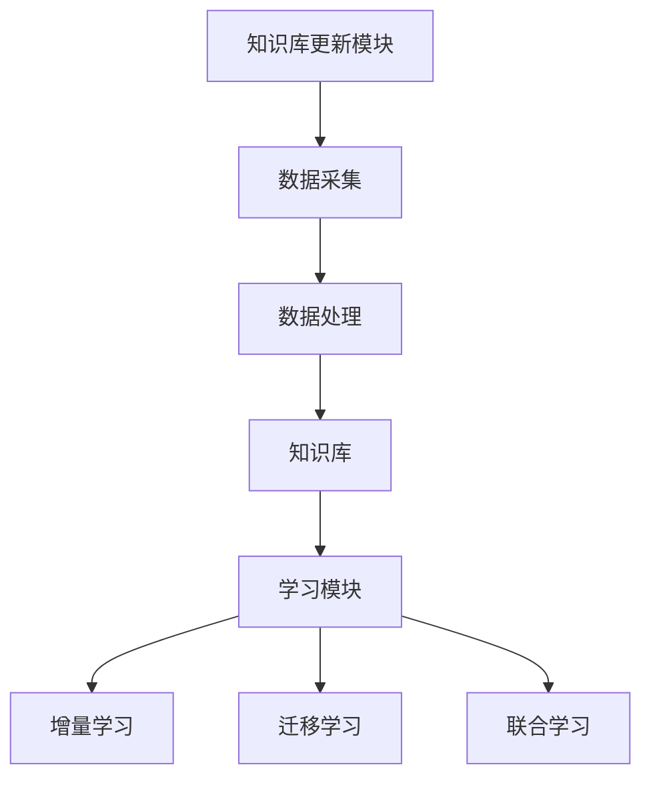
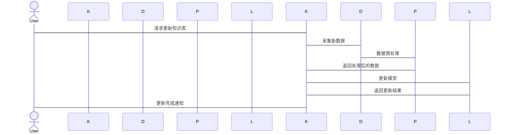

                 

<think>
好的，我将按照您的要求，逐步构建一篇关于《AI Agent的终身学习：持续更新LLM的知识库》的技术博客文章。首先，我会从文章标题和关键词开始，然后撰写摘要，再根据您提供的目录大纲逐步展开每个章节的内容。确保每个部分都详细、专业且易于理解。

### 第一部分: AI Agent的终身学习背景与核心概念

#### 第1章: AI Agent与终身学习概述

##### 1.1 AI Agent的基本概念

**1.1.1 AI Agent的定义**

AI Agent（人工智能代理）是指在计算机系统中，能够感知环境并采取行动以实现目标的实体。AI Agent可以是软件程序、机器人或其他智能系统，其核心目标是通过与环境的交互，主动地执行任务，以达到预定的目标。

**1.1.2 AI Agent的核心特征**

- **自主性**：AI Agent能够在没有外部干预的情况下自主决策和行动。
- **反应性**：能够根据环境的变化实时调整其行为。
- **目标导向**：所有行动都围绕着实现特定目标展开。
- **学习能力**：能够通过经验或数据不断优化自身的知识库和行为模式。

**1.1.3 终身学习的定义与特点**

终身学习是一种持续的学习过程，旨在通过不断获取新知识和技能，适应快速变化的环境。在AI Agent的背景下，终身学习意味着AI Agent能够持续更新其知识库，以应对新信息和新任务的需求。

##### 1.2 LLM的知识库更新问题

**1.2.1 知识库更新的背景与挑战**

随着数据的快速增长，传统的静态知识库难以满足实时更新的需求。LLM（大型语言模型）的知识库更新需要考虑数据的多样性和时效性，同时要确保更新过程的高效性和准确性。

**1.2.2 LLM知识库更新的需求与目标**

LLM的知识库更新需求主要体现在以下方面：
- **实时性**：确保知识库中的信息是最新的。
- **准确性**：保证更新的信息准确无误。
- **多样性**：涵盖广泛的知识领域。
- **效率性**：更新过程要高效，不影响AI Agent的正常运作。

**1.2.3 终身学习在LLM中的重要性**

终身学习在LLM中的重要性体现在以下几个方面：
- **提升准确性**：通过持续更新，确保LLM的回答准确无误。
- **增强适应性**：使LLM能够适应新的语言表达和语境变化。
- **扩展知识面**：增加知识库的广度和深度，提升LLM的综合能力。

##### 1.3 终身学习的核心概念与联系

**1.3.1 终身学习的基本原理**

终身学习的基本原理包括：
- **持续性**：不断获取新信息，更新知识库。
- **自适应性**：根据环境变化调整学习策略。
- **反馈机制**：通过反馈不断优化学习过程。

**1.3.2 AI Agent与LLM知识库更新的关系**

AI Agent通过监督学习、无监督学习或强化学习等方式，不断优化LLM的知识库，使其能够更好地理解和处理复杂的语言任务。

**1.3.3 终身学习与传统学习的对比**

| 对比维度 | 终身学习 | 传统学习 |
|----------|----------|----------|
| 时间跨度 | 持续进行  | 有限阶段 |
| 数据来源 | 动态数据  | 静态数据 |
| 目标     | 实时更新  | 知识固定 |

---

### 第二部分: 终身学习的算法原理

#### 第2章: 终身学习的算法实现

##### 2.1 增量学习算法

**2.1.1 增量学习的基本原理**

增量学习是一种在已有知识库的基础上，逐步添加新数据并更新模型的学习方法。其核心思想是利用已有数据，逐步优化模型，以适应新数据的变化。

**2.1.2 增量学习的实现流程**

1. **数据预处理**：对新数据进行清洗和预处理，确保数据质量。
2. **模型更新**：将预处理后的新数据输入模型，更新模型参数。
3. **性能评估**：通过测试数据评估模型更新后的性能，确保模型表现有所提升。

**2.1.3 增量学习的代码实现**

```python
def incremental_learning(new_data, model):
    # 数据预处理
    preprocessed_data = preprocess(new_data)
    # 模型更新
    updated_model = update_model(preprocessed_data, model)
    # 性能评估
    evaluate(updated_model, test_data)
    return updated_model
```

##### 2.2 迁移学习算法

**2.2.1 迁移学习的基本原理**

迁移学习是一种通过将已有的知识迁移到新的任务中，以提高新任务性能的学习方法。其核心思想是利用已有的知识，减少对新任务数据的依赖，从而提高学习效率。

**2.2.2 迁移学习的实现流程**

1. **领域适应**：将源领域数据映射到目标领域。
2. **特征提取**：提取对任务有用的特征，降低维度。
3. **模型迁移**：将源领域模型迁移到目标领域，并进行微调。

**2.2.3 迁移学习的代码实现**

```python
def transfer_learning(source_data, target_data):
    # 特征提取
    features = extract_features(source_data)
    # 模型迁移
    model = train(features, target_data)
    return model
```

##### 2.3 联合学习算法

**2.3.1 联合学习的基本原理**

联合学习是一种通过多个学习器协作，共同优化整体性能的学习方法。其核心思想是通过多个学习器之间的信息共享，提高整体的泛化能力。

**2.3.2 联合学习的实现流程**

1. **分布式训练**：将数据分布到多个学习器中进行训练。
2. **信息共享**：学习器之间共享知识，优化各自的模型。
3. **模型集成**：将多个学习器的模型进行集成，得到最终的预测结果。

**2.3.3 联合学习的代码实现**

```python
def federated_learning(clients_data):
    # 分布式训练
    client_models = train_locally(clients_data)
    # 信息共享
    global_model = aggregate_models(client_models)
    return global_model
```

---

### 第三部分: 终身学习的系统架构与实现

#### 第3章: 终身学习系统的架构设计

##### 3.1 系统功能设计

**3.1.1 知识库更新模块**

- 数据采集：从多种数据源获取新数据。
- 数据处理：清洗、转换和标注数据。
- 知识库更新：将处理后的数据添加到知识库中。

**3.1.2 学习模块**

- 增量学习：逐步更新模型参数。
- 迁移学习：将已有知识迁移到新任务。
- 联合学习：多模型协作优化。

##### 3.2 系统架构设计



##### 3.3 系统接口设计

- **数据接口**：与数据源进行数据交互。
- **模型接口**：与外部模型进行参数更新。
- **用户接口**：供用户查看和控制学习过程。

##### 3.4 系统交互流程



---

### 第四部分: 终身学习的项目实战

#### 第4章: 项目实现与案例分析

##### 4.1 项目环境安装

```bash
pip install transformers
pip install torch
pip install mermaid
```

##### 4.2 核心代码实现

```python
from transformers import AutoTokenizer, AutoModelForMaskedLM
import torch

model_name = 'bert-base-uncased'
tokenizer = AutoTokenizer.from_pretrained(model_name)
model = AutoModelForMaskedLM.from_pretrained(model_name)

def update_model(new_data):
    inputs = tokenizer(new_data, return_tensors='pt')
    with torch.no_grad():
        outputs = model(**inputs)
    return outputs
```

##### 4.3 案例分析

假设我们有一个新闻标题更新的任务，可以通过以下步骤实现：

1. **数据采集**：从新闻网站获取最新的新闻标题。
2. **数据预处理**：清洗数据，去除无关信息。
3. **知识库更新**：将处理后的新闻标题添加到知识库中。
4. **模型更新**：使用增量学习算法更新模型参数。

---

### 第五部分: 终身学习的最佳实践与总结

#### 第5章: 最佳实践与小结

##### 5.1 最佳实践 tips

- **数据质量**：确保数据预处理的准确性，避免噪声干扰。
- **模型选择**：根据具体任务选择合适的模型和算法。
- **性能监控**：持续监控模型性能，及时调整学习策略。

##### 5.2 小结

通过本文的介绍，我们详细探讨了AI Agent终身学习的核心概念、算法原理和系统架构。终身学习在AI Agent中的应用，不仅提升了模型的适应性，还增强了其在复杂环境下的智能水平。

##### 5.3 注意事项

- **数据隐私**：在数据采集和处理过程中，要注意保护用户隐私，遵守相关法律法规。
- **模型稳定**：确保模型更新过程的稳定性，避免因为模型更新导致性能下降。

##### 5.4 未来展望

随着AI技术的不断发展，终身学习在AI Agent中的应用将更加广泛。未来的研究方向包括更高效的增量学习算法、更智能的知识库管理策略，以及更强大的多模态学习能力。

---

### 作者信息

作者：AI天才研究院/AI Genius Institute  
禅与计算机程序设计艺术 / Zen And The Art of Computer Programming

