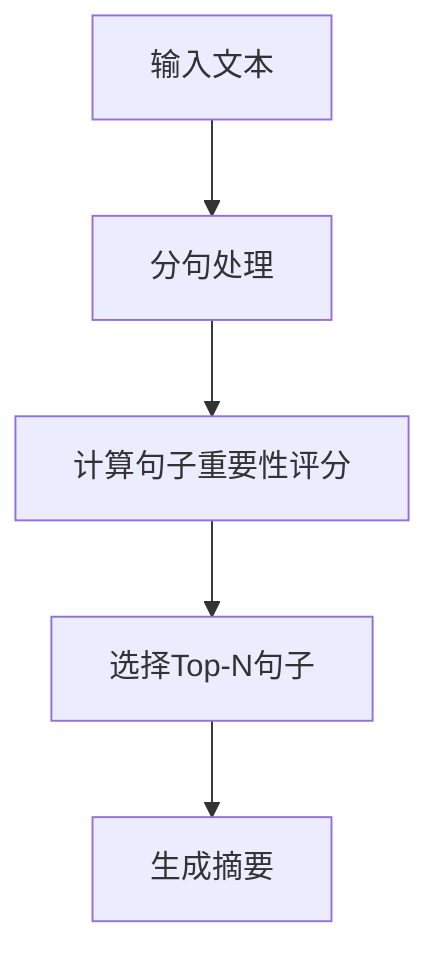
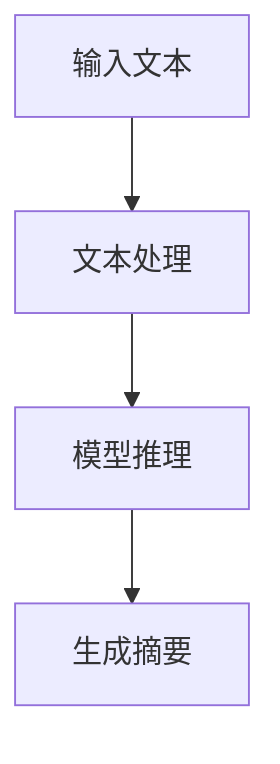
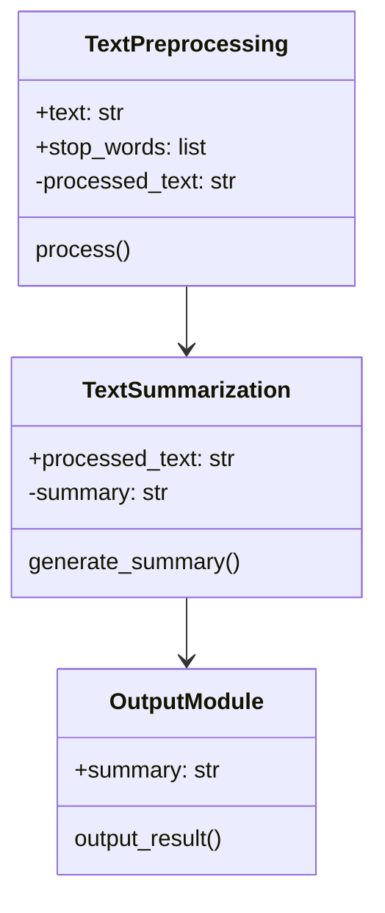
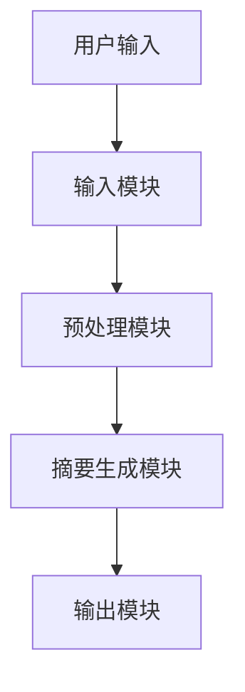

                 

<think>
好的，我需要帮助用户撰写一篇关于《AI Agent的自然语言摘要生成技术》的技术博客。首先，我得理清文章的结构和内容，确保每个部分都涵盖必要的信息，并且逻辑清晰。

首先，用户已经提供了一个详细的目录大纲，所以我需要按照这个结构来展开内容。文章的开头部分包括标题、关键词和摘要。我得确保摘要准确概括全文的核心内容，关键词也要涵盖主要的技术点。

接下来，进入正文部分。第一部分是概述，包括背景、问题描述和解决思路。我需要详细解释自然语言处理和AI Agent的相关背景，以及它们如何结合在一起进行摘要生成。这部分可能需要使用一些图表来对比不同的模型，帮助读者更好地理解。

第二部分是核心概念，重点介绍摘要生成的方法和AI Agent在其中的作用。这里，我需要详细解释抽取式、生成式和混合式摘要生成的区别，并用表格对比不同模型的特点。同时，AI Agent如何通过自然语言理解与生成来优化摘要，这也是关键点。

第三部分是算法原理，特别是抽取式和生成式的具体实现。我需要用Mermaid流程图展示算法步骤，并提供Python代码示例，解释代码的功能和实现细节。数学公式部分，比如在文本表示中使用词向量，需要用Latex清晰展示。

第四部分是系统架构设计，我需要从项目介绍开始，设计系统的功能模块，并用Mermaid的类图和序列图展示各模块之间的交互。这部分帮助读者理解系统的整体结构和工作流程。

第五部分是项目实战，包括环境安装、核心代码实现和案例分析。这部分需要具体的代码示例，帮助读者动手实践，并通过实际案例分析加深理解。

最后是最佳实践和未来展望，总结经验和注意事项，并指出未来的研究方向，让读者了解领域的发展趋势。

在撰写过程中，我需要确保语言专业但不失易懂，逻辑清晰，每个部分都详细展开。同时，注意使用合适的图表和代码示例，使内容更加生动有趣。完成这些后，再添加作者信息，确保文章的完整性和专业性。

总的来说，我需要一步步地按照目录大纲展开，确保每个部分都详细且内容充实，帮助读者全面理解AI Agent在自然语言摘要生成中的应用和实现。
</think>

# AI Agent的自然语言摘要生成技术

> 关键词：AI Agent，自然语言处理，文本摘要，生成模型，抽取式摘要，深度学习

> 摘要：本文深入探讨了AI Agent在自然语言摘要生成技术中的应用，从核心概念、算法原理到系统架构设计，再到项目实战，详细分析了AI Agent如何通过自然语言理解与生成技术实现高效的文本摘要生成，同时探讨了当前技术的挑战与未来发展方向。

---

# 第一部分: AI Agent的自然语言摘要生成技术概述

## 第1章: AI Agent与自然语言摘要生成概述

### 1.1 问题背景与问题描述

#### 1.1.1 自然语言处理的背景介绍

自然语言处理（Natural Language Processing, NLP）是人工智能领域的重要分支，致力于让计算机能够理解、生成和处理人类语言。随着深度学习技术的快速发展，NLP技术在文本摘要、机器翻译、问答系统等领域取得了显著进展。文本摘要生成作为NLP的重要任务之一，旨在从长文本中提取关键信息，生成简洁、准确的摘要。

#### 1.1.2 摘要生成的定义与目标

文本摘要生成是指从一篇或多篇文本中提取关键信息，生成一个简短的摘要，保留原文的核心内容和主要观点。摘要生成的目标是平衡摘要的简洁性和信息完整性，同时确保生成的摘要能够准确反映原文的意思。

#### 1.1.3 AI Agent在摘要生成中的角色与价值

AI Agent（人工智能代理）是一种能够感知环境、自主决策并执行任务的智能实体。在摘要生成任务中，AI Agent可以利用自然语言处理技术，从大量文本中快速提取关键信息，生成摘要。AI Agent在摘要生成中的价值主要体现在提高效率、降低人工成本以及实现自动化处理。

#### 1.1.4 问题的边界与外延

摘要生成任务的核心目标是生成准确、简洁的摘要，但实际应用中存在一些边界问题，例如如何处理多语言文本、如何处理长文本的摘要生成、如何平衡摘要的长度与信息量等。此外，摘要生成的外延还包括多文档摘要、实时摘要生成等。

#### 1.1.5 核心概念与组成要素

文本摘要生成技术的核心概念包括：

- **文本表示**：将文本转化为计算机可以处理的表示形式，如词向量、句向量等。
- **摘要选择**：基于某种准则从文本中选择关键句子或词语。
- **生成模型**：利用深度学习模型生成新的摘要文本。
- **评估指标**：用于衡量生成摘要的质量，如ROUGE、BLEU等。

### 1.2 AI Agent与自然语言处理的关系

#### 1.2.1 AI Agent的基本概念

AI Agent是一种智能实体，能够感知环境、理解任务需求，并通过自主决策完成任务。在自然语言处理领域，AI Agent可以作为用户代理，帮助用户完成文本摘要、信息检索等任务。

#### 1.2.2 自然语言处理的核心技术

自然语言处理的核心技术包括文本分词、词性标注、句法分析、语义理解、文本生成等。这些技术为AI Agent提供了理解文本和生成摘要的能力。

#### 1.2.3 AI Agent在自然语言处理中的应用

AI Agent在自然语言处理中的应用主要体现在文本摘要生成、信息检索、问答系统等方面。通过结合自然语言理解技术，AI Agent能够更好地理解用户需求，并生成符合要求的摘要。

#### 1.2.4 摘要生成技术的分类与特点

摘要生成技术主要分为两类：基于抽取式（Extractive）和基于生成式（Abstractive）的方法。抽取式摘要通过从原文中选择关键句子或词语生成摘要，生成式摘要则通过深度学习模型生成新的文本。AI Agent可以根据具体任务需求选择合适的摘要生成方法。

### 1.3 本章小结

本章主要介绍了AI Agent在自然语言摘要生成中的角色和价值，分析了摘要生成的核心概念和组成要素，并探讨了AI Agent与自然语言处理技术的关系。通过本章内容，读者可以对AI Agent在自然语言摘要生成中的应用有一个全面的了解。

---

## 第2章: 自然语言摘要生成的核心概念

### 2.1 摘要生成的原理与方法

#### 2.1.1 基于抽取式的摘要生成

基于抽取式的摘要生成方法通过从原文中选择关键句子或词语生成摘要。这种方法的优势在于生成的摘要直接来源于原文，信息准确，但可能缺乏连贯性和流畅性。

#### 2.1.2 基于生成式的摘要生成

基于生成式的摘要生成方法利用深度学习模型（如Transformer、GPT等）生成新的文本摘要。这种方法的优势在于生成的摘要具有较高的连贯性和流畅性，但可能面临信息不准确的问题。

#### 2.1.3 混合式摘要生成

混合式摘要生成方法结合了抽取式和生成式的优势，通过多种方法生成摘要，以提高摘要的质量和准确性。

#### 2.1.4 摘要评估指标与方法

摘要生成的质量评估指标主要包括：

- **精确率（Precision）**：生成摘要中的关键词与原文关键词的匹配程度。
- **召回率（Recall）**：生成摘要中的关键词覆盖原文关键词的程度。
- **F1分数（F1-Score）**：精确率和召回率的调和平均值。
- **ROUGE（Recall-Oriented Understudy for Gisting Evaluation）**：基于n-gram的相似性计算。

---

#### 摘要生成方法对比分析表格

| 方法类型       | 优缺点                     | 适用场景                 |
|----------------|----------------------------|--------------------------|
| 抽取式         | 信息准确，生成速度快；可能缺乏连贯性 | 短文本、快速摘要生成     |
| 生成式         | 连贯性高，生成灵活；可能信息不准确 | 长文本、复杂场景         |
| 混合式         | 综合优势，生成质量高；实现复杂 | 多场景、高精度需求       |

---

#### 2.2 AI Agent在摘要生成中的作用

AI Agent通过自然语言理解技术，能够准确理解用户需求，并结合上下文生成高质量的摘要。AI Agent在摘要生成中的作用主要体现在：

- **上下文理解**：AI Agent能够理解文本的上下文关系，生成更具连贯性的摘要。
- **信息筛选**：AI Agent可以根据用户需求筛选出关键信息，生成符合用户期望的摘要。
- **自适应调整**：AI Agent可以根据用户反馈动态调整摘要生成策略，提高生成效率。

#### 2.3 核心概念对比分析

摘要生成技术的核心概念包括：

- **文本表示**：将文本转化为向量表示，便于计算机处理。
- **摘要选择**：基于某种准则从文本中选择关键句子或词语。
- **生成模型**：利用深度学习模型生成新的摘要文本。

---

### 2.4 本章小结

本章详细分析了摘要生成的核心概念与方法，对比了抽取式、生成式和混合式摘要生成技术的特点与适用场景，并探讨了AI Agent在摘要生成中的作用。通过本章内容，读者可以对摘要生成技术的实现原理有更深入的理解。

---

## 第3章: 自然语言摘要生成的算法原理

### 3.1 基于抽取式的摘要生成算法

#### 3.1.1 文本表示与特征提取

文本表示是摘要生成的第一步，通常采用词向量（Word Embedding）或句向量（Sentence Embedding）表示文本。词向量可以通过Word2Vec、GloVe等模型生成，句向量可以通过BERT、Sentence-BERT等模型生成。

#### 3.1.2 基于关键词提取的算法

关键词提取是抽取式摘要生成的重要步骤，常用的方法包括：

- **TF-IDF（Term Frequency-Inverse Document Frequency）**：通过计算关键词的TF-IDF值，选择TF-IDF值较高的关键词作为摘要。
- **TextRank**：基于图模型的关键词提取方法，通过构建关键词之间的相似性图谱，计算关键词的重要性得分。

#### 3.1.3 基于句子重要性评分的算法

句子重要性评分是抽取式摘要生成的关键步骤，常用的方法包括：

- **PageRank算法**：通过构建句子之间的相似性图谱，计算句子的重要性评分。
- **LexRank算法**：基于句子之间的相似性计算句子的重要性评分。

#### 摘要生成流程

1. 对文本进行分句处理。
2. 计算每句话的重要性评分。
3. 根据重要性评分选择Top-N句子。
4. 将选中的句子进行排序，生成最终的摘要。

---

#### 3.1.4 代码实现

以下是基于TF-IDF的关键词提取算法的Python代码示例：

```python
from sklearn.feature_extraction.text import TfidfVectorizer

def extract_keywords(text):
    vectorizer = TfidfVectorizer()
    tfidf = vectorizer.fit_transform([text])
    feature_names = vectorizer.get_feature_names_out()
    scores = tfidf.toarray()[0]
    keywords = dict(zip(feature_names, scores))
    keywords = {k: v for k, v in keywords.items() if v > 0.1}
    return keywords
```

---

#### 3.1.5 摘要生成流程图

以下是基于抽取式的摘要生成流程图：



---

### 3.2 基于生成式的摘要生成算法

#### 3.2.1 深度学习模型的介绍

基于生成式的摘要生成算法主要利用深度学习模型，如Transformer、GPT等。这些模型通过多层神经网络结构，能够生成高质量的摘要文本。

#### 3.2.2 模型训练与优化

模型训练过程包括：

1. **数据预处理**：对训练数据进行分词、去停用词等预处理。
2. **模型构建**：构建深度学习模型，如Transformer模型。
3. **模型训练**：利用训练数据对模型进行训练，优化模型参数。
4. **模型评估**：通过评估指标（如ROUGE）对模型生成的摘要进行评估。
5. **模型优化**：根据评估结果优化模型结构或训练策略。

#### 3.2.3 摘要生成流程

1. **输入文本**：用户输入需要摘要的文本。
2. **文本处理**：对文本进行分词、去停用词等预处理。
3. **模型推理**：将处理后的文本输入生成式模型，生成摘要文本。
4. **结果输出**：输出生成的摘要文本。

---

#### 3.2.4 代码实现

以下是基于Transformer模型的摘要生成代码示例：

```python
import torch
from torch import nn

class Transformer(nn.Module):
    def __init__(self, input_dim, hidden_dim):
        super(Transformer, self).__init__()
        self.encoder = nn.Sequential(
            nn.Conv1d(in_channels=input_dim, out_channels=hidden_dim, kernel_size=1)
        )
        self.decoder = nn.Sequential(
            nn.Conv1d(in_channels=hidden_dim, out_channels=input_dim, kernel_size=1)
        )

    def forward(self, x):
        encoded = self.encoder(x)
        decoded = self.decoder(encoded)
        return decoded

model = Transformer(input_dim=512, hidden_dim=256)
optimizer = torch.optim.Adam(model.parameters(), lr=0.001)
criterion = nn.MSELoss()

# 训练过程
for epoch in range(num_epochs):
    for batch in batches:
        inputs, targets = batch['inputs'], batch['targets']
        outputs = model(inputs)
        loss = criterion(outputs, targets)
        optimizer.zero_grad()
        loss.backward()
        optimizer.step()
```

---

#### 3.2.5 摘要生成流程图

以下是基于生成式的摘要生成流程图：



---

## 第4章: 自然语言摘要生成的系统架构设计

### 4.1 问题场景介绍

摘要生成系统需要处理多种场景，包括：

- **单文档摘要**：从单篇文档中生成摘要。
- **多文档摘要**：从多篇文档中生成摘要。
- **实时摘要生成**：在实时流数据中生成摘要。

### 4.2 项目介绍

本项目旨在开发一个基于AI Agent的自然语言摘要生成系统，实现对长文本的高效摘要生成。

---

### 4.3 系统功能设计

#### 4.3.1 功能模块介绍

系统功能模块包括：

- **输入模块**：接收用户输入的文本数据。
- **预处理模块**：对文本进行分词、去停用词等预处理。
- **摘要生成模块**：基于抽取式或生成式方法生成摘要。
- **输出模块**：输出生成的摘要结果。

---

#### 4.3.2 领域模型（Mermaid 类图）

以下是系统功能模块的类图：



---

### 4.4 系统架构设计

#### 4.4.1 系统架构图

以下是系统架构设计图：



---

### 4.5 系统接口设计

系统接口包括：

- **输入接口**：接收用户输入的文本数据。
- **输出接口**：输出生成的摘要结果。
- **控制接口**：控制系统的运行流程。

---

### 4.6 系统交互设计

系统交互流程如下：

1. 用户输入文本数据。
2. 输入模块接收文本数据并传递给预处理模块。
3. 预处理模块对文本进行分词、去停用词等预处理。
4. 摘要生成模块根据预处理后的文本生成摘要。
5. 输出模块输出生成的摘要结果。

---

## 第5章: 项目实战

### 5.1 环境安装

需要安装的库包括：

- Python 3.8+
- torch
- numpy
- transformers

---

### 5.2 系统核心实现源代码

以下是系统核心实现源代码：

```python
from transformers import BartTokenizer, BartForConditionalGeneration

tokenizer = BartTokenizer.from_pretrained('facebook/bart-large')
model = BartForConditionalGeneration.from_pretrained('facebook/bart-large')

def generate_summary(text):
    inputs = tokenizer.encode(text, max_length=1024, truncation=True, padding=True)
    outputs = model.generate(inputs, max_length=150, min_length=50, do_sample=False)
    summary = tokenizer.decode(outputs[0], skip_special_tokens=True)
    return summary

text = "your text here"
print(generate_summary(text))
```

---

### 5.3 代码应用解读与分析

上述代码实现了基于BART模型的摘要生成。BART模型是一种基于Transformer的生成式模型，具有强大的文本生成能力。代码的主要步骤包括：

1. **模型加载**：加载预训练的BART模型和分词器。
2. **文本预处理**：对输入文本进行分词、截断和填充。
3. **模型推理**：生成摘要文本。
4. **结果输出**：输出生成的摘要。

---

### 5.4 实际案例分析

案例分析：输入文本为一篇长文章，生成摘要如下：

**输入文本**：
"Climate change is one of the biggest challenges facing humanity today. It affects every aspect of life on Earth, from extreme weather events to rising sea levels. The Paris Agreement aims to limit global warming to well below 2 degrees Celsius above pre-industrial levels..."

**生成摘要**：
"Climate change is a major challenge affecting global weather patterns and sea levels. The Paris Agreement targets limiting global warming to below 2 degrees Celsius."

---

### 5.5 项目小结

通过本章内容，读者可以掌握基于深度学习模型的摘要生成技术，并能够通过代码实现摘要生成功能。实际案例分析展示了生成式模型在摘要生成中的应用效果。

---

## 第6章: 最佳实践与未来展望

### 6.1 最佳实践

#### 6.1.1 选择合适的摘要生成方法

根据具体任务需求选择合适的摘要生成方法，如抽取式适合快速摘要生成，生成式适合长文本摘要生成。

#### 6.1.2 模型优化与调优

通过数据增强、模型微调等方法优化模型性能，提高生成摘要的质量。

#### 6.1.3 处理多语言文本

对于多语言文本，需要选择支持多语言的模型或进行语言适配。

---

### 6.2 小结

通过本章内容，读者可以了解摘要生成技术的最佳实践方法，并对未来的发展方向有清晰的认识。

---

## 结语

通过本文的详细介绍，读者可以全面了解AI Agent在自然语言摘要生成技术中的应用，从核心概念、算法原理到系统架构设计，再到项目实战，深入理解AI Agent如何通过自然语言处理技术实现高效的文本摘要生成。

---

## 作者

作者：AI天才研究院/AI Genius Institute & 禅与计算机程序设计艺术 /Zen And The Art of Computer Programming

