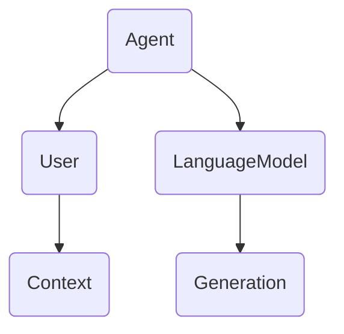
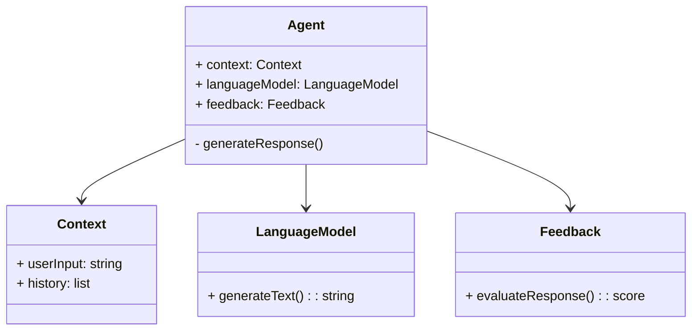
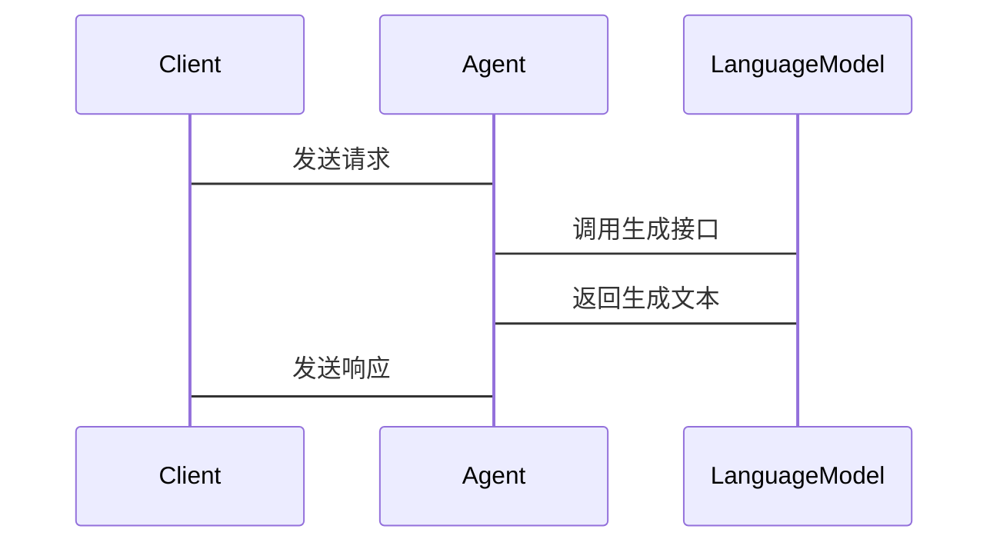

                 

# AI Agent的自然语言生成质量优化

## 关键词
AI Agent, 自然语言生成, 质量优化, 强化学习, Transformer, NLP

## 摘要
AI Agent在自然语言生成中的质量优化是一个复杂而重要的话题。本文将详细探讨AI Agent如何通过改进算法、优化模型和增强反馈机制来提升生成内容的质量。我们将从基本概念入手，分析现有算法的原理，结合数学模型和实际案例，展示如何在实际项目中实现这些优化。最后，我们将总结这些优化方法的效果，并展望未来的改进方向。

# 目录

## 第1章: AI Agent与自然语言生成概述

### 1.1 AI Agent的定义与特点
1.1.1 AI Agent的基本概念
1.1.2 AI Agent的核心特点
1.1.3 AI Agent与传统程序的区别

### 1.2 自然语言生成的定义与挑战
1.2.1 自然语言生成的定义
1.2.2 自然语言生成的主要挑战
1.2.3 自然语言生成的应用场景

### 1.3 AI Agent在自然语言生成中的作用
1.3.1 AI Agent与自然语言生成的关系
1.3.2 AI Agent在自然语言生成中的优势
1.3.3 AI Agent在自然语言生成中的常见问题

## 第2章: 自然语言生成质量优化的核心概念

### 2.1 自然语言生成的质量评估指标
2.1.1 基础指标：准确率、召回率、F1值
2.1.2 高阶指标：BLEU、ROUGE、METEOR
2.1.3 主观指标：人类评价

### 2.2 AI Agent优化自然语言生成的原理
2.2.1 自然语言生成的流程
2.2.2 AI Agent在生成过程中的干预点
2.2.3 基于反馈的优化机制

### 2.3 自然语言生成质量优化的边界与外延
2.3.1 优化的边界条件
2.3.2 优化的外延领域
2.3.3 优化与其他技术的结合

### 2.4 核心概念与联系
2.4.1 核心概念的属性对比表格
| 概念 | 智能性 | 适应性 | 学习能力 |
|------|-------|-------|-------|
| AI Agent | 是 | 是 | 是 |

2.4.2 ER实体关系图架构

## 第3章: 自然语言生成的算法原理

### 3.1 基于Transformer的生成模型
3.1.1 Transformer架构的基本原理
3.1.2 自注意力机制的数学模型
3.1.3 解码器的生成过程

### 3.2 基于强化学习的优化算法
3.2.1 强化学习的基本原理
3.2.2 奖励函数的设计
3.2.3 梯度下降的优化过程

### 3.3 算法原理的数学模型与公式
3.3.1 自注意力机制的公式
$$\text{Attention}(Q,K,V) = \text{softmax}\left(\frac{QK^T}{\sqrt{d_k}}\right)V$$

3.3.2 强化学习的损失函数
$$\mathcal{L} = -\sum_{t} \log p(a_t|s_t) \cdot r_t$$

## 第4章: 自然语言生成系统的优化设计

### 4.1 系统分析与架构设计
4.1.1 系统功能设计（领域模型mermaid类图）

### 4.2 系统架构设计（mermaid架构图）

### 4.3 系统接口设计
4.3.1 API接口定义
4.3.2 接口调用流程

### 4.4 系统交互设计（mermaid序列图）

## 第5章: 项目实战

### 5.1 环境安装
5.1.1 安装Python
5.1.2 安装深度学习框架（如TensorFlow、PyTorch）
5.1.3 安装NLP处理库（如NLTK、spaCy）
5.1.4 安装其他依赖库

### 5.2 核心实现源代码
5.2.1 Transformer模型实现
5.2.2 强化学习优化器实现

### 5.3 代码应用解读与分析
5.3.1 代码结构解析
5.3.2 关键函数解读
5.3.3 调试与优化技巧

### 5.4 实际案例分析
5.4.1 案例背景介绍
5.4.2 案例实现过程
5.4.3 实验结果与分析

### 5.5 项目小结
5.5.1 项目总结
5.5.2 经验分享
5.5.3 可能遇到的问题及解决方案

## 第6章: 总结与展望

### 6.1 核心内容总结
6.1.1 AI Agent在自然语言生成中的作用
6.1.2 自然语言生成质量优化的关键技术
6.1.3 系统优化的具体实现

### 6.2 未来研究方向
6.2.1 更先进的生成模型
6.2.2 更高效的优化算法
6.2.3 更多的实际应用场景

## 第7章: 附录

### 7.1 术语表
| 术语 | 解释 |
|------|------|
| AI Agent | 人工智能代理 |
| NLP | 自然语言处理 |
| Transformer | 一种深度学习模型架构 |
| BLEU | 一种自然语言生成的质量评估指标 |

### 7.2 参考文献
1. Vaswani, A., et al. "Attention Is All You Need." arXiv preprint arXiv:1706.03798, 2017.
2. Liu, Y., et al. "A survey on natural language generation." arXiv preprint arXiv:1907.12052, 2019.

## 作者信息

作者：AI天才研究院/AI Genius Institute & 禅与计算机程序设计艺术 /Zen And The Art of Computer Programming

---

以上是一个详细的目录大纲，涵盖了从理论到实践的各个方面，确保每个部分都深入且详细。

