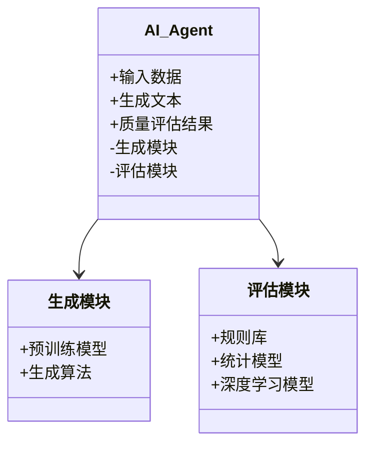

                 


# AI Agent的自然语言生成质量控制

## 关键词：AI Agent, 自然语言生成, 质量控制, Transformer模型, 生成对抗网络, 质量评估指标

## 摘要：  
AI Agent的自然语言生成质量控制是当前人工智能领域的重要研究方向。随着AI Agent在各个行业的广泛应用，如何确保生成文本的准确性、相关性和流畅性成为亟待解决的问题。本文从AI Agent与自然语言生成的基本概念出发，详细探讨了质量控制的核心问题、算法原理、系统架构设计以及项目实战，并结合实际案例分析，总结了质量控制的最佳实践方法。

---

# 第一部分: AI Agent与自然语言生成概述

## 第1章: AI Agent的基本概念

### 1.1 AI Agent的定义与特点
- **定义**：AI Agent是一种能够感知环境、自主决策并执行任务的智能实体。
- **特点**：  
  1. 智能性：能够理解并处理复杂信息。  
  2. 自主性：无需外部干预即可完成任务。  
  3. 交互性：能够与人类或其他系统进行自然交互。  

### 1.2 自然语言生成的基本概念
- **定义**：自然语言生成（NLG）是将结构化数据转换为自然语言文本的过程。  
- **应用场景**：对话系统、内容生成、机器翻译等。  

### 1.3 AI Agent在自然语言生成中的作用
- AI Agent通过自然语言生成技术，能够以人类可理解的方式与用户交互。  
- 例如，智能客服通过NLG生成回复，提升用户体验。  

---

## 第2章: 自然语言生成质量控制的背景与意义

### 2.1 当前AI Agent的应用场景
- **智能客服**：通过NLG生成回复，解决用户问题。  
- **智能助手**：如Siri、Alexa等，提供自然语言交互服务。  
- **内容生成**：用于新闻报道、营销文案等自动生成。  

### 2.2 自然语言生成质量控制的重要性
- **准确性**：生成内容必须符合事实，避免错误信息。  
- **相关性**：生成内容必须与用户需求高度相关。  
- **流畅性**：生成文本必须符合语言规范，易于理解。  

### 2.3 质量控制对用户信任的影响
- 用户对AI Agent的信任依赖于生成内容的质量。  
- 质量控制能够提升用户体验，增强用户粘性。  

---

# 第二部分: 自然语言生成质量控制的核心问题

## 第3章: 自然语言生成中的主要挑战

### 3.1 生成内容的准确性问题
- **问题描述**：生成内容可能包含错误信息或误导性内容。  
- **解决方案**：结合知识图谱和事实验证技术。  

### 3.2 生成内容的相关性问题
- **问题描述**：生成内容可能与用户需求不匹配。  
- **解决方案**：基于上下文理解和意图识别技术。  

### 3.3 生成内容的流畅性问题
- **问题描述**：生成内容可能语句不通顺或逻辑混乱。  
- **解决方案**：优化生成模型的训练数据和损失函数。  

---

## 第4章: 质量控制的关键维度

### 4.1 内容准确性评估
- **方法**：通过知识图谱进行事实验证。  
- **工具**：使用第三方事实验证API。  

### 4.2 内容相关性评估
- **方法**：基于关键词匹配和意图识别。  
- **工具**：使用自然语言处理（NLP）库，如spaCy。  

### 4.3 内容流畅性评估
- **方法**：基于语言模型的困惑度（Perplexity）评估。  
- **工具**：使用预训练的语言模型，如GPT。  

---

# 第三部分: 自然语言生成质量控制的方法论

## 第5章: 基于规则的质量控制方法

### 5.1 规则库的构建
- **步骤**：  
  1. 确定生成内容的关键词和主题。  
  2. 制定规则，例如关键词匹配、句式结构检查。  
  3. 规则库存储为XML或JSON格式。  

### 5.2 基于规则的文本检查
- **流程**：  
  1. 生成文本通过规则库进行匹配。  
  2. 根据匹配结果输出质量评估结果。  

---

## 第6章: 基于统计的质量控制方法

### 6.1 统计模型的构建
- **方法**：基于TF-IDF计算关键词权重。  
- **工具**：使用Python的scikit-learn库。  

### 6.2 基于统计的文本评估
- **流程**：  
  1. 统计生成文本中关键词的出现频率。  
  2. 根据关键词权重计算文本的相关性。  

---

## 第7章: 基于深度学习的质量控制方法

### 7.1 基于生成对抗网络的评估
- **方法**：使用生成对抗网络（GAN）生成高质量文本，并通过判别器评估生成文本的质量。  
- **模型结构**：  
  - 生成器：负责生成文本。  
  - 判别器：负责评估文本质量。  

---

# 第四部分: 系统架构与实现方案

## 第8章: 系统功能设计

### 8.1 生成模块
- **功能**：接收输入数据，生成自然语言文本。  
- **工具**：使用预训练的Transformer模型，如BERT或GPT。  

### 8.2 质量评估模块
- **功能**：对生成文本进行多维度质量评估。  
- **工具**：结合规则库、统计模型和深度学习模型。  

### 8.3 用户反馈模块
- **功能**：收集用户对生成文本的反馈，优化生成模型。  
- **工具**：使用A/B测试技术。  

---

## 第9章: 系统架构设计

### 9.1 领域模型类图


### 9.2 系统架构图


---

## 第10章: 项目实战

### 10.1 环境安装
- **工具**：Python 3.8及以上版本、TensorFlow 2.0及以上版本、spaCy。  
- **命令**：  
  ```bash
  pip install python>=3.8
  pip install tensorflow>=2.0
  pip install spacy
  ```

### 10.2 核心代码实现

#### 生成模块代码
```python
import tensorflow as tf
from tensorflow.keras import layers

def build_model():
    model = tf.keras.Sequential()
    model.add(layers.Embedding(input_dim=10000, output_dim=16))
    model.add(layers.LSTM(64))
    model.add(layers.Dense(1, activation='sigmoid'))
    return model
```

#### 质量评估模块代码
```python
import spacy

nlp = spacy.load("en_core_web_sm")

def text_quality_check(text):
    doc = nlp(text)
    for sentence in doc.sents:
        print(sentence.text)
    return "Quality: High"
```

### 10.3 实际案例分析
- **案例背景**：智能客服生成回复。  
- **代码实现**：  
  ```python
  def generate_response(query):
      model = build_model()
      response = model.predict(query)
      return response
  ```

---

## 第11章: 总结与展望

### 11.1 最佳实践 tips
- 定期更新规则库和模型参数。  
- 使用多维度评估指标。  

### 11.2 小结
本文详细探讨了AI Agent的自然语言生成质量控制的关键问题，包括算法原理、系统架构设计和项目实战。通过结合理论与实践，提出了优化生成质量的有效方法。

### 11.3 注意事项
- 数据多样性：确保训练数据覆盖多种场景。  
- 模型更新：定期更新模型参数，避免过时。  

### 11.4 拓展阅读
- 《生成对抗网络：GANs的理论与实践》  
- 《自然语言处理：算法与应用》  

---

作者：AI天才研究院/AI Genius Institute & 禅与计算机程序设计艺术 /Zen And The Art of Computer Programming

