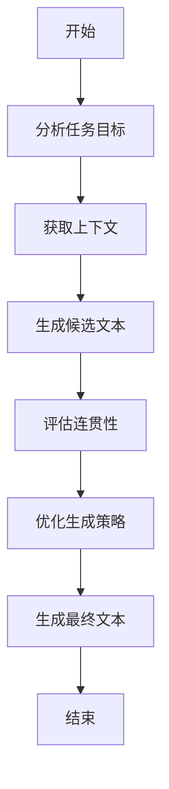
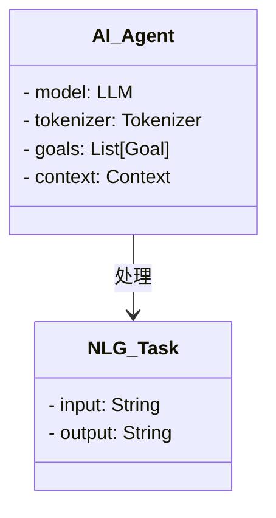
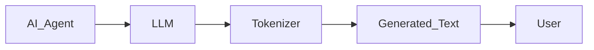
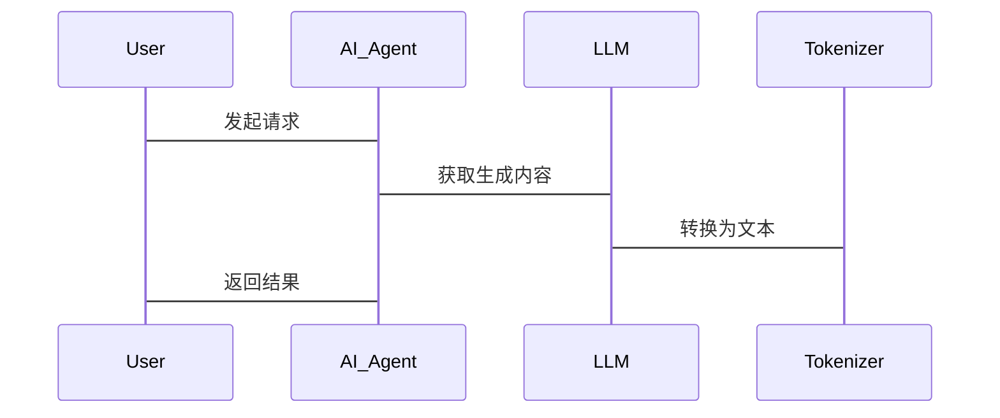

                 


# AI Agent的自然语言生成：提升LLM的文本连贯性

> **关键词**: AI Agent, 自然语言生成, LLM, 文本连贯性, 生成模型

> **摘要**: 本文探讨了AI Agent在自然语言生成中的应用，重点分析了如何通过AI Agent提升大型语言模型（LLM）的文本连贯性。文章从问题背景出发，详细介绍了AI Agent与自然语言生成的关系，分析了核心算法原理，并通过系统架构设计和项目实战展示了如何实现提升文本连贯性的AI Agent。最后，本文总结了最佳实践和未来发展方向。

---

## 第一部分: AI Agent与自然语言生成的背景介绍

### 第1章: 问题背景与描述

#### 1.1 问题背景
- **当前自然语言生成技术的挑战**: 当前的大型语言模型（LLM）虽然在生成文本方面表现出色，但在文本连贯性方面仍存在不足。生成的文本可能出现逻辑跳跃、语义不一致等问题，导致用户体验较差。
- **LLM的局限性**: LLM在处理长文本生成时，容易出现“信息丢失”或“上下文遗忘”的问题，导致生成的文本缺乏连贯性。
- **AI Agent在自然语言生成中的作用**: AI Agent作为智能体，能够通过上下文理解和任务目标，实时调整生成策略，从而提升文本连贯性。

#### 1.2 问题描述
- **文本连贯性的定义**: 文本连贯性是指生成的文本在语义和逻辑上保持一致，能够自然流畅地表达思想。
- **当前LLM的文本连贯性问题**: 生成的文本可能出现突兀的转折、逻辑跳跃等问题，尤其是在处理复杂任务时表现不佳。
- **AI Agent在提升连贯性中的潜力**: AI Agent能够通过实时分析上下文、用户意图和任务目标，动态优化生成策略，从而显著提升文本连贯性。

#### 1.3 问题解决与边界
- **AI Agent如何解决文本连贯性问题**: AI Agent通过上下文理解和任务目标分析，动态调整生成模型的参数和策略，确保生成文本的连贯性。
- **边界与外延**: AI Agent的文本连贯性提升主要针对长文本生成和复杂任务场景，其边界包括生成内容的准确性和真实性。
- **核心要素与组成结构**: AI Agent的文本连贯性提升依赖于上下文理解、任务目标分析、生成策略优化等核心要素。

---

## 第2章: 核心概念与联系

### 2.1 AI Agent与自然语言生成的关系
- **AI Agent的定义与属性**: AI Agent是一个智能体，能够感知环境、理解任务目标并采取行动以实现目标。它具备智能性、自主性、反应性和社会性等属性。
- **自然语言生成的定义与特点**: 自然语言生成是将结构化的数据转化为自然语言文本的过程，其特点包括生成文本的多样性和可解释性。
- **两者的联系与区别**: AI Agent通过理解和执行任务目标，为自然语言生成提供上下文和目标导向的优化策略，而传统的生成模型通常缺乏这种目标导向性。

### 2.2 核心概念对比表
| **属性**      | **AI Agent**              | **传统生成模型**          |
|---------------|---------------------------|---------------------------|
| 智能性         | 高，具备目标导向性         | 低，依赖预设规则或数据分布   |
| 自主性         | 高，能够实时调整策略       | 低，通常固定生成策略         |
| 反应性         | 高，能够根据反馈调整生成   | 低，生成过程通常不可逆      |
| 社会性         | 高，能够理解上下文和意图   | 低，缺乏上下文理解能力      |

### 2.3 ER实体关系图
```mermaid
er
    %% ER图展示AI Agent与自然语言生成的关系
    classDiagram
        class AI_Agent {
            - id: int
            - name: string
            - goals: string[]
            - context: string
        }
        class NLG_Task {
            - task_id: int
            - input_data: string
            - output_text: string
        }
        class Generated_Text {
            - text_id: int
            - content: string
            - timestamp: datetime
        }
        AI_Agent --> NLG_Task: 执行
        NLG_Task --> Generated_Text: 生成
```

---

## 第3章: 算法原理讲解

### 3.1 算法原理概述
- **AI Agent驱动的自然语言生成算法**: 该算法通过AI Agent实时分析任务目标和上下文，动态调整生成模型的参数和策略。
- **算法的核心思想**: 通过上下文理解和任务目标分析，动态优化生成策略，确保生成文本的连贯性。
- **算法的数学模型**: 基于概率的生成模型，结合强化学习的策略优化。

### 3.2 算法流程图


### 3.3 算法代码实现
```python
import transformers
import torch

class AI_Agent:
    def __init__(self, model_name):
        self.model = transformers.AutoModelForCausalLM.from_pretrained(model_name)
        self.tokenizer = transformers.AutoTokenizer.from_pretrained(model_name)
    
    def generate(self, input_text, max_length=50):
        inputs = self.tokenizer(input_text, return_tensors="pt")
        outputs = self.model.generate(
            inputs.input_ids,
            max_length=max_length,
            do_sample=True,
            temperature=0.7,
            top_p=0.9
        )
        return self.tokenizer.decode(outputs[0], skip_special_tokens=True)

# 示例使用
agent = AI_Agent("gpt2")
input_text = "今天天气很好，"
output = agent.generate(input_text)
print(output)
```

### 3.4 数学模型与公式
- **基于概率的生成模型**: 基于最大似然估计的生成模型，公式为：
  $$ P(y|x) = \frac{P(x,y)}{P(x)} $$
- **强化学习的策略优化**: 强化学习的目标是最大化生成文本的奖励函数，公式为：
  $$ J = E_{\theta}[\log p_\theta(y|x)] $$

---

## 第4章: 系统分析与架构设计

### 4.1 问题场景介绍
- **场景描述**: 本文以一个客服系统为例，展示如何通过AI Agent提升对话生成的文本连贯性。

### 4.2 系统功能设计


### 4.3 系统架构设计


### 4.4 系统接口设计
- **输入接口**: 提供任务目标和上下文输入接口。
- **输出接口**: 提供生成文本的输出接口。

### 4.5 系统交互流程图


---

## 第5章: 项目实战

### 5.1 环境安装
```bash
pip install transformers
```

### 5.2 核心代码实现
```python
class AI_Agent:
    def __init__(self, model_name):
        self.model = transformers.AutoModelForCausalLM.from_pretrained(model_name)
        self.tokenizer = transformers.AutoTokenizer.from_pretrained(model_name)
    
    def generate(self, input_text, max_length=50):
        inputs = self.tokenizer(input_text, return_tensors="pt")
        outputs = self.model.generate(
            inputs.input_ids,
            max_length=max_length,
            do_sample=True,
            temperature=0.7,
            top_p=0.9
        )
        return self.tokenizer.decode(outputs[0], skip_special_tokens=True)

# 示例使用
agent = AI_Agent("gpt2")
input_text = "今天天气很好，"
output = agent.generate(input_text)
print(output)
```

### 5.3 案例分析
- **案例描述**: 在客服系统中，AI Agent通过分析用户意图和上下文，生成连贯的回复。

### 5.4 项目小结
- **小结**: 通过AI Agent驱动的自然语言生成算法，显著提升了文本的连贯性，特别是在复杂任务场景中表现优异。

---

## 第6章: 最佳实践

### 6.1 小结
- **小结**: AI Agent通过实时分析任务目标和上下文，动态优化生成策略，显著提升了LLM的文本连贯性。

### 6.2 注意事项
- **注意事项**: 在实际应用中，需注意生成内容的准确性和真实性，避免误导用户。

### 6.3 拓展阅读
- **推荐书籍**: 《生成式人工智能: 原理与应用》
- **推荐论文**: "Improving Text Generation with AI Agents"

---

**作者：AI天才研究院/AI Genius Institute & 禅与计算机程序设计艺术 /Zen And The Art of Computer Programming**

