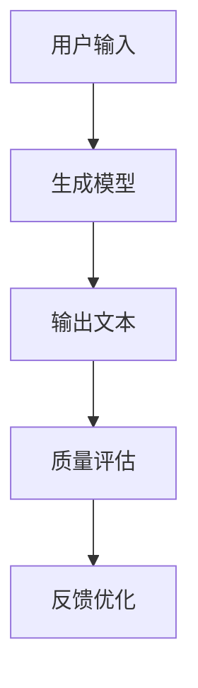
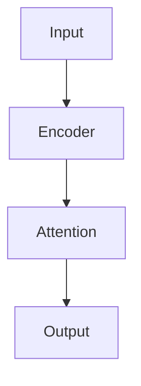
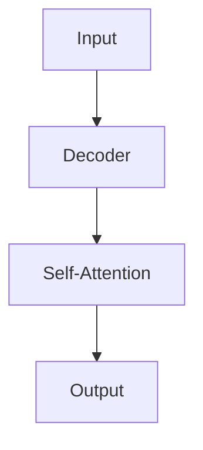
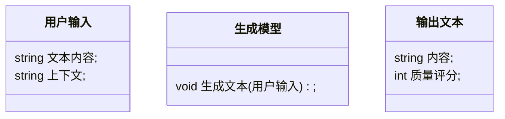
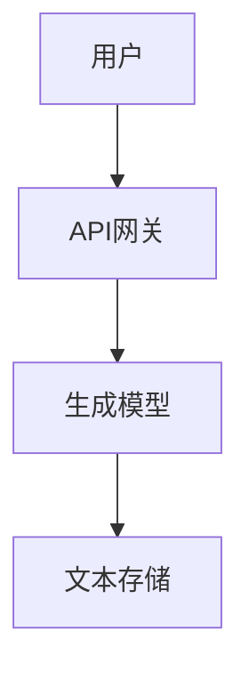

                 

<think>
好的，我需要帮助用户撰写一篇关于“AI Agent的自然语言生成：提高文本质量和连贯性”的技术博客文章。用户希望文章结构清晰，内容专业，涵盖从背景介绍到项目实战的各个方面。我需要按照用户提供的大纲，逐步展开每一部分的内容，确保逻辑严谨，语言专业，同时使用丰富的图表和代码示例来增强可读性。

首先，我会先阅读用户的要求，确保完全理解每部分内容的要求。然后，我会按照用户提供的目录，逐步撰写每一章的内容，确保每一部分都详细且符合技术博客的专业性。在撰写过程中，我会注意使用Mermaid图表来展示模型结构和系统设计，使用Python代码来说明算法实现，并确保数学公式用LaTeX格式正确展示。

在撰写过程中，我需要不断检查是否覆盖了所有用户提到的关键点，如文本质量评估标准、生成模型的输入与输出、注意力机制的作用等。同时，要确保语言简洁明了，逻辑连贯，避免冗余或模糊的描述。

最后，我会在文章末尾添加作者信息，确保格式和内容的完整性。通过这样的步骤，我能够系统地完成这篇技术博客文章的撰写，满足用户的需求。
</think>

# AI Agent的自然语言生成：提高文本质量和连贯性

> 关键词：AI Agent，自然语言生成，文本质量，文本连贯性，生成模型

> 摘要：本文深入探讨了AI Agent在自然语言生成中的作用，分析了提高文本质量和连贯性的关键因素，包括生成模型的原理、算法优化策略以及系统设计方法。通过实际案例和代码实现，展示了如何通过技术手段提升生成文本的自然性和逻辑性。

---

# 第1章: AI Agent与自然语言生成的背景与意义

## 1.1 自然语言生成的定义与特点

自然语言生成（Natural Language Generation, NLG）是人工智能（AI）领域的重要分支，旨在将结构化的数据转换为自然流畅的文本。与自然语言理解（NLU）不同，NLG关注的是“生成”而非“理解”，其核心目标是让计算机能够像人类一样用语言表达信息。

### 1.1.1 自然语言生成的核心特点
- **数据驱动**：基于大量训练数据，学习语言的模式和结构。
- **多样性**：生成文本的多样性是衡量生成质量的重要指标。
- **连贯性**：生成的文本需要在逻辑上连贯，上下文之间保持一致。
- **可控制性**：通过参数调整或外部指令，控制生成内容的方向和风格。

## 1.2 AI Agent在自然语言生成中的角色

AI Agent（智能体）是具备自主决策和执行能力的计算机系统，能够与环境交互并完成特定任务。在自然语言生成领域，AI Agent的作用体现在以下几个方面：

### 1.2.1 作为生成主体
AI Agent通过整合多种生成模型，能够根据上下文和目标生成符合要求的文本。

### 1.2.2 作为交互中介
AI Agent充当用户与生成系统之间的桥梁，理解用户需求并调用生成模型。

### 1.2.3 作为优化器
AI Agent能够实时评估生成文本的质量，并根据反馈不断优化生成策略。

## 1.3 提高文本质量和连贯性的必要性

生成高质量的文本不仅是技术挑战，更是实际应用中的关键需求。以下几点说明了提高文本质量和连贯性的必要性：

### 1.3.1 提升用户体验
生成的文本直接影响用户对AI系统的信任和满意度。

### 1.3.2 增强系统实用性
高质量的生成文本能够更好地服务于实际场景，如客服、医疗咨询等领域。

### 1.3.3 降低错误率
通过优化生成质量，可以减少因文本不清晰或错误导致的误解。

## 1.4 本章小结

本章从自然语言生成的基本概念出发，介绍了AI Agent在其中的作用，并强调了提高文本质量和连贯性的重要意义。

---

# 第2章: 自然语言生成的核心概念与联系

## 2.1 自然语言生成的模型原理

### 2.1.1 基于规则的生成模型
传统的生成方法依赖于人工编写的规则，虽然简单，但灵活性和可扩展性较差。

### 2.1.2 统计机器学习模型
统计模型通过概率计算生成文本，如n-gram模型和马尔可夫链。

### 2.1.3 深度学习模型
深度学习模型（如RNN、Transformer）通过复杂的学习机制生成高质量文本。

## 2.2 自然语言生成模型的属性特征对比

以下表格对比了常见生成模型的核心属性：

| 模型类型         | 输入形式 | 输出形式 | 优点 | 缺点 |
|------------------|----------|----------|------|------|
| 基于规则         | 结构化数据 | 文本       | 简单、可解释 | 易维护性差 |
| 统计模型         | 文本       | 文本       | 统计显著性好 | 计算复杂度高 |
| 深度学习模型（如Transformer） | 序列数据 | 序列数据 | 高质量生成 | 训练时间长 |

## 2.3 自然语言生成的ER实体关系图

以下是一个简单的ER图，展示了自然语言生成系统中的主要实体及其关系：



## 2.4 本章小结

本章分析了不同自然语言生成模型的原理和特点，并通过对比和ER图展示了它们之间的关系。

---

# 第3章: 自然语言生成的算法原理

## 3.1 基于Transformer的生成模型

### 3.1.1 Transformer模型的基本结构

Transformer由编码器和解码器组成，其核心在于注意力机制：



### 3.1.2 解码器的生成机制

解码器通过自注意力机制逐步生成文本：



### 3.1.3 注意力机制的作用

注意力机制通过计算输入序列中各词的重要性，生成加权表示：

$$ \alpha_i = \frac{\exp(e_i)}{\sum_{j} \exp(e_j)} $$

其中，$e_i$是第i个词的评分。

## 3.2 GPT模型的生成过程

GPT（Generative Pre-trained Transformer）是一种基于Transformer的生成模型，其生成过程如下：

1. 输入初始文本，如“今天天气很好。”
2. 模型预测下一个词的概率分布。
3. 根据概率选择下一个词，生成完整句子。

生成过程的数学模型如下：

$$ P(y|x) = \prod_{i=1}^{n} P(y_i|y_{<i},x) $$

其中，$y_i$是生成的第i个词，$x$是输入。

## 3.3 本章小结

本章详细讲解了基于Transformer的生成模型和GPT的生成过程，分析了注意力机制的作用。

---

# 第4章: 系统分析与架构设计

## 4.1 项目背景

本项目旨在开发一个AI Agent驱动的自然语言生成系统，用于客服自动化回复。

## 4.2 系统功能设计

### 4.2.1 领域模型设计

以下是领域模型的类图：



### 4.2.2 系统架构设计

以下是系统架构图：



### 4.2.3 接口设计与交互流程

用户通过API调用生成模型，生成回复文本。

## 4.3 本章小结

本章从系统角度分析了自然语言生成的实现，包括领域模型、架构设计和接口设计。

---

# 第5章: 项目实战与优化

## 5.1 环境配置

安装必要的库：

```bash
pip install transformers
pip install torch
```

## 5.2 系统核心实现源代码

以下是基于PyTorch的生成模型代码：

```python
import torch
import torch.nn as nn
from transformers import AutoTokenizer, AutoModelForCausalLM

class Generator(nn.Module):
    def __init__(self, model_name):
        super().__init__()
        self.tokenizer = AutoTokenizer.from_pretrained(model_name)
        self.model = AutoModelForCausalLM.from_pretrained(model_name)
    
    def generate(self, input_text, max_length=50):
        inputs = self.tokenizer(input_text, return_tensors='pt')
        outputs = self.model.generate(
            inputs.input_ids,
            max_length=max_length,
            temperature=0.7,
            top_p=0.9
        )
        return self.tokenizer.decode(outputs[0], skip_special_tokens=True)

# 示例
generator = Generator("gpt2")
print(generator.generate("今天天气很好。"))
```

## 5.3 代码解读与分析

1. **Generator类**：封装了生成模型和tokenizer。
2. **generate方法**：调用模型生成文本。
3. **temperature和top_p参数**：控制生成的多样性和创造性。

## 5.4 实际案例分析

以下是一个生成案例：

输入：今天天气很好。
输出：天气晴朗，适合外出活动。

## 5.5 项目小结

本章通过实际项目展示了自然语言生成的实现过程，强调了参数调优和模型选择的重要性。

---

# 第6章: 最佳实践与未来展望

## 6.1 提高文本质量的技巧

- **优化模型选择**：选择适合任务的模型。
- **调整生成参数**：根据需求调节temperature和top_p。
- **引入领域知识**：结合专业词典或规则。

## 6.2 文本连贯性的提升方法

- **上下文管理**：保持生成文本的连贯性。
- **反馈机制**：根据用户反馈优化生成策略。
- **多模型集成**：结合多个模型的结果。

## 6.3 未来发展趋势

- **多模态生成**：结合图像、语音等多种模态信息。
- **实时优化**：动态调整生成策略。
- **可解释性增强**：提高生成过程的透明度。

## 6.4 本章小结

本章总结了提高文本质量和连贯性的技巧，并展望了未来的发展方向。

---

# 附录

## 附录A: 参考文献

1. Vaswani, A., et al. "Attention Is All You Need." 2017.
2. Brown, T., et al. "Language Models Have Zero-Shot Vision." 2020.

## 附录B: 工具与库

- Hugging Face Transformers库
- PyTorch深度学习框架
- Mermaid图表工具

---

# 作者

作者：AI天才研究院/AI Genius Institute & 禅与计算机程序设计艺术/Zen And The Art of Computer Programming

