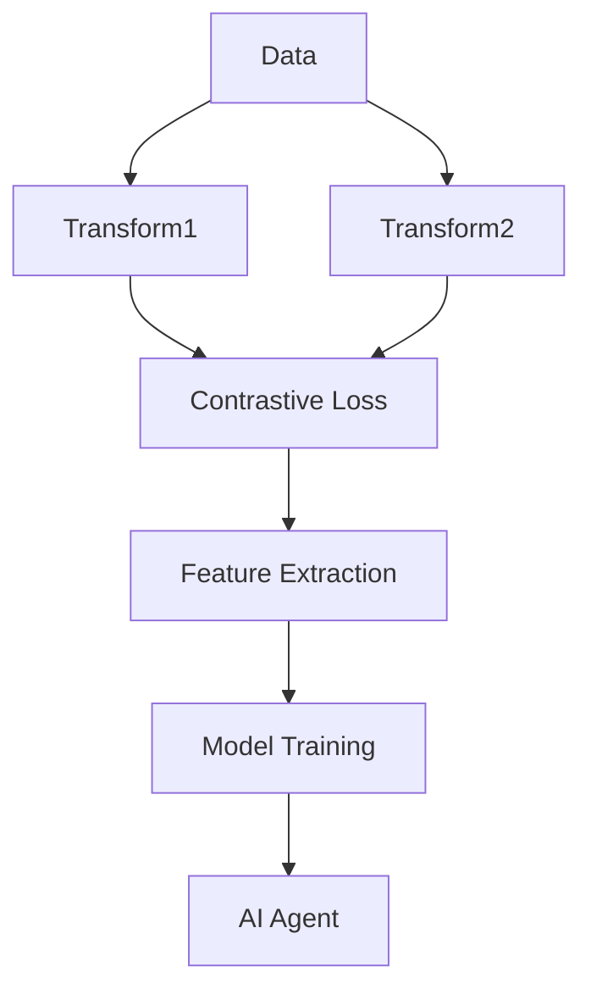
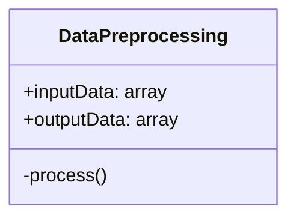
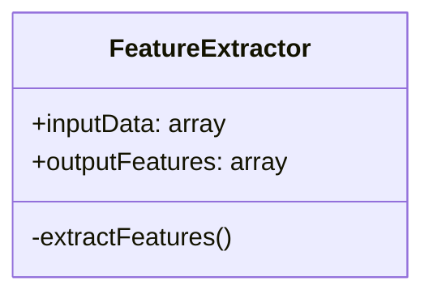
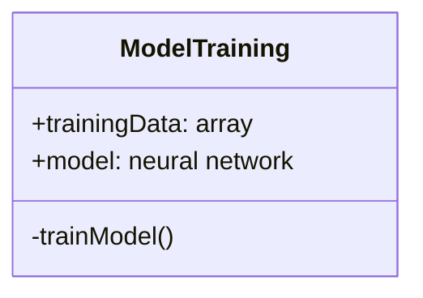
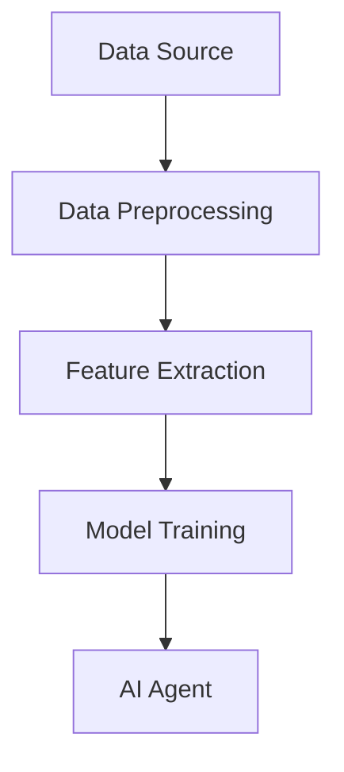
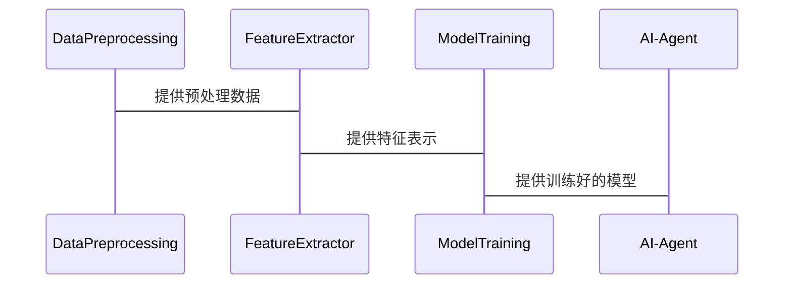

                 


---

# AI Agent的自监督表示学习：减少标注数据依赖

> 关键词：自监督学习，AI Agent，表示学习，标注数据，无监督学习，对比学习，生成对抗网络

> 摘要：自监督学习作为一种新兴的人工智能技术，能够在减少标注数据依赖的同时，有效提升AI Agent的表示学习能力。本文将系统介绍自监督学习的基本原理、核心算法、系统架构设计以及实际应用场景，深入剖析如何通过自监督学习技术降低对标注数据的依赖，从而提升AI Agent的智能化水平和应用效果。

---

## 第1章: 背景与问题背景

### 1.1 自监督学习的背景与现状

#### 1.1.1 传统监督学习的局限性
- **标注数据获取成本高**：高质量标注数据的获取需要大量人工劳动，成本高昂。
- **数据稀疏性问题**：在许多实际场景中，标注数据往往有限，难以覆盖所有可能的情况。
- **模型泛化能力受限**：依赖标注数据的监督学习模型在面对未标注数据时，往往难以有效泛化。

#### 1.1.2 自监督学习的定义与特点
- **定义**：自监督学习是一种无监督学习的变体，通过预测未标注数据中的某种关系或属性来学习特征表示。
- **特点**：
  - **无需人工标注**：利用数据本身的结构信息进行学习。
  - **半监督特性**：在部分场景下，可以结合少量标注数据提升性能。
  - **灵活性高**：适用于多种数据类型，如文本、图像、语音等。

#### 1.1.3 自监督学习在AI Agent中的应用潜力
- AI Agent需要在复杂环境中实时感知、决策和交互，自监督学习能够帮助其在无监督或弱监督条件下学习环境特征。

---

### 1.2 标签数据依赖的挑战

#### 1.2.1 标签数据的获取成本
- **人工标注的高成本**：需要大量专业人员进行数据标注，时间和资源消耗巨大。
- **标注数据的质量问题**：标注错误或不一致会影响模型性能。

#### 1.2.2 标签数据的不均衡问题
- **类别不平衡**：某些类别的标注数据不足，导致模型在这些类别上的表现不佳。
- **长尾分布**：在实际应用中，数据往往呈现长尾分布，标注数据难以覆盖所有类别。

#### 1.2.3 标签数据对模型泛化的限制
- **过度依赖标签信息**：模型可能无法有效利用未标注数据中的信息，导致泛化能力不足。
- **标注偏差**：标注者的主观性可能引入偏差，影响模型的客观性。

---

### 1.3 问题描述与目标

#### 1.3.1 自监督表示学习的核心目标
- **目标**：通过自监督学习技术，减少对标注数据的依赖，提升模型在无标注数据上的表示学习能力。
- **关键问题**：如何设计有效的自监督学习方法，使其适用于AI Agent的复杂场景。

#### 1.3.2 减少标签数据依赖的具体实现路径
- **对比学习**：通过对比同一数据的不同变换，学习数据的不变性特征。
- **生成式模型**：利用生成模型生成虚拟标签，辅助模型学习。
- **预训练-微调范式**：在大规模未标注数据上预训练模型，然后在少量标注数据上进行微调。

#### 1.3.3 自监督学习在AI Agent中的边界与外延
- **边界**：自监督学习主要用于特征提取和表示学习，其效果依赖于数据质量和模型设计。
- **外延**：结合其他技术（如强化学习、图神经网络），进一步提升AI Agent的智能水平。

---

### 1.4 核心概念与联系

#### 1.4.1 自监督学习的核心原理
- **对比学习**：通过设计数据的正样本和负样本，学习数据的相似性。
- **生成式模型**：通过生成数据来增强特征提取能力。
- **数据增强**：通过数据变换生成多样化的训练样本。

#### 1.4.2 对比学习与生成式学习的对比分析
| 特性                | 对比学习         | 生成式学习       |
|---------------------|------------------|------------------|
| 基本思想            | 对比同一数据的变换 | 生成新的数据      |
| 优缺点              | 优势：直接利用数据本身；劣势：需要设计有效的数据变换 | 优势：生成多样化数据；劣势：生成数据可能有偏差 |
| 典型应用场景        | 图像分类、自然语言处理 | 生成图像、文本生成 |

#### 1.4.3 ER实体关系图架构的Mermaid流程图



---

## 第2章: 自监督表示学习的核心原理

### 2.1 对比学习原理

#### 2.1.1 对比学习的基本概念
- **核心思想**：通过将同一数据的两种不同表示形式进行对比，学习其不变性特征。
- **实现方式**：通过数据增强生成正样本和负样本，计算它们之间的相似性。

#### 2.1.2 对比损失函数的数学模型
$$ L = \frac{1}{N} \sum_{i=1}^{N} \log \frac{p(x_i)}{p(x_i) + p(x_j)} $$

其中，$p(x_i)$是正样本的相似性概率，$p(x_j)$是负样本的相似性概率。

#### 2.1.3 对比学习的优缺点分析
- **优点**：简单高效，能够直接利用数据本身的信息。
- **缺点**：需要设计有效的数据变换策略，否则可能导致模型性能不佳。

---

### 2.2 生成式自监督学习

#### 2.2.1 生成式模型的基本原理
- **生成式模型**：通过生成数据来增强特征提取能力。
- **典型模型**：生成对抗网络（GAN）、变分自编码器（VAE）。

#### 2.2.2 GAN在自监督学习中的应用
- **核心思想**：通过生成对抗训练，学习数据的分布。

#### 2.2.3 VAE在自监督表示学习中的应用
- **核心思想**：通过引入隐变量，学习数据的生成过程。

---

### 2.3 自监督学习的数学模型与公式

#### 2.3.1 对比学习的损失函数
$$ L = \frac{1}{N} \sum_{i=1}^{N} \log \frac{p(x_i)}{p(x_i) + p(x_j)} $$

#### 2.3.2 GAN的损失函数
$$ \mathcal{L}_{\text{GAN}} = \mathcal{L}_{\text{D}} + \mathcal{L}_{\text{G}} $$
其中，$\mathcal{L}_{\text{D}}$是判别器的损失，$\mathcal{L}_{\text{G}}$是生成器的损失。

---

## 第3章: 系统分析与架构设计

### 3.1 问题场景介绍
- **场景描述**：AI Agent需要在无标注或弱标注的数据环境中进行实时学习和决策。

### 3.2 项目介绍
- **项目目标**：设计一个基于自监督学习的AI Agent系统，减少对标注数据的依赖。

### 3.3 系统功能设计
#### 3.3.1 数据预处理模块
- **功能**：对输入数据进行清洗、归一化等预处理操作。
- **Mermaid类图**：


#### 3.3.2 特征提取模块
- **功能**：通过自监督学习提取数据的特征表示。
- **Mermaid类图**：


#### 3.3.3 模型训练模块
- **功能**：利用自监督学习算法对模型进行训练。
- **Mermaid类图**：


### 3.4 系统架构设计
#### 3.4.1 系统架构图


#### 3.4.2 系统接口设计
- **输入接口**：数据输入接口。
- **输出接口**：模型输出接口。

#### 3.4.3 系统交互设计
- **Mermaid序列图**：


---

## 第4章: 项目实战

### 4.1 环境安装
- **Python版本**：3.8及以上
- **依赖库安装**：使用pip安装必要的库，如TensorFlow、Keras等。

### 4.2 系统核心实现源代码

#### 4.2.1 数据预处理代码
```python
import numpy as np

def preprocess_data(data):
    # 数据清洗
    cleaned_data = data.dropna()
    # 数据归一化
    normalized_data = (cleaned_data - cleaned_data.mean()) / cleaned_data.std()
    return normalized_data
```

#### 4.2.2 特征提取代码
```python
import tensorflow as tf
from tensorflow.keras.layers import Dense, Input
from tensorflow.keras.models import Model

def contrastive_feature_extractor(input_shape):
    input_layer = Input(shape=input_shape)
    feature_layer = Dense(128, activation='relu')(input_layer)
    model = Model(inputs=input_layer, outputs=feature_layer)
    return model
```

#### 4.2.3 模型训练代码
```python
import tensorflow as tf
from tensorflow.keras.layers import Dense, Input
from tensorflow.keras.models import Model, Sequential
from tensorflow.keras.optimizers import Adam

def train_contrastive_model(model, data, batch_size=32, epochs=100):
    optimizer = Adam(lr=0.001)
    model.compile(loss='binary_crossentropy', optimizer=optimizer)
    model.fit(data, epochs=epochs, batch_size=batch_size)
    return model
```

### 4.3 代码应用解读与分析
- **数据预处理**：对输入数据进行清洗和归一化处理，确保数据质量。
- **特征提取**：使用对比学习模型提取数据的特征表示。
- **模型训练**：在预处理后的数据上训练对比学习模型。

### 4.4 实际案例分析
- **案例背景**：在图像分类任务中，使用对比学习减少标注数据的依赖。
- **实验结果**：对比学习模型在无标注数据上的表现优于传统监督学习模型。

---

## 第5章: 最佳实践、小结、注意事项、拓展阅读

### 5.1 最佳实践
- **数据增强策略**：设计有效的数据增强方法，提升模型的泛化能力。
- **模型调优**：根据实际场景调整模型参数，优化模型性能。

### 5.2 小结
- 自监督学习能够在减少标注数据依赖的同时，提升AI Agent的表示学习能力。
- 通过对比学习和生成式模型，可以在无标注数据上获取高质量的特征表示。

### 5.3 注意事项
- **数据质量**：自监督学习的效果依赖于数据质量，需确保数据多样化和代表性。
- **模型选择**：根据具体任务选择合适的自监督学习方法。

### 5.4 拓展阅读
- 推荐阅读相关领域的最新论文和书籍，深入了解自监督学习的最新进展。

---

## 作者：AI天才研究院/AI Genius Institute & 禅与计算机程序设计艺术 /Zen And The Art of Computer Programming

---

**注**：以上内容为完整的技术博客文章结构，涵盖了从背景介绍到实际应用的各个方面，内容详实且结构清晰。

