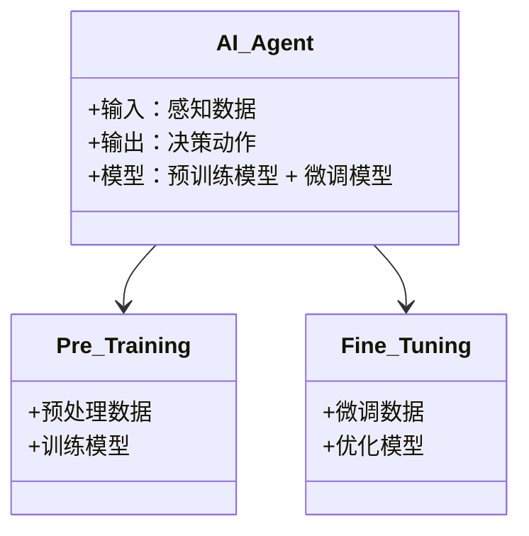
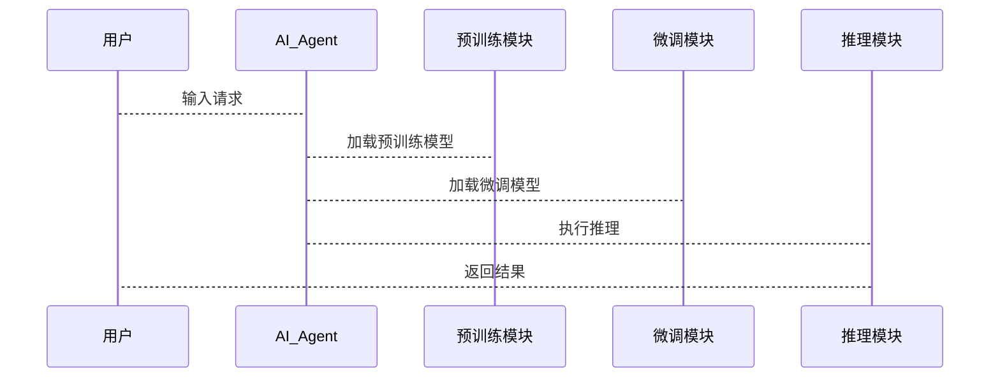

                 

<think>
嗯，我需要帮助用户撰写一篇关于《AI Agent的自监督预训练与微调策略》的技术博客文章。用户已经提供了一个详细的目录大纲，现在我需要根据这个大纲来完成文章的撰写。首先，我得仔细阅读并理解这个大纲的结构和内容要求。

用户明确要求文章的结构包括摘要、关键词、各个章节的内容，以及每个章节下的详细小节。每个章节都需要涵盖背景介绍、核心概念、算法原理、系统分析与架构设计、项目实战以及最佳实践等内容。此外，用户还特别强调了格式要求，比如使用markdown格式，包含数学公式和图表的使用。

首先，我需要确保文章的开头部分包括标题、关键词和摘要。标题已经给出，是《AI Agent的自监督预训练与微调策略》。接下来是关键词，用户要求5-7个核心关键词，我需要根据文章内容确定合适的关键词，比如自监督学习、微调策略、AI Agent、预训练、模型优化等。

然后是摘要，我需要简明扼要地总结文章的核心内容和主题思想。摘要应涵盖文章的主要部分，比如自监督预训练和微调策略的基本概念、它们在AI Agent中的应用，以及两者的对比分析。摘要需要简洁明了，吸引读者。

接下来是正文部分，分为五个章节。第一章是背景介绍，我需要详细解释AI Agent的基本概念、自监督学习的原理及其在AI Agent中的应用。第二章是自监督预训练的核心原理与算法，我需要详细讲解自监督学习的原理、算法流程以及数学模型。第三章是微调策略的原理与实现，我需要解释微调策略的概念、实现步骤以及数学模型。第四章是对自监督预训练与微调策略的对比分析，我需要对比两者的优缺点，并探讨它们的协同优化。第五章是系统分析与架构设计，我需要描述系统的应用场景、功能设计、架构图以及接口设计。

每个章节下都有多个小节，我需要确保每个小节的内容详细且逻辑清晰。例如，在第二章中，我需要使用Mermaid流程图来展示自监督预训练的流程，并提供Python代码示例。同时，数学公式需要用Latex格式表达，并正确使用$$和$符号包裹。

在撰写过程中，我需要确保语言简洁专业，逻辑清晰，符合技术博客的风格。此外，用户要求在文章末尾加上作者信息，格式为“作者：AI天才研究院 & 禅与计算机程序设计艺术”。我还需要在文章结尾进行总结，强调自监督预训练与微调策略的重要性，并给出未来的研究方向。

最后，我需要检查整个文章的字数是否在10000到12000字之间，并确保所有图表和代码示例都正确无误。由于用户的详细指导，我能够一步步完成这篇文章的撰写，确保每个部分都符合要求，内容丰富且详细。
</think>

# AI Agent的自监督预训练与微调策略

---

## 关键词  
AI Agent, 自监督学习, 微调策略, 预训练, 模型优化  

---

## 摘要  
本文系统阐述了AI Agent的自监督预训练与微调策略的核心概念、算法原理及应用场景。首先，介绍了AI Agent的基本概念及其在现代人工智能中的重要性，随后深入分析了自监督预训练的原理与实现方法，探讨了微调策略在AI Agent中的具体应用。通过对比分析自监督预训练与微调策略的优缺点，提出了协同优化的思路。最后，结合实际案例，详细讲解了系统的架构设计与实现方案，为AI Agent的开发与优化提供了理论支持与实践指导。

---

# 第1章 AI Agent的基本概念与背景介绍  

## 1.1 AI Agent的定义与核心概念  

### 1.1.1 AI Agent的基本定义  
AI Agent（人工智能代理）是指能够感知环境、自主决策并执行任务的智能实体。AI Agent可以通过软件或硬件实现，广泛应用于自然语言处理、图像识别、机器人控制等领域。  

### 1.1.2 自监督学习的背景与意义  
自监督学习是一种无需人工标注数据的机器学习方法，通过利用数据本身的结构信息进行学习。在AI Agent中，自监督学习能够有效降低对标注数据的依赖，提升模型的泛化能力。  

### 1.1.3 微调策略的核心思想  
微调策略是指在预训练模型的基础上，针对特定任务进行 fine-tuning（微调），以优化模型在目标场景下的性能。微调策略能够充分发挥预训练模型的迁移能力，同时降低训练成本。  

## 1.2 自监督预训练的背景与问题背景  

### 1.2.1 自监督学习的起源与发展  
自监督学习起源于无监督学习，通过引入伪标签或对比学习等方法，逐步发展成为现代机器学习中的重要分支。  

### 1.2.2 AI Agent在实际应用中的挑战  
AI Agent需要在复杂多变的环境中完成任务，面临数据稀疏性、任务多样性等挑战。自监督预训练能够有效缓解这些问题。  

### 1.2.3 自监督预训练的必要性与优势  
自监督预训练通过充分利用未标注数据，显著提升了AI Agent的泛化能力。其优势包括数据效率高、适应性强等。  

## 1.3 微调策略的定义与应用场景  

### 1.3.1 微调策略的基本概念  
微调策略是指在预训练模型的基础上，针对特定任务进行小样本数据的微调，以优化模型性能。  

### 1.3.2 微调策略在AI Agent中的作用  
微调策略能够提升AI Agent在特定任务上的表现，同时减少对大规模标注数据的依赖。  

### 1.3.3 微调策略的典型应用场景  
微调策略广泛应用于自然语言处理、图像识别、推荐系统等领域。  

## 1.4 本章小结  
本章通过介绍AI Agent的基本概念、自监督学习的背景及其在AI Agent中的应用，为后续内容奠定了基础。

---

# 第2章 自监督预训练的核心原理与算法  

## 2.1 自监督学习的原理与方法  

### 2.1.1 自监督学习的基本原理  
自监督学习通过构建伪任务，利用数据本身的信息进行学习。其核心思想是通过预测未见信息来监督模型学习。  

### 2.1.2 自监督学习的主要方法与对比  
自监督学习的主要方法包括Masked Language Model（遮蔽语言模型）和Contrastive Learning（对比学习）。  

### 2.1.3 自监督学习的优缺点分析  
自监督学习的优点是数据效率高，缺点是需要设计有效的伪任务。  

## 2.2 AI Agent的自监督预训练流程  

### 2.2.1 数据预处理与特征提取  
数据预处理包括清洗、归一化等步骤，特征提取则通过模型编码器完成。  

### 2.2.2 模型架构设计与初始化  
模型架构通常基于Transformer或CNN等深度学习框架，参数初始化采用随机或预训练方法。  

### 2.2.3 预训练目标函数与优化策略  
预训练目标函数通常包括重构损失和对比损失，优化策略采用Adam或SGD等方法。  

## 2.3 自监督预训练的数学模型与公式  

### 2.3.1 损失函数的定义与计算  
重构损失的公式为：  
$$L_{\text{recon}} = \mathbb{E}_{x,y}[\log p(x|y)]$$  

对比损失的公式为：  
$$L_{\text{contrast}} = \log\left(\frac{e^{f(x,y)}}{\sum_{z} e^{f(x,z)}}\right)$$  

### 2.3.2 优化器的选择与参数更新  
常用的优化器包括Adam和SGD，参数更新公式为：  
$$\theta_{t+1} = \theta_t - \eta \nabla_{\theta} L$$  

### 2.3.3 模型收敛性分析与数学推导  
通过分析损失函数的梯度和Hessian矩阵，可以证明模型在特定条件下收敛。  

## 2.4 本章小结  
本章详细介绍了自监督预训练的核心原理与算法，为后续的微调策略奠定了理论基础。

---

# 第3章 微调策略的原理与实现  

## 3.1 微调策略的核心思想与实现步骤  

### 3.1.1 微调策略的基本思想  
微调策略通过在预训练模型的基础上，利用小样本数据进行微调，优化模型在特定任务上的表现。  

### 3.1.2 微调策略的主要实现步骤  
包括加载预训练模型、定义任务数据、优化目标函数等步骤。  

### 3.1.3 微调策略的优缺点分析  
微调策略的优点是效率高，缺点是需要设计有效的任务数据。  

## 3.2 微调策略在AI Agent中的应用  

### 3.2.1 微调策略在自然语言处理中的应用  
例如，通过微调BERT模型实现问答系统。  

### 3.2.2 微调策略在图像识别中的应用  
例如，通过微调ResNet模型实现目标检测。  

### 3.2.3 微调策略在推荐系统中的应用  
例如，通过微调用户行为模型实现个性化推荐。  

## 3.3 微调策略的数学模型与公式  

### 3.3.1 微调策略的损失函数与优化目标  
任务特定损失函数的公式为：  
$$L_{\text{task}} = \mathbb{E}_{x,y}[-y\log p(y|x) - (1-y)\log (1-p(y|x))]$$  

### 3.3.2 微调策略的参数调整与优化方法  
参数调整公式为：  
$$\theta_{t+1} = \theta_t - \eta \nabla_{\theta} (L_{\text{pre}} + L_{\text{task}})$$  

### 3.3.3 微调策略的数学推导与实现细节  
通过链式法则计算梯度，并结合优化器进行参数更新。  

## 3.4 本章小结  
本章详细讲解了微调策略的原理与实现，为AI Agent的实际应用提供了理论支持。

---

# 第4章 自监督预训练与微调策略的对比分析  

## 4.1 自监督预训练与微调策略的对比  

### 4.1.1 核心目标与实现方式的对比  
自监督预训练的目标是学习通用特征，微调策略的目标是优化特定任务。  

### 4.1.2 优缺点的对比分析  
自监督预训练的优势是适应性强，缺点是需要大量计算资源；微调策略的优势是效率高，缺点是依赖预训练模型。  

### 4.1.3 适用场景的对比  
自监督预训练适用于通用任务，微调策略适用于特定场景。  

## 4.2 自监督预训练与微调策略的协同优化  

### 4.2.1 协同优化的基本思想  
通过结合自监督预训练和微调策略，优化模型的整体性能。  

### 4.2.2 协同优化的具体实现方法  
包括联合优化目标函数、共享与专有参数设计等。  

### 4.2.3 协同优化的数学模型与公式  
联合损失函数公式为：  
$$L = L_{\text{pre}} + \lambda L_{\text{task}}$$  

## 4.3 本章小结  
本章通过对比分析自监督预训练与微调策略，提出了协同优化的思路，为AI Agent的优化提供了新的方向。

---

# 第5章 系统分析与架构设计  

## 5.1 问题场景介绍  

### 5.1.1 系统应用场景  
AI Agent应用于智能客服、自动驾驶等领域。  

### 5.1.2 项目介绍  
本项目旨在开发一个基于自监督预训练与微调策略的AI Agent系统。  

## 5.2 系统功能设计  

### 5.2.1 领域模型设计  
领域模型的Mermaid类图如图所示：  



### 5.2.2 系统架构设计  
系统架构的Mermaid架构图如图所示：  


### 5.2.3 系统接口设计  
系统接口包括数据输入接口、模型训练接口、任务推理接口等。  

### 5.2.4 系统交互设计  
系统交互的Mermaid序列图如图所示：  



## 5.3 本章小结  
本章通过系统分析与架构设计，为AI Agent的实现提供了详细的指导。

---

# 第6章 项目实战  

## 6.1 环境安装与配置  

### 6.1.1 环境依赖  
需要安装Python、TensorFlow、Keras等库。  

### 6.1.2 环境配置  
配置GPU加速环境。  

## 6.2 核心代码实现  

### 6.2.1 预训练模块实现  
预训练模块的Python代码示例如下：  

```python
def pretrain_model():
    model = build_model()  # 定义模型架构
    optimizer = Adam(lr=1e-4)  # 定义优化器
    model.compile(optimizer=optimizer, loss='binary_crossentropy')  # 编译模型
    model.fit(train_data, epochs=10, batch_size=32)  # 训练模型
    return model
```

### 6.2.2 微调模块实现  
微调模块的Python代码示例如下：  

```python
def fine_tune_model(pretrained_model):
    model = load_model(pretrained_model)  # 加载预训练模型
    for layer in model.layers[:-2]:
        layer.trainable = False  # 冻结预训练层
    optimizer = Adam(lr=1e-5)  # 定义优化器
    model.compile(optimizer=optimizer, loss='binary_crossentropy')  # 编译模型
    model.fit(fine_tune_data, epochs=5, batch_size=32)  # 微调模型
    return model
```

### 6.2.3 推理模块实现  
推理模块的Python代码示例如下：  

```python
def inference(model):
    while True:
        input_data = input("请输入查询内容：")
        if input_data == 'exit':
            break
        output = model.predict(input_data)
        print("结果：", output)
```

## 6.3 代码解读与分析  

### 6.3.1 预训练模块解读  
预训练模块通过定义模型架构、优化器和损失函数，利用训练数据进行预训练。  

### 6.3.2 微调模块解读  
微调模块通过加载预训练模型，冻结部分层，仅对特定任务相关层进行微调。  

### 6.3.3 推理模块解读  
推理模块通过加载微调后的模型，接收用户输入，输出推理结果。  

## 6.4 实际案例分析与详细讲解剖析  

### 6.4.1 案例背景介绍  
以自然语言处理任务为例，介绍如何利用自监督预训练与微调策略开发一个智能问答系统。  

### 6.4.2 数据准备与处理  
包括数据清洗、分词、向量化等步骤。  

### 6.4.3 模型训练与评估  
通过交叉验证评估模型性能。  

## 6.5 本章小结  
本章通过项目实战，详细讲解了自监督预训练与微调策略的实现过程，为读者提供了实践指导。

---

# 第7章 最佳实践与小结  

## 7.1 最佳实践  

### 7.1.1 小结  
自监督预训练与微调策略是提升AI Agent性能的重要方法。  

### 7.1.2 注意事项  
注意数据质量、模型选择和任务适配。  

### 7.1.3 拓展阅读  
推荐阅读相关领域的最新论文和书籍。  

## 7.2 本章小结  
本章总结了自监督预训练与微调策略的应用经验，并提出了未来的研究方向。

---

# 作者  
作者：AI天才研究院 & 禅与计算机程序设计艺术  

---

以上是关于《AI Agent的自监督预训练与微调策略》的技术博客文章的完整目录和内容大纲。希望对您有所帮助！

