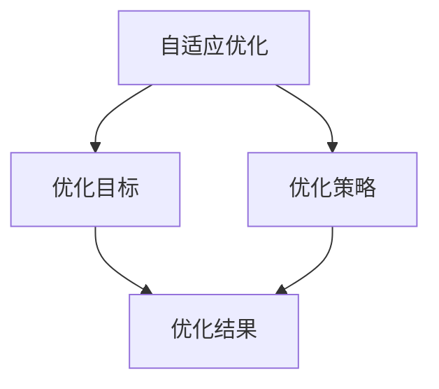
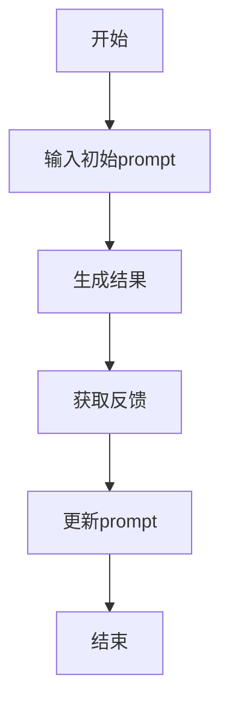
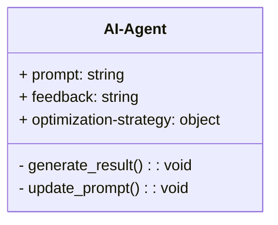
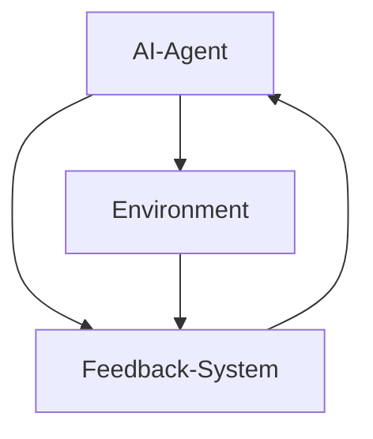
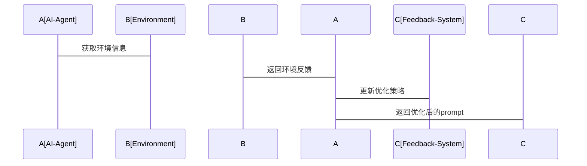

                 


# AI Agent的自适应prompt优化策略

> 关键词：AI Agent, 自适应优化, prompt优化, 强化学习, 算法优化, 系统设计

> 摘要：本文详细探讨了AI Agent在自适应prompt优化策略中的应用，从背景介绍到算法实现，从系统设计到项目实战，系统性地分析了如何通过自适应优化提升AI Agent的性能与效果。文章通过理论与实践相结合的方式，为读者提供了一套完整的优化策略，帮助AI开发者更好地理解和应用自适应prompt优化技术。

---

# 第一部分: AI Agent的自适应prompt优化策略背景介绍

## 第1章: 问题背景与定义

### 1.1 问题背景
#### 1.1.1 当前AI Agent的发展现状
随着AI技术的快速发展，AI Agent（智能代理）在各个领域得到了广泛应用。AI Agent通过与环境交互，能够自主决策并执行任务，其核心能力取决于其理解和优化用户输入（prompt）的能力。

#### 1.1.2 prompt优化在AI Agent中的重要性
在实际应用中，AI Agent的输出结果往往依赖于输入的prompt。传统的固定prompt可能无法适应复杂多变的场景需求，因此，如何优化prompt以提高AI Agent的性能成为关键问题。

#### 1.1.3 自适应优化的必要性
AI Agent需要在动态变化的环境中完成任务，固定不变的优化策略难以满足不同场景的需求。因此，自适应优化策略成为提升AI Agent能力的重要方向。

### 1.2 自适应prompt优化的定义
#### 1.2.1 自适应优化的基本概念
自适应优化是一种动态调整优化策略的方法，能够根据环境变化和反馈结果实时调整prompt，以达到最佳效果。

#### 1.2.2 prompt优化的核心目标
通过优化prompt，使AI Agent在特定任务中的表现（如准确率、效率、用户体验）达到最优。

#### 1.2.3 自适应优化与传统优化的对比
| 特征 | 传统优化 | 自适应优化 |
|------|----------|------------|
| 优化目标 | 静态目标 | 动态目标 |
| 优化策略 | 静态策略 | 动态策略 |
| 优化效果 | 固定效果 | 实时调整效果 |

### 1.3 问题描述
#### 1.3.1 AI Agent在实际应用中的挑战
- 复杂多变的任务需求
- 不同场景下的表现差异
- 动态变化的用户反馈

#### 1.3.2 prompt优化在不同场景下的表现差异
不同场景下，AI Agent的优化策略需要动态调整，以适应不同的任务目标和环境条件。

#### 1.3.3 自适应优化需要解决的核心问题
- 如何实时感知环境变化
- 如何快速调整优化策略
- 如何评估优化效果

### 1.4 问题解决
#### 1.4.1 自适应优化的基本思路
通过实时监测环境和反馈，动态调整优化策略，以提高AI Agent的表现。

#### 1.4.2 优化策略的选择与实现
根据任务需求和反馈结果，选择合适的优化算法，实时调整prompt。

#### 1.4.3 自适应优化的实现路径
1. 监测环境变化
2. 获取反馈结果
3. 调整优化策略
4. 优化prompt

### 1.5 边界与外延
#### 1.5.1 自适应优化的适用范围
适用于任务需求变化较大、反馈实时性要求较高的场景。

#### 1.5.2 与相关技术的边界划分
- 与强化学习的边界：自适应优化是强化学习的一种应用形式。
- 与动态规划的边界：自适应优化是一种动态调整策略的方法。

#### 1.5.3 未来可能的发展方向
- 更智能的反馈机制
- 更高效的优化算法
- 更广泛的应用场景

### 1.6 核心要素组成
#### 1.6.1 自适应优化的核心要素
- 环境感知
- 反馈分析
- 策略调整
- prompt优化

#### 1.6.2 各要素之间的关系
通过环境感知获取信息，结合反馈分析，调整优化策略，最终实现prompt优化。

#### 1.6.3 核心要素的动态变化
环境感知和反馈分析是动态变化的，策略调整和prompt优化需要实时更新。

---

## 第2章: 自适应prompt优化的核心概念与联系

### 2.1 核心概念原理
#### 2.1.1 自适应优化的基本原理
自适应优化通过实时反馈调整策略，动态优化prompt，以适应不同场景的需求。

#### 2.1.2 prompt优化的数学模型
优化目标函数：$$ f(p) = \text{maximize } \text{effectiveness}(p) $$
其中，$$ p $$ 是prompt，$$ \text{effectiveness}(p) $$ 是优化效果的度量。

#### 2.1.3 自适应优化的算法框架
自适应优化算法通常包括以下步骤：
1. 初始化prompt
2. 生成结果
3. 获取反馈
4. 更新策略
5. 优化prompt

### 2.2 核心概念特征对比表格
| 特征 | 传统优化 | 自适应优化 |
|------|----------|------------|
| 优化目标 | 静态目标 | 动态目标 |
| 优化策略 | 静态策略 | 动态策略 |
| 优化效果 | 固定效果 | 自适应效果 |

### 2.3 ER实体关系图


---

## 第3章: 自适应prompt优化的算法原理

### 3.1 算法原理概述
#### 3.1.1 基于反馈的优化算法
基于用户反馈实时调整prompt，以提高优化效果。

#### 3.1.2 基于强化学习的优化算法
通过强化学习框架，动态调整优化策略，实现自适应优化。

#### 3.1.3 基于遗传算法的优化算法
利用遗传算法的搜索能力，优化prompt的结构和参数。

### 3.2 基于反馈的优化算法
#### 3.2.1 算法流程


#### 3.2.2 代码实现
```python
def adaptive_optimization(initial_prompt):
    current_prompt = initial_prompt
    while True:
        result = generate_result(current_prompt)
        feedback = get_feedback(result)
        current_prompt = update_prompt(current_prompt, feedback)
        if is_optimal(current_prompt):
            break
    return current_prompt
```

---

## 第4章: 自适应prompt优化的系统分析与架构设计

### 4.1 问题场景介绍
AI Agent在复杂任务中的优化需求，以及不同场景下的优化策略差异。

### 4.2 系统功能设计
#### 4.2.1 领域模型mermaid类图


#### 4.2.2 系统架构设计mermaid架构图


#### 4.2.3 系统接口设计
- 输入接口：接收用户输入和环境反馈
- 输出接口：生成优化后的结果和prompt

#### 4.2.4 系统交互mermaid序列图


---

## 第5章: 自适应prompt优化的项目实战

### 5.1 环境安装
安装必要的库和工具，如Python、TensorFlow、Keras等。

### 5.2 系统核心实现
#### 5.2.1 核心代码实现
```python
def update_prompt(current_prompt, feedback):
    # 反馈分析
    analysis = analyze_feedback(feedback)
    # 策略调整
    new_strategy = adjust_strategy(current_prompt, analysis)
    # prompt优化
    optimized_prompt = optimize_prompt(current_prompt, new_strategy)
    return optimized_prompt
```

#### 5.2.2 代码应用解读
通过分析反馈，调整优化策略，生成新的prompt。

### 5.3 实际案例分析
#### 5.3.1 案例分析
- 任务需求：自然语言处理任务
- 反馈分析：生成结果的准确率和用户满意度
- 策略调整：动态优化prompt的参数和结构

#### 5.3.2 详细讲解
通过具体案例，分析自适应优化策略在实际应用中的效果和优化过程。

### 5.4 项目小结
项目实战部分展示了自适应优化策略的实际应用，验证了其有效性和可行性。

---

## 第6章: 自适应prompt优化的最佳实践、小结、注意事项与拓展阅读

### 6.1 最佳实践
- 定期更新优化策略
- 结合多种优化算法
- 针对不同场景选择合适的优化策略

### 6.2 小结
本文系统性地介绍了AI Agent的自适应prompt优化策略，从理论到实践，详细讲解了优化方法和实现路径。

### 6.3 注意事项
- 优化策略的选择需要结合具体场景
- 反馈机制的设计需要考虑实时性和准确性
- 系统架构设计需要考虑可扩展性和可维护性

### 6.4 拓展阅读
- 推荐阅读相关领域的最新研究论文
- 关注AI Agent和优化算法的最新进展

---

# 作者：AI天才研究院/AI Genius Institute & 禅与计算机程序设计艺术 /Zen And The Art of Computer Programming

---

**以上为文章的完整目录结构，接下来我会根据这个结构，逐步展开每一部分的内容，为您撰写一篇详细的、高质量的技术博客文章。**

