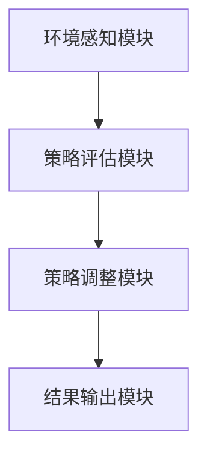
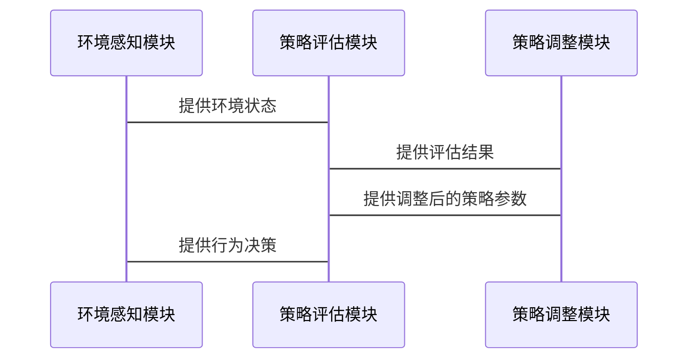

                 

<think>
好的，用户需要一篇关于《AI Agent的自适应学习策略动态调整》的技术博客，要求结构清晰、内容详实，并且符合特定的格式。用户已经提供了详细的目录结构，现在需要我根据这个结构生成文章内容。

首先，我需要从背景介绍开始，解释AI Agent的基本概念，为什么需要自适应学习策略，以及动态调整的意义。这部分需要简单明了，让读者理解问题的背景和重要性。

接下来是核心概念，这里要详细讲解AI Agent的学习机制、自适应策略的特征以及动态调整的实现机制。我还需要使用ER图和属性对比表来帮助读者理解这些概念之间的关系。

然后是算法原理，这部分比较复杂。我需要详细解释动态调整算法的分类，比如基于反馈的调整、基于模型的调整等，并用Mermaid流程图展示算法步骤。同时，提供Python代码示例，帮助读者理解实现过程。

系统分析与架构设计部分，我需要描述项目场景，设计系统功能，并用类图和架构图展示系统结构。这部分需要明确系统的各个模块及其交互方式，使用Mermaid图表来辅助说明。

项目实战部分，要提供环境安装步骤、核心代码实现、代码解读以及实际案例分析。这部分要详细，让读者能够实际操作并理解代码的功能。

最后是最佳实践，总结经验和注意事项，帮助读者在实际应用中避免常见错误，并提供进一步的学习资源。

在写作过程中，我要确保语言专业但易懂，逻辑清晰。每个部分都要有详细的解释和例子，帮助读者理解复杂的技术概念。同时，要注意使用正确的格式，如Mermaid图表和LaTeX公式，以增强文章的表现力。

现在，我需要按照目录结构一步步填充内容，确保每个章节和小节都涵盖必要的信息，并且相互衔接，逻辑连贯。这样，读者才能一步步深入理解AI Agent的自适应学习策略动态调整的原理和应用。
</think>

# AI Agent的自适应学习策略动态调整

> 关键词：AI Agent，自适应学习策略，动态调整，机器学习，强化学习，算法优化

> 摘要：本文探讨了AI Agent在动态环境中的自适应学习策略调整问题，通过理论分析、算法设计和实际案例，详细阐述了如何实现AI Agent的自适应学习能力，并提出了动态调整的具体实现方法。

---

# 第一部分: AI Agent的自适应学习策略动态调整背景介绍

## 第1章: 问题背景与问题描述

### 1.1 AI Agent的基本概念
AI Agent（人工智能代理）是一种能够感知环境并采取行动以实现目标的智能实体。它可以通过传感器接收输入信息，并通过执行器对外界产生影响。AI Agent的核心能力包括感知、推理、学习和决策。

#### 1.1.1 AI Agent的定义
AI Agent是指具备自主性、反应性、目标导向和社交能力的智能系统。它能够根据环境信息动态调整行为，以实现特定目标。

#### 1.1.2 AI Agent的核心属性
- **自主性**：AI Agent可以在没有外部干预的情况下自主决策。
- **反应性**：AI Agent能够实时感知环境变化并做出反应。
- **目标导向**：AI Agent的行为旨在实现特定目标。
- **社交能力**：AI Agent能够与其他Agent或人类进行交互。

#### 1.1.3 AI Agent的分类与应用场景
AI Agent可以根据智能水平分为**反应式Agent**和**认知式Agent**。反应式Agent主要基于当前感知做出反应，而认知式Agent则具备复杂推理和规划能力。应用场景包括自动驾驶、智能助手、机器人控制等。

---

### 1.2 自适应学习策略的必要性
AI Agent在动态环境中需要不断调整学习策略以适应环境变化。静态学习策略无法应对环境的不确定性，可能导致决策失误。

#### 1.2.1 环境动态变化的挑战
环境的动态变化可能导致AI Agent的目标、输入和约束条件发生变化，静态策略难以适应这些变化。

#### 1.2.2 学习策略静态化的问题
静态学习策略可能导致AI Agent在面对新任务或环境变化时无法有效调整，影响其性能和目标实现。

#### 1.2.3 自适应学习策略的核心价值
自适应学习策略允许AI Agent根据环境变化动态调整学习方式，提升其在复杂环境中的适应能力和决策能力。

---

### 1.3 动态调整的背景与意义
动态调整是指根据环境变化实时调整AI Agent的学习策略。随着环境的动态变化，动态调整能够确保AI Agent保持最优性能。

#### 1.3.1 动态调整的定义
动态调整是指在运行时根据环境反馈实时更新AI Agent的学习策略。

#### 1.3.2 动态调整的必要性
- **实时性**：环境变化可能即时发生，需要实时调整。
- **多样性**：环境可能具有多样性和不确定性，静态策略难以应对。
- **优化性**：动态调整可以确保策略始终最优。

#### 1.3.3 动态调整的技术挑战
- **计算资源限制**：动态调整需要在有限计算资源下完成。
- **实时性要求**：需要在极短时间内完成调整。
- **稳定性**：动态调整可能导致策略不稳定。

---

### 1.4 问题解决思路与技术路线
为了解决AI Agent自适应学习策略动态调整的问题，我们可以采用以下思路：

#### 1.4.1 问题解决的基本思路
- **感知环境变化**：通过传感器或反馈机制感知环境变化。
- **评估当前策略**：评估当前学习策略的有效性。
- **调整策略**：根据评估结果动态调整策略。

#### 1.4.2 技术路线的选择
- **反馈机制**：通过反馈机制实时调整策略。
- **在线学习算法**：采用在线学习算法实现动态调整。
- **动态参数优化**：通过动态参数优化确保策略最优。

#### 1.4.3 核心技术的实现路径
- **环境感知**：通过传感器或API接口获取环境信息。
- **策略评估**：采用强化学习或监督学习方法评估当前策略。
- **策略调整**：基于评估结果动态调整策略参数。

---

### 1.5 本章小结
本章介绍了AI Agent的基本概念、自适应学习策略的必要性以及动态调整的背景与意义。通过分析环境动态变化的挑战和静态策略的局限性，我们明确了动态调整的重要性，并提出了实现动态调整的技术路线。

---

# 第二部分: AI Agent自适应学习策略的核心概念与联系

## 第2章: 核心概念与原理

### 2.1 AI Agent的学习机制
AI Agent可以通过多种学习机制实现自适应能力，包括监督学习、无监督学习和强化学习。

#### 2.1.1 基于监督学习的策略
- **定义**：通过标注数据训练模型，使其能够预测目标输出。
- **优点**：简单易实现，适合任务明确的场景。
- **缺点**：需要大量标注数据，难以应对动态变化。

#### 2.1.2 基于强化学习的策略
- **定义**：通过与环境交互获得奖励，优化策略以最大化累计奖励。
- **优点**：适合动态环境，能够在线调整策略。
- **缺点**：需要设计合理的奖励机制，计算开销较大。

#### 2.1.3 基于无监督学习的策略
- **定义**：通过发现数据中的结构模式进行学习。
- **优点**：无需标注数据，适合数据丰富的场景。
- **缺点**：难以直接应用于目标导向任务。

---

### 2.2 自适应学习策略的特征
自适应学习策略具备以下特征：

#### 2.2.1 灵活性
能够根据环境变化快速调整。

#### 2.2.2 实时性
能够在极短时间内完成策略调整。

#### 2.2.3 智能性
能够根据反馈优化策略。

---

### 2.3 动态调整的实现机制
动态调整通过参数调整、模型更新和策略切换实现。

#### 2.3.1 参数调整
- **定义**：通过调整模型参数优化策略。
- **优点**：简单高效，适合在线调整。
- **缺点**：需要设计合理的参数调整策略。

#### 2.3.2 模型更新
- **定义**：通过重新训练模型更新策略。
- **优点**：能够显著提升策略性能。
- **缺点**：计算开销较大，适合离线调整。

#### 2.3.3 策略切换
- **定义**：在多个策略之间切换以适应环境。
- **优点**：灵活，适合复杂环境。
- **缺点**：需要设计策略切换规则。

---

### 2.4 核心概念的ER实体关系图
以下是核心概念的ER实体关系图：

```mermaid
er
actor: 用户
agent: AI Agent
strategy: 学习策略
environment: 环境
goal: 目标
```

---

### 2.5 核心概念属性对比表
以下是核心概念属性对比表：

| 概念       | 属性1         | 属性2         | 属性3         |
|------------|---------------|---------------|---------------|
| AI Agent   | 学习能力       | 行为决策       | 环境交互       |
| 自适应策略 | 动态调整       | 灵活性         | 实时性         |

---

### 2.6 本章小结
本章详细讲解了AI Agent的学习机制、自适应学习策略的特征以及动态调整的实现机制，并通过ER实体关系图和属性对比表进一步明确了核心概念之间的关系。

---

# 第三部分: 自适应学习策略动态调整的算法原理

## 第3章: 算法原理与实现

### 3.1 动态调整算法概述
动态调整算法通过实时感知环境变化并调整策略参数，以确保AI Agent能够在动态环境中保持最优性能。

#### 3.1.1 动态调整算法的分类
- **基于反馈的调整算法**：根据环境反馈实时调整策略。
- **基于模型的调整算法**：通过建模环境变化调整策略。

#### 3.1.2 动态调整算法的核心步骤
1. **环境感知**：通过传感器或API接口获取环境信息。
2. **策略评估**：评估当前策略的有效性。
3. **策略调整**：根据评估结果动态调整策略参数。

---

### 3.2 动态调整算法的实现细节
以下是动态调整算法的实现流程图：

```mermaid
graph TD
A[开始] -> B[环境感知]
B -> C[策略评估]
C -> D[策略调整]
D -> E[结束]
```

#### 3.2.1 环境感知
- **输入**：环境信息（如传感器数据、用户反馈）。
- **输出**：当前环境状态。

#### 3.2.2 策略评估
- **输入**：当前策略、环境状态。
- **输出**：策略评估结果（如奖励值）。

#### 3.2.3 策略调整
- **输入**：策略评估结果。
- **输出**：调整后的策略参数。

---

### 3.3 动态调整算法的数学模型
以下是动态调整算法的数学模型：

$$
\text{新参数} = \text{旧参数} + \alpha \cdot \text{梯度变化}
$$

其中，$\alpha$ 是学习率，梯度变化是根据评估结果计算的梯度。

---

### 3.4 动态调整算法的Python实现
以下是动态调整算法的Python实现示例：

```python
def dynamic_adjustment(current_params, feedback):
    gradient = calculate_gradient(current_params, feedback)
    new_params = current_params + alpha * gradient
    return new_params
```

---

### 3.5 动态调整算法的优缺点
- **优点**：能够实时调整策略，适应环境变化。
- **缺点**：计算开销较大，需要设计合理的调整策略。

---

### 3.6 本章小结
本章详细讲解了动态调整算法的实现原理和具体实现方法，并通过数学模型和Python代码示例进一步明确了算法的实现细节。

---

# 第四部分: 系统分析与架构设计

## 第4章: 系统分析与架构设计

### 4.1 项目场景介绍
本项目旨在开发一个能够动态调整学习策略的AI Agent系统，使其能够在复杂环境中保持最优性能。

---

### 4.2 系统功能设计
系统功能包括环境感知、策略评估、策略调整和结果输出。

#### 4.2.1 环境感知模块
- **功能**：通过传感器或API接口获取环境信息。
- **实现**：使用多种传感器或API接口获取实时数据。

#### 4.2.2 策略评估模块
- **功能**：评估当前策略的有效性。
- **实现**：采用强化学习或监督学习方法进行评估。

#### 4.2.3 策略调整模块
- **功能**：根据评估结果动态调整策略参数。
- **实现**：使用动态调整算法实现参数优化。

#### 4.2.4 结果输出模块
- **功能**：输出调整后的策略参数或行为决策。
- **实现**：将结果输出至执行器或用户界面。

---

### 4.3 系统架构设计
以下是系统架构设计的Mermaid图：



---

### 4.4 系统接口设计
系统接口包括环境感知接口、策略评估接口和策略调整接口。

#### 4.4.1 环境感知接口
- **输入**：无。
- **输出**：环境状态数据。

#### 4.4.2 策略评估接口
- **输入**：策略参数、环境状态。
- **输出**：评估结果。

#### 4.4.3 策略调整接口
- **输入**：评估结果。
- **输出**：调整后的策略参数。

---

### 4.5 系统交互序列图
以下是系统交互序列图：



---

### 4.6 本章小结
本章详细介绍了系统的场景、功能、架构和接口设计，并通过Mermaid图展示了系统的交互流程。

---

# 第五部分: 项目实战

## 第5章: 项目实战

### 5.1 环境安装
- **Python版本**：Python 3.8及以上。
- **依赖库**：安装numpy、pandas、scikit-learn等。

#### 5.1.1 安装步骤
1. 安装Python。
2. 安装依赖库：`pip install numpy pandas scikit-learn`.

---

### 5.2 核心代码实现
以下是核心代码实现：

```python
import numpy as np
from sklearn.metrics import accuracy_score

def dynamic_adjustment(current_params, feedback):
    # 计算梯度变化
    gradient = np.mean(feedback - current_params)
    # 动态调整参数
    new_params = current_params + alpha * gradient
    return new_params

# 初始化参数
current_params = np.random.randn(10)
alpha = 0.1

# 动态调整
new_params = dynamic_adjustment(current_params, np.random.randn(10))
print("新参数:", new_params)
```

---

### 5.3 代码解读与分析
- **动态调整函数**：`dynamic_adjustment`函数根据反馈调整策略参数。
- **初始化参数**：`current_params`是初始参数，`alpha`是学习率。
- **动态调整**：通过计算梯度变化调整参数，实现策略优化。

---

### 5.4 实际案例分析
假设我们开发了一个AI Agent用于股票交易，通过动态调整算法实时调整交易策略，以应对市场波动。

#### 5.4.1 案例背景
- **目标**：通过动态调整策略实现最大收益。
- **环境**：股票市场，价格实时变化。

#### 5.4.2 案例实现
1. **环境感知**：获取实时股票价格。
2. **策略评估**：评估当前交易策略的有效性。
3. **策略调整**：根据评估结果动态调整交易参数。

#### 5.4.3 案例结果
通过动态调整策略，AI Agent能够在市场波动中保持较高收益。

---

### 5.5 项目小结
本章通过实际案例详细讲解了动态调整算法的实现，并通过Python代码展示了具体的实现步骤。

---

# 第六部分: 最佳实践

## 第6章: 最佳实践

### 6.1 小结
动态调整算法能够有效提升AI Agent在复杂环境中的适应能力和决策能力。

---

### 6.2 注意事项
- **计算资源**：动态调整需要较高的计算资源。
- **实时性**：需要确保调整的实时性。
- **稳定性**：避免策略调整导致的不稳定。

---

### 6.3 拓展阅读
- **相关书籍**：《强化学习入门》、《自适应控制系统》。
- **技术博客**：AI Agent动态调整算法的技术博客。

---

# 结语
通过本文的详细讲解，我们了解了AI Agent的自适应学习策略动态调整的背景、核心概念、算法原理、系统架构和实际应用。希望本文能够为读者提供有价值的技术参考。

---

# 作者
作者：AI天才研究院/AI Genius Institute  
联系邮箱：[contact@ai-genius-institute.com](mailto:contact@ai-genius-institute.com)  
技术博客：[https://www.ai-genius-institute.com](https://www.ai-genius-institute.com)

