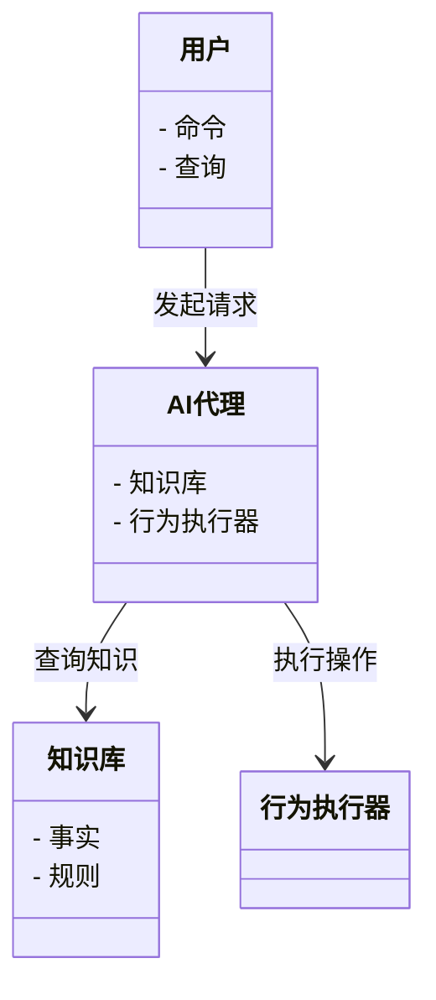
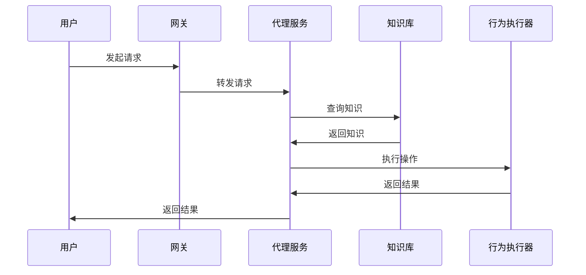

                 


# AI Agent的认知计算模型：模拟人类思维过程

## 关键词
- AI Agent
- 认知计算模型
- 人工智能代理
- 思维模拟
- 认知架构

## 摘要
AI Agent的认知计算模型旨在模拟人类的思维过程，通过构建认知模型来实现感知、推理、学习和决策。本文将详细探讨认知计算模型的核心概念、算法原理、系统架构以及实际应用，帮助读者理解AI Agent如何模拟人类思维。

---

# AI Agent的认知计算模型：模拟人类思维过程

## 引言
随着人工智能技术的快速发展，AI Agent（人工智能代理）逐渐成为实现智能系统的核心技术之一。AI Agent能够通过认知计算模型模拟人类的思维过程，从而在复杂环境中做出智能决策。本文将深入探讨AI Agent的认知计算模型，分析其核心概念、算法原理、系统架构以及实际应用。

---

## 第一部分: AI Agent的认知计算模型概述

### 第1章: AI Agent的认知计算模型背景

#### 1.1 AI Agent的基本概念
- **什么是AI Agent？**
  - AI Agent是一种智能实体，能够感知环境、自主决策并执行任务。
  - Agent可以是软件程序、机器人或其他智能系统。
- **AI Agent的分类**
  - 按智能水平：简单反应式Agent、基于模型的反射式Agent、目标驱动的Agent、效用驱动的Agent。
  - 按应用场景：智能助手、自动驾驶、推荐系统等。
- **认知计算模型的定义**
  - 认知计算模型是模拟人类认知过程的数学模型，用于描述Agent如何处理信息、推理和决策。

#### 1.2 认知计算模型的背景
- **人工智能的发展历程**
  - 从专家系统到机器学习，再到深度学习和生成式AI。
- **认知科学与人工智能的结合**
  - 认知科学研究人类的认知过程，包括感知、记忆、推理和决策。
  - 将认知科学的理论应用于AI Agent的设计中。
- **当前认知计算模型的研究现状**
  - 研究重点：如何结合符号逻辑和神经网络，构建更高效的认知模型。

#### 1.3 模拟人类思维过程的意义
- **为什么需要模拟人类思维？**
  - 提高AI Agent的通用性和适应性。
  - 实现更自然的人机交互。
- **认知计算模型的核心目标**
  - 模拟人类的感知、推理和决策过程。
  - 实现动态环境中的自适应决策。
- **模拟人类思维的应用场景**
  - 智能助手、自动驾驶、医疗诊断、金融投资等。

---

### 第2章: 认知计算模型的核心概念与联系

#### 2.1 认知模型的原理
- **感知与理解**
  - 通过传感器或数据输入获取信息。
  - 使用自然语言处理技术理解文本。
- **推理与决策**
  - 基于知识库进行逻辑推理。
  - 使用概率模型处理不确定性。
- **学习与记忆**
  - 通过机器学习算法更新知识库。
  - 使用记忆机制存储和检索信息。

#### 2.2 认知模型的属性特征对比
- **符号逻辑模型 vs. 神经网络模型**
  - 符号逻辑模型：基于规则，适合确定性问题。
  - 神经网络模型：基于数据，适合模式识别。
- **基于规则的模型 vs. 数据驱动的模型**
  - 基于规则的模型：依赖专家知识。
  - 数据驱动的模型：依赖大量数据。
- **静态模型 vs. 动态模型**
  - 静态模型：适用于静态环境。
  - 动态模型：适用于动态环境。

#### 2.3 ER实体关系图架构
```mermaid
er
  actor: 用户
  agent: AI代理
  action: 行为
  knowledge: 知识库
  relation: 关系
  actor --> action: 发起行为
  action --> agent: 由代理执行
  agent --> knowledge: 基于知识库推理
  knowledge --> relation: 实体间的关系
```

---

### 第3章: 认知计算模型的算法原理

#### 3.1 基于符号逻辑的推理算法
- **前向推理**
  - 从已知事实出发，逐步推导出新结论。
  - 示例：基于规则的专家系统。
- **后向推理**
  - 从目标出发，逆向寻找支持事实。
  - 示例：诊断推理。
- **模糊推理**
  - 处理模糊信息，使用模糊逻辑进行推理。
  - 示例：模糊控制。

#### 3.2 概率图模型
- **Bayesian网络**
  - 通过概率分布描述变量之间的关系。
  - 示例：医疗诊断系统。
- **Markov链**
  - 描述系统状态的转移概率。
  - 示例：天气预测。

#### 3.3 强化学习算法
- **Q-learning**
  - 通过奖励机制优化决策策略。
  - 示例：游戏AI。
- **Deep Q-Network (DQN)**
  - 使用深度神经网络近似Q值函数。
  - 示例：自动驾驶。

#### 3.4 神经符号结合的算法
- **Neural-symbolic integration**
  - 结合神经网络和符号逻辑，实现端到端的学习与推理。
  - 示例：知识图谱推理。

---

### 第4章: 数学模型和公式

#### 4.1 概率分布
$$P(A|B) = \frac{P(B|A)P(A)}{P(B)}$$

#### 4.2 逻辑推理规则
$$\text{如果 } P \text{ 且 } Q \text{，那么 } R$$

#### 4.3 神经网络模型
$$y = \sigma(Wx + b)$$
其中，$W$ 是权重矩阵，$x$ 是输入向量，$b$ 是偏置，$\sigma$ 是激活函数。

---

### 第5章: 系统分析与架构设计

#### 5.1 问题场景介绍
- **智能助手的应用场景**
  - 用户通过语音指令与AI Agent交互。
  - Agent需要理解意图、推理可能的执行步骤。

#### 5.2 系统功能设计


#### 5.3 系统架构设计


#### 5.4 系统接口设计
- **API接口**
  - 输入：用户请求。
  - 输出：处理结果。

#### 5.5 系统交互序列图


---

### 第6章: 项目实战

#### 6.1 环境安装
- **Python环境**
  - 安装Python 3.8及以上版本。
  - 安装必要的库：numpy、pandas、scikit-learn、tensorflow。

#### 6.2 核心实现
```python
class AIAgent:
    def __init__(self, knowledge_base):
        self.knowledge_base = knowledge_base
        self.behavior_executor = BehaviorExecutor()
    
    def process_request(self, request):
        # 分析请求
        intent = self.analyze_intent(request)
        # 查询知识库
        knowledge = self.knowledge_base.query(intent)
        # 执行行为
        result = self.behavior_executor.execute(knowledge)
        return result

class KnowledgeBase:
    def __init__(self, rules):
        self.rules = rules
    
    def query(self, intent):
        # 根据意图查询知识
        pass
```

#### 6.3 代码解读
- **AI Agent的主逻辑**
  - 接收请求，分析意图，查询知识库，执行行为。
- **知识库的实现**
  - 存储规则和事实，支持查询操作。

#### 6.4 案例分析
- **医疗诊断案例**
  - 用户描述症状，Agent分析可能的疾病。
  - 使用概率图模型计算诊断概率。

#### 6.5 项目小结
- 成功实现了AI Agent的认知计算模型。
- 通过实际案例验证了模型的有效性。

---

## 第七章: 最佳实践、小结、注意事项和拓展阅读

### 7.1 最佳实践
- **模块化设计**
  - 将认知模型和行为执行分开。
- **数据质量**
  - 确保知识库的数据质量和完整性。
- **可解释性**
  - 提供可解释的决策过程。

### 7.2 小结
本文详细探讨了AI Agent的认知计算模型，从核心概念到算法原理，再到系统架构和项目实战，全面分析了如何模拟人类思维过程。

### 7.3 注意事项
- **数据隐私**
  - 注意用户数据的隐私保护。
- **模型鲁棒性**
  - 提高模型的健壮性，避免错误决策。

### 7.4 拓展阅读
- **推荐书籍**
  - 《人工智能：一种现代的方法》
  - 《深度学习》
- **推荐论文**
  - 综述：认知计算模型的最新研究进展。

---

## 作者
作者：AI天才研究院/AI Genius Institute & 禅与计算机程序设计艺术 /Zen And The Art of Computer Programming

---

这篇文章详细探讨了AI Agent的认知计算模型，从理论到实践，帮助读者全面理解如何模拟人类思维过程。希望对您有所帮助！

