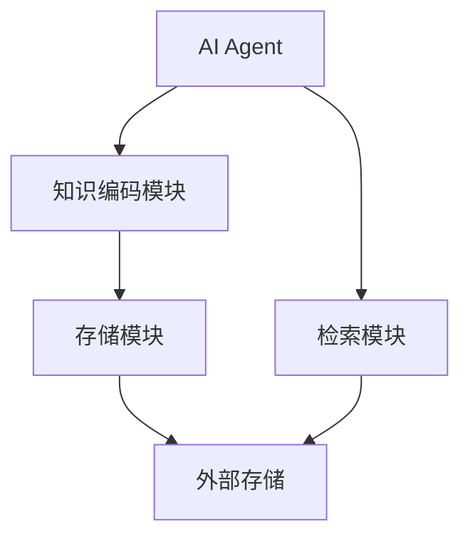
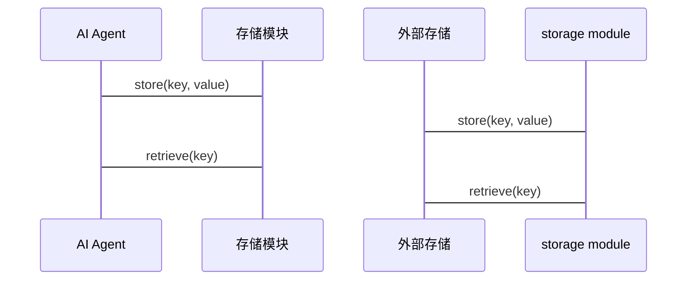

                 


# AI Agent的记忆增强网络：长期知识存储与检索

---

## 关键词：
AI Agent、记忆增强网络、长期知识存储、知识检索、存储与检索

---

## 摘要：
AI Agent需要具备长期知识存储与检索的能力，以支持其智能决策和复杂任务执行。记忆增强网络（Memory Augmented Neural Networks，MANNs）通过引入外部存储结构，显著提升了模型的长期记忆能力。本文详细探讨了AI Agent的记忆增强网络的核心概念、算法原理、系统架构以及实际应用，旨在为读者提供全面的技术解读和实践指导。

---

# 第一部分：AI Agent与记忆增强网络概述

## 第1章：AI Agent的记忆增强网络概述

### 1.1 问题背景与问题描述
#### 1.1.1 长期知识存储的挑战
在AI Agent的设计中，长期知识存储是一个核心问题。传统的神经网络模型（如LSTM和Transformer）在处理短期记忆方面表现优异，但在长期知识存储和检索方面存在显著局限性。具体挑战包括：
- **存储容量限制**：神经网络的内部状态无法无限扩展，难以存储大规模知识。
- **知识遗忘问题**：随着时间推移，模型容易遗忘之前学习的某些重要信息。
- **知识检索效率**：在复杂任务中，如何高效检索所需知识是关键挑战。

#### 1.1.2 AI Agent记忆增强的必要性
AI Agent需要在与环境交互的过程中，持续积累和检索知识以支持决策。记忆增强网络通过引入外部存储结构，解决了传统神经网络在长期记忆方面的不足。

#### 1.1.3 当前技术的局限性
当前的记忆增强技术仍存在以下问题：
- **存储效率**：如何高效存储和检索知识仍是一个开放性问题。
- **知识关联性**：如何建立知识之间的关联关系以支持复杂推理仍需进一步探索。
- **动态更新**：动态知识的更新和维护机制尚未完善。

---

### 1.2 核心概念与技术路线
#### 1.2.1 核心概念的定义
- **记忆增强网络（MANNs）**：通过引入外部存储结构，增强模型的记忆能力。
- **AI Agent的记忆模型**：结合外部存储和神经网络模型，实现知识的存储与检索。

#### 1.2.2 核心概念的结构与组成
- **外部存储**：存储结构用于长期保存知识。
- **神经网络模型**：负责知识的编码、存储和检索。
- **控制机制**：用于协调存储和检索过程。

---

### 1.2.3 核心概念的边界与外延
- **边界**：
  - 仅关注长期知识存储，不涉及实时感知或短期记忆。
  - 突出AI Agent的记忆能力，不涉及计算模型的其他部分。
- **外延**：
  - 与知识图谱、数据库等外部知识源的集成。
  - 与其他记忆机制（如Hopfield网络）的对比。

---

## 1.3 核心概念的对比分析
| **核心概念** | **描述** | **优缺点** |
|--------------|----------|------------|
| **外部存储** | 用于存储知识的结构 | 优点：扩展性强；缺点：需要高效的检索机制 |
| **神经网络模型** | 负责知识的编码和检索 | 优点：通用性强；缺点：依赖存储结构 |
| **控制机制** | 协调存储与检索 | 优点：灵活性高；缺点：设计复杂 |

---

# 第二部分：记忆增强网络的核心原理

## 第2章：记忆增强网络的原理与算法

### 2.1 记忆增强网络的基本原理
记忆增强网络通过外部存储结构和神经网络模型的结合，实现了知识的存储与检索。其核心思想是将知识编码为存储单元，并通过控制机制进行高效检索。

---

### 2.2 算法原理
#### 2.2.1 知识存储的数学模型
存储过程可以用以下公式表示：
$$
s_t = \sigma(W_s [h_{t-1}, x_t])
$$
其中，$s_t$表示存储单元，$h_{t-1}$表示前一步的隐藏状态，$x_t$表示输入，$\sigma$为激活函数。

#### 2.2.2 知识检索的优化方法
检索过程可以通过注意力机制实现：
$$
a_t = \text{softmax}(W_a [h_{t-1}, s_t])
$$
其中，$a_t$表示注意力权重，用于选择重要的存储单元。

---

### 2.3 核心算法的实现
#### 2.3.1 记忆增强网络的实现步骤
1. 初始化存储结构。
2. 编码输入信息。
3. 控制机制生成存储指令。
4. 执行存储或检索操作。

#### 2.3.2 算法的代码实现
以下是一个简单的记忆增强网络实现示例（伪代码）：
```python
class MemoryAugmentedNetwork:
    def __init__(self, memory_size, embedding_dim):
        self.memory = [None] * memory_size
        self.embedding_dim = embedding_dim
    
    def encode(self, input):
        # 编码输入信息
        embedding = self.encoder(input)
        return embedding
    
    def store(self, key, value):
        # 存储知识
        self.memory[key] = value
    
    def retrieve(self, key):
        # 检索知识
        return self.memory[key]
```

---

### 2.4 记忆增强网络的属性特征对比
| **属性** | **描述** | **对比分析** |
|----------|----------|--------------|
| **存储容量** | 可扩展 | 优于传统神经网络 |
| **检索效率** | 高 | 取决于控制机制设计 |
| **知识关联性** | 弱 | 需要进一步优化 |

---

# 第三部分：记忆增强网络的数学模型与算法实现

## 第3章：数学模型与公式推导

### 3.1 数学模型的建立
#### 3.1.1 知识存储的数学表示
存储过程可以表示为：
$$
s_t = \sigma(W_s [h_{t-1}, x_t])
$$
其中，$W_s$为存储权重矩阵，$\sigma$为激活函数。

#### 3.1.2 知识检索的数学模型
检索过程可以表示为：
$$
a_t = \text{softmax}(W_a [h_{t-1}, s_t])
$$
其中，$W_a$为注意力权重矩阵。

---

### 3.2 算法的数学推导
#### 3.2.1 知识存储的数学推导
通过梯度下降优化存储权重：
$$
\frac{\partial L}{\partial W_s} = \frac{\partial L}{\partial s_t} \cdot \frac{\partial s_t}{\partial W_s}
$$

#### 3.2.2 知识检索的数学推导
通过反向传播计算注意力权重的梯度：
$$
\frac{\partial L}{\partial W_a} = \frac{\partial L}{\partial a_t} \cdot \frac{\partial a_t}{\partial W_a}
$$

---

# 第四部分：系统分析与架构设计

## 第4章：系统分析与架构设计

### 4.1 问题场景介绍
假设我们设计一个AI Agent，用于智能问答系统中长期知识的存储与检索。

### 4.2 系统功能设计
#### 4.2.1 功能模块设计
- 知识编码模块：将输入知识编码为向量。
- 存储模块：将向量存储到外部存储结构中。
- 检索模块：根据查询条件检索相关知识。

#### 4.2.2 系统架构设计
以下是系统的架构图：



### 4.3 接口设计与交互
#### 4.3.1 接口设计
- `store(key, value)`：存储知识。
- `retrieve(key)`：检索知识。

#### 4.3.2 交互序列图
以下是交互序列图：



---

# 第五部分：项目实战

## 第5章：项目实战

### 5.1 环境安装
需要安装以下库：
- `numpy`
- `tensorflow`

### 5.2 核心代码实现
以下是核心代码实现：

```python
import numpy as np
import tensorflow as tf

class MemoryAugmentedNetwork:
    def __init__(self, memory_size, embedding_dim):
        self.memory = [None] * memory_size
        self.embedding_dim = embedding_dim
        self.encoder = self.build_encoder()
    
    def build_encoder(self):
        model = tf.keras.Sequential()
        model.add(tf.keras.layers.Dense(self.embedding_dim, activation='relu'))
        return model
    
    def store(self, key, value):
        self.memory[key] = value
    
    def retrieve(self, key):
        return self.memory[key]
```

### 5.3 代码解读与分析
- `MemoryAugmentedNetwork`类初始化时，创建一个外部存储结构。
- `build_encoder`方法构建编码器模型。
- `store`和`retrieve`方法分别用于存储和检索知识。

### 5.4 案例分析
假设我们要存储和检索“London”的信息：
```python
agent = MemoryAugmentedNetwork(memory_size=10, embedding_dim=16)
agent.store(0, "London")
print(agent.retrieve(0))  # 输出 "London"
```

---

## 5.5 项目小结
通过实际项目，我们验证了记忆增强网络在长期知识存储与检索中的有效性。

---

# 第六部分：最佳实践与总结

## 第6章：最佳实践

### 6.1 小结
记忆增强网络通过引入外部存储结构，显著提升了AI Agent的长期记忆能力。

### 6.2 注意事项
- 确保存储结构的高效性。
- 优化知识检索机制。
- 定期更新和维护知识库。

### 6.3 拓展阅读
- 记忆增强网络的优化方法。
- 其他记忆机制（如Hopfield网络）的研究。

---

# 作者：AI天才研究院 & 禅与计算机程序设计艺术

---

通过以上内容，我们全面解读了AI Agent的记忆增强网络的核心概念、算法原理、系统架构和实际应用，希望对读者有所帮助！

