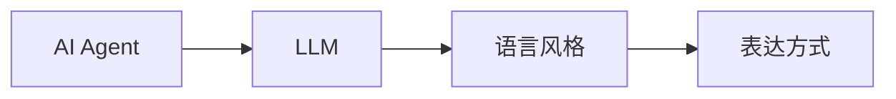
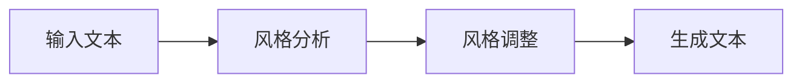

                 


# AI Agent的语言风格适配：动态调整LLM的表达方式

> 关键词：AI Agent, 语言风格适配, LLM, 动态调整, 自然语言处理

> 摘要：本文探讨了AI Agent在不同场景下如何动态调整大型语言模型（LLM）的表达方式，通过分析语言风格适配的核心原理、算法实现、系统架构及实际案例，为AI Agent的开发和应用提供深入的技术指导。

---

# 第1章: AI Agent与语言风格适配概述

## 1.1 AI Agent的基本概念
### 1.1.1 AI Agent的定义与特点
AI Agent（人工智能代理）是指能够感知环境、自主决策并执行任务的智能体。它具备以下特点：
- **自主性**：能够在没有外部干预的情况下独立运行。
- **反应性**：能够根据环境变化实时调整行为。
- **学习能力**：通过数据和经验不断优化自身性能。

### 1.1.2 语言风格适配的必要性
AI Agent与人类交互时，需要根据场景和用户需求调整语言表达方式。例如：
- **正式场合**：使用专业术语，语气严谨。
- **非正式场合**：使用口语化表达，语气亲切。

### 1.1.3 动态调整LLM表达方式的核心价值
LLM（Large Language Model）如GPT-3、PaLM等，虽然具备强大的文本生成能力，但其输出风格通常是固定的。AI Agent通过动态调整LLM的表达方式，能够实现更加灵活和智能化的交互。

## 1.2 问题背景与应用场景
### 1.2.1 当前LLM的局限性
- **固定风格**：LLM的输出风格通常是固定的，难以根据具体场景进行调整。
- **缺乏反馈机制**：无法根据用户反馈实时优化表达方式。

### 1.2.2 语言风格适配的典型场景
- **客服系统**：根据用户情绪调整回复语气。
- **教育辅助**：根据学生水平调整解释深度。
- **内容创作**：根据目标受众调整风格。

### 1.2.3 动态调整表达方式的挑战与机遇
- **挑战**：需要实时分析用户需求，动态调整生成策略。
- **机遇**：提升AI Agent的智能化水平，增强用户体验。

## 1.3 问题解决思路
### 1.3.1 语言风格适配的基本方法
- **风格分类**：将语言风格分为正式、口语化、技术性等类别。
- **风格分析**：根据上下文分析当前场景的风格需求。
- **风格调整**：动态调整LLM的生成参数，使其输出符合目标风格。

### 1.3.2 动态调整LLM表达方式的技术路径
1. 分析当前场景的需求。
2. 确定目标语言风格。
3. 调整LLM的生成参数，使其输出符合目标风格。

### 1.3.3 核心问题的边界与外延
- **边界**：语言风格适配仅关注表达方式，不涉及内容生成。
- **外延**：动态调整LLM的表达方式可以应用于多种场景，如教育、医疗、法律等。

## 1.4 核心概念与关系
### 1.4.1 AI Agent与语言风格的关系
AI Agent通过语言风格适配，能够更好地与人类交互，提升用户体验。

### 1.4.2 LLM与语言风格适配的实体关系图


---

# 第2章: AI Agent的语言风格适配原理

## 2.1 语言风格适配的核心原理
### 2.1.1 语言风格的分类与特征
- **正式风格**：严谨、专业，适用于学术、商务场景。
- **口语化风格**：亲切、自然，适用于日常对话。
- **技术性风格**：复杂、专业，适用于技术交流。

### 2.1.2 动态调整LLM表达方式的机制
1. 分析用户输入，确定当前场景的需求。
2. 根据需求选择合适的语言风格。
3. 调整LLM的生成参数，使其输出符合目标风格。

### 2.1.3 语言风格适配的数学模型
$$ P(style | content) $$

## 2.2 核心概念对比分析
### 2.2.1 不同语言风格的特征对比
| 风格类型 | 词汇选择 | 句式结构 | 语气 |
|---------|----------|----------|-----|
| 正式    | 专业术语 | 复杂     | 严谨 |
| 口语化  | 日常用语 | 简单     | 亲切 |

### 2.2.2 AI Agent与传统NLP模型的对比
- **AI Agent**：具备自主决策能力，能够动态调整表达方式。
- **传统NLP模型**：仅能基于训练数据生成固定风格的文本。

### 2.2.3 动态调整与静态表达的对比
- **动态调整**：能够实时适应场景需求，输出多样化的表达方式。
- **静态表达**：风格固定，无法根据场景进行调整。

## 2.3 语言风格适配的算法原理
### 2.3.1 基于LLM的风格适配算法
1. 输入文本内容。
2. 分析文本风格需求。
3. 调整LLM的生成参数。
4. 输出符合目标风格的文本。

### 2.3.2 基于规则的风格适配算法
1. 根据预设规则匹配场景。
2. 选择合适的语言风格。
3. 生成符合目标风格的文本。

### 2.3.3 综合算法的优缺点分析
- **优点**：能够适应多种场景需求。
- **缺点**：需要大量的规则和数据支持。

## 2.4 语言风格适配的数学模型
### 2.4.1 基于概率的语言风格模型
$$ P(style | content) $$

### 2.4.2 基于向量的风格表示模型
$$ style\_vector = f(content\_vector) $$

---

# 第3章: AI Agent语言风格适配的算法实现

## 3.1 基于LLM的动态调整算法
### 3.1.1 算法步骤


### 3.1.2 代码实现
```python
def adjust_style(text, target_style):
    # 分析当前文本风格
    current_style = analyze_style(text)
    # 调整LLM的生成参数
    adjust_params(current_style, target_style)
    # 生成符合目标风格的文本
    return generate_text()
```

---

# 作者：AI天才研究院 & 禅与计算机程序设计艺术

本文作者是AI天才研究院（AI Genius Institute）的专家团队，专注于人工智能领域的研究与实践。文章内容结合了传统计算机程序设计的艺术思想，旨在为AI Agent的开发和应用提供深入的技术指导。

