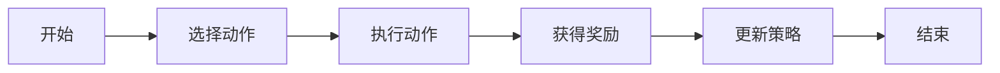
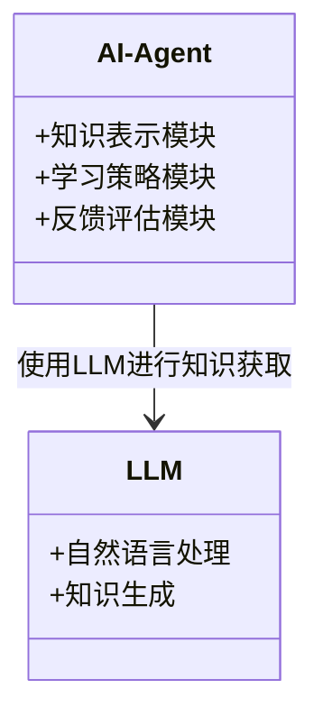
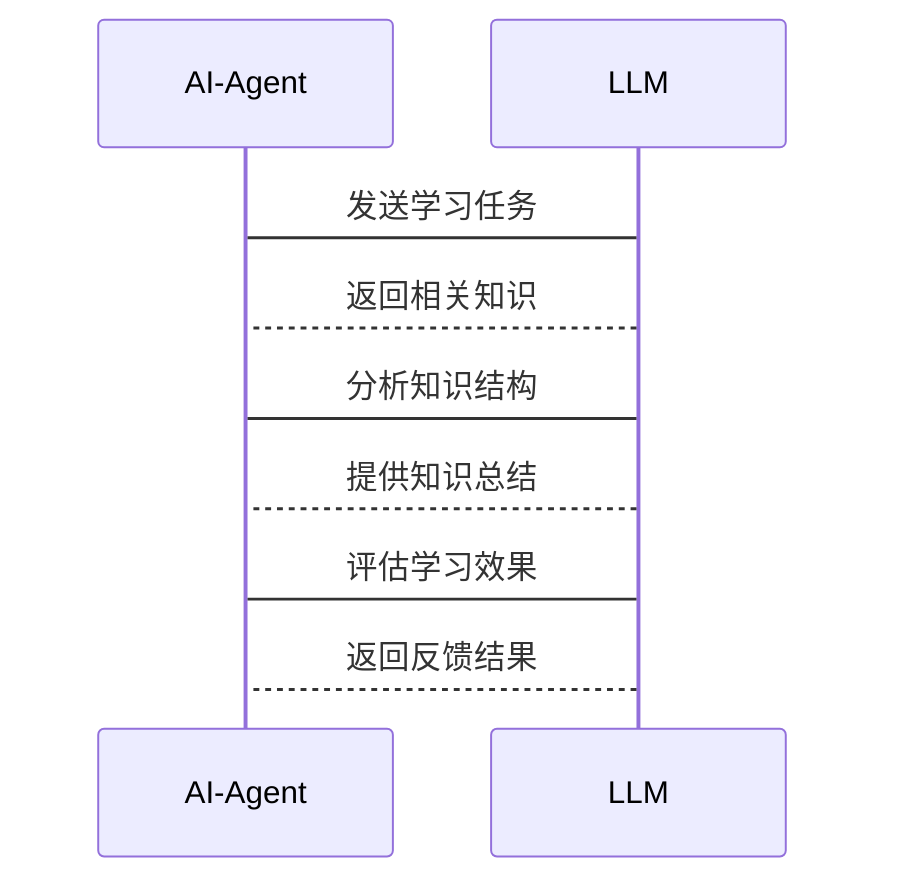

                 


# AI Agent的课程学习：模拟LLM的系统知识获取过程

## 关键词：AI Agent, LLM, 课程学习, 知识获取, 强化学习, 系统设计

## 摘要：AI Agent通过模拟大语言模型（LLM）的系统知识获取过程，实现类似人类的学习机制。本文详细分析了AI Agent的学习过程，包括课程学习的定义、核心算法、系统架构设计及项目实战，帮助读者全面理解AI Agent如何通过模拟LLM进行系统知识学习。

---

## 第一部分: AI Agent与LLM的课程学习基础

### 第1章: AI Agent与LLM的基本概念

#### 1.1 AI Agent的定义与特点
- **定义**: AI Agent是具有自主决策能力的智能体，能够感知环境并执行任务。
- **特点**: 
  - 自主性：无需外部干预，自主决策。
  - 反应性：实时感知并响应环境变化。
  - 学习能力：通过学习提升性能。

#### 1.2 LLM的定义与特点
- **定义**: 大语言模型（LLM）是基于深度学习的自然语言处理模型。
- **特点**: 
  - 大规模训练数据：提升理解和生成能力。
  - 强大的上下文理解：能够处理复杂语义。
  - 多任务通用性：适用于多种语言处理任务。

#### 1.3 AI Agent与LLM的结合
- **结合方式**: LLM作为知识库和学习工具，AI Agent通过LLM进行信息检索和知识获取。
- **优势**: 
  - 提高AI Agent的自然语言处理能力。
  - 通过LLM的上下文理解，增强AI Agent的学习效果。

---

## 第2章: AI Agent的课程学习过程

#### 2.1 课程学习的定义
- **背景**: 传统AI依赖规则，而课程学习依赖数据驱动。
- **核心要素**: 
  - 知识表示：将知识转化为可处理的形式。
  - 学习策略：选择最优学习路径。
  - 反馈机制：评估学习效果并调整策略。

#### 2.2 AI Agent的课程学习模型
- **输入输出关系**: 输入为任务目标和学习材料，输出为完成任务所需的知识和技能。
- **训练过程**: 
  - 监督学习：教师提供正确答案。
  - 强化学习：通过奖励机制优化决策。
  - 对比学习：通过对比不同知识结构，提升理解深度。

#### 2.3 学习目标与反馈机制
- **学习目标**: 明确的知识获取和技能提升。
- **反馈机制**: 
  - 正向反馈：强化正确行为。
  - 负向反馈：修正错误行为。

---

## 第3章: LLM在AI Agent学习中的作用

#### 3.1 LLM作为知识表示工具
- **知识表示**: 将知识以结构化形式表示，如概念图、知识图谱。
- **LLM的应用**: 
  - 自然语言理解：提取隐含知识。
  - 知识推理：通过上下文推导新知识。

#### 3.2 LLM作为学习目标的实现工具
- **学习目标实现**: 
  - 通过LLM生成学习材料。
  - 利用LLM进行知识检索和总结。

#### 3.3 LLM作为学习反馈的生成工具
- **反馈机制**: 
  - 自动生成评估报告。
  - 提供学习建议和改进方向。

---

## 第4章: AI Agent的课程学习算法

#### 4.1 基于强化学习的课程学习算法
- **强化学习定义**: 通过试错获得最优策略。
- **算法实现**: 
  - 状态表示：当前知识水平。
  - 动作选择：选择下一步学习内容。
  - 奖励机制：评估学习效果。

**Mermaid图：强化学习流程图**


#### 4.2 基于监督学习的课程学习算法
- **监督学习定义**: 通过标签数据进行学习。
- **算法实现**: 
  - 数据标注：明确知识正确性。
  - 模型训练：基于标注数据调整参数。

**数学公式：监督学习损失函数**
$$ L = \frac{1}{N}\sum_{i=1}^{N}(y_i - \hat{y_i})^2 $$

#### 4.3 基于对比学习的课程学习算法
- **对比学习定义**: 通过比较不同样本的相似性。
- **算法实现**: 
  - 对比损失计算：衡量样本之间的相似性。
  - 模型优化：基于对比损失调整参数。

**数学公式：对比学习损失函数**
$$ L = -\sum_{i=1}^{N} \log(\text{sim}(x_i, x_j) + \epsilon) $$

---

## 第5章: 系统架构与实现

#### 5.1 系统架构设计
- **模块划分**: 
  - 知识表示模块：处理知识结构。
  - 学习策略模块：制定学习计划。
  - 反馈评估模块：评估学习效果。
- **优缺点**: 
  - 优点：模块化设计便于维护。
  - 缺点：模块之间依赖性强。

**Mermaid图：系统架构类图**


#### 5.2 系统接口设计
- **接口定义**: 
  - API调用：与LLM交互。
  - 数据输入输出：处理学习数据。
- **实现细节**: 
  - 输入接口：接收学习任务。
  - 输出接口：返回学习结果。

#### 5.3 系统交互流程
- **交互流程**: 
  - 初始化任务：AI Agent接收学习目标。
  - 知识检索：调用LLM获取相关知识。
  - 知识处理：分析并整合知识。
  - 反馈评估：评估学习效果并优化策略。

**Mermaid图：系统交互序列图**


---

## 第六部分: 项目实战

### 第6章: 项目实战与代码实现

#### 6.1 环境安装
- **依赖管理**: 
  - Python 3.8+
  - TensorFlow或PyTorch
  - Hugging Face库

#### 6.2 核心代码实现
- **知识表示模块**: 
  ```python
  def represent_knowledge(knowledge_base):
      # 将知识库中的知识表示为结构化形式
      pass
  ```
- **学习策略模块**: 
  ```python
  def learning_strategy(current_state):
      # 根据当前状态制定学习策略
      pass
  ```
- **反馈评估模块**: 
  ```python
  def evaluate_feedback(feedback):
      # 根据反馈评估学习效果
      pass
  ```

#### 6.3 代码解读与分析
- **知识表示**: 使用知识图谱表示知识结构。
- **学习策略**: 基于强化学习的策略网络。
- **反馈评估**: 使用对比学习计算相似度。

#### 6.4 实际案例分析
- **案例背景**: AI Agent学习自然语言处理知识。
- **实现步骤**: 
  1. 初始化学习目标。
  2. 调用LLM获取相关知识。
  3. 分析并整合知识。
  4. 评估学习效果并优化策略。

---

## 第七部分: 总结与展望

### 第7章: 总结与展望

#### 7.1 总结
- AI Agent通过模拟LLM的系统知识获取过程，实现了高效的知识学习。
- 课程学习模型结合多种算法，提升了AI Agent的学习能力和效果。

#### 7.2 展望
- 结合边缘计算，提升AI Agent的实时性。
- 嵌入更多领域知识，提升学习深度。
- 研究AI Agent的自适应学习能力，实现个性化的知识获取。

---

## 作者：AI天才研究院 & 禅与计算机程序设计艺术

---

这篇文章详细介绍了AI Agent通过模拟LLM进行系统知识获取的过程，从基础概念到算法实现，再到系统设计和项目实战，为读者提供了全面的知识框架。

