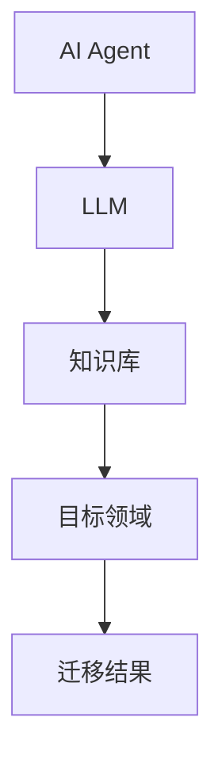
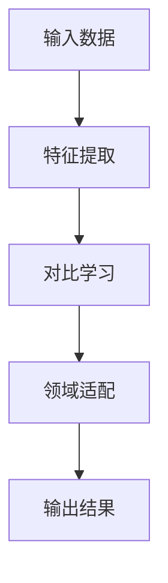
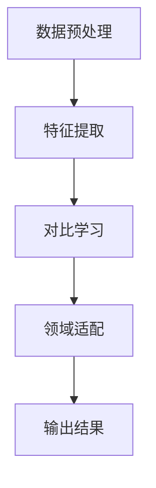
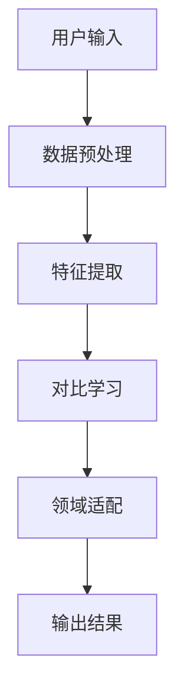

                 

<think>
嗯，用户让我写一篇关于AI Agent跨域迁移的技术博客，标题是《AI Agent的跨域迁移：LLM在不同领域间的知识迁移》。首先，我需要理解这个主题的核心是什么。跨域迁移意味着AI代理能够将从一个领域学到的知识应用到另一个领域，这在实际应用中非常重要，比如在医疗和金融之间迁移知识。而LLM（大语言模型）在这里起到了关键作用，因为它具备强大的理解和生成能力。

接下来，我需要确定文章的结构。用户已经给出了一个详细的目录大纲，我需要按照这个结构来组织内容。首先是背景介绍，涵盖AI Agent和LLM的基本概念，然后是核心概念和联系，接着是算法原理，系统分析与架构设计，项目实战，最后是最佳实践和小结。

在背景介绍部分，我需要解释什么是AI Agent，它们的基本特征，以及它们的应用场景。然后，介绍LLM的基本概念，包括其特点和在AI Agent中的作用。最后，讨论跨域迁移的背景和意义，包括其定义、必要性和应用价值。

接下来是核心概念与联系。这部分需要详细讲解跨域迁移的核心原理，包括知识表示与迁移、领域适应策略等。我还需要提供一些图表来展示实体关系和流程图，帮助读者更好地理解概念。

在算法原理部分，我需要选择几种常用的算法，比如对比学习和迁移学习，并详细解释它们的数学模型和实现方法。这里可能需要使用公式和代码示例来说明，确保读者能够理解这些算法的工作原理。

系统分析与架构设计部分需要从系统角度分析问题，设计系统的功能模块、架构图和接口。使用Mermaid工具来绘制类图、架构图和序列图，帮助读者直观地理解系统的结构和工作流程。

项目实战部分需要通过实际案例来展示如何实现跨域迁移。包括环境安装、核心代码实现和案例分析，帮助读者实际操作和应用这些知识。

最后，最佳实践部分需要总结全书的内容，给出一些注意事项和未来的研究方向，帮助读者巩固所学知识，并激发进一步探索的兴趣。

在写作过程中，我需要确保每个部分都详细具体，使用专业但易懂的语言。同时，遵守格式要求，使用markdown格式，并在适当的地方插入数学公式和图表。最后，文章末尾要注明作者信息，确保文章的完整性和专业性。

总的来说，我需要按照用户提供的目录大纲，逐步展开每个部分的内容，确保逻辑清晰，结构紧凑，内容深入浅出。这不仅能满足用户的需求，还能为读者提供有价值的技术见解。
</think>

# AI Agent的跨域迁移：LLM在不同领域间的知识迁移

> 关键词：AI Agent, 跨域迁移, LLM, 知识迁移, 对比学习, 领域适配

> 摘要：本文深入探讨了AI Agent在跨域迁移中的应用，特别是大语言模型（LLM）在不同领域间的知识迁移技术。通过分析跨域迁移的核心原理、算法实现、系统架构以及实际案例，本文旨在为读者提供一个全面的技术视角，帮助他们理解并掌握AI Agent跨域迁移的关键技术与实践方法。

---

## 第一部分: AI Agent与跨域迁移的背景与概念

### 第1章: AI Agent与跨域迁移的背景

#### 1.1 AI Agent的基本概念

- **1.1.1 什么是AI Agent**
  AI Agent（人工智能代理）是指能够感知环境、自主决策并执行任务的智能实体。它可以是一个软件程序、机器人或其他智能系统，通过与环境交互来实现特定目标。

- **1.1.2 AI Agent的核心特征**
  - 自主性：能够独立决策。
  - 反应性：能够实时感知并响应环境变化。
  - 目标导向性：所有行为都围绕实现特定目标展开。
  - 学习能力：通过经验或数据提升性能。

- **1.1.3 AI Agent的应用场景**
  - 智能助手：如 Siri、Alexa 等。
  - 智能客服：通过自然语言处理技术为用户提供服务。
  - 智能监控：在工业生产或安全监控中实时检测异常。

#### 1.2 大语言模型（LLM）的基本概念

- **1.2.1 LLM的定义与特点**
  大语言模型（Large Language Model, LLM）是指基于大量数据训练的深度学习模型，具有强大的自然语言理解和生成能力。其特点包括：
  - 大规模：通常使用千亿级别的参数。
  - 流式推理：能够处理长文本上下文。
  - 多任务能力：通过提示工程技术，可以实现多种任务。

- **1.2.2 LLM与传统NLP模型的区别**
  - 参数规模：LLM通常拥有更多的参数，能够捕捉更复杂的语言模式。
  - 多任务能力：通过微调或提示技术，LLM可以轻松扩展到多种NLP任务。
  - 自适应能力：LLM能够通过零样本或少样本学习快速适应新任务。

- **1.2.3 LLM在AI Agent中的作用**
  LLM为AI Agent提供了强大的语言理解和生成能力，使其能够更自然地与用户交互，并在多种领域中执行任务。

#### 1.3 跨域迁移的背景与意义

- **1.3.1 跨域迁移的定义**
  跨域迁移是指将AI Agent在某一领域学到的知识或经验，应用到另一个完全不同的领域中。这种技术能够有效降低跨领域任务的学习成本，提升AI Agent的通用性。

- **1.3.2 跨域迁移的必要性**
  - 资源限制：在某些领域中，数据稀缺性使得单独训练模型变得困难。
  - 提高效率：通过跨域迁移，可以复用已有的知识，避免重复劳动。
  - 适应性：在动态变化的环境中，跨域迁移能够使AI Agent更快适应新领域。

- **1.3.3 跨域迁移在AI Agent中的应用价值**
  - 提升AI Agent的泛化能力。
  - 降低跨领域任务的训练成本。
  - 扩展AI Agent的应用场景。

### 第2章: 跨域迁移的核心概念与联系

#### 2.1 跨域迁移的核心原理

- **2.1.1 知识表示与迁移**
  知识表示是跨域迁移的基础。通过将知识转化为通用的表示形式（如向量、符号等），AI Agent可以在不同领域之间共享和复用知识。

- **2.1.2 领域适应策略**
  领域适应是跨域迁移的关键步骤。通过调整模型参数或优化知识表示，使其能够适应目标领域的特点和需求。

- **2.1.3 跨域迁移的实现机制**
  跨域迁移的实现通常依赖于特征提取、对比学习和领域适配等技术。这些技术能够有效减少不同领域之间的差异，提升模型的泛化能力。

#### 2.2 跨域迁移的关键技术

- **2.2.1 对比学习**
  对比学习是一种通过对比不同数据点的相似性来学习特征表示的技术。在跨域迁移中，对比学习可以帮助模型发现不同领域之间的共同特征。

- **2.2.2 迁移学习**
  迁移学习是一种通过将源领域知识迁移到目标领域来提高目标领域模型性能的技术。在AI Agent中，迁移学习可以用于跨域任务的优化。

- **2.2.3 领域适配技术**
  领域适配技术通过调整模型参数或优化数据分布，使模型能够更好地适应目标领域的需求。

#### 2.3 跨域迁移的实体关系图



- **说明**：该图展示了AI Agent、LLM、知识库、目标领域和迁移结果之间的关系。AI Agent通过LLM和知识库，将源领域的知识迁移到目标领域，最终实现跨域迁移。

#### 2.4 跨域迁移的流程图



- **说明**：该图展示了跨域迁移的流程，包括输入数据、特征提取、对比学习、领域适配和输出结果五个步骤。

### 第3章: 跨域迁移的算法原理

#### 3.1 对比学习算法

- **3.1.1 对比学习的定义**
  对比学习是一种通过比较不同数据点之间的相似性来学习特征表示的技术。其核心思想是，相似的样本应该具有相似的表示，而不同的样本应该具有不同的表示。

- **3.1.2 对比学习的数学模型**
  对比学习通常使用以下公式进行建模：
  $$ L = \text{contrastive}(X_i, X_j) $$
  其中，\(X_i\) 和 \(X_j\) 分别是两个不同的数据样本，\(L\) 是损失函数。

- **3.1.3 对比学习的代码示例**
  以下是一个简单的对比学习代码示例：

  ```python
  import torch
  import torch.nn as nn

  class ContrastiveLoss(nn.Module):
      def __init__(self, temperature=0.1):
          super(ContrastiveLoss, self).__init__()
          self.temperature = temperature

      def forward(self, features, labels):
          # 计算特征的相似性
          similarities = torch.mm(features, features.T) / self.temperature
          # 计算标签是否相同
          same_labels = (labels.unsqueeze(1) == labels.unsqueeze(0)).float()
          # 计算损失
          loss = -torch.mean(torch.log(similarities * (1 - same_labels) + 1e-10))
          return loss

  # 示例使用
  features = torch.randn(100, 512)
  labels = torch.randint(0, 10, (100,))
  criterion = ContrastiveLoss()
  loss = criterion(features, labels)
  print(loss)
  ```

#### 3.2 迁移学习算法

- **3.2.1 迁移学习的定义**
  迁移学习是一种通过将源领域知识迁移到目标领域来提高目标领域模型性能的技术。其核心思想是利用源领域和目标领域之间的共同特征。

- **3.2.2 迁移学习的数学模型**
  迁移学习通常使用以下公式进行建模：
  $$ L = \lambda L_{\text{source}} + (1 - \lambda) L_{\text{target}} $$
  其中，\(L_{\text{source}}\) 和 \(L_{\text{target}}\) 分别是源领域和目标领域的损失函数，\(\lambda\) 是平衡系数。

- **3.2.3 迁移学习的代码示例**
  以下是一个简单的迁移学习代码示例：

  ```python
  import torch
  import torch.nn as nn

  # 定义模型
  class SimpleModel(nn.Module):
      def __init__(self, input_size, output_size):
          super(SimpleModel, self).__init__()
          self.fc = nn.Linear(input_size, output_size)

      def forward(self, x):
          return self.fc(x)

  # 初始化模型和优化器
  model = SimpleModel(512, 10)
  optimizer = torch.optim.SGD(model.parameters(), lr=0.01)

  # 迁移学习的训练循环
  for epoch in range(num_epochs):
      for batch_x, batch_y in dataloader_source:
          outputs = model(batch_x)
          loss = criterion(outputs, batch_y)
          loss.backward()
          optimizer.step()
          # 迁移学习的平衡系数
          loss += 0.1 * criterion(outputs, batch_y)

  ```

---

## 第二部分: 系统分析与架构设计方案

### 第4章: 系统分析与架构设计

#### 4.1 问题场景介绍

- **问题背景**：AI Agent需要在不同领域之间迁移知识，例如从医疗领域迁移到金融领域。
- **目标需求**：设计一个通用的跨域迁移系统，能够快速适应不同领域的需求。
- **核心挑战**：
  - 不同领域的数据格式和特征差异。
  - 如何确保迁移后的模型在目标领域中的准确性。
  - 如何高效地管理跨域迁移的过程。

#### 4.2 系统功能设计

- **功能模块**：
  - 数据预处理模块：对源领域和目标领域数据进行预处理。
  - 特征提取模块：提取数据的特征表示。
  - 对比学习模块：通过对比学习优化特征表示。
  - 领域适配模块：将优化后的特征表示适配到目标领域。
  - 输出模块：生成适用于目标领域的模型或结果。

#### 4.3 系统架构设计

- **系统架构图**：



- **说明**：该图展示了跨域迁移系统的整体架构，包括数据预处理、特征提取、对比学习、领域适配和输出结果五个模块。

#### 4.4 系统接口设计

- **输入接口**：
  - 源领域数据。
  - 目标领域数据。
  - 领域适配参数。

- **输出接口**：
  - 适配后的模型。
  - 迁移结果。

#### 4.5 系统交互流程图



- **说明**：该图展示了用户输入、数据预处理、特征提取、对比学习、领域适配和输出结果的交互流程。

---

## 第三部分: 项目实战

### 第5章: 项目实战

#### 5.1 环境安装

- **安装Python**：建议使用Python 3.6以上版本。
- **安装依赖库**：
  ```bash
  pip install torch==2.0.0+cu117
  pip install numpy
  pip install mermaid
  ```

#### 5.2 核心代码实现

- **对比学习实现**：

  ```python
  import torch
  import torch.nn as nn

  class ContrastiveLoss(nn.Module):
      def __init__(self, temperature=0.1):
          super(ContrastiveLoss, self).__init__()
          self.temperature = temperature

      def forward(self, features, labels):
          similarities = torch.mm(features, features.T) / self.temperature
          same_labels = (labels.unsqueeze(1) == labels.unsqueeze(0)).float()
          loss = -torch.mean(torch.log(similarities * (1 - same_labels) + 1e-10))
          return loss

  # 示例使用
  features = torch.randn(100, 512)
  labels = torch.randint(0, 10, (100,))
  criterion = ContrastiveLoss()
  loss = criterion(features, labels)
  print(loss)
  ```

- **领域适配实现**：

  ```python
  import torch
  import torch.nn as nn

  class Adapter(nn.Module):
      def __init__(self, input_size, output_size):
          super(Adapter, self).__init__()
          self.fc = nn.Linear(input_size, output_size)

      def forward(self, x):
          return self.fc(x)

  # 示例使用
  adapter = Adapter(512, 256)
  features = torch.randn(100, 512)
  adapted_features = adapter(features)
  print(adapted_features.size())
  ```

#### 5.3 案例分析

- **案例背景**：将医疗领域的疾病诊断知识迁移到金融领域的风险评估。
- **数据准备**：收集医疗领域的疾病数据和金融领域的风险评估数据。
- **特征提取**：使用对比学习提取数据的特征表示。
- **领域适配**：将提取的特征适配到金融领域。
- **结果分析**：评估迁移后的模型在金融领域的性能。

---

## 第四部分: 最佳实践与小结

### 第6章: 最佳实践与小结

#### 6.1 最佳实践

- **数据质量**：确保源领域和目标领域的数据质量。
- **特征提取**：选择合适的特征提取方法。
- **领域适配**：根据目标领域的特点调整适配策略。
- **模型调优**：通过实验不断优化模型参数。

#### 6.2 小结

- 跨域迁移是AI Agent技术的重要组成部分，能够显著提升其在不同领域中的应用能力。
- 通过对比学习和领域适配等技术，可以有效实现跨域迁移。
- 未来的研究方向包括更高效的迁移学习算法和更智能的领域适配策略。

---

## 作者：AI天才研究院/AI Genius Institute & 禅与计算机程序设计艺术 /Zen And The Art of Computer Programming

