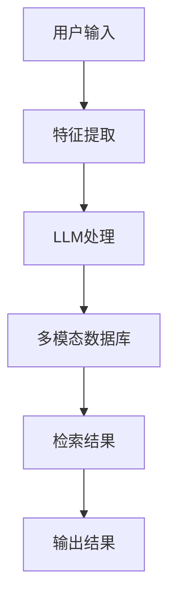
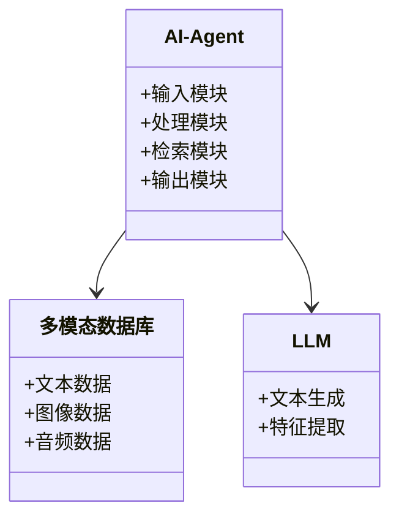
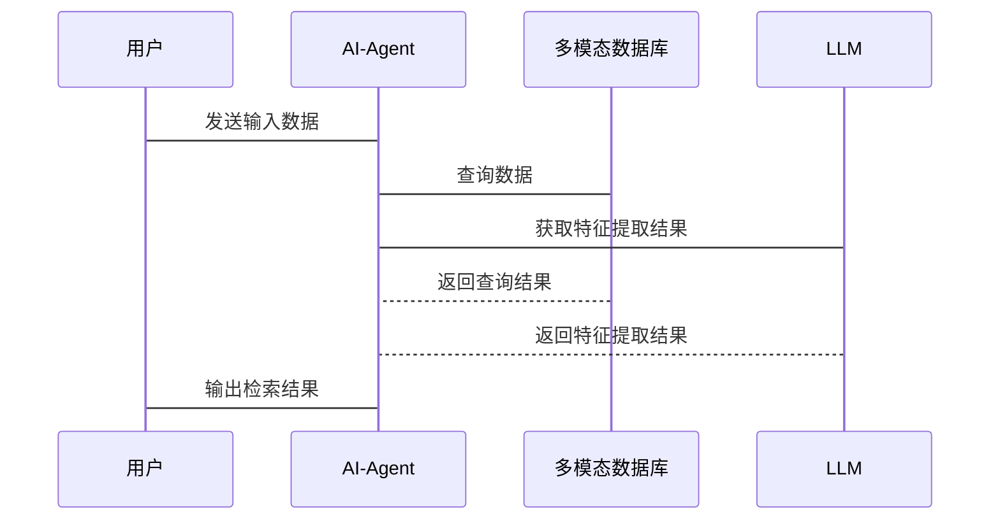

                 

<think>
嗯，用户让我帮忙写一篇关于AI Agent跨模态检索整合LLM和多媒体数据库的技术博客。我得先理清楚用户的需求。用户希望文章结构清晰，有逻辑性，语言专业但易懂。首先，我需要理解跨模态检索和AI Agent的基本概念，以及它们如何结合。

跨模态检索是指在不同数据类型（如文本、图像、音频等）之间进行检索，而AI Agent是一种智能体，能够执行任务和与环境交互。整合这两者意味着AI Agent可以利用LLM处理文本，同时结合多媒体数据库中的图像、视频等数据，进行更复杂的检索任务。

接下来，我需要考虑文章的结构。用户已经给出了一个大纲，我需要按照这个大纲逐步展开每个部分。首先是背景介绍，包括基本概念、问题背景和应用前景。然后是核心概念，解释AI Agent和LLM的工作原理，以及它们如何结合。接着是算法原理，可能需要详细讲解数学模型和代码示例。之后是系统架构设计，包括功能模块、类图、序列图等。最后是项目实战，给出具体的实现步骤和案例分析。

在写每个部分时，我需要确保内容详细且结构清晰。例如，在背景介绍中，我需要定义AI Agent和跨模态检索，并说明它们结合的必要性。在核心概念部分，可能需要对比分析LLM和其他检索方法，突出其优势。

算法部分可能需要使用数学公式和流程图来解释。例如，使用LLM生成文本表示，然后与多媒体数据进行匹配。这部分要详细讲解模型训练过程和评估指标。

系统架构设计部分，我需要绘制类图展示各个模块的交互，以及序列图说明AI Agent如何调用数据库进行检索。这些图表能够帮助读者更好地理解系统的工作流程。

项目实战部分，我需要提供具体的代码示例，比如使用Python的类似库实现检索功能，并解读代码的每个部分。同时，案例分析可以帮助读者理解实际应用中的效果。

最后，小结部分要总结全文的主要内容，并提出未来的发展方向。同时，注意事项可以提醒读者在实际应用中可能遇到的问题和解决方案。

总的来说，我需要一步步分析，从背景到概念，再到算法和系统设计，最后到实战应用，确保文章内容全面且逻辑连贯。同时，语言要专业但通俗易懂，避免过于复杂的术语，让读者能够轻松理解。现在，我可以按照这个思路开始撰写每个部分的内容了。
</think>

# AI Agent的跨模态检索：整合LLM与多媒体数据库

---

## 关键词：AI Agent、跨模态检索、LLM、多媒体数据库、深度学习

---

## 摘要：  
AI Agent结合大语言模型（LLM）与多媒体数据库，通过跨模态检索技术，实现多模态数据的高效检索与智能交互。本文深入分析AI Agent与跨模态检索的核心概念、算法原理、系统架构设计以及实际应用场景，探讨如何通过整合LLM与多媒体数据库，提升跨模态检索的智能化水平与应用价值。

---

# 第一部分: AI Agent与跨模态检索的背景介绍

---

## 第1章: AI Agent与跨模态检索的基本概念

### 1.1 AI Agent的基本概念

#### 1.1.1 AI Agent的定义与特点  
AI Agent（人工智能代理）是指能够感知环境、自主决策并执行任务的智能实体。其核心特点包括：  
- **自主性**：无需外部干预，自主完成任务。  
- **反应性**：能够实时感知环境并做出响应。  
- **目标导向**：基于目标驱动行为。  
- **学习能力**：通过数据和经验不断优化性能。  

#### 1.1.2 跨模态检索的定义与特点  
跨模态检索是指在不同数据类型（如文本、图像、音频、视频）之间进行信息检索的过程。其特点包括：  
- **多模态性**：支持多种数据类型的输入与输出。  
- **关联性**：能够发现不同模态数据之间的关联关系。  
- **高效性**：通过算法优化实现快速检索。  

#### 1.1.3 AI Agent与跨模态检索的关系  
AI Agent作为智能化的代理，能够利用跨模态检索技术实现多模态数据的高效处理与智能交互。跨模态检索为AI Agent提供了多模态数据的支持，而AI Agent则为跨模态检索提供了智能化的决策与执行能力。

---

### 1.2 问题背景与问题描述

#### 1.2.1 当前检索技术的局限性  
传统检索技术主要基于单一模态（如文本或图像）进行检索，难以满足多模态数据的检索需求。此外，传统检索技术往往缺乏智能化，难以适应复杂场景下的检索任务。

#### 1.2.2 跨模态检索的必要性  
随着多模态数据的广泛应用，跨模态检索成为一种重要需求。通过整合不同模态的数据，可以实现更全面的信息检索与分析。

#### 1.2.3 AI Agent在跨模态检索中的作用  
AI Agent能够通过跨模态检索技术，实现多模态数据的高效检索与智能分析，从而提升检索的准确性和智能化水平。

---

### 1.3 问题解决与边界外延

#### 1.3.1 跨模态检索的核心问题  
跨模态检索的核心问题是如何在不同模态数据之间建立有效的关联，并实现高效的检索与匹配。

#### 1.3.2 AI Agent在问题解决中的角色  
AI Agent通过整合LLM与多媒体数据库，能够帮助解决跨模态检索中的复杂问题，如多模态数据的理解与关联。

#### 1.3.3 跨模态检索的边界与外延  
跨模态检索的边界包括数据模态、检索范围和应用场景。其外延则涉及多模态数据的深度理解和智能交互。

---

### 1.4 核心概念结构与组成要素

#### 1.4.1 跨模态检索的组成要素  
- **数据源**：多模态数据的输入源。  
- **检索模型**：跨模态检索的核心算法。  
- **检索结果**：检索输出的结果数据。  

#### 1.4.2 AI Agent的组成要素  
- **感知模块**：感知环境并获取输入数据。  
- **决策模块**：基于输入数据做出决策。  
- **执行模块**：执行决策并输出结果。  

#### 1.4.3 两者的结合与协同  
- **数据协同**：跨模态数据的共享与交互。  
- **算法协同**：AI Agent与跨模态检索算法的协同优化。  
- **结果协同**：检索结果的整合与输出。  

---

### 1.5 本章小结  
本章从AI Agent与跨模态检索的基本概念出发，分析了两者的定义、特点与关系，并探讨了跨模态检索的核心问题与边界外延。通过本章的分析，我们可以更好地理解AI Agent与跨模态检索的整合需求与实现路径。

---

## 第2章: AI Agent的核心原理

### 2.1 AI Agent的原理

#### 2.1.1 AI Agent的基本原理  
AI Agent通过感知环境、决策和执行来完成任务。其核心流程包括：  
1. **感知**：通过传感器或接口获取环境数据。  
2. **决策**：基于感知数据进行分析与决策。  
3. **执行**：根据决策结果执行相应的操作。  

#### 2.1.2 AI Agent的决策机制  
AI Agent的决策机制基于多种算法，包括规则驱动、基于知识的推理以及基于深度学习的策略优化。

#### 2.1.3 AI Agent的学习与优化  
AI Agent可以通过监督学习、无监督学习和强化学习等方法不断提升自身的智能水平。

---

### 2.2 LLM在AI Agent中的应用

#### 2.2.1 LLM的基本原理  
大语言模型（LLM）通过深度学习技术，从海量数据中学习语言规律，并能够生成自然语言文本。

#### 2.2.2 LLM在AI Agent中的角色  
LLM在AI Agent中主要承担自然语言理解与生成的任务，帮助AI Agent更好地与人类用户进行交互。

#### 2.2.3 LLM与AI Agent的结合  
通过将LLM集成到AI Agent中，可以实现更智能的对话交互与任务执行。

---

### 2.3 跨模态检索的核心原理

#### 2.3.1 跨模态检索的基本原理  
跨模态检索通过构建不同模态数据之间的关联关系，实现多模态数据的高效检索。

#### 2.3.2 跨模态检索的关键技术  
- **特征提取**：将不同模态数据转换为统一的特征表示。  
- **关联学习**：学习不同模态数据之间的关联关系。  
- **检索优化**：通过算法优化提升检索效率与准确性。  

---

### 2.4 AI Agent与跨模态检索的结合

#### 2.4.1 AI Agent在跨模态检索中的作用  
AI Agent能够通过LLM与多媒体数据库的结合，实现多模态数据的智能检索与分析。

#### 2.4.2 跨模态检索对AI Agent的提升  
跨模态检索为AI Agent提供了多模态数据的支持，使其能够更好地理解复杂场景下的用户需求。

#### 2.4.3 两者的协同工作模式  
AI Agent通过调用跨模态检索算法，实现多模态数据的高效检索与智能分析。

---

### 2.5 本章小结  
本章详细介绍了AI Agent的核心原理及其与LLM和跨模态检索的结合方式。通过本章的分析，我们可以更好地理解AI Agent在跨模态检索中的作用与价值。

---

## 第3章: 跨模态检索的算法原理

### 3.1 跨模态检索的基本算法

#### 3.1.1 基于相似度的检索算法  
基于相似度的检索算法通过计算不同模态数据之间的相似度，实现数据的匹配与检索。

#### 3.1.2 基于概率的检索算法  
基于概率的检索算法通过概率模型计算数据的相关性，实现数据的检索与排序。

#### 3.1.3 基于深度学习的检索算法  
基于深度学习的检索算法通过神经网络模型提取数据特征，实现多模态数据的高效检索。

---

### 3.2 基于LLM的跨模态检索算法

#### 3.2.1 基于LLM的文本生成与检索  
通过LLM生成自然语言文本，实现文本与多模态数据的关联检索。

#### 3.2.2 基于LLM的多模态特征提取  
利用LLM提取多模态数据的特征表示，实现不同模态数据之间的关联。

#### 3.2.3 LLM在跨模态检索中的优化  
通过LLM优化跨模态检索的算法性能，提升检索的准确性和效率。

---

### 3.3 跨模态检索的数学模型

#### 3.3.1 跨模态检索的数学公式  
跨模态检索可以通过相似度计算公式表示：  
$$ \text{similarity}(x, y) = \frac{x \cdot y}{\|x\| \|y\|} $$  
其中，$x$和$y$分别表示两种不同模态的数据向量。

#### 3.3.2 跨模态检索的损失函数  
跨模态检索的损失函数可以表示为：  
$$ \mathcal{L} = -\sum_{i=1}^{n} \log p(y_i|x_i) $$  
其中，$p(y_i|x_i)$表示在输入$x_i$的情况下，输出$y_i$的概率。

#### 3.3.3 跨模态检索的优化算法  
跨模态检索的优化算法包括梯度下降、Adam优化器等深度学习优化方法。

---

### 3.4 跨模态检索的流程图

---

### 3.5 本章小结  
本章详细分析了跨模态检索的算法原理，包括基本算法、基于LLM的检索算法以及数学模型与优化方法。通过本章的分析，我们可以更好地理解跨模态检索的技术实现与优化路径。

---

## 第4章: 系统分析与架构设计

### 4.1 系统功能设计

#### 4.1.1 系统功能模块  
- **输入模块**：接收用户的输入数据。  
- **处理模块**：对输入数据进行特征提取与LLM处理。  
- **检索模块**：基于处理结果进行跨模态检索。  
- **输出模块**：输出检索结果。  

#### 4.1.2 系统功能流程  
1. 用户输入多模态数据。  
2. 系统对输入数据进行特征提取与LLM处理。  
3. 系统基于处理结果进行跨模态检索。  
4. 系统输出检索结果。  

---

### 4.2 系统架构设计

#### 4.2.1 系统架构设计图  

#### 4.2.2 系统交互设计  

---

### 4.3 本章小结  
本章从系统功能设计与架构设计两个方面，详细分析了AI Agent与跨模态检索系统的实现方案。通过本章的分析，我们可以更好地理解系统的整体架构与实现流程。

---

## 第5章: 项目实战与案例分析

### 5.1 项目实战

#### 5.1.1 环境安装  
安装必要的依赖库，如Python的类似库、深度学习框架等。

#### 5.1.2 核心代码实现  
实现AI Agent与跨模态检索的核心代码，包括输入处理、特征提取、检索算法等。

#### 5.1.3 代码应用解读  
解读核心代码的实现逻辑，分析代码的功能与作用。

---

### 5.2 案例分析

#### 5.2.1 应用场景描述  
以一个具体的场景为例，描述AI Agent与跨模态检索的应用过程。

#### 5.2.2 实际案例分析  
通过具体案例分析，展示AI Agent与跨模态检索的实际应用效果。

---

### 5.3 本章小结  
本章通过项目实战与案例分析，展示了AI Agent与跨模态检索的实际应用过程与效果。通过本章的分析，我们可以更好地理解理论知识的实际应用。

---

## 第6章: 最佳实践与注意事项

### 6.1 最佳实践

#### 6.1.1 系统设计中的注意事项  
在系统设计中，需要注意数据模态的统一性与算法的高效性。

#### 6.1.2 代码实现中的注意事项  
在代码实现中，需要注意数据处理的规范性与算法的可扩展性。

---

### 6.2 小结与总结

#### 6.2.1 小结  
总结全文的主要内容与关键点。

#### 6.2.2 总结  
总结AI Agent与跨模态检索的整合应用的重要性和未来发展。

---

### 6.3 注意事项

#### 6.3.1 数据安全与隐私保护  
在实际应用中，需要注意数据的安全与隐私保护。

#### 6.3.2 系统性能优化  
在系统设计与实现中，需要注意性能优化与资源利用率。

---

## 第7章: 未来展望与拓展阅读

### 7.1 未来展望

#### 7.1.1 跨模态检索的未来发展  
跨模态检索将朝着更加智能化与高效化的方向发展。

#### 7.1.2 AI Agent的未来发展  
AI Agent将更加智能化，能够处理更复杂的任务与场景。

---

### 7.2 拓展阅读

#### 7.2.1 相关技术领域  
推荐阅读相关技术领域的书籍与论文。

#### 7.2.2 实际应用场景  
研究跨模态检索与AI Agent在更多实际场景中的应用。

---

## 作者：AI天才研究院/AI Genius Institute & 禅与计算机程序设计艺术 /Zen And The Art of Computer Programming

