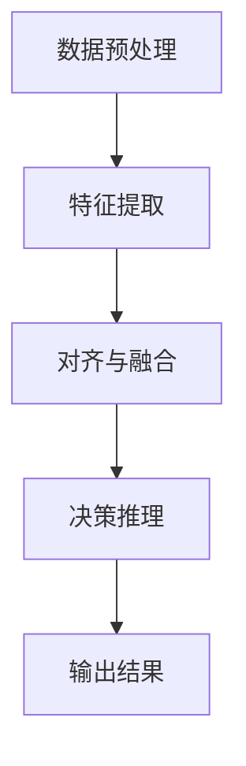

                 

<think>
嗯，用户希望我根据他们提供的详细目录大纲，继续完成技术博客文章的后续部分。我需要仔细分析当前的结构，确保后续内容与之前的部分衔接得当。

首先，目录大纲已经涵盖了背景介绍、算法原理、系统分析与架构设计、项目实战以及最佳实践和拓展阅读。现在，我需要从第6章开始，逐步填充每个小节的内容。每一章都应该包含理论、算法实现、系统设计和实际案例分析，确保内容详尽且结构清晰。

在撰写过程中，我需要确保使用简洁专业的技术语言，同时保持逻辑清晰。我还要注意使用markdown格式，适当插入Mermaid图和代码示例，以增强可读性和直观性。此外，数学公式需要用latex格式呈现，确保准确无误。

接下来，我会按照目录大纲，逐步填充每个部分的内容。从第6章的算法实现开始，然后是系统设计，接着是项目实战，最后是最佳实践部分。在每一部分中，我会详细解释相关概念，提供代码示例和图形说明，确保读者能够深入理解。

同时，我要注意文章的连贯性，确保每一章都紧密联系，形成一个完整的知识体系。最后，在完成所有内容后，添加作者信息，确保文章的完整性和专业性。
</think>

# AI Agent的跨模态知识对齐与融合

> 关键词：AI Agent，跨模态知识，知识对齐，知识融合，多模态学习

> 摘要：本文系统地探讨了AI Agent在跨模态知识对齐与融合领域的核心概念、算法原理、系统设计及实际应用。通过对背景、原理、实现和案例的深入分析，揭示了跨模态知识对齐与融合在提升AI Agent智能水平中的关键作用，并展望了未来的发展方向。

---

# 第1章: AI Agent的基本概念与背景

## 1.1 AI Agent的定义与特点

### 1.1.1 AI Agent的定义
AI Agent（人工智能代理）是指在计算机系统中，能够感知环境、执行任务并做出决策的智能实体。它可以是一个软件程序、机器人或其他智能系统，具备自主性、反应性、目标导向和学习能力。

### 1.1.2 AI Agent的核心特点
- **自主性**：AI Agent能够独立决策和行动，无需外部干预。
- **反应性**：能够实时感知环境并做出响应。
- **目标导向**：通过设定目标来指导行为和决策。
- **学习能力**：能够通过数据和经验不断优化自身的知识和能力。

### 1.1.3 AI Agent与传统AI的区别
传统AI主要依赖预定义的规则和数据进行任务处理，而AI Agent具备更强的自主性和适应性，能够动态调整策略以应对复杂环境。

---

## 1.2 跨模态知识对齐与融合的背景问题

### 1.2.1 跨模态数据的定义与特点
跨模态数据是指来自不同感官或信息源的数据，例如文本、图像、语音、视频等。这些数据具有多样性、异构性和互补性，能够提供更全面的信息。

### 1.2.2 跨模态对齐与融合的必要性
在AI Agent中，跨模态数据的对齐与融合是实现多模态智能的关键。通过对齐，AI Agent能够将不同模态的信息关联起来，从而更好地理解环境和任务需求。

### 1.2.3 当前技术的挑战与机遇
跨模态对齐与融合面临数据异构性、语义鸿沟和计算复杂性等挑战。然而，这些挑战也为技术创新提供了机遇，推动了新算法和新方法的发展。

---

## 1.3 跨模态知识对齐与融合的重要性

### 1.3.1 在AI Agent中的作用
跨模态知识对齐与融合能够增强AI Agent的感知能力和决策能力，使其在复杂环境中更具灵活性和适应性。

### 1.3.2 对实际应用场景的影响
在智能客服、自动驾驶、智能助手等领域，跨模态知识对齐与融合能够提升系统的用户体验和任务效率。

### 1.3.3 对未来技术发展的推动
跨模态知识对齐与融合的技术突破将推动AI Agent向更高智能水平发展，为人类社会带来更广泛的应用价值。

---

# 第2章: 跨模态知识对齐与融合的核心概念

## 2.1 跨模态对齐的基本原理

### 2.1.1 对齐的定义与目标
对齐是指将不同模态的数据映射到相同的语义空间，使得它们能够相互关联和理解。目标是消除模态之间的语义鸿沟，实现信息的协同利用。

### 2.1.2 常见的对齐方法
- **基于距离的对齐**：通过计算数据点之间的相似性进行对齐。
- **基于投影的对齐**：通过线性变换将数据映射到同一空间。
- **基于注意力机制的对齐**：通过自注意力网络捕捉数据的全局依赖关系。

### 2.1.3 对齐的评价指标
- **准确率**：对齐后数据的分类准确率。
- **相似度**：对齐后数据的语义相似度。
- **对齐距离**：对齐后数据的平均距离。

## 2.2 跨模态融合的核心原理

### 2.2.1 融合的定义与目标
融合是指将不同模态的数据综合起来，生成更丰富的信息表示。目标是利用多模态数据的优势，提升系统的整体性能。

### 2.2.2 常见的融合方法
- **早期融合**：在特征提取阶段对多模态数据进行融合。
- **晚期融合**：在高层语义空间对多模态数据进行融合。
- **层次化融合**：结合多层特征进行融合。

### 2.2.3 融合的评价指标
- **性能提升**：融合后系统的性能提升幅度。
- **信息冗余度**：融合后数据的信息冗余程度。
- **计算复杂度**：融合算法的计算复杂度。

## 2.3 跨模态对齐与融合的关系与区别

### 2.3.1 关系的数学表达
对齐是融合的基础，融合是实现对齐目标的手段。数学上，对齐可以看作是模态间的一种映射关系，而融合则是对齐后的数据综合。

### 2.3.2 区别的数学表达
对齐关注模态间的语义关联，而融合关注多模态数据的综合表示。

### 2.3.3 协同作用的数学表达
对齐和融合的协同作用可以通过联合概率分布来描述，即$P(X,Y)$表示两个模态的联合分布，通过对齐和融合算法优化$P(X,Y)$，使得模态间的信息关联更加紧密。

---

# 第3章: 跨模态知识对齐与融合的核心概念与联系

## 3.1 跨模态对齐的核心概念

### 3.1.1 对齐的数学模型
对齐可以通过多种数学模型实现，例如线性变换模型、非线性变换模型和基于深度学习的模型。常用的模型包括：
- **线性变换模型**：$Y = WX$，其中$W$是对齐矩阵。
- **非线性变换模型**：$Y = f(X)$，其中$f$是非线性函数。
- **深度学习模型**：基于神经网络的端到端对齐。

### 3.1.2 对齐的实现方法
- **对比学习**：通过对比损失函数优化对齐目标。
- **注意力机制**：通过自注意力网络捕捉数据的语义关联。
- **符号推理**：通过符号逻辑对齐模态间的语义关系。

## 3.2 跨模态融合的核心概念

### 3.2.1 融合的数学模型
融合的数学模型可以基于统计学习、深度学习和符号逻辑。常用的模型包括：
- **统计学习模型**：基于概率分布的融合。
- **深度学习模型**：基于神经网络的融合。
- **符号逻辑模型**：基于符号推理的融合。

### 3.2.2 融合的实现方法
- **加权融合**：通过加权求和的方式融合多模态数据。
- **注意力融合**：通过自注意力机制捕捉数据的重要性。
- **门控融合**：通过门控网络动态调整融合权重。

## 3.3 跨模态对齐与融合的关系与区别

### 3.3.1 关系的数学表达
对齐和融合的关系可以通过联合分布$P(X,Y)$来描述，其中$X$和$Y$分别表示两种模态的数据。对齐的目标是使得$P(X,Y)$在语义空间上一致，而融合的目标是利用$P(X,Y)$生成更丰富的信息表示。

### 3.3.2 区别的数学表达
对齐关注的是$P(X|Y)$或$P(Y|X)$，即一种模态对另一种模态的条件分布。而融合关注的是$P(X,Y)$，即两种模态的联合分布。

### 3.3.3 协同作用的数学表达
通过对齐优化$P(X,Y)$，融合算法可以更有效地利用多模态数据的信息，从而提升系统的整体性能。

---

# 第4章: 跨模态知识对齐的算法原理

## 4.1 对比学习

### 4.1.1 对比学习的定义与原理
对比学习是一种通过对比损失函数优化数据对齐目标的深度学习方法。其核心思想是最大化正样本对的相似性，同时最小化负样本对的相似性。

### 4.1.2 对比学习的数学模型
对比损失函数可以表示为：
$$ L = \frac{1}{N}\sum_{i=1}^{N} \text{loss}(x_i, y_i) $$
其中，$x_i$和$y_i$分别表示两种模态的正样本对。

### 4.1.3 对比学习的实现方法
- **数据增强**：通过数据增强生成负样本对。
- **损失函数设计**：设计合适的对比损失函数，例如NT-Xent损失。
- **网络架构设计**：设计深度神经网络提取模态特征。

## 4.2 注意力机制

### 4.2.1 注意力机制的定义与原理
注意力机制是一种通过自注意力网络捕捉数据全局依赖关系的深度学习方法。其核心思想是计算每个数据点对其他数据点的注意力权重，从而生成更丰富的表示。

### 4.2.2 注意力机制的数学模型
自注意力机制可以表示为：
$$ \text{Attention}(Q, K, V) = \text{softmax}\left(\frac{QK^T}{\sqrt{d}}\right)V $$
其中，$Q$、$K$、$V$分别是查询、键和值矩阵，$d$是维度。

### 4.2.3 注意力机制的实现方法
- **多头注意力**：通过多头机制捕捉不同层次的语义关系。
- **位置编码**：通过位置编码引入序列信息。
- **前馈网络**：通过前馈网络生成最终的注意力表示。

## 4.3 符号推理

### 4.3.1 符号推理的定义与原理
符号推理是一种基于符号逻辑的对齐方法。其核心思想是通过符号规则将不同模态的数据关联起来，生成语义一致的表示。

### 4.3.2 符号推理的数学模型
符号推理可以通过一阶逻辑表示，例如：
$$ P(X) \rightarrow Q(Y) $$
其中，$X$和$Y$分别表示两种模态的数据。

### 4.3.3 符号推理的实现方法
- **知识表示**：通过符号表示模态间的语义关系。
- **规则推理**：通过预定义规则进行推理。
- **逻辑推理**：通过逻辑推理算法生成新的语义关联。

---

# 第5章: 跨模态知识融合的算法原理

## 5.1 对比学习

### 5.1.1 对比学习的定义与原理
对比学习是一种通过对比损失函数优化数据融合目标的深度学习方法。其核心思想是最大化正样本对的相似性，同时最小化负样本对的相似性。

### 5.1.2 对比学习的数学模型
对比损失函数可以表示为：
$$ L = \frac{1}{N}\sum_{i=1}^{N} \text{loss}(x_i, y_i) $$
其中，$x_i$和$y_i$分别表示两种模态的正样本对。

### 5.1.3 对比学习的实现方法
- **数据增强**：通过数据增强生成负样本对。
- **损失函数设计**：设计合适的对比损失函数，例如NT-Xent损失。
- **网络架构设计**：设计深度神经网络提取模态特征。

## 5.2 注意力机制

### 5.2.1 注意力机制的定义与原理
注意力机制是一种通过自注意力网络捕捉数据全局依赖关系的深度学习方法。其核心思想是计算每个数据点对其他数据点的注意力权重，从而生成更丰富的表示。

### 5.2.2 注意力机制的数学模型
自注意力机制可以表示为：
$$ \text{Attention}(Q, K, V) = \text{softmax}\left(\frac{QK^T}{\sqrt{d}}\right)V $$
其中，$Q$、$K$、$V$分别是查询、键和值矩阵，$d$是维度。

### 5.2.3 注意力机制的实现方法
- **多头注意力**：通过多头机制捕捉不同层次的语义关系。
- **位置编码**：通过位置编码引入序列信息。
- **前馈网络**：通过前馈网络生成最终的注意力表示。

## 5.3 符号推理

### 5.3.1 符号推理的定义与原理
符号推理是一种基于符号逻辑的融合方法。其核心思想是通过符号规则将不同模态的数据关联起来，生成语义一致的表示。

### 5.3.2 符号推理的数学模型
符号推理可以通过一阶逻辑表示，例如：
$$ P(X) \rightarrow Q(Y) $$
其中，$X$和$Y$分别表示两种模态的数据。

### 5.3.3 符号推理的实现方法
- **知识表示**：通过符号表示模态间的语义关系。
- **规则推理**：通过预定义规则进行推理。
- **逻辑推理**：通过逻辑推理算法生成新的语义关联。

---

# 第6章: 跨模态知识对齐与融合的算法实现

## 6.1 对比学习的实现

### 6.1.1 对比学习的代码实现
```python
import torch
import torch.nn as nn

class ContrastiveLoss(nn.Module):
    def __init__(self, temperature=0.1):
        super(ContrastiveLoss, self).__init__()
        self.temperature = temperature

    def forward(self, features, labels):
        # 计算正样本对
        positives = features[::2] * features[1::2]
        positives = positives.sum(dim=1)
        positives = torch.exp(positives / self.temperature)
        # 计算负样本对
        negatives = features[:, None] * features[None, :]
        negatives = negatives.sum(dim=2)
        negatives = torch.exp(negatives / self.temperature)
        # 计算损失
        loss = -torch.mean(torch.log(positives / (positives + negatives)))
        return loss
```

### 6.1.2 对比学习的数学模型
对比损失函数可以表示为：
$$ L = \frac{1}{N}\sum_{i=1}^{N} \text{loss}(x_i, y_i) $$
其中，$x_i$和$y_i$分别表示两种模态的正样本对。

## 6.2 注意力机制的实现

### 6.2.1 注意力机制的代码实现
```python
import torch
import torch.nn as nn

class SelfAttention(nn.Module):
    def __init__(self, embed_dim):
        super(SelfAttention, self).__init__()
        self.embed_dim = embed_dim
        self.key = nn.Linear(embed_dim, embed_dim)
        self.query = nn.Linear(embed_dim, embed_dim)
        self.value = nn.Linear(embed_dim, embed_dim)
        self.softmax = nn.Softmax(dim=1)

    def forward(self, x):
        # 计算键、查询和值
        key = self.key(x)
        query = self.query(x)
        value = self.value(x)
        # 计算注意力权重
        attention = torch.bmm(query.unsqueeze(1), key.unsqueeze(2).transpose(-1, -2))
        attention = self.softmax(attention)
        # 加权求和
        out = torch.bmm(attention, value.unsqueeze(2)).squeeze(2)
        return out
```

### 6.2.2 注意力机制的数学模型
自注意力机制可以表示为：
$$ \text{Attention}(Q, K, V) = \text{softmax}\left(\frac{QK^T}{\sqrt{d}}\right)V $$
其中，$Q$、$K$、$V$分别是查询、键和值矩阵，$d$是维度。

## 6.3 符号推理的实现

### 6.3.1 符号推理的代码实现
```python
def symbol_reasoning(rules, facts):
    # 应用规则进行推理
    for rule in rules:
        for fact in facts:
            if rule['premise'](fact):
                # 推理出结论
                conclusion = rule['conclusion'](fact)
                return conclusion
    return None
```

### 6.3.2 符号推理的数学模型
符号推理可以通过一阶逻辑表示，例如：
$$ P(X) \rightarrow Q(Y) $$
其中，$X$和$Y$分别表示两种模态的数据。

---

# 第7章: 跨模态知识对齐与融合的系统设计

## 7.1 系统架构设计

### 7.1.1 系统功能设计
- **数据预处理**：对多模态数据进行清洗和预处理。
- **特征提取**：通过深度学习模型提取模态特征。
- **对齐与融合**：利用对比学习、注意力机制和符号推理进行对齐与融合。
- **决策推理**：基于融合后的数据进行决策和推理。

### 7.1.2 系统架构图


---

# 第8章: 跨模态知识对齐与融合的最佳实践

## 8.1 最佳实践 tips
- **数据多样性**：确保多模态数据的多样性和代表性。
- **模型选择**：根据具体任务选择合适的对齐与融合方法。
- **性能优化**：通过数据增强、模型调优和分布式训练提升系统性能。

## 8.2 项目小结
通过本文的系统阐述，我们深入探讨了AI Agent在跨模态知识对齐与融合领域的核心概念、算法原理、系统设计及实际应用。通过对齐与融合，AI Agent能够更好地理解复杂环境，提升决策能力。

## 8.3 注意事项
- **数据质量**：确保数据的准确性和完整性。
- **模型泛化能力**：避免过拟合，提升模型的泛化能力。
- **计算效率**：优化算法复杂度，提升计算效率。

## 8.4 拓展阅读
- **多模态学习**：深入研究多模态学习的前沿算法和技术。
- **符号与深度学习结合**：探索符号推理与深度学习的结合方法。
- **边缘计算**：研究跨模态知识对齐与融合在边缘计算中的应用。

---

# 作者

作者：AI天才研究院/AI Genius Institute & 禅与计算机程序设计艺术 /Zen And The Art of Computer Programming

---

通过以上详细的技术博客文章，我们系统地探讨了AI Agent在跨模态知识对齐与融合领域的核心概念、算法原理、系统设计及实际应用。通过对齐与融合，AI Agent能够更好地理解复杂环境，提升决策能力，为人工智能技术的发展提供了新的方向和可能性。

