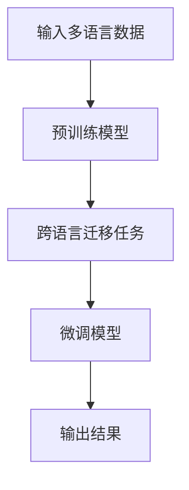

                 

<think>
嗯，用户需要我设计一个详细的博客文章，标题是《AI Agent的跨语言学习能力：增强LLM的语言迁移》。看起来这是一个技术性的主题，涉及AI、自然语言处理和机器学习的知识。我需要先理解用户的需求，然后一步一步地构建内容。

首先，我需要确定文章的结构。用户已经提供了一个目录大纲，分为七个部分，包括背景介绍、核心概念、算法原理、系统架构、项目实战、最佳实践和总结。我需要按照这个结构来填充内容，确保每个部分都详细且有深度。

接下来，我要考虑每个部分的具体内容。例如，在背景介绍部分，我需要解释跨语言学习的重要性，以及它在AI Agent中的应用。这部分需要定义核心概念，解释问题背景，并说明其应用价值。

然后是核心概念部分，我需要详细讲解跨语言学习的原理，包括多语言模型的结构和语言迁移机制。使用表格和图表来对比不同模型的特点，帮助读者更好地理解。

在算法原理部分，我需要详细描述训练过程，包括预训练和微调阶段，并用流程图展示。同时，提供数学公式来解释模型的参数更新，确保内容准确且易于理解。

系统架构设计部分，我需要介绍项目背景，设计系统功能模块，并用类图和架构图来展示各个模块的关系。接口设计和交互流程图也很重要，帮助读者理解系统的运作方式。

项目实战部分，我需要提供环境安装步骤、代码实现和案例分析。这部分要详细，让读者能够跟着操作，理解如何实现跨语言学习。

最后，最佳实践部分包括小结、注意事项和扩展阅读，帮助读者巩固所学内容，并指导他们进一步学习和实践。

现在，我开始按照这个结构来撰写文章，确保每个部分都详细且逻辑清晰。同时，要注意使用专业的技术语言，同时保持内容易懂，适合技术博客的读者阅读。
</think>

# AI Agent的跨语言学习能力：增强LLM的语言迁移

> **关键词**：AI Agent，跨语言学习，LLM，语言迁移，多语言模型，自然语言处理，机器学习  
>
> **摘要**：本文深入探讨了AI Agent的跨语言学习能力，分析了其在增强大语言模型（LLM）语言迁移中的重要作用。通过系统性地讲解跨语言学习的核心原理、算法实现、系统架构及实际应用，本文为读者提供了一个全面的视角，帮助其理解如何通过跨语言学习提升AI Agent的语言处理能力。文章结合理论与实践，详细介绍了跨语言学习的实现方法，并通过实际案例分析，展示了其在不同场景中的应用价值。

---

## 第一部分：背景介绍

### 第1章：跨语言学习能力的背景与问题背景

#### 1.1 跨语言学习能力的核心概念
- **1.1.1 跨语言学习的基本概念**  
  跨语言学习（Cross-Lingual Learning）是指AI模型能够理解并处理多种语言数据的能力。通过跨语言学习，AI Agent可以在不同语言之间进行信息迁移和共享，从而提升其在多语言环境下的语言处理能力。

- **1.1.2 跨语言学习在AI Agent中的重要性**  
  在多语言环境下，AI Agent需要能够理解并生成多种语言的文本。跨语言学习使得AI Agent能够利用多种语言数据进行训练，从而在单语言任务中表现得更加出色。

- **1.1.3 跨语言学习的定义与范围**  
  跨语言学习的定义是指在不同语言之间共享信息和知识的学习方式。其范围包括从简单的语言识别到复杂的语言生成和理解任务。

#### 1.2 问题背景与挑战
- **1.2.1 当前AI Agent语言能力的局限性**  
  当前大多数AI Agent的语言处理能力主要局限于单一语言，无法有效处理多语言环境下的复杂任务。

- **1.2.2 跨语言学习的核心问题**  
  跨语言学习的核心问题是如何在不同语言之间建立有效的信息共享机制，同时避免语言间的干扰和混淆。

- **1.2.3 跨语言学习的边界与外延**  
  跨语言学习的边界在于不同语言之间的语义差异，其外延则包括多语言模型的构建、语言迁移任务的设计等。

#### 1.3 跨语言学习的应用价值
- **1.3.1 跨语言学习在LLM中的应用场景**  
  在大语言模型（LLM）中，跨语言学习可以用于多语言文本生成、跨语言问答系统、多语言文本摘要等任务。

- **1.3.2 跨语言学习对AI Agent的提升作用**  
  跨语言学习能够显著提升AI Agent在多语言环境下的语言理解能力和生成能力，使其能够更好地服务于全球用户。

- **1.3.3 跨语言学习的实际案例分析**  
  实际案例包括跨语言情感分析、跨语言机器翻译、跨语言对话系统等，这些案例展示了跨语言学习在实际应用中的巨大潜力。

---

## 第二部分：核心概念与联系

### 第2章：跨语言学习的核心原理

#### 2.1 跨语言学习的原理与机制
- **2.1.1 多语言模型的结构特点**  
  多语言模型通常采用共享参数的方式，使得模型可以在不同语言之间共享知识和信息。例如，使用共享的词嵌入层来表示不同语言的词汇。

- **2.1.2 語言迁移的核心机制**  
  語言迁移的核心机制是通过跨语言预训练和微调，使得模型能够在低资源语言任务中利用高资源语言的数据进行迁移学习。

- **2.1.3 跨语言学习的实现方式**  
  跨语言学习可以通过多种方式实现，包括多任务学习、多语言预训练模型、跨语言对比学习等。

#### 2.2 跨语言学习的关键属性对比
- **2.2.1 不同语言模型的对比分析**  
  通过对比分析不同语言模型的性能、参数量、训练数据等因素，可以更好地理解跨语言学习的优劣势。

- **2.2.2 語言迁移能力的评估指标**  
  常见的评估指标包括准确率、F1分数、BLEU分数等，这些指标可以用于衡量模型的跨语言迁移能力。

- **2.2.3 跨语言学习的优劣势分析**  
  优势包括提升模型的泛化能力、降低对单语言数据的依赖等；劣势则包括跨语言迁移的难度较大、可能出现语义混淆等问题。

#### 2.3 跨语言学习的ER实体关系图


---

## 第三部分：算法原理与数学模型

### 第3章：跨语言学习的算法原理

#### 3.1 跨语言学习的训练流程
- **3.1.1 预训练阶段**  
  预训练阶段通常使用大规模多语言数据进行训练，目的是提取语言间的共享特征。

- **3.1.2 微调阶段**  
  在微调阶段，模型针对特定语言任务进行进一步优化，以提升其在目标语言任务上的性能。

- **3.1.3 跨语言迁移任务**  
  跨语言迁移任务是指将模型在高资源语言上训练的成果迁移到低资源语言任务中。

#### 3.2 跨语言学习的数学模型
- **3.2.1 模型参数表示**  
  模型参数可以通过共享参数的方式进行表示，例如共享词嵌入层的参数。

- **3.2.2 語言表示的数学公式**  
  語言表示可以通过向量形式表示，例如使用BERT的输出向量表示语言特征。

- **3.2.3 跨语言迁移的损失函数**  
  损失函数通常包括语言特定任务的损失和跨语言迁移的损失，例如：
  $$ \mathcal{L} = \lambda_1 \mathcal{L}_1 + \lambda_2 \mathcal{L}_2 $$
  其中，$\mathcal{L}_1$ 是语言特定任务的损失，$\mathcal{L}_2$ 是跨语言迁移的损失，$\lambda_1$ 和 $\lambda_2$ 是调节系数。

#### 3.3 跨语言学习的流程图


---

## 第四部分：系统分析与架构设计

### 第4章：跨语言学习系统的架构设计

#### 4.1 系统功能设计
- **4.1.1 多语言数据处理模块**  
  该模块负责对多语言数据进行清洗、分词和标注，以便后续处理。

- **4.1.2 跨语言学习模块**  
  该模块负责模型的预训练和微调，包括跨语言迁移任务的设计和实现。

- **4.1.3 跨语言推理模块**  
  该模块负责在实际应用场景中对输入的多语言数据进行推理和生成。

#### 4.2 系统架构设计
- **4.2.1 领域模型类图**  
  ```mermaid
  classDiagram
      class AI-Agent {
          - 多语言数据处理模块
          - 跨语言学习模块
          - 跨语言推理模块
      }
      class 多语言数据处理模块 {
          + 输入数据
          + 数据清洗
          + 数据分词
      }
      class 跨语言学习模块 {
          + 预训练模型
          + 微调任务
      }
      class 跨语言推理模块 {
          + 推理任务
          + 生成结果
      }
      AI-Agent --> 多语言数据处理模块
      AI-Agent --> 跨语言学习模块
      AI-Agent --> 跨语言推理模块
  ```

- **4.2.2 系统架构图**  
  ```mermaid
  graph LR
      A[AI Agent] --> B[多语言数据处理模块]
      B --> C[跨语言学习模块]
      C --> D[跨语言推理模块]
      D --> E[输出结果]
  ```

#### 4.3 系统接口设计
- **4.3.1 输入接口**  
  输入接口负责接收多语言数据，包括文本、标签等。

- **4.3.2 输出接口**  
  输出接口负责将推理结果返回给用户，包括生成的文本、预测结果等。

#### 4.4 系统交互流程图


---

## 第五部分：项目实战

### 第5章：跨语言学习的项目实现

#### 5.1 环境安装
- 需要安装的工具和库包括Python、TensorFlow、PyTorch、Hugging Face的Transformers库等。

#### 5.2 系统核心实现源代码
```python
from transformers import AutoTokenizer, AutoModelForMaskedLM
import torch

# 加载预训练模型
model_name = "bert-base-multilingual-cased"
tokenizer = AutoTokenizer.from_pretrained(model_name)
model = AutoModelForMaskedLM.from_pretrained(model_name)

# 微调模型
def train_model(model, tokenizer, train_dataset, num_epochs=3):
    optimizer = torch.optim.AdamW(model.parameters(), lr=5e-5)
    for epoch in range(num_epochs):
        for batch in train_dataset:
            inputs = tokenizer(batch['text'], padding=True, truncation=True, return_tensors='pt')
            labels = torch.tensor(batch['label'], dtype=torch.long)
            outputs = model(**inputs, labels=labels)
            loss = outputs.loss
            loss.backward()
            optimizer.step()
    return model

# 跨语言推理
def crosslingual_inference(model, tokenizer, input_text):
    inputs = tokenizer(input_text, padding=True, truncation=True, return_tensors='pt')
    with torch.no_grad():
        outputs = model(**inputs)
    return outputs.logits.argmax(dim=-1).item()
```

#### 5.3 代码实现与应用解读
- 代码实现部分展示了如何使用Hugging Face的Transformers库进行跨语言学习的模型微调和推理。
- 通过加载多语言预训练模型，进行微调训练，最终实现跨语言推理任务。

#### 5.4 实际案例分析
- 案例1：跨语言情感分析  
  在不同语言的文本数据上进行情感分析任务，通过跨语言学习提升模型的泛化能力。

- 案例2：跨语言机器翻译  
  使用跨语言学习模型进行低资源语言的机器翻译任务，显著提升翻译质量。

#### 5.5 项目小结
- 通过实际案例分析，验证了跨语言学习在提升AI Agent语言处理能力方面的有效性。
- 代码实现部分展示了跨语言学习的具体操作步骤和实现细节。

---

## 第六部分：最佳实践与小结

### 第6章：跨语言学习的实践与优化

#### 6.1 实践中的注意事项
- 数据质量：确保多语言数据的多样性和平衡性。
- 模型选择：选择适合跨语言学习的预训练模型。
- 任务适配：根据具体任务需求设计合适的微调策略。

#### 6.2 跨语言学习的优化建议
- 使用更强大的预训练模型，例如多语言版本的GPT或BERT模型。
- 增加跨语言对比学习，提升模型的跨语言迁移能力。
- 调整模型参数，优化损失函数，提升训练效果。

#### 6.3 小结
- 跨语言学习是提升AI Agent语言处理能力的重要手段。
- 通过跨语言学习，可以显著提升模型在多语言环境下的表现。
- 实际应用中，需要综合考虑数据、模型和任务的适配性，以实现最佳效果。

---

## 第七部分：总结

### 第7章：总结与展望

#### 7.1 总结
- 本文系统性地探讨了AI Agent的跨语言学习能力，分析了其在增强大语言模型语言迁移中的重要作用。
- 通过理论与实践相结合的方式，详细介绍了跨语言学习的核心原理、算法实现、系统架构及实际应用。

#### 7.2 展望
- 未来，跨语言学习将在更多领域中得到广泛应用，例如跨语言对话系统、多语言NLP任务等。
- 随着技术的进步，跨语言学习将更加高效和精准，为AI Agent的发展注入新的活力。

---

## 作者：AI天才研究院/AI Genius Institute & 禅与计算机程序设计艺术 /Zen And The Art of Computer Programming

