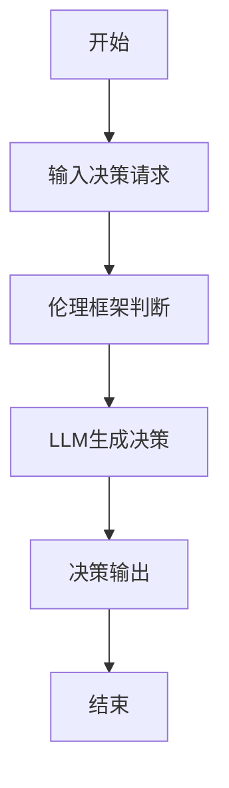
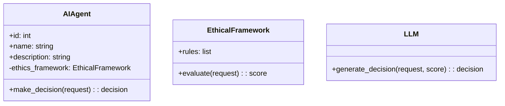
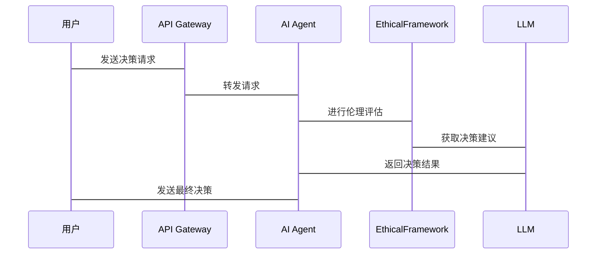

                 


# AI Agent的道德决策：在LLM中植入伦理框架

## 关键词：AI Agent, 道德决策, LLM, 伦理框架, 决策模型, 人工智能, 伦理学

## 摘要

在人工智能快速发展的今天，AI Agent（智能体）在各个领域的应用日益广泛，尤其是在大型语言模型（LLM）中，如何确保其决策过程符合伦理道德成为一个重要课题。本文将详细探讨在LLM中植入伦理框架的必要性、技术实现及实际应用，旨在为AI Agent的道德决策提供系统的解决方案。

---

## 第一部分：AI Agent的道德决策背景与核心概念

### 第1章：问题背景与问题描述

#### 1.1 问题背景

- **AI Agent的定义与特点**  
  AI Agent是一种能够感知环境并采取行动以实现目标的智能实体，具备自主性、反应性、目标导向性和社会性等特征。

- **LLM在AI Agent中的应用**  
  大型语言模型（如GPT-3、GPT-4）作为AI Agent的核心，能够处理复杂的语言任务，提供决策支持。

- **道德决策的重要性**  
  AI Agent的决策直接影响用户和社会，必须符合伦理规范，避免负面后果。

#### 1.2 问题描述

- **当前AI Agent决策中的伦理挑战**  
  包括偏见、责任归属、隐私保护等问题。

- **LLM在道德决策中的潜力与局限**  
  LLM具备强大的语言处理能力，但缺乏明确的伦理判断机制。

- **伦理框架的必要性**  
  通过植入伦理框架，规范AI Agent的决策过程。

#### 1.3 问题解决

- **伦理框架在AI Agent中的作用**  
  提供决策的伦理指导，确保符合社会规范。

- **LLM中植入伦理框架的目标**  
  实现道德驱动的决策，提升AI Agent的可信度和责任感。

- **技术路径**  
  在LLM的训练或推理阶段，引入伦理规则和约束条件。

#### 1.4 边界与外延

- **道德决策的适用范围**  
  包括医疗、法律、教育等领域，但需明确边界。

- **伦理框架的边界**  
  避免过度干预，确保AI Agent的灵活性和适应性。

- **道德决策与法律的关系**  
  道德决策应符合法律要求，同时提供法律之外的伦理指导。

#### 1.5 概念结构与核心要素

- **AI Agent的伦理决策模型**  
  包括输入处理、伦理判断、决策输出等模块。

- **伦理框架与AI Agent的关系**  
  伦理框架作为决策的指导和约束，嵌入AI Agent的决策过程中。

- **核心要素**  
  包括伦理规则库、情境分析模块、决策优化算法等。

### 第2章：核心概念与联系

#### 2.1 伦理框架的原理

- **伦理框架的定义**  
  一套用于指导和约束AI决策的规则和原则。

- **伦理框架的属性特征**  
  包括可解释性、可调整性、可扩展性等。

- **伦理框架与AI Agent的关系**  
  伦理框架为AI Agent提供决策依据，AI Agent通过反馈优化伦理框架。

#### 2.2 核心概念的联系

- **伦理框架与LLM的关系**  
  LLM作为AI Agent的核心，通过伦理框架实现道德决策。

- **AI Agent与伦理决策的关系**  
  AI Agent通过伦理框架实现决策的道德性，伦理框架通过AI Agent实现具体应用。

- **道德决策与用户需求的关系**  
  道德决策应满足用户需求，同时符合社会伦理。

#### 2.3 概念属性对比表

| 概念       | 属性特征               |
|------------|------------------------|
| 伦理框架   | 可解释性、可调整性       |
| LLM        | 强大语言处理能力         |
| AI Agent   | 自主性、目标导向性       |

#### 2.4 ER实体关系图

```mermaid
erd
  entity(AI Agent) {
    id
    name
    description
  }
  entity(LLM) {
    id
    model
    parameters
  }
  entity(伦理框架) {
    id
    rules
    principles
  }
  AI Agent --> LLM: uses
  AI Agent --> 伦理框架: incorporates
  LLM --> 伦理框架: guided by
```

---

## 第二部分：AI Agent道德决策的算法原理

### 第3章：算法原理讲解

#### 3.1 伦理决策算法的原理



#### 3.2 算法实现代码示例

```python
def ethical_decision-making(request, ethical_framework):
    # 输入处理
    processed_request = preprocess(request)
    # 伦理判断
    ethical_score = ethical_framework.evaluate(processed_request)
    # LLM决策生成
    decision = llm.generate_decision(processed_request, ethical_score)
    # 决策优化
    optimized_decision = optimize(decision, ethical_score)
    return optimized_decision

# 示例伦理框架类
class EthicalFramework:
    def __init__(self, rules):
        self.rules = rules

    def evaluate(self, request):
        # 返回伦理评分
        return sum(1 for rule in self.rules if rule.check(request))
```

#### 3.3 数学模型与公式

- **伦理评分公式**  
  $$ ethical\_score = \sum_{i=1}^{n} w_i \cdot r_i $$  
  其中，\( w_i \) 是规则 \( r_i \) 的权重。

- **决策优化函数**  
  $$ optimized\_decision = argmax_{d \in D} \sum_{i=1}^{m} w_i \cdot d_i $$  
  其中，\( D \) 是所有可能的决策，\( d_i \) 是决策 \( d \) 的特征。

---

## 第三部分：AI Agent道德决策的系统分析与架构设计

### 第4章：系统分析与架构设计

#### 4.1 系统应用场景

- 医疗诊断辅助决策
- 法律咨询
- 金融投资建议

#### 4.2 系统功能设计



#### 4.3 系统架构设计

```mermaid
graph TD
    UI --> API Gateway
    API Gateway --> AI Agent
    AI Agent --> EthicalFramework
    AI Agent --> LLM
```

#### 4.4 系统接口设计

- 输入接口：接受用户请求
- 输出接口：返回决策结果
- 伦理框架接口：提供伦理评分

#### 4.5 系统交互设计



---

## 第四部分：AI Agent道德决策的项目实战

### 第5章：项目实战

#### 5.1 环境安装

```bash
pip install transformers
pip install torch
pip install mermaid
```

#### 5.2 系统核心实现

```python
# 安装依赖
from transformers import GPT2LMHeadModel, GPT2Tokenizer
import torch

# 初始化模型
model = GPT2LMHeadModel.from_pretrained('gpt2')
tokenizer = GPT2Tokenizer.from_pretrained('gpt2')

# 伦理框架
class SimpleEthicalFramework:
    def __init__(self, rules):
        self.rules = rules

    def evaluate(self, request):
        count = 0
        for rule in self.rules:
            if rule.check(request):
                count += 1
        return count / len(self.rules)

# 决策过程
def make_decision(request, ethical_framework):
    # 输入处理
    input_ids = tokenizer.encode(request, return_tensors='pt')
    # 伦理评分
    ethical_score = ethical_framework.evaluate(request)
    # 生成决策
    output = model.generate(input_ids, max_length=50, do_sample=True)
    decision = tokenizer.decode(output[0], skip_special_tokens=True)
    return decision
```

#### 5.3 案例分析

- **医疗案例**：AI Agent在诊断中的伦理判断，确保隐私保护和患者利益。
- **法律案例**：AI Agent在法律咨询中的道德决策，确保公正性。

---

## 第五部分：最佳实践与总结

### 第6章：最佳实践、小结、注意事项与拓展阅读

#### 6.1 最佳实践

- 定期更新伦理框架，适应社会变化。
- 提供透明的决策过程，增强用户信任。
- 在不同领域中定制伦理框架，确保适用性。

#### 6.2 小结

本文详细探讨了在LLM中植入伦理框架的必要性、技术实现和实际应用。通过系统设计和项目实战，展示了如何在AI Agent中实现道德决策。

#### 6.3 注意事项

- 伦理框架的设计需考虑文化差异。
- 避免过度依赖伦理框架，保持AI Agent的灵活性。
- 定期评估和优化伦理框架。

#### 6.4 拓展阅读

- 推荐书籍：《道德机器》、《AI的伦理与社会影响》
- 推荐论文：探讨AI伦理的最新研究

---

## 作者：AI天才研究院/AI Genius Institute & 禅与计算机程序设计艺术 /Zen And The Art of Computer Programming

