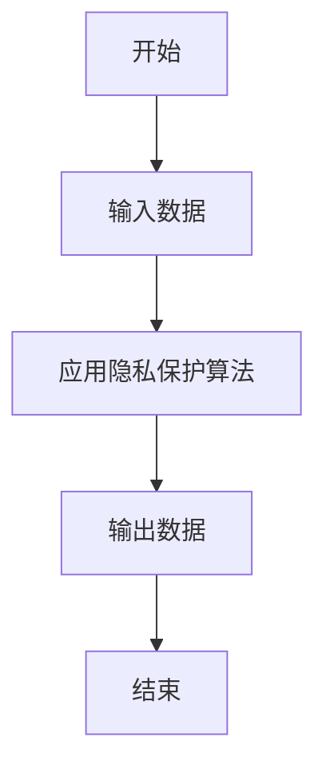
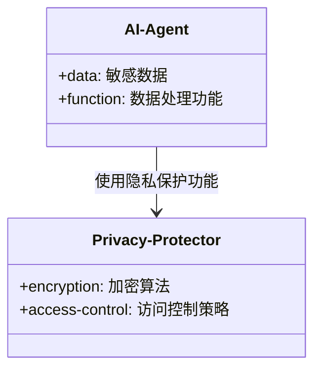
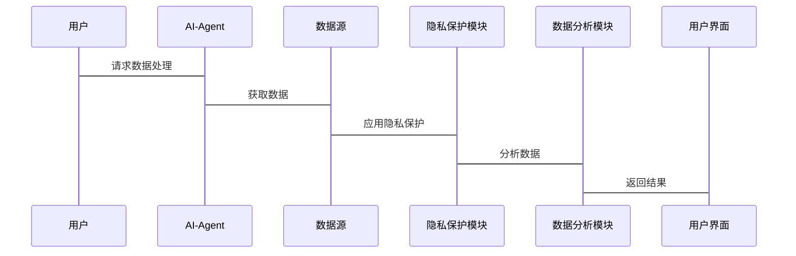

                 

<think>
嗯，我现在要帮用户写一篇关于AI Agent隐私保护机制的技术博客。标题是《AI Agent的隐私保护机制：在智能与安全间寻找平衡》。用户希望我按照之前的目录结构来写，而且有很多具体要求，比如每个章节要详细，用技术语言，还有关键词和摘要。

首先，我需要理解用户的需求。用户可能是一位技术专家，也可能是CTO或软件架构师，他们需要一篇结构清晰、内容深入的专业博客。关键词包括AI Agent、隐私保护、数据安全、算法机制、智能平衡，大概5-7个。摘要部分要简明扼要，说明文章的核心内容。

接下来，我需要按照目录大纲来组织内容。第一部分是背景介绍，包括AI Agent的基本概念和隐私保护的重要性。这部分需要解释什么是AI Agent，它们的应用场景，以及为什么隐私保护如此关键。

然后是核心概念，这里需要详细解释AI Agent和隐私保护的基本原理，可能用表格和ER图来对比分析，帮助读者理解。

算法原理部分，我需要用数学公式和流程图来展示隐私保护机制，比如联邦学习或同态加密，还要用Python代码实现核心算法，确保读者能够理解这些技术细节。

系统分析与架构设计部分，我需要介绍实际的应用场景，设计系统功能模型，并用Mermaid图展示系统架构和接口设计。

项目实战部分，提供具体的案例，比如医疗数据共享中的隐私保护，包括环境安装、核心代码实现、案例分析等，让读者能够实际操作。

最后是总结与展望，回顾主要内容，讨论当前的挑战和未来的研究方向，给出一些最佳实践的建议。

在写作过程中，我需要确保每个部分都详细且逻辑清晰，使用专业的技术语言，同时保持可读性。可能需要多次修改，确保每个章节都涵盖必要的内容，同时不过于冗长。

现在，我需要开始逐步撰写每个部分，确保符合用户的所有要求，包括关键词、摘要、目录结构，以及每个章节的具体内容。可能还需要检查格式，确保使用正确的Markdown语法，并在适当的地方插入公式和图表。

总之，我需要系统地按照用户的要求，一步一步地构建这篇技术博客，确保内容全面、结构合理，满足专业读者的需求。
</think>

# AI Agent的隐私保护机制：在智能与安全间寻找平衡

> 关键词：AI Agent，隐私保护，数据安全，算法机制，智能平衡

> 摘要：AI Agent作为人工智能领域的核心组件，其隐私保护机制在智能与安全之间寻求平衡至关重要。本文详细探讨AI Agent的隐私保护机制，从核心概念、算法原理到系统设计与实战，层层剖析，为读者提供全面的技术解析。

---

## 第一部分: AI Agent的隐私保护机制概述

## 第1章: AI Agent与隐私保护的背景介绍

### 1.1 AI Agent的基本概念

#### 1.1.1 AI Agent的定义与分类
AI Agent（人工智能代理）是指能够感知环境、自主决策并执行任务的智能实体。根据功能和智能水平，AI Agent可分为简单反射型、基于模型的反应型、目标驱动型和效用驱动型。

#### 1.1.2 AI Agent的核心功能与应用场景
AI Agent的核心功能包括感知、推理、规划和执行。应用场景涵盖智能助手、自动驾驶、推荐系统和智能安防等。

#### 1.1.3 AI Agent与隐私保护的关系
AI Agent在处理数据时，涉及大量用户隐私信息。如何在提升智能性的同时保护隐私，是技术的核心挑战。

### 1.2 隐私保护的重要性

#### 1.2.1 隐私保护的基本概念
隐私保护是指保护个人或组织的信息不被未经授权的访问或泄露。在数字化时代，隐私保护尤为重要。

#### 1.2.2 数字化时代隐私保护的挑战
随着AI Agent的应用普及，数据泄露风险增加，如何在数据利用与隐私保护之间找到平衡成为难题。

#### 1.2.3 AI Agent对隐私保护的特殊要求
AI Agent需要在数据处理过程中保护隐私，确保数据的安全性和用户的隐私权。

---

## 第2章: AI Agent隐私保护的核心概念

### 2.1 AI Agent隐私保护的基本原理

#### 2.1.1 隐私保护的数学模型
隐私保护的数学模型通常涉及概率论和统计学，用于衡量隐私泄露风险。

#### 2.1.2 隐私保护的核心要素
包括数据匿名化、加密技术、访问控制和隐私计算等。

#### 2.1.3 隐私保护与AI Agent智能性的平衡
在提升AI Agent智能性的同时，必须确保隐私保护措施的有效性。

### 2.2 核心概念的属性对比

#### 2.2.1 AI Agent的功能属性与隐私保护的关系
通过表格对比AI Agent的功能属性与隐私保护属性的关系，如数据处理能力与隐私泄露风险。

#### 2.2.2 隐私保护的属性特征对比表格
| 属性       | 隐私保护属性 | AI Agent属性   |
|------------|--------------|----------------|
| 数据类型    | 敏感数据     | 用户行为数据   |
| 处理方式    | 加密处理     | 智能分析       |
| 保护级别    | 高           | 中/高         |

#### 2.2.3 ER实体关系图架构
通过ER图展示AI Agent与隐私保护的关系，例如用户数据表与隐私保护策略表之间的关联。

---

## 第3章: AI Agent隐私保护的算法原理

### 3.1 隐私保护算法的基本原理

#### 3.1.1 隐私保护算法的分类
包括数据加密算法、数据脱敏算法、隐私计算算法等。

#### 3.1.2 隐私保护算法的核心思想
以隐私计算为例，通过局部差分隐私（LDP）机制保护数据隐私。

#### 3.1.3 隐私保护算法的优缺点对比
对比不同算法在隐私保护和性能上的优缺点。

### 3.2 隐私保护算法的数学模型

#### 3.2.1 隐私保护的数学模型与公式
例如，局部差分隐私的公式：
$$ P(\text{输出} y | x) = \text{exp}(-\lambda |y - x|) $$

#### 3.2.2 算法流程图（使用Mermaid）


#### 3.2.3 算法实现的Python源代码
```python
import numpy as np

def laplace_dp(sensitive_data, epsilon):
    beta = 1.0 / epsilon
    noise = np.random.laplace(0, 1.0 / epsilon, len(sensitive_data))
    protected_data = sensitive_data + noise
    return protected_data

# 示例
sensitive_data = [1, 2, 3]
epsilon = 0.1
protected_data = laplace_dp(sensitive_data, epsilon)
print("Protected Data:", protected_data)
```

---

## 第4章: AI Agent隐私保护的系统分析与架构设计

### 4.1 问题场景介绍

#### 4.1.1 AI Agent隐私保护的典型场景
以医疗数据共享为例，AI Agent需要保护患者的隐私数据，同时支持医疗数据分析。

#### 4.1.2 隐私保护在AI Agent中的关键问题
包括数据存储安全、数据传输安全和数据处理安全。

#### 4.1.3 系统需求分析
系统需要支持数据加密、访问控制和隐私计算功能。

### 4.2 系统功能设计

#### 4.2.1 领域模型（使用Mermaid类图）


#### 4.2.2 系统架构设计（使用Mermaid架构图）


#### 4.2.3 系统接口设计
包括数据接口、API接口和用户接口，确保数据安全传输和访问控制。

#### 4.2.4 系统交互（使用Mermaid序列图）


---

## 第5章: 项目实战

### 5.1 环境安装与配置

#### 5.1.1 环境需求
需要安装Python、NumPy和必要的机器学习库。

#### 5.1.2 安装步骤
```bash
pip install numpy
pip install scikit-learn
pip install mermaid
```

### 5.2 核心代码实现

#### 5.2.1 数据加密与脱敏代码
```python
import numpy as np

def encrypt_data(data, key):
    encrypted = []
    for d in data:
        encrypted.append(d ^ key)
    return encrypted

def decrypt_data(encrypted_data, key):
    decrypted = []
    for ed in encrypted_data:
        decrypted.append(ed ^ key)
    return decrypted

# 示例
sensitive_data = [10, 20, 30]
key = 123
encrypted = encrypt_data(sensitive_data, key)
decrypted = decrypt_data(encrypted, key)
print("原始数据:", sensitive_data)
print("加密数据:", encrypted)
print("解密数据:", decrypted)
```

#### 5.2.2 隐私保护算法实现
```python
def differential_privacy(data, epsilon):
    noise = np.random.laplace(0, 1.0 / epsilon, len(data))
    protected_data = data + noise
    return protected_data

# 示例
data = [5, 15, 25]
epsilon = 0.5
protected = differential_privacy(data, epsilon)
print("保护数据:", protected)
```

### 5.3 代码解读与分析

#### 5.3.1 数据加密与脱敏
通过异或操作实现简单的数据加密，确保数据在传输过程中的安全性。

#### 5.3.2 隐私保护算法
使用局部差分隐私机制，在数据处理中添加噪声，保护用户隐私。

### 5.4 实际案例分析

#### 5.4.1 医疗数据共享
在医疗数据共享中，AI Agent需要保护患者隐私，同时支持数据的分析和研究。

#### 5.4.2 案例分析
通过具体案例展示如何在实际项目中应用隐私保护机制，确保数据安全和智能性。

### 5.5 项目小结

#### 5.5.1 成功经验总结
总结项目中使用的隐私保护技术和方法，确保在提升智能性的同时保护隐私。

#### 5.5.2 经验教训
反思项目中遇到的问题，提出改进建议。

---

## 第6章: 总结与展望

### 6.1 总结

#### 6.1.1 核心内容回顾
回顾本文的核心内容，强调AI Agent隐私保护机制的重要性。

#### 6.1.2 当前技术的优缺点
总结当前隐私保护技术的优缺点，为未来研究提供方向。

### 6.2 未来展望

#### 6.2.1 技术发展趋势
展望AI Agent隐私保护技术的未来发展趋势，如隐私增强AI（PEAI）和联邦学习。

#### 6.2.2 研究方向
提出未来的研究方向，如隐私保护与AI Agent智能性的深度融合。

### 6.3 最佳实践 tips

#### 6.3.1 开发建议
为开发者提供一些建议，如选择合适的隐私保护算法和工具。

#### 6.3.2 使用注意事项
提醒用户在使用AI Agent时注意隐私保护，选择可靠的服务提供商。

---

## 作者：AI天才研究院 & 禅与计算机程序设计艺术

---

这篇文章系统地探讨了AI Agent的隐私保护机制，从核心概念到算法实现，再到系统设计与实战，为读者提供了全面的技术解析。通过详细的案例分析和代码实现，帮助读者更好地理解和应用这些技术。希望本文能为AI Agent的隐私保护研究和实践提供有价值的参考。

