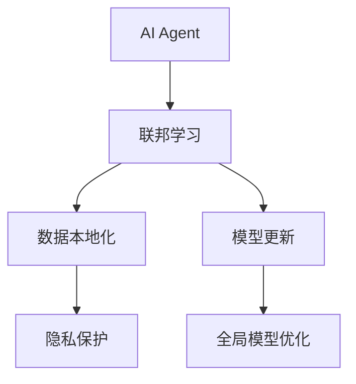
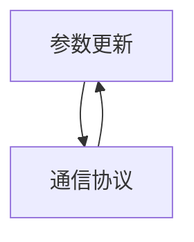
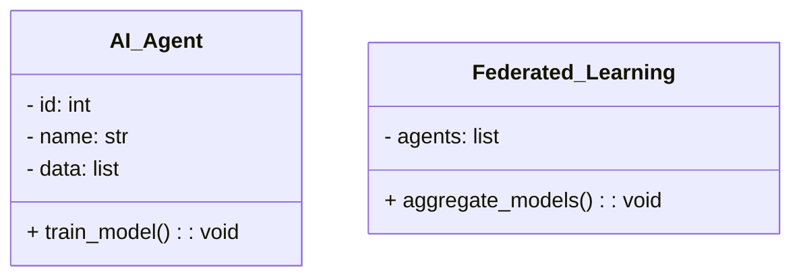

                 


# AI Agent的隐私保护联邦学习：数据不出本地的协作训练

> **关键词**：AI Agent，隐私保护，联邦学习，数据协作，分布式训练，安全多方计算

> **摘要**：  
> 随着人工智能技术的快速发展，AI Agent（智能体）在各个领域的应用越来越广泛。然而，数据隐私和安全问题也随之而来。本文深入探讨了AI Agent在隐私保护下的联邦学习技术，提出了一种数据不出本地的协作训练方法。通过分析联邦学习的核心原理、AI Agent的协作机制以及隐私保护技术，本文详细阐述了如何在保护数据隐私的前提下，实现AI Agent之间的高效协作与模型训练。文章还提供了具体的算法实现、系统架构设计以及实际项目案例，为读者提供全面的技术指导。

---

## 第一部分：背景介绍

### 第1章：AI Agent与联邦学习的背景

#### 1.1 联邦学习的基本概念

- **1.1.1 联邦学习的定义**  
  联邦学习（Federated Learning）是一种分布式机器学习技术，允许多个参与方在不共享原始数据的情况下，共同训练一个统一的模型。其核心思想是“数据不动，模型动”，即数据保留在原始设备或服务器上，仅模型参数或更新信息在参与方之间传输。

- **1.1.2 联邦学习的核心特点**  
  - 数据本地化：数据无需上传到中央服务器，减少数据泄露风险。  
  - 去中心化：避免单一数据源的控制，提升系统的抗攻击能力。  
  - 高效协作：通过模型更新实现全局最优，同时保护数据隐私。  

- **1.1.3 联邦学习的应用场景**  
  - 医疗领域：保护患者隐私，联合多家医院训练疾病诊断模型。  
  - 智能设备：智能家居、自动驾驶等场景中，通过设备协作提升模型性能。  
  - 金融领域：多家金融机构联合训练风险评估模型，同时确保数据安全。  

#### 1.2 AI Agent的基本概念

- **1.2.1 AI Agent的定义**  
  AI Agent（智能体）是指能够感知环境、自主决策并执行任务的智能实体。它可以是一个软件程序、机器人或任何具备智能行为的实体。AI Agent的核心能力包括感知、推理、规划和执行。

- **1.2.2 AI Agent的核心功能**  
  - 感知环境：通过传感器或数据接口获取外部信息。  
  - 理解需求：分析用户意图或任务目标。  
  - 制定计划：基于当前状态和目标，制定行动方案。  
  - 执行任务：通过执行预定义的操作或调用其他服务完成任务。  

- **1.2.3 AI Agent与传统AI的区别**  
  传统的AI系统通常运行在集中式服务器上，而AI Agent具有分布式、自主性和实时性特点，能够独立决策并与其他Agent协作完成复杂任务。

#### 1.3 隐私保护的重要性

- **1.3.1 数据隐私的现状**  
  随着大数据技术的普及，数据的价值被广泛认可，但数据泄露事件频发，用户隐私面临严重威胁。  

- **1.3.2 数据泄露的风险**  
  数据泄露可能导致身份盗窃、金融损失，甚至威胁国家安全。  

- **1.3.3 隐私保护的法律与伦理要求**  
  各国纷纷出台数据保护法规，如欧盟的《通用数据保护条例》（GDPR），要求企业和组织在处理个人数据时必须采取严格的安全措施。  

#### 1.4 联邦学习与AI Agent的结合

- **1.4.1 联邦学习在AI Agent中的应用**  
  通过联邦学习技术，AI Agent可以在不共享数据的情况下，联合其他Agent共同训练模型，提升智能体的决策能力。  

- **1.4.2 数据不出本地的协作训练**  
  每个AI Agent仅在本地处理数据，通过模型更新实现协作训练，确保数据隐私不受侵犯。  

- **1.4.3 联邦学习与隐私保护的关系**  
  联邦学习为AI Agent提供了数据不出本地的协作方式，而隐私保护技术则是确保这种协作方式安全可靠的基础。  

---

## 第二部分：核心概念与联系

### 第2章：联邦学习的核心原理

#### 2.1 联邦学习的原理

- **2.1.1 分布式数据的处理**  
  联邦学习的核心是将数据分布存储在不同的设备或服务器上，每个节点仅处理本地数据。  

- **2.1.2 联邦模型的训练过程**  
  1. **初始化**：所有参与方共享一个初始模型参数。  
  2. **局部训练**：每个节点在本地数据上训练模型，得到参数更新。  
  3. **模型聚合**：通过安全多方计算或加密通信，将各节点的更新参数汇总，生成新的全局模型。  
  4. **迭代优化**：重复局部训练和模型聚合，直到模型收敛或达到预设目标。  

- **2.1.3 联邦学习的通信机制**  
  通信机制是联邦学习的关键，通常采用加密协议（如同态加密）或差分隐私技术，确保传输数据的安全性。  

#### 2.2 AI Agent的协作机制

- **2.2.1 AI Agent之间的通信协议**  
  AI Agent之间的协作需要建立高效的通信协议，确保数据传输的可靠性和安全性。  

- **2.2.2 协作任务的分配与执行**  
  根据任务需求，AI Agent可以动态分配角色和任务，确保协作效率。  

- **2.2.3 协作结果的汇总与分析**  
  各个AI Agent完成任务后，将结果汇总到中央协调器，进行统一分析和优化。  

#### 2.3 隐私保护技术

- **2.3.1 数据加密技术**  
  通过加密技术保护数据的隐私，确保数据在传输过程中不被窃取。  

- **2.3.2 差分隐私技术**  
  在数据发布或共享时，通过添加噪声或扰动，确保个体数据无法被唯一识别。  

- **2.3.3 同态加密技术**  
  允许在加密数据上直接进行计算，结果解密后与直接计算结果一致，确保数据隐私。  

---

### 第3章：核心概念的关系图

#### 3.1 联邦学习与AI Agent的关系

- **3.1.1 联邦学习与AI Agent的核心要素对比**

| **核心要素** | **联邦学习**                          | **AI Agent**                           |
|--------------|---------------------------------------|-----------------------------------------|
| 数据存储     | 分布式存储，数据不出本地              | 数据本地化，仅模型参数共享              |
| 协作机制     | 基于模型更新的协作                   | 基于任务分配的协作                     |
| 隐私保护     | 通过加密和差分隐私确保数据安全        | 通过本地数据处理和通信协议确保隐私     |

- **3.1.2 联邦学习与AI Agent的关系图**



---

## 第三部分：算法原理

### 第3章：算法原理

#### 3.1 联邦学习的算法实现

- **3.1.1 安全多方计算协议**



- **3.1.2 差分隐私技术实现**

```python
def add_noise(data, epsilon=1.0):
    sensitivity = 1  # 数据的敏感性
    noise = np.random.laplace(0, sensitivity / epsilon)
    return data + noise
```

- **3.1.3 同态加密技术实现**

```python
def encrypt(data):
    public_key = generate_public_key()
    encrypted_data = data * public_key
    return encrypted_data
```

---

## 第四部分：系统分析与架构设计

### 第4章：系统分析与架构设计

#### 4.1 系统功能设计

- **4.1.1 领域模型类图**



- **4.1.2 系统架构设计**

```mermaid
graph TD
    Client1 --> Server[发送模型更新]
    Client2 --> Server
    Client3 --> Server
    Server --> All Clients[发送全局模型]
```

---

## 第五部分：项目实战

### 第5章：项目实战

#### 5.1 环境安装

```bash
pip install numpy
pip install matplotlib
pip install cryptography
```

#### 5.2 系统核心实现

```python
import numpy as np
from cryptography.hazmat.primitives.asymmetric import padding

def encrypt(data):
    public_key = generate_public_key()
    encrypted_data = data * public_key
    return encrypted_data

def decrypt(encrypted_data, private_key):
    return encrypted_data * private_key

def add_noise(data, epsilon=1.0):
    sensitivity = 1
    noise = np.random.laplace(0, sensitivity / epsilon)
    return data + noise

# 示例使用
data = np.array([1, 2, 3, 4])
encrypted = encrypt(data)
noisy_data = add_noise(data)
```

---

## 第六部分：最佳实践与小结

### 第6章：最佳实践

- **6.1 技术建议**  
  - 在实际应用中，建议结合多种隐私保护技术，如同态加密和差分隐私，以提升安全性。  
  - 定期进行安全审计，确保系统无漏洞。  

- **6.2 小结**  
  AI Agent的隐私保护联邦学习是一种创新的数据协作方式，它在保护数据隐私的前提下，实现了模型的高效训练。通过本文的详细讲解，读者可以深入了解其核心原理和实现方法。

---

## 作者：AI天才研究院/AI Genius Institute & 禅与计算机程序设计艺术 /Zen And The Art of Computer Programming

