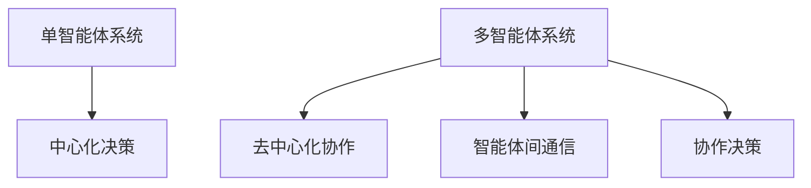
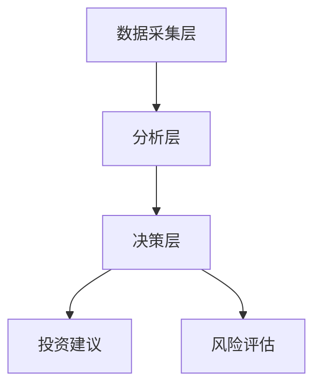
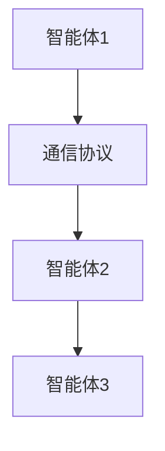
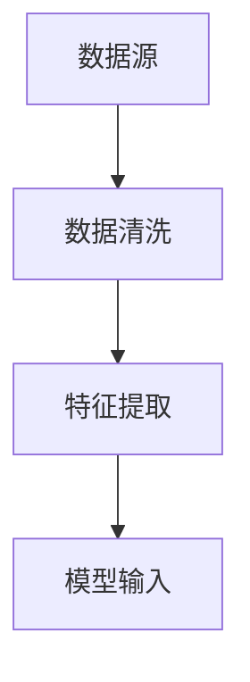

                 

# AI Multi Agent System 在价值投资学中的应用

> 关键词：AI多智能体系统，价值投资，投资决策，分布式计算，多智能体协作，强化学习

> 摘要：本文探讨了AI多智能体系统在价值投资学中的应用，分析了多智能体系统的概念、算法、数学模型，并结合实际案例，展示了如何利用AI多智能体系统提升投资决策的效率和准确性。

---

# 第一部分: AI多智能体系统与价值投资学的结合

## 第1章: AI多智能体系统概述

### 1.1 AI多智能体系统的核心概念

#### 1.1.1 多智能体系统的基本定义
多智能体系统（Multi Agent System，MAS）由多个智能体组成，这些智能体能够通过协作完成复杂的任务。与单智能体系统相比，MAS在处理分布式问题时更具优势。

#### 1.1.2 AI多智能体系统的特征
AI多智能体系统具有智能性、自主性、协作性和分布式计算的特点。每个智能体能够独立决策，同时通过通信协作完成整体目标。

#### 1.1.3 多智能体系统与单智能体系统的区别
单智能体系统依赖中心化决策，而多智能体系统通过去中心化的方式，实现智能体间的协作与信息共享。

#### 图1-1：多智能体系统与单智能体系统的对比

### 1.2 多智能体系统在金融领域的应用前景

#### 1.2.1 金融领域的复杂性与多智能体系统的匹配性
金融市场涉及大量参与者和复杂信息，多智能体系统能够通过分布计算和协作，提高决策的效率和准确性。

#### 1.2.2 多智能体系统在金融中的潜在应用场景
- 股票交易策略优化
- 风险评估与管理
- 市场情绪分析

#### 1.2.3 价值投资学中的多智能体系统优势
多智能体系统能够同时分析多个公司的基本面数据，识别潜在投资机会，优化投资组合。

---

## 第2章: 价值投资学的基本原理

### 2.1 价值投资的核心理念

#### 2.1.1 价值投资的定义
价值投资是通过分析公司基本面，寻找市场低估的投资标的。

#### 2.1.2 价值投资的基本原则
- 长期投资
- 风险控制
- 价值发现

#### 2.1.3 价值投资的关键要素
- 财务指标分析
- 行业分析
- 市场趋势分析

### 2.2 价值投资中的关键分析方法

#### 2.2.1 公司基本面分析
分析公司的财务报表，评估其盈利能力和成长性。

#### 2.2.2 财务指标分析
- 市盈率（P/E）
- 市净率（P/B）
- 股息率

#### 2.2.3 行业分析与市场趋势分析
研究行业前景和市场趋势，判断投资标的的成长空间。

### 2.3 价值投资中的决策过程

#### 2.3.1 投资决策的复杂性
涉及多方面的信息和复杂决策，传统方法存在局限性。

#### 2.3.2 传统投资决策的局限性
- 信息处理能力有限
- 决策效率不高
- 风险控制不足

#### 2.3.3 AI技术在投资决策中的潜力
AI多智能体系统能够处理海量数据，提供更精准的投资建议。

---

## 第3章: AI多智能体系统在价值投资中的应用框架

### 3.1 多智能体系统在价值投资中的角色

#### 3.1.1 智能体的分工与协作
- 数据采集智能体
- 分析智能体
- 决策智能体

#### 3.1.2 智能体之间的信息交互
通过通信机制共享数据，实现协作决策。

#### 3.1.3 智能体的决策机制
基于强化学习和博弈论，优化投资策略。

### 3.2 价值投资中的多智能体系统架构

#### 3.2.1 系统整体架构设计
- 数据采集层
- 分析层
- 决策层

#### 3.2.2 各智能体的功能模块
- 数据处理模块
- 分析模块
- 决策模块

#### 3.2.3 系统的输入输出流程
输入：市场数据、财务数据；输出：投资建议、风险评估。

### 图3-1：多智能体系统架构设计

---

## 第4章: 多智能体系统的核心算法与数学模型

### 4.1 多智能体系统的协作算法

#### 4.1.1 基于强化学习的协作算法
使用强化学习训练智能体，优化投资策略。

#### 4.1.2 基于博弈论的协作机制
通过博弈论模型，模拟智能体间的协作与竞争。

#### 4.1.3 分布式计算与并行处理
利用分布式计算，提高系统的处理能力。

### 4.2 多智能体系统的通信机制

#### 4.2.1 智能体之间的通信协议
定义智能体间的信息传递规则。

#### 4.2.2 信息传递的数学模型
使用图论模型描述智能体间的信息流。

#### 4.2.3 通信效率的优化方法
通过优化算法，提高通信效率。

### 图4-1：智能体间通信协议

---

## 第5章: 价值投资中的多智能体系统实现

### 5.1 系统环境与工具安装

#### 5.1.1 开发环境的选择
推荐使用Python和相关库（如TensorFlow、Keras）进行开发。

#### 5.1.2 Python与相关库的安装
安装Python、TensorFlow、Keras等工具。

#### 5.1.3 数据源的获取与处理
获取股票数据，进行清洗和预处理。

### 5.2 系统核心功能实现

#### 5.2.1 数据采集与预处理
编写代码采集市场数据，并进行清洗。

#### 5.2.2 多智能体协作算法的实现
实现强化学习算法，训练智能体进行投资决策。

#### 5.2.3 投资决策模型的构建
基于历史数据，构建投资决策模型。

### 图5-1：数据处理流程

---

## 第6章: 实战分析与总结

### 6.1 项目实战

#### 6.1.1 环境安装
安装必要的开发工具和库。

#### 6.1.2 核心代码实现
编写AI多智能体系统的代码，实现投资决策功能。

#### 6.1.3 实际案例分析
通过实际案例，展示系统的应用效果。

### 6.2 总结与展望

#### 6.2.1 本章小结
总结AI多智能体系统在价值投资中的应用优势。

#### 6.2.2 展望
展望未来的发展方向和潜在应用。

---

## 第7章: 最佳实践与注意事项

### 7.1 最佳实践 tips

#### 7.1.1 系统设计建议
建议在设计系统时注重模块化和可扩展性。

#### 7.1.2 代码实现注意事项
注意数据安全和代码优化。

#### 7.1.3 系统维护建议
定期更新模型和数据，保持系统性能。

### 7.2 小结

### 7.3 注意事项

### 7.4 拓展阅读

---

# 作者：AI天才研究院/AI Genius Institute & 禅与计算机程序设计艺术 /Zen And The Art of Computer Programming

