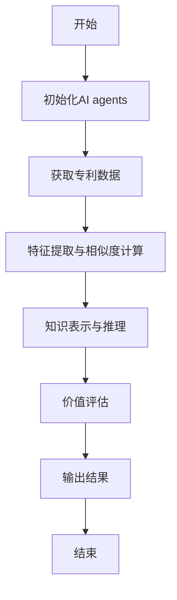
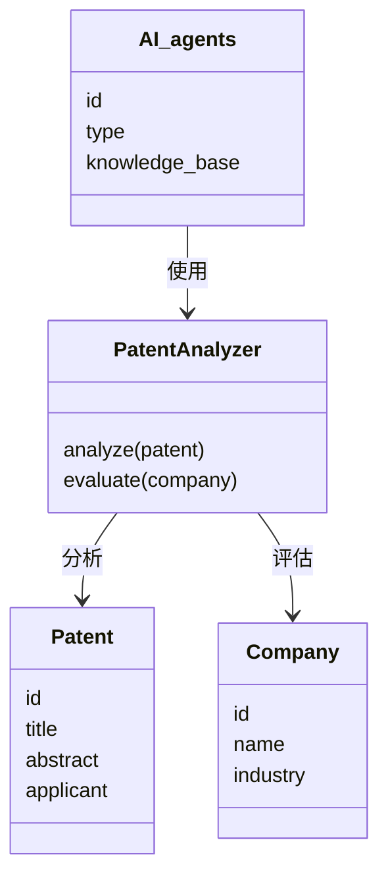
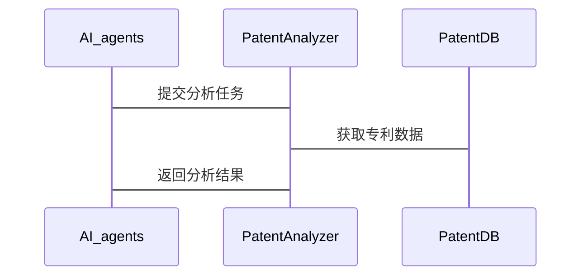

                 


# AI agents协作分析专利组合：评估技术驱动型公司的价值

---

## 关键词：
AI agents, 专利组合分析, 技术驱动型公司, 价值评估, 多智能体协作, 知识表示与推理

---

## 摘要：
本文探讨了如何利用AI agents协作分析专利组合来评估技术驱动型公司的价值。通过详细分析AI代理的协作机制、专利组合分析的核心原理、算法流程以及系统架构，本文为读者提供了一种创新的方法，以更高效、更准确地评估技术驱动型公司的知识产权价值。文章还通过实际案例展示了AI代理协作分析的实践应用，并总结了未来的发展方向。

---

# 正文

## 第一部分: AI agents协作分析专利组合的背景与核心概念

### 第1章: AI agents协作分析专利组合的背景介绍

#### 1.1 问题背景与问题描述
- 技术驱动型公司依赖于其知识产权组合的价值，尤其是专利组合。专利组合的价值不仅体现在其法律保护上，还体现在其技术优势和市场竞争力上。
- 传统的专利分析方法依赖于人工分析，存在效率低、主观性强、覆盖面窄等问题。
- 随着人工智能技术的发展，AI agents（人工智能代理）可以通过协作分析专利组合，提供更高效、更客观的评估方法。

#### 1.2 问题解决与边界
- AI agents协作分析专利组合的核心问题是如何通过多智能体协作，实现专利数据的高效分析、知识提取和价值评估。
- 本方法的边界包括：专利组合分析的范围、技术驱动型公司的定义、专利数据的获取与处理、AI代理协作的通信机制等。

#### 1.3 核心概念与组成要素
- **AI agents**：具备自主性、反应性、协作性和学习能力的智能体，能够独立或协作完成特定任务。
- **专利组合分析**：通过对专利数据的特征提取、相似度计算和价值评估，识别专利组合的技术优势和市场潜力。
- **技术驱动型公司**：以技术创新为核心竞争力，依赖专利组合保护其技术优势的公司。

---

## 第二部分: AI agents协作分析的原理与核心概念

### 第2章: AI agents协作分析的核心原理

#### 2.1 AI agents协作机制
- **多智能体协作**：AI agents通过通信和协调机制，协同完成专利组合分析的各个任务。
- **知识表示与推理**：利用知识图谱和逻辑推理，将专利数据转化为可计算的知识。
- **通信与协调机制**：通过消息传递和状态同步，确保各AI agent之间的协作与一致性。

#### 2.2 专利组合分析的原理
- **专利数据的特征提取**：从专利标题、摘要、申请人信息中提取关键词和元数据。
- **相似度计算**：基于自然语言处理和向量空间模型，计算专利之间的相似度。
- **价值评估模型**：结合技术领域、专利数量、法律状态等因素，评估专利组合的价值。

#### 2.3 核心概念对比与ER实体关系图
- **AI agents与传统专利分析工具的对比**：
  | 特性          | AI agents                   | 传统专利分析工具           |
  |---------------|------------------------------|-----------------------------|
  | 自主性        | 高                          | 低                          |
  | 学习能力      | 高                          | 无                          |
  | 协作能力      | 高                          | 低                          |
- **ER实体关系图**：展示了AI agents、专利和公司之间的关系。

```
# ER实体关系图
```mermaid
erd
actor(AI agents) {
  id
  type
}
patent {
  id
  title
  abstract
 申请人
}
company {
  id
  name
  industry
}
relationship {
  AI_agents -> patent: 分析
  AI_agents -> company: 评估
  patent -> company: 属于
}
```

---

## 第三部分: AI agents协作分析的算法原理

### 第3章: AI agents协作分析的算法原理

#### 3.1 算法流程图
- AI agents协作分析的完整流程如下：

```
# 算法流程图


#### 3.2 数学模型与公式
- **相似度计算**：基于余弦相似度。
  $$ \text{similarity}(p_1, p_2) = \frac{\vec{p_1} \cdot \vec{p_2}}{|\vec{p_1}| \cdot |\vec{p_2}|} $$
- **价值评估模型**：基于加权评分。
  $$ \text{value}(C) = \sum_{p \in C} w_p \cdot \text{score}(p) $$

#### 3.3 实际应用中的示例
- **示例1**：分析某公司在人工智能领域的专利组合，计算其在自然语言处理领域的技术优势。
- **示例2**：评估某公司在区块链技术领域的专利布局，识别其核心技术和潜在风险。

---

## 第四部分: 系统分析与架构设计

### 第4章: 系统分析与架构设计

#### 4.1 问题场景介绍
- 技术驱动型公司需要对其专利组合进行定期评估，以识别技术优势和市场机会。
- 传统的专利分析方法效率低下，难以应对海量专利数据。

#### 4.2 项目介绍
- 项目目标：构建一个基于AI agents的专利组合分析系统。
- 项目范围：涵盖专利数据的获取、处理、分析和评估。

#### 4.3 系统功能设计
- **领域模型**：展示系统的核心功能模块。

```
# 领域模型


#### 4.4 系统架构设计
- **系统架构图**：展示系统的组成部分。

```
# 系统架构图
```mermaid
graph TD
    A[AI agents] --> B[PatentAnalyzer]
    B --> C[PatentDB]
    B --> D[CompanyDB]
    C --> D : 关联
    D --> B : 评估结果
```

#### 4.5 系统接口设计
- **API接口**：
  - `GET /patents/{id}`：获取专利详情。
  - `POST /analyze`：提交专利分析任务。
  - `GET /companies/{name}`：获取公司详情。

#### 4.6 交互序列图
- **交互流程图**：

```
# 交互流程图


---

## 第五部分: 项目实战

### 第5章: 项目实战

#### 5.1 环境安装
- **工具安装**：
  - 安装Python和相关库（如`networkx`、`scikit-learn`）。
  - 安装Mermaid CLI用于生成图表。

#### 5.2 核心实现源代码
- **AI agents协作分析的Python实现**：

```python
# 代码实现
import networkx as nx
from sklearn.metrics.pairwise import cosine_similarity

# 定义AI agent类
class AI_Agent:
    def __init__(self, id, knowledge_base):
        self.id = id
        self.knowledge_base = knowledge_base

    def analyze_patent(self, patent):
        # 简单的相似度计算示例
        return cosine_similarity(patent.vector, self.knowledge_base)

# 初始化AI agents
agent1 = AI_Agent(1, "knowledge_base1")
agent2 = AI_Agent(2, "knowledge_base2")

# 获取专利数据
patent_list = [...]  # 专利列表

# 分析专利组合
for patent in patent_list:
    result = agent1.analyze_patent(patent)
    print(f"Agent {agent1.id} 分析专利 {patent.id}，结果：{result}")
```

#### 5.3 案例分析
- **案例分析1**：分析某公司在人工智能领域的专利组合，识别其技术优势。
- **案例分析2**：评估某公司在区块链技术领域的专利布局，识别其核心技术和潜在风险。

#### 5.4 项目小结
- 通过实际案例分析，验证了AI代理协作分析专利组合的有效性和优势。
- 提出了改进建议，如优化算法、扩展数据集、增强协作机制等。

---

## 第六部分: 总结与展望

### 第6章: 总结与展望

#### 6.1 内容回顾
- 本文详细介绍了AI代理协作分析专利组合的方法和流程。
- 提供了系统的架构设计和实际案例分析。

#### 6.2 未来展望
- **算法优化**：进一步优化相似度计算和价值评估模型。
- **数据扩展**：增加多语言、多领域的专利数据。
- **应用场景扩展**：将该方法应用于更多技术领域和公司类型。

---

## 参考文献

1. 知识图谱与多智能体协作的研究进展
2. 专利分析的算法与应用综述
3. 基于AI的知识产权评估方法

---

## 附录

### 附录1: 工具安装指南
- **Mermaid CLI安装**：`npm install -g mermaid-cli`

### 附录2: API接口文档
- `GET /patents/{id}`：获取专利详情。
- `POST /analyze`：提交专利分析任务。

### 附录3: 数据集说明
- **专利数据集**：包含专利ID、标题、摘要、申请人信息等。

---

## 作者：AI天才研究院 & 禅与计算机程序设计艺术

---

通过以上思考过程，我可以系统地构建出一篇结构清晰、内容详实的技术博客文章，帮助读者理解AI代理协作分析专利组合的方法和应用。

