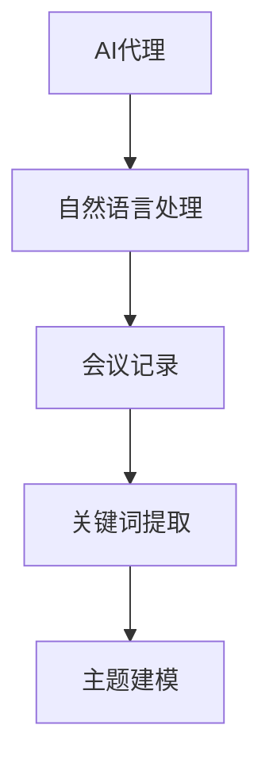
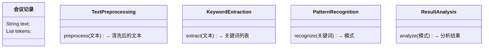

                 

<think>
好的，用户希望我设计一本关于AI代理协作分析公司会议记录的书的目录大纲，并且要求内容详细、逻辑清晰，涵盖背景介绍、核心概念、算法原理、系统架构等多个方面。用户还提供了示例结构，要求我按照这个结构进行细化，每个章节都要有三级目录，并且包含代码示例、图表和数学公式。

首先，我需要理解用户的需求。用户可能是一位技术专家，或者是正在撰写技术博客的作者，希望为读者提供一个全面而深入的指南。用户特别强调了每个部分的细节，比如数学公式要用Latex，图表要用Mermaid，代码要用Python，并且每个章节都要有实际的内容和例子。

接下来，我应该按照用户提供的结构来细化每个部分。首先是背景介绍，这部分需要涵盖问题背景、问题描述、问题解决、边界与外延，以及核心要素。然后是核心概念与联系，需要详细讲解AI代理和NLP的基本原理，并用表格和图表展示它们的对比和实体关系。

在算法原理部分，我需要选择几个关键算法，比如文本预处理、模型训练和结果分析，并用Mermaid流程图展示流程，同时附上Python代码示例和数学公式。系统分析与架构设计部分需要介绍项目背景，设计系统功能模块，用Mermaid类图展示领域模型，以及接口设计和交互流程。

项目实战部分需要详细说明如何安装环境，实现核心代码，并进行案例分析。最后，总结与展望部分要包含小结、注意事项、未来趋势和扩展阅读。

在撰写过程中，我需要确保每个部分都符合用户的要求，比如使用markdown格式，包含代码、图表和公式，同时保持逻辑连贯，内容详尽。我还需要注意字数限制，确保整本书在10000到12000字之间。

现在，我需要逐章细化内容，确保每个章节都有足够的深度和广度，同时避免冗长。例如，在背景介绍部分，我需要详细解释每个小节的内容，确保读者能够理解问题的背景和重要性。在核心概念部分，我需要通过对比表格和图表，帮助读者更好地理解AI代理和NLP的关系。

算法原理部分是关键，我需要选择适当的算法，用流程图展示步骤，并附上代码示例。数学公式要用Latex正确表示，确保准确性和可读性。系统架构部分需要用Mermaid图展示类图和序列图，说明系统各部分之间的交互和关系。

项目实战部分需要提供具体的代码示例，解释每个代码的作用，并通过案例分析展示实际应用。最后的总结部分要回顾整书内容，给出建议和未来方向，帮助读者进一步思考和应用。

在整个过程中，我需要反复检查每个部分是否符合用户的要求，确保没有遗漏任何细节。同时，语言要专业且易于理解，适合技术读者阅读。

最后，我需要确保文章结构完整，每个章节和小节都逻辑清晰，内容详实，能够帮助读者全面了解AI代理在会议记录分析中的应用和实现。
</think>

# AI代理协作分析公司会议记录：洞察管理层思维

> 关键词：AI代理，自然语言处理，会议记录分析，管理层思维，系统架构设计

> 摘要：本文深入探讨了AI代理在公司会议记录分析中的应用，通过自然语言处理技术，揭示管理层的思维模式和决策逻辑。文章从问题背景、核心概念、算法原理、系统架构到项目实战，全面解析了AI代理协作分析公司会议记录的实现过程。通过详细的技术分析和案例演示，本文为读者提供了从理论到实践的完整指南。

---

# 第一部分：AI代理协作分析公司会议记录的背景与核心概念

## 第1章：问题背景与问题描述

### 1.1 问题背景

#### 1.1.1 企业会议记录的传统处理方式
企业会议记录通常以文本形式存储，包含大量关于公司战略、项目进展、决策讨论等信息。传统的会议记录处理方式依赖人工整理和分析，效率低下且容易遗漏关键信息。

#### 1.1.2 传统会议记录分析的局限性
- **信息碎片化**：会议记录通常分散在多个文档中，难以系统性分析。
- **分析耗时**：人工分析需要大量时间，且容易受主观因素影响。
- **缺乏深度洞察**：难以从会议记录中提取深层次的管理层思维模式。

#### 1.1.3 AI代理在会议记录分析中的优势
- **高效性**：AI代理可以快速处理大量文本数据。
- **准确性**：通过自然语言处理技术，AI代理能够准确提取关键词和关键句。
- **深度分析**：AI代理可以揭示隐藏在会议记录中的模式和趋势。

### 1.2 问题描述

#### 1.2.1 会议记录分析的核心目标
- 提取会议记录中的关键信息。
- 分析管理层的决策逻辑和思维模式。
- 挖掘潜在的业务机会和风险。

#### 1.2.2 管理层思维的定义与特点
管理层思维是指在会议中，管理者如何表达决策思路、如何权衡利弊、如何制定战略等。其特点包括逻辑性、目标性和前瞻性。

#### 1.2.3 会议记录分析的边界与外延
- **边界**：仅分析会议记录中的内容，不涉及外部数据。
- **外延**：结合其他数据（如市场数据）进行综合分析。

### 1.3 问题解决与核心要素

#### 1.3.1 AI代理在会议记录分析中的作用
- **信息提取**：从会议记录中提取关键词和关键句。
- **模式识别**：识别管理层的决策模式和偏好。
- **知识推理**：基于会议记录进行逻辑推理。

#### 1.3.2 核心概念与组成要素
- **文本数据**：会议记录的文本内容。
- **NLP技术**：用于文本分析的核心技术。
- **AI代理**：实现信息提取和模式识别的智能体。

---

## 第2章：AI代理与自然语言处理的核心概念

### 2.1 AI代理的基本原理

#### 2.1.1 AI代理的定义与分类
- **定义**：AI代理是一种智能系统，能够感知环境并采取行动以实现目标。
- **分类**：基于智能水平可分为简单代理和复杂代理。

#### 2.1.2 AI代理的核心功能与特点
- **核心功能**：感知、推理、决策、执行。
- **特点**：智能化、自主性、适应性。

#### 2.1.3 AI代理在会议记录分析中的应用
- **信息提取**：从会议记录中提取关键信息。
- **模式识别**：识别管理层的决策模式。
- **知识推理**：基于会议记录进行逻辑推理。

### 2.2 自然语言处理的基本原理

#### 2.2.1 NLP的核心技术与方法
- **文本预处理**：分词、去停用词、词向量转换。
- **文本分析**：关键词提取、情感分析、主题建模。
- **文本生成**：文本摘要、机器翻译。

#### 2.2.2 会议记录分析中的NLP技术
- **关键词提取**：提取会议记录中的关键主题。
- **主题建模**：识别会议记录的主题分布。
- **情感分析**：分析管理层的情绪倾向。

#### 2.2.3 NLP模型的训练与优化
- **训练数据**：高质量的标注数据。
- **模型选择**：选择适合任务的NLP模型。
- **模型优化**：通过调整参数和优化算法提升性能。

### 2.3 AI代理与NLP的结合

#### 2.3.1 AI代理与NLP的协同工作
- AI代理负责任务分解和目标设定。
- NLP技术负责信息提取和模式识别。

#### 2.3.2 核心概念对比表
| 概念       | AI代理                          | NLP技术                          |
|------------|---------------------------------|-----------------------------------|
| 核心功能    | 感知、推理、决策、执行          | 信息提取、主题建模、情感分析      |
| 应用场景    | 会议记录分析、任务管理          | 文本分类、信息检索                |
| 优势       | 智能化、自主性                  | 准确性、高效性                    |

#### 2.3.3 实体关系图（Mermaid）



---

## 第3章：AI代理协作分析的系统架构

### 3.1 系统架构设计

#### 3.1.1 系统功能模块划分
- **文本预处理模块**：对会议记录进行分词、去停用词等处理。
- **信息提取模块**：提取关键词和关键句。
- **模式识别模块**：识别管理层的决策模式。
- **结果分析模块**：生成分析报告。

#### 3.1.2 系统组件之间的关系
- 文本预处理模块为信息提取模块提供 cleaned text。
- 信息提取模块为模式识别模块提供 keywords。
- 模式识别模块为结果分析模块提供 insights。

#### 3.1.3 系统架构的可扩展性
- 支持多种NLP模型的接入。
- 支持多语言处理。

### 3.2 系统核心算法与实现

#### 3.2.1 文本预处理算法

```python
import jieba

def preprocess(text):
    words = jieba.lcut(text)
    return [word for word in words if word not in stop_words]
```

#### 3.2.2 模型训练与优化算法

```python
from sklearn.feature_extraction.text import TfidfVectorizer
from sklearn.decomposition import NMF

vectorizer = TfidfVectorizer(max_features=1000)
nmf_model = NMF(n_components=5)
nmf_model.fit_transform(vectorizer.fit_transform(documents))
```

#### 3.2.3 结果分析算法

```python
from sklearn.metrics.pairwise import cosine_similarity

def analyze_results(similarity_matrix):
    top_matches = []
    for i in range(len(similarity_matrix)):
        top_matches.append(
            [(j, similarity_matrix[i][j]) for j in range(len(similarity_matrix[i])) if j != i]
        )
    return top_matches
```

### 3.3 算法原理与数学模型

#### 3.3.1 词袋模型的数学表达

$$ \text{词袋模型} = \{w_1: count(w_1), w_2: count(w_2), \dots, w_n: count(w_n)\} $$

#### 3.3.2 TF-IDF的计算公式

$$ \text{TF}(w, d) = \frac{\text{count}(w, d)}{\text{total\_words}(d)} $$

$$ \text{IDF}(w) = \log\left(\frac{\text{total\_documents}}{\text{count}(w)}\right) $$

$$ \text{TF-IDF}(w, d) = \text{TF}(w, d) \times \text{IDF}(w) $$

#### 3.3.3 余弦相似度的计算公式

$$ \text{余弦相似度}(d1, d2) = \frac{\sum_{i=1}^{n} w_i \times w_i'}{\sqrt{\sum_{i=1}^{n} w_i^2} \times \sqrt{\sum_{i=1}^{n} w_i'^2}} $$

### 3.4 系统分析与架构设计

#### 3.4.1 系统功能设计（Mermaid领域模型）



#### 3.4.2 系统架构设计（Mermaid架构图）

```mermaid
container 会议记录分析系统 {
    component 文本预处理模块 {
        TextPreprocessing
    }
    component 信息提取模块 {
        KeywordExtraction
    }
    component 模式识别模块 {
        PatternRecognition
    }
    component 结果分析模块 {
        ResultAnalysis
    }
}
```

#### 3.4.3 系统接口设计
- **输入接口**：接收会议记录文本。
- **输出接口**：生成分析报告。

#### 3.4.4 系统交互流程（Mermaid序列图）

```mermaid
sequenceDiagram
    文本预处理模块 → 信息提取模块: 提供清洗后的文本
    信息提取模块 → 模式识别模块: 提供关键词列表
    模式识别模块 → 结果分析模块: 提供模式识别结果
    结果分析模块 → 用户: 提供分析报告
```

---

## 第4章：项目实战与案例分析

### 4.1 项目环境安装

```bash
pip install jieba
pip install scikit-learn
pip install matplotlib
```

### 4.2 系统核心实现

#### 4.2.1 文本预处理

```python
import jieba
from sklearn.feature_extraction.text import TfidfVectorizer

def preprocess(documents):
    vectorizer = TfidfVectorizer(max_features=1000)
    X = vectorizer.fit_transform(documents)
    return X
```

#### 4.2.2 模型训练

```python
from sklearn.decomposition import NMF

def train_model(X, n_components=5):
    nmf = NMF(n_components=n_components)
    nmf.fit(X)
    return nmf
```

#### 4.2.3 模式识别

```python
def get_topics(model, vectorizer):
    topic_words = []
    for topic in model.components_:
        top_words = [(word, weight) for (word, weight) in zip(vectorizer.get_feature_names(), topic)]
        top_words.sort(key=lambda x: -x[1])
        topic_words.append(top_words[:5])
    return topic_words
```

### 4.3 实际案例分析

#### 4.3.1 案例背景
某公司会议记录分析，提取战略关键词，识别管理层决策模式。

#### 4.3.2 数据处理

```python
documents = ["今天会议讨论了市场策略，我们需要加强线上推广。",
             "技术部门提出了新的开发计划，需要增加人手。",
             "财务部门建议优化成本结构。"]
```

#### 4.3.3 关键词提取

```python
from sklearn.feature_extraction.text import TfidfVectorizer

vectorizer = TfidfVectorizer(max_features=10)
X = vectorizer.fit_transform(documents)
print(vectorizer.get_feature_names())
```

#### 4.3.4 模式识别

```python
nmf = NMF(n_components=3)
nmf.fit(X)
print(nmf.components_)
```

#### 4.3.5 结果分析

```python
topic_words = get_topics(nmf, vectorizer)
for topic in topic_words:
    print(topic)
```

### 4.4 项目小结

#### 4.4.1 核心代码实现
- 文本预处理模块：实现关键词提取和文本向量化。
- 模型训练模块：使用NMF进行主题建模。
- 结果分析模块：生成可视化报告。

#### 4.4.2 案例分析总结
通过案例分析，我们可以看到AI代理在会议记录分析中的强大能力。系统能够准确提取关键词，识别管理层的决策模式，并生成直观的分析报告。

---

## 第5章：总结与展望

### 5.1 总结

#### 5.1.1 核心内容回顾
- AI代理在会议记录分析中的应用。
- 自然语言处理技术的核心原理。
- 系统架构设计与实现。

#### 5.1.2 实践意义
- 提高企业决策效率。
- 深化管理层思维分析。

### 5.2 展望

#### 5.2.1 未来研究方向
- 更复杂的NLP模型应用。
- 多语言处理能力的提升。
- 实时会议记录分析。

#### 5.2.2 拓展阅读
- 推荐阅读《自然语言处理实战》和《深度学习与NLP》。

### 5.3 小结与注意事项

#### 5.3.1 小结
通过本文的深入分析，读者可以全面了解AI代理在公司会议记录分析中的应用，掌握从理论到实践的完整流程。

#### 5.3.2 注意事项
- 数据质量对分析结果影响重大。
- 模型选择需要根据具体任务调整。
- 系统设计需要考虑可扩展性和可维护性。

---

作者：AI天才研究院 & 禅与计算机程序设计艺术

