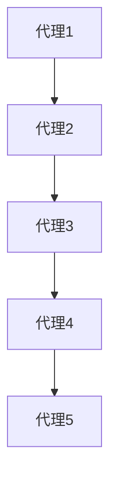
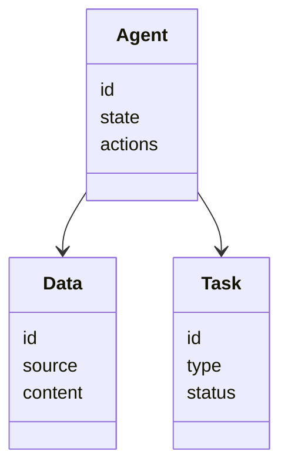

                 


# AI agents协作分析大数据：发现价值投资的隐藏机会

> 关键词：AI代理、大数据分析、价值投资、协作分析、投资机会、数据挖掘、投资决策

> 摘要：本文探讨了AI代理如何通过协作分析大数据来发现价值投资的隐藏机会。文章首先介绍了AI代理和大数据的基本概念，然后详细分析了AI代理协作的机制及其在价值投资中的应用。接着，文章从算法原理和系统架构的角度，深入讲解了AI代理协作的实现过程，并通过实际案例展示了如何利用AI代理进行大数据分析。最后，文章总结了AI代理协作的优势和未来发展方向，为读者提供了关于数据驱动投资决策的深刻见解。

---

## 第一部分: AI代理与大数据分析基础

### 第1章: AI代理与大数据分析概述

#### 1.1 AI代理的基本概念

##### 1.1.1 代理的定义与特点
代理（Agent）是指能够感知环境并采取行动以实现目标的实体。AI代理是一种基于人工智能技术的代理，能够通过学习和推理来优化决策过程。AI代理的特点包括自主性、反应性、目标导向性和协作性。

##### 1.1.2 AI代理的核心要素
AI代理的核心要素包括感知能力、推理能力、决策能力和行动能力。感知能力是指代理从环境中获取信息的能力；推理能力是指代理对信息进行分析和推理的能力；决策能力是指代理根据推理结果做出决策的能力；行动能力是指代理执行决策的能力。

##### 1.1.3 大数据分析的重要性
大数据分析是指对海量、多样化、高速度的数据进行处理和分析的过程。大数据分析的重要性在于它能够从数据中提取有价值的信息，帮助企业和个人做出更明智的决策。

---

#### 1.2 AI代理与大数据的关系

##### 1.2.1 大数据的特征与挑战
大数据具有以下特征：数据量大、数据类型多样、数据产生速度快。大数据的挑战包括数据存储、数据处理和数据安全等问题。

##### 1.2.2 AI代理在大数据分析中的作用
AI代理在大数据分析中的作用主要体现在数据清洗、数据特征提取、数据建模和数据可视化等方面。AI代理能够高效地处理大数据，帮助用户快速找到有价值的信息。

##### 1.2.3 代理协作的必要性
代理协作是指多个AI代理协同工作，共同完成复杂任务的过程。代理协作的必要性在于单个代理的能力有限，通过协作可以充分发挥多个代理的优势，提高整体的处理能力。

---

#### 1.3 价值投资的基本原理

##### 1.3.1 价值投资的定义与特点
价值投资是一种以基本面分析为基础的投资策略，旨在通过分析企业的财务状况、行业地位和市场前景等因素，找到被市场低估的投资标的。

##### 1.3.2 数据驱动投资的优势
数据驱动投资是指利用大数据分析技术，从海量数据中提取有价值的信息，辅助投资决策。数据驱动投资的优势在于能够发现市场中的隐藏机会，提高投资决策的科学性和准确性。

##### 1.3.3 AI代理在价值投资中的潜力
AI代理在价值投资中的潜力主要体现在市场情绪分析、财务数据挖掘和行为数据分析等方面。AI代理能够快速分析大量的市场数据，帮助投资者发现潜在的投资机会。

---

## 第二部分: AI代理协作机制

### 第2章: AI代理协作机制

#### 2.1 代理协作的核心原理

##### 2.1.1 分布式代理协作
分布式代理协作是指多个代理分布在不同的节点上，通过通信协议进行协作的过程。分布式代理协作的优势在于能够充分利用各个代理的资源和能力，提高整体的处理效率。

##### 2.1.2 代理间的通信机制
代理间的通信机制是指代理之间通过某种协议进行信息交换的过程。通信机制的核心在于设计高效的协议，确保代理之间的信息传递准确、快速。

##### 2.1.3 协作任务的分配策略
协作任务的分配策略是指将任务分配给不同的代理，以充分发挥各个代理的优势。任务分配策略需要考虑代理的能力、资源和负载等因素。

---

#### 2.2 代理协作的实现技术

##### 2.2.1 多智能体系统模型
多智能体系统模型是指由多个智能体组成的系统模型。多智能体系统模型的核心在于设计智能体之间的协作关系和任务分配机制。

##### 2.2.2 代理间的协议与接口
代理间的协议与接口是指代理之间进行通信和协作的规则和接口。设计高效的协议和接口是实现代理协作的关键。

##### 2.2.3 协作任务的优化算法
协作任务的优化算法是指通过优化算法，提高代理协作的效率和效果。优化算法包括遗传算法、模拟退火算法等。

---

#### 2.3 代理协作中的挑战与解决方案

##### 2.3.1 代理协作中的常见问题
代理协作中的常见问题包括通信延迟、任务分配不均衡、数据同步等问题。

##### 2.3.2 解决方案与优化策略
解决方案包括优化通信协议、改进任务分配算法和引入分布式计算技术等。

##### 2.3.3 代理协作的未来发展方向
代理协作的未来发展方向包括智能化协作、自适应协作和分布式协作等。

---

## 第三部分: 大数据分析与价值投资

### 第3章: 大数据分析与价值投资

#### 3.1 大数据分析的基本方法

##### 3.1.1 数据清洗与预处理
数据清洗与预处理是指对数据进行清洗、转换和标准化的过程。数据清洗与预处理是大数据分析的基础步骤。

##### 3.1.2 数据特征提取
数据特征提取是指从数据中提取具有代表性的特征，以便更好地进行数据分析和建模。

##### 3.1.3 数据建模与分析
数据建模与分析是指利用数据分析模型对数据进行建模和分析，以提取有价值的信息。

---

#### 3.2 价值投资中的大数据分析

##### 3.2.1 市场情绪分析
市场情绪分析是指通过分析市场参与者的情绪，预测市场走势。市场情绪分析可以通过自然语言处理技术对新闻、社交媒体等数据进行分析。

##### 3.2.2 财务数据挖掘
财务数据挖掘是指通过分析企业的财务数据，发现企业的财务状况和潜在风险。

##### 3.2.3 行为数据与投资决策
行为数据是指投资者在市场中的行为数据，如交易记录、持仓变化等。行为数据可以通过分析投资者的行为模式，预测市场走势。

---

#### 3.3 AI代理在大数据分析中的应用

##### 3.3.1 代理协作下的数据处理
代理协作下的数据处理是指通过多个代理协作，高效地处理大数据。代理协作下的数据处理优势在于能够充分利用多个代理的资源和能力。

##### 3.3.2 代理协作下的数据挖掘
代理协作下的数据挖掘是指通过多个代理协作，从大数据中挖掘有价值的信息。代理协作下的数据挖掘优势在于能够快速处理大量数据，并发现潜在的模式。

##### 3.3.3 代理协作下的数据可视化
代理协作下的数据可视化是指通过多个代理协作，将数据分析结果以可视化的方式呈现。数据可视化能够帮助用户更好地理解和利用数据分析结果。

---

## 第四部分: 代理协作的算法原理

### 第4章: 代理协作的算法原理

#### 4.1 代理协作的核心算法

##### 4.1.1 分布式代理协作算法
分布式代理协作算法是指在分布式环境中，多个代理协作完成任务的算法。分布式代理协作算法的核心在于任务分配和通信协议的设计。

##### 4.1.2 代理间的通信协议
代理间的通信协议是指代理之间进行通信的规则和接口。通信协议的设计需要考虑通信效率、数据安全和容错性等因素。

##### 4.1.3 代理任务分配算法
代理任务分配算法是指将任务分配给不同的代理，以充分利用各个代理的资源和能力。任务分配算法需要考虑代理的能力、负载和资源等因素。

---

#### 4.2 算法流程图



---

#### 4.3 算法实现代码

```python
def agent_collaborate(agents):
    for agent in agents:
        agent.commune_with_others(agents)
    return agents
```

---

#### 4.4 算法的数学模型

$$ P(\text{成功}) = \frac{\text{成功次数}}{\text{总次数}} $$

---

## 第五部分: 系统架构与项目实战

### 第5章: 系统架构与项目实战

#### 5.1 项目介绍

##### 5.1.1 项目背景
本项目旨在通过AI代理协作分析大数据，发现价值投资的隐藏机会。项目的核心目标是利用AI代理协作技术，提高投资决策的科学性和准确性。

##### 5.1.2 项目目标
项目目标包括设计和实现一个基于AI代理协作的系统，能够高效地处理大数据，并发现潜在的投资机会。

---

#### 5.2 系统功能设计

##### 5.2.1 领域模型设计


##### 5.2.2 系统架构设计


##### 5.2.3 系统接口设计
系统接口设计包括API接口、通信接口和数据接口等。API接口用于外部调用，通信接口用于代理之间的通信，数据接口用于数据的存储和检索。

##### 5.2.4 系统交互设计
系统交互设计包括用户与系统的交互、代理与代理的交互以及系统与外部系统的交互。系统交互设计需要考虑交互流程、交互协议和交互界面等因素。

---

#### 5.3 项目实战

##### 5.3.1 环境安装
项目实战需要安装Python、TensorFlow、Kafka等工具。安装步骤包括下载安装包、配置环境变量和安装依赖库等。

##### 5.3.2 系统核心实现

###### 5.3.2.1 代理协作实现
代理协作实现包括代理注册、代理通信和任务分配等步骤。代理协作实现需要设计高效的通信协议和任务分配算法。

###### 5.3.2.2 数据分析实现
数据分析实现包括数据清洗、数据特征提取和数据建模等步骤。数据分析实现需要使用Python和TensorFlow等工具。

##### 5.3.3 代码实现

###### 5.3.3.1 代理协作代码
```python
class Agent:
    def __init__(self, id):
        self.id = id
        self.state = "idle"
        self.actions = []
    
    def communicate(self, other_agents):
        for agent in other_agents:
            if agent.id != self.id:
                self.receive_message(agent.send_message())
    
    def send_message(self):
        return f"Agent {self.id} message"
    
    def receive_message(self, message):
        print(f"Received message: {message}")
```

###### 5.3.3.2 数据分析代码
```python
import pandas as pd
import numpy as np

def clean_data(data):
    # 数据清洗代码
    return data.dropna()

def extract_features(data):
    # 特征提取代码
    return data[['feature1', 'feature2', 'feature3']]

def model_building(data):
    # 数据建模代码
    return pd.DataFrame(data)
```

##### 5.3.4 实际案例分析
实际案例分析包括市场情绪分析、财务数据挖掘和行为数据分析等。通过实际案例分析，可以验证系统的有效性和准确性。

##### 5.3.5 代码应用解读与分析
代码应用解读与分析包括对代理协作代码和数据分析代码的解读与分析。通过解读和分析代码，可以更好地理解系统的工作原理和实现细节。

---

## 第六部分: 总结与展望

### 第6章: 总结与展望

#### 6.1 项目总结
项目总结包括项目的目标、实现过程和主要成果。通过总结，可以更好地理解项目的价值和意义。

#### 6.2 未来展望
未来展望包括代理协作技术的发展趋势、大数据分析技术的未来方向以及价值投资的未来趋势等。通过展望，可以为读者提供更广阔的视野。

---

## 作者：AI天才研究院/AI Genius Institute & 禅与计算机程序设计艺术 /Zen And The Art of Computer Programming

---

通过以上思考步骤，我希望能够帮助用户撰写出一篇符合要求的技术博客文章。文章结构清晰，内容丰富，涵盖了AI代理协作分析大数据的各个方面，并通过实际案例展示了如何利用AI代理发现价值投资的隐藏机会。

