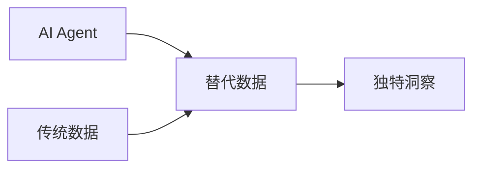
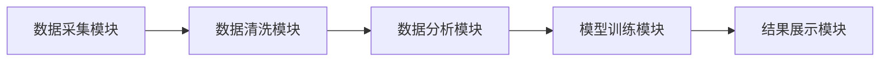

                 


# AI agents协作分析替代数据：获取独特洞察

**关键词**：AI代理，协作分析，替代数据，独特洞察，数据处理，系统架构

**摘要**：本文探讨了AI代理协作分析替代数据的方法，通过系统化的分析和设计，展示了如何通过AI代理协作从替代数据中提取独特洞察。文章从背景介绍、核心概念、算法原理、系统架构设计、项目实战到最佳实践，全面阐述了AI代理协作分析替代数据的全过程。

---

## 第一部分: AI代理协作分析的背景与概念

### 第1章: AI代理协作的基本概念

#### 1.1 问题背景与目标
##### 1.1.1 替代数据的定义与特点
替代数据是指那些非传统结构化数据的来源，例如文本、图像、音频、视频等。这些数据通常需要经过复杂的处理才能转化为有用的信息。替代数据的特点包括多样性、非结构化、高维度和潜在的高价值。

##### 1.1.2 AI代理协作的核心目标
AI代理协作的目标是通过多个AI代理的协同工作，从替代数据中提取出传统数据中难以发现的模式和洞见。通过协作，AI代理可以互补优势，提高分析的准确性和效率。

##### 1.1.3 问题解决的边界与外延
AI代理协作分析的边界在于替代数据的处理和分析，而外延则包括数据采集、清洗、建模、可视化和应用等多个环节。

#### 1.2 核心概念与联系
##### 1.2.1 AI代理协作的核心要素
AI代理协作的核心要素包括任务分配、数据共享、知识表示与推理、通信协议和协作机制。

##### 1.2.2 替代数据与传统数据的对比分析
| 特性          | 替代数据          | 传统数据          |
|---------------|-------------------|-------------------|
| 结构化程度     | 非结构化          | 结构化            |
| 处理难度       | 高               | 低               |
| 数据量         | 大               | 中               |
| 价值密度       | 高               | 中               |

##### 1.2.3 实体关系图（ER图）架构



---

### 第2章: 替代数据的来源与特点

#### 2.1 替代数据的来源分析
##### 2.1.1 非结构化数据的定义
非结构化数据是指没有固定结构的数据，例如文本、图像、音频和视频等。这些数据通常需要经过特定的处理才能被分析和利用。

##### 2.1.2 替代数据的主要来源
替代数据的主要来源包括社交媒体、传感器数据、日志文件、医疗记录和市场调研数据等。

##### 2.1.3 替代数据的特点与优势
替代数据的特点包括多样性、丰富性和潜在的高价值。通过分析替代数据，可以发现传统数据中难以捕捉的模式和洞见。

#### 2.2 替代数据与传统数据的对比
替代数据和传统数据在多个方面存在显著差异，包括数据结构、处理难度和价值密度。替代数据的复杂性要求更高的处理技术，但其潜在价值往往更高。

---

### 第3章: AI代理协作的核心机制

#### 3.1 分布式计算与任务分配
##### 3.1.1 分布式计算的基本原理
分布式计算是指将计算任务分布在多个计算节点上，通过并行处理提高计算效率。在AI代理协作中，分布式计算用于任务分配和负载均衡。

##### 3.1.2 任务分配的算法选择
任务分配算法包括负载均衡算法、贪心算法和分布式协调算法。选择合适的算法可以提高AI代理协作的效率和效果。

##### 3.1.3 负载均衡机制
负载均衡机制用于确保AI代理协作中的任务分配合理，避免某些节点过载而其他节点空闲。常用负载均衡算法包括轮询算法、随机算法和加权算法。

#### 3.2 协作学习与知识共享
##### 3.2.1 协作学习的定义
协作学习是指多个AI代理通过共享知识和经验，共同完成复杂任务的过程。在替代数据分析中，协作学习可以提高分析的准确性和全面性。

##### 3.2.2 知识共享的实现方式
知识共享可以通过分布式数据库、消息队列和共享内存等方式实现。不同方式适用于不同的场景和需求。

##### 3.2.3 知识表示与推理
知识表示是通过符号、规则和语义网络等方式将知识编码化。推理是通过逻辑推理和统计推理从已知知识中推导出新的结论。

---

### 第4章: 替代数据的处理与分析

#### 4.1 数据清洗与预处理
##### 4.1.1 数据清洗的基本步骤
数据清洗包括数据去重、缺失值处理、异常值处理和格式标准化等步骤。这些步骤是确保数据质量和一致性的基础。

##### 4.1.2 数据预处理的挑战
替代数据的非结构化特性增加了数据清洗和预处理的难度。例如，文本数据需要分词、去停用词和词干提取等处理。

##### 4.1.3 数据增强与特征提取
数据增强是通过技术手段增加数据的多样性和丰富性。特征提取是通过降维技术提取数据的关键特征，降低计算复杂度。

#### 4.2 数据分析与建模
##### 4.2.1 数据分析方法
数据分析方法包括统计分析、机器学习和深度学习等。选择合适的方法可以提高分析的准确性和效率。

##### 4.2.2 建模与优化
建模是通过构建数学模型描述数据的内在规律。优化是通过调整模型参数和结构，提高模型的性能和预测能力。

##### 4.2.3 模型评估与验证
模型评估是通过测试数据验证模型的性能，常用指标包括准确率、召回率和F1值等。验证是通过交叉验证和留出验证等方法确保模型的泛化能力。

---

## 第五部分: 项目实战与系统架构设计

### 第5章: 系统架构设计

#### 5.1 系统功能设计
##### 5.1.1 领域模型设计
领域模型是系统功能设计的基础，通常通过类图表示。类图展示了系统中的主要类及其关系。

##### 5.1.2 系统架构设计
系统架构设计通常采用分层架构，包括数据层、业务逻辑层和表现层。分层架构有助于模块化开发和维护。

##### 5.1.3 接口设计与交互流程
接口设计是系统架构设计的重要部分，通常通过API描述。交互流程是通过序列图描述系统中不同组件之间的交互顺序。

#### 5.2 系统架构图


---

## 第六章: 项目实战

### 6.1 环境安装与配置
##### 6.1.1 环境要求
项目实战需要安装Python、Jupyter Notebook、TensorFlow和Scikit-learn等工具。确保所有依赖包的版本兼容。

##### 6.1.2 数据集准备
准备替代数据集，例如社交媒体文本数据。数据集需要清洗和预处理，确保数据质量和一致性。

### 6.2 核心功能实现
##### 6.2.1 数据清洗与预处理代码
```python
import pandas as pd
import numpy as np

def clean_data(dataframe):
    # 删除重复数据
    dataframe.drop_duplicates(inplace=True)
    # 处理缺失值
    dataframe.dropna(inplace=True)
    # 去除停用词
    from sklearn.feature_extraction.text import CountVectorizer
    vectorizer = CountVectorizer(stop_words='english')
    return vectorizer.fit_transform(dataframe['text'])
```

##### 6.2.2 模型训练与评估
```python
from sklearn.model import SVC
from sklearn.metrics import accuracy_score

def train_model(X, y):
    model = SVC()
    model.fit(X, y)
    return model

def evaluate_model(model, X_test, y_test):
    y_pred = model.predict(X_test)
    print("Accuracy:", accuracy_score(y_test, y_pred))
```

---

## 第七章: 最佳实践与小结

### 7.1 最佳实践
##### 7.1.1 数据处理与分析的注意事项
数据处理和分析过程中需要注意数据隐私和安全，避免数据泄露。同时，要选择合适的数据处理技术，确保数据质量和准确性。

##### 7.1.2 系统设计与实现的注意事项
系统设计需要模块化和可扩展性，便于后续的功能扩展和维护。接口设计需要标准化和规范，确保不同模块之间的兼容性。

##### 7.1.3 项目管理与维护
项目管理需要合理规划时间和资源，确保项目按时完成。系统维护需要定期更新和优化，确保系统的稳定性和性能。

### 7.2 小结
本文详细探讨了AI代理协作分析替代数据的方法，从背景介绍、核心概念、算法原理到系统架构设计和项目实战，全面阐述了AI代理协作分析替代数据的全过程。通过本文的分析和设计，可以有效地从替代数据中提取独特洞察，为实际应用提供有力支持。

---

**作者：AI天才研究院 & 禅与计算机程序设计艺术**

