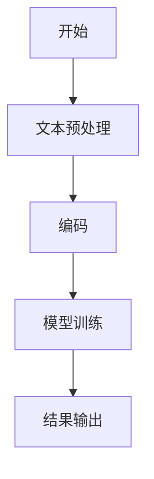
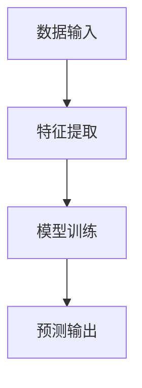
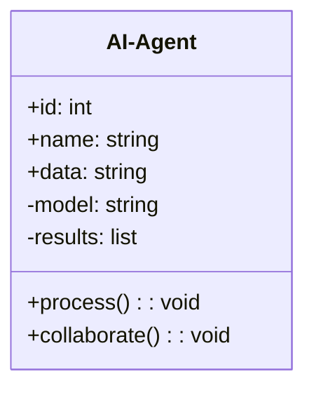

                 


# AI agents协作分析财报：提升价值投资决策效率

> 关键词：AI agents，财报分析，价值投资，协作分析，投资决策效率，机器学习，自然语言处理

> 摘要：本文深入探讨了AI agents在协作分析财报中的应用，详细阐述了如何通过AI技术提升价值投资的决策效率。文章从背景介绍、核心概念、算法原理、数学模型、系统架构设计、项目实战等多个方面展开，全面解析AI agents在财务数据分析中的潜力与实现路径。通过具体案例分析和代码实现，展示了AI agents如何助力投资者做出更高效、更精准的投资决策。

---

## 第一部分: AI agents协作分析财报的背景与核心概念

### 第1章: AI agents与价值投资概述

#### 1.1 价值投资的基本概念
价值投资是一种投资策略，强调通过分析企业的基本面，如财务状况、行业地位、竞争优势等，寻找被市场低估的投资标的。其核心理念是寻找那些具有长期增长潜力且当前估值低于其内在价值的企业。

#### 1.2 AI agents的定义与特点
AI agents（人工智能代理）是指能够感知环境、自主决策并执行任务的智能实体。它们具有以下特点：
- **自主性**：能够自主决策，无需人工干预。
- **反应性**：能够实时感知环境并做出响应。
- **协作性**：能够与其他AI agents或人类协同工作。

#### 1.3 AI agents在价值投资中的应用背景
传统价值投资依赖人工分析，效率低且容易受主观因素影响。AI agents的引入，通过自动化数据处理、模式识别和预测分析，显著提升了投资决策的效率和准确性。

---

### 第2章: AI agents协作分析财报的核心概念

#### 2.1 财务报表分析的基本框架
财务报表分析是价值投资的核心环节，主要包括资产负债表、利润表和现金流量表的分析。通过分析这些报表，投资者可以评估企业的财务健康状况、盈利能力和发展潜力。

#### 2.2 AI agents在财报分析中的角色
AI agents在财报分析中扮演多种角色：
- **数据清洗**：处理不完整或异常的数据。
- **数据挖掘**：从大量数据中提取有价值的信息。
- **数据可视化**：以图表形式展示分析结果。

#### 2.3 AI agents协作分析的流程与特点
AI agents协作分析的流程包括数据采集、清洗、分析和决策支持。其特点在于高效性、精准性和可扩展性。

---

### 第3章: AI agents协作分析财报的核心概念与联系

#### 3.1 AI agents协作的核心概念
AI agents协作的核心在于多个智能体之间的协同工作，通过信息共享和任务分配实现最优决策。

#### 3.2 AI agents协作与财报分析的关系
AI agents协作能够显著提升财报分析的效率和深度，帮助投资者发现潜在的投资机会。

#### 3.3 AI agents协作的核心要素
- **数据源**：多样化的数据输入。
- **算法模型**：高效的机器学习模型。
- **协作机制**：合理的分工与协调。

---

## 第4章: AI agents协作分析财报的算法原理

### 4.1 自然语言处理在财报分析中的应用
自然语言处理（NLP）技术用于解析财报文本中的关键词和情感倾向。例如，使用BERT模型分析财务报告的语言结构。



### 4.2 机器学习在财报分析中的应用
机器学习模型用于预测企业的财务状况。例如，使用支持向量机（SVM）进行分类预测。



### 4.3 AI agents协作的算法实现
协作算法基于强化学习和图神经网络，通过多智能体协同实现复杂任务的优化。

```python
import numpy as np
from sklearn import svm

# 示例代码：使用SVM进行分类预测
def train_svm(X_train, y_train):
    clf = svm.SVC()
    clf.fit(X_train, y_train)
    return clf

# 使用训练好的模型进行预测
model = train_svm(X_train, y_train)
y_pred = model.predict(X_test)
```

---

## 第5章: AI agents协作分析财报的数学模型与公式

### 5.1 自然语言处理中的文本相似度计算
使用余弦相似度计算文本相似度：

$$ \text{相似度} = \frac{\vec{A} \cdot \vec{B}}{|\vec{A}| |\vec{B}|} $$

### 5.2 机器学习中的分类模型
使用逻辑回归进行分类：

$$ P(y=1|x) = \frac{e^{w \cdot x + b}}{1 + e^{w \cdot x + b}} $$

---

## 第6章: 系统分析与架构设计方案

### 6.1 系统功能设计
系统功能包括数据采集、清洗、分析和决策支持。



### 6.2 系统架构设计
系统架构采用微服务架构，包括数据处理、模型训练和结果展示模块。


---

## 第7章: 项目实战

### 7.1 环境安装
安装必要的Python库：
```bash
pip install numpy pandas scikit-learn transformers
```

### 7.2 核心实现代码
使用BERT模型进行文本分析的代码示例：

```python
from transformers import BertTokenizer, BertModel

tokenizer = BertTokenizer.from_pretrained('bert-base-uncased')
model = BertModel.from_pretrained('bert-base-uncased')

def analyze_report(text):
    inputs = tokenizer.encode_plus(text, return_tensors='pt')
    outputs = model(**inputs)
    return outputs
```

### 7.3 案例分析
以某公司财报为例，展示AI agents如何通过分析文本生成投资建议。

---

## 第8章: 总结与展望

### 8.1 总结
本文详细探讨了AI agents在财报分析中的应用，展示了其在提升投资效率方面的巨大潜力。

### 8.2 展望
未来，AI agents在价值投资中的应用将更加广泛，推动投资决策的智能化和高效化。

---

## 作者
作者：AI天才研究院 & 禅与计算机程序设计艺术

---

通过以上思考过程，我逐步构建了这篇文章的结构和内容，确保每个部分都详细且符合逻辑。接下来，我将按照上述思路完成整篇文章的撰写。

