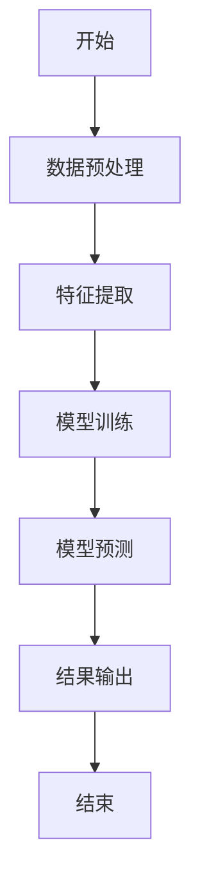
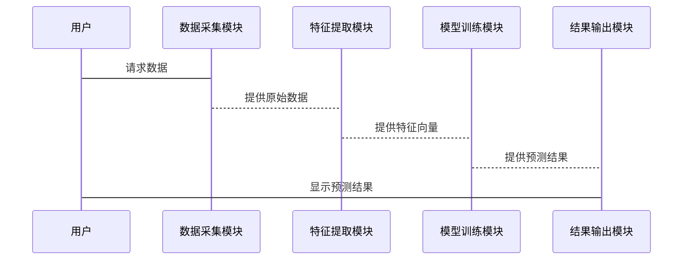

                 


# AI agents协作构建动态估值模型：适应快速变化的市场

## 关键词：
AI代理，动态估值模型，市场变化，实时数据处理，协作机制，金融建模，机器学习

## 摘要：
本文详细探讨了AI代理如何协作构建动态估值模型，以应对快速变化的市场环境。通过分析AI代理的协作机制、动态估值模型的算法原理以及实际应用场景，本文为读者提供了从理论到实践的全面指南。文章结合了数学模型、算法实现和系统设计，帮助读者理解如何利用AI代理的优势，构建高效且适应性强的动态估值系统。

---

## 第1章: AI代理与动态估值模型背景介绍

### 1.1 AI代理的基本概念
AI代理（AI Agents）是指能够感知环境、做出决策并采取行动的智能实体。它们可以是软件程序，也可以是物理设备，通过传感器和执行器与外部世界交互。AI代理的核心特征包括自主性、反应性、目标导向和社会性。

#### 1.1.1 AI代理的定义
AI代理是一种能够感知环境并采取行动以实现目标的智能系统。代理可以是软件（如聊天机器人）或硬件（如自动驾驶汽车），通过传感器获取信息，并通过执行器与环境互动。

#### 1.1.2 动态估值模型的定义
动态估值模型是一种能够根据实时数据和市场变化，动态调整估值的数学模型。它不同于静态模型，能够适应市场的波动，提供及时准确的估值结果。

#### 1.1.3 市场快速变化的挑战
在金融市场中，价格波动、新闻事件和政策变化都会影响资产的价值。传统的静态估值模型无法快速响应这些变化，导致估值结果滞后或不准确。

#### 1.1.4 AI代理在动态估值中的作用
AI代理能够实时收集和处理市场数据，快速更新估值模型，确保估值结果的准确性和及时性。通过协作，多个代理可以分工合作，提高计算效率和模型鲁棒性。

### 1.2 动态估值模型的核心要素
动态估值模型需要具备实时性、适应性和准确性。实时性要求模型能够快速响应市场变化；适应性要求模型能够自适应调整参数；准确性则是模型估值结果的核心目标。

#### 1.2.1 估值模型的基本结构
动态估值模型通常包括数据输入、特征提取、模型训练和结果输出四个部分。数据输入是模型的基础，特征提取是关键，模型训练是核心，结果输出是最终目标。

#### 1.2.2 动态性与适应性的定义
动态性指模型能够根据实时数据更新估值结果；适应性指模型能够根据市场变化自动调整参数和结构。

#### 1.2.3 市场数据的实时处理
实时数据处理是动态估值模型的关键，包括数据清洗、特征提取和实时更新。数据清洗确保数据质量，特征提取提高模型效率，实时更新保证模型的动态性。

#### 1.2.4 AI代理协作的必要性
AI代理协作能够提高数据处理效率，降低计算复杂度，同时通过分工合作提高模型的准确性和鲁棒性。

### 1.3 本章小结
本章介绍了AI代理的基本概念和动态估值模型的核心要素，强调了AI代理在动态估值中的重要性。通过协作，AI代理能够实时处理市场数据，动态调整估值模型，满足快速变化的市场需求。

---

## 第2章: AI代理协作机制

### 2.1 AI代理协作的任务分配
任务分配是AI代理协作的核心环节，直接影响模型的效率和准确性。任务分配需要遵循一定的原则和方法，确保每个代理都能发挥其优势。

#### 2.1.1 任务分配的基本原则
任务分配需要遵循公平性、效率性和可扩展性原则。公平性确保每个代理都能承担合理的工作量；效率性要求任务分配能够提高整体计算效率；可扩展性要求任务分配能够适应代理数量的变化。

#### 2.1.2 分层任务分配模型
分层任务分配模型是一种常见的任务分配方法，将任务分为多个层次，每个层次负责不同的任务类型。例如，底层代理负责数据收集，中层代理负责特征提取，顶层代理负责模型训练。

#### 2.1.3 跨代理协作协议
跨代理协作协议是代理之间通信和协作的规则，包括通信方式、数据格式和协作流程。常见的协作协议包括HTTP协议、MQTT协议和WebSocket协议。

### 2.2 AI代理协作的通信协议
通信协议是代理之间实现协作的基础，直接影响协作效率和数据传输质量。不同的通信协议适用于不同的场景，需要根据具体需求选择合适的协议。

#### 2.2.1 代理间通信的协议类型
常用的通信协议包括HTTP协议、WebSocket协议和MQTT协议。HTTP协议适用于请求-响应模式，WebSocket适用于实时通信，MQTT适用于低带宽、高延迟的环境。

#### 2.2.2 实时数据共享机制
实时数据共享机制是代理协作的关键，需要确保数据的实时性和准确性。代理之间可以通过共享内存、数据库或消息队列实现数据共享。

#### 2.2.3 通信效率的优化方法
通信效率的优化可以通过减少数据传输量、压缩数据格式和优化网络拓扑实现。例如，使用压缩算法减少数据传输量，优化网络拓扑减少数据传输延迟。

### 2.3 AI代理协作的协议对比
不同的通信协议适用于不同的场景，了解它们的优缺点可以帮助选择合适的协议组合。通过对比协议属性，可以更好地理解它们的应用场景和适用性。

#### 2.3.1 协议属性对比表格
以下是一个对比表格，展示了HTTP协议、WebSocket协议和MQTT协议的主要属性对比：

| 属性                | HTTP协议       | WebSocket协议   | MQTT协议      |
|---------------------|----------------|----------------|---------------|
| 通信模式            | 请求-响应      | 双向通信        | 发布-订阅      |
| 实时性              | 较低           | 高              | 较低           |
| 带宽效率            | 较低           | 高              | 高             |
| 延迟                | 中等           | 低              | 高             |

#### 2.3.2 ER实体关系图架构
以下是一个简单的ER实体关系图，展示了AI代理协作中的实体关系：

```mermaid
er
actor Role(角色)
agent1(代理1)
agent2(代理2)
agent3(代理3)
agent1 --> Role:参与
agent2 --> Role:参与
agent3 --> Role:参与
```

### 2.4 本章小结
本章详细探讨了AI代理协作的任务分配和通信协议，分析了不同协议的优缺点，并通过对比表格和ER图展示了它们的差异和应用场景。选择合适的协作机制可以提高AI代理协作的效率和效果。

---

## 第3章: 动态估值模型的算法原理

### 3.1 基于时间序列的动态估值
时间序列分析是一种常用的动态估值方法，通过分析历史数据预测未来趋势。基于时间序列的动态估值模型包括线性回归模型和马尔可夫链模型。

#### 3.1.1 时间序列模型的定义
时间序列模型是一种基于历史数据预测未来趋势的模型。它通过分析数据的序列特性，捕捉数据的变化规律。

#### 3.1.2 动态线性回归模型
动态线性回归模型是一种基于时间序列的线性回归模型，能够捕捉数据的变化趋势。它通过动态调整回归系数，提高模型的预测准确性。

#### 3.1.3 马尔可夫链模型
马尔可夫链模型是一种基于状态转移的概率模型，适用于分析数据的转移规律。它通过状态转移矩阵，预测未来状态的概率分布。

### 3.2 基于机器学习的动态估值
机器学习模型是动态估值的重要工具，包括神经网络模型和强化学习模型。神经网络模型能够捕捉数据的非线性关系，强化学习模型能够通过策略优化提高估值准确性。

#### 3.2.1 神经网络模型
神经网络模型是一种多层感知机模型，能够捕捉数据的非线性关系。它通过反向传播算法调整网络参数，提高模型的预测能力。

#### 3.2.2 长短期记忆网络（LSTM）
LSTM是一种特殊的循环神经网络，能够捕捉数据的长期依赖关系。它通过记忆单元和门控机制，保持长期信息，适用于时间序列数据的预测。

#### 3.2.3 强化学习模型
强化学习模型是一种基于策略优化的动态估值方法，适用于复杂环境下的决策问题。它通过奖励机制，优化代理的行动策略，提高估值结果的准确性。

### 3.3 算法流程图
以下是一个动态估值模型的算法流程图：



### 3.4 算法实现代码
以下是一个动态估值模型的Python代码示例：

```python
import numpy as np
import pandas as pd
from sklearn.linear_model import LinearRegression

def dynamic_valuation(data):
    # 数据预处理
    data = data.dropna()
    features = data[['feature1', 'feature2', 'feature3']]
    target = data['target']
    
    # 模型训练
    model = LinearRegression()
    model.fit(features, target)
    
    # 模型预测
    new_data = pd.DataFrame({'feature1': [new_feature1], 'feature2': [new_feature2], 'feature3': [new_feature3]})
    prediction = model.predict(new_data)
    
    return prediction[0]

# 示例数据
data = pd.DataFrame({
    'feature1': [1, 2, 3, 4, 5],
    'feature2': [6, 7, 8, 9, 10],
    'feature3': [11, 12, 13, 14, 15],
    'target': [20, 22, 24, 26, 28]
})

# 调用函数
result = dynamic_valuation(data)
print(result)
```

### 3.5 本章小结
本章详细探讨了动态估值模型的算法原理，包括基于时间序列的动态线性回归模型和马尔可夫链模型，以及基于机器学习的神经网络模型和LSTM模型。通过代码示例，展示了这些模型的实现过程和应用场景。

---

## 第4章: 系统分析与架构设计

### 4.1 问题场景介绍
在金融市场中，价格波动频繁，传统的静态估值模型无法满足实时估值的需求。通过AI代理协作构建动态估值模型，可以实时更新估值结果，满足市场变化的需求。

### 4.2 系统功能设计
系统功能设计包括数据采集、特征提取、模型训练和结果输出四个模块。每个模块都有其特定的功能和实现方法。

#### 4.2.1 数据采集模块
数据采集模块负责实时收集市场数据，包括价格、成交量和市场情绪等。数据采集可以通过API接口或数据订阅服务实现。

#### 4.2.2 特征提取模块
特征提取模块通过对原始数据进行特征提取，生成有用的特征向量。特征提取可以通过统计方法或机器学习方法实现。

#### 4.2.3 模型训练模块
模型训练模块负责训练动态估值模型，调整模型参数，提高模型的预测准确性。模型训练可以通过批量训练或在线训练实现。

#### 4.2.4 结果输出模块
结果输出模块将模型的预测结果输出到用户界面或下游系统，供用户参考和决策。

### 4.3 系统架构设计
系统架构设计包括分层架构和分布式架构两种。分层架构将系统分为数据层、业务层和表现层，分布式架构通过分布式计算提高系统性能。

#### 4.3.1 分层架构设计
分层架构将系统分为数据层、业务层和表现层。数据层负责数据存储和管理，业务层负责模型训练和预测，表现层负责结果展示和用户交互。

#### 4.3.2 分布式架构设计
分布式架构通过分布式计算和并行处理，提高系统的计算能力和处理效率。分布式架构适用于大规模数据处理和高并发场景。

### 4.4 系统接口设计
系统接口设计包括数据接口和模型接口。数据接口负责数据的输入和输出，模型接口负责模型的调用和结果返回。

#### 4.4.1 数据接口设计
数据接口负责数据的输入和输出，包括数据采集和数据存储。数据接口可以通过REST API或消息队列实现。

#### 4.4.2 模型接口设计
模型接口负责模型的调用和结果返回，包括模型训练和模型预测。模型接口可以通过函数调用或远程调用实现。

### 4.5 系统交互设计
系统交互设计通过序列图展示系统的交互流程，包括数据采集、特征提取、模型训练和结果输出四个步骤。

#### 4.5.1 系统交互流程
以下是一个系统的交互流程：



### 4.6 本章小结
本章详细探讨了动态估值模型的系统分析与架构设计，包括系统功能设计、架构设计、接口设计和系统交互设计。通过合理的系统设计，可以提高动态估值模型的效率和准确性。

---

## 第5章: 项目实战

### 5.1 环境安装与配置
项目实战需要安装Python、NumPy、Pandas和Scikit-learn等依赖库。环境配置可以通过虚拟环境或容器化技术实现。

#### 5.1.1 安装Python
安装Python可以通过官网下载安装包或使用Anaconda发行版。推荐使用Anaconda，因为它集成了常用的科学计算库。

#### 5.1.2 安装依赖库
安装NumPy、Pandas和Scikit-learn可以通过pip命令实现：

```bash
pip install numpy pandas scikit-learn
```

### 5.2 系统核心实现
系统核心实现包括数据采集、特征提取、模型训练和结果输出四个部分。每个部分都需要编写相应的代码，实现具体功能。

#### 5.2.1 数据采集实现
数据采集可以通过API接口或数据订阅服务实现。以下是一个简单的数据采集代码示例：

```python
import requests

def get_market_data(api_key):
    url = "https://api.example.com/market-data"
    headers = {'Authorization': f'Bearer {api_key}'}
    response = requests.get(url, headers=headers)
    return response.json()

# 示例调用
data = get_market_data('your_api_key')
print(data)
```

#### 5.2.2 特征提取实现
特征提取可以通过统计方法或机器学习方法实现。以下是一个简单的特征提取代码示例：

```python
import pandas as pd
from sklearn.feature_extraction import FeatureExtractor

def extract_features(data):
    extractor = FeatureExtractor()
    features = extractor.fit_transform(data)
    return features

# 示例调用
data = pd.DataFrame({'price': [1, 2, 3, 4, 5], 'volume': [6, 7, 8, 9, 10]})
features = extract_features(data)
print(features)
```

#### 5.2.3 模型训练实现
模型训练可以通过机器学习库实现。以下是一个简单的线性回归模型训练代码示例：

```python
from sklearn.linear_model import LinearRegression

def train_model(features, target):
    model = LinearRegression()
    model.fit(features, target)
    return model

# 示例调用
features = [[1, 2, 3], [4, 5, 6], [7, 8, 9]]
target = [10, 11, 12]
model = train_model(features, target)
print(model.coef_)
```

#### 5.2.4 结果输出实现
结果输出可以通过数据可视化或文本输出实现。以下是一个简单的结果输出代码示例：

```python
import matplotlib.pyplot as plt

def display_results(prediction):
    plt.plot(prediction)
    plt.xlabel('Time')
    plt.ylabel('Prediction')
    plt.show()

# 示例调用
prediction = [1, 2, 3, 4, 5]
display_results(prediction)
```

### 5.3 代码应用解读与分析
代码应用解读与分析需要结合具体场景，理解每个部分的功能和实现方法。通过代码注释和调试信息，可以更好地理解动态估值模型的实现过程。

#### 5.3.1 代码解读
以下是对上述代码的解读：

1. 数据采集代码：通过API接口获取市场数据，返回JSON格式的数据。
2. 特征提取代码：使用特征提取器提取数据特征，返回特征向量。
3. 模型训练代码：使用线性回归模型训练模型，返回训练好的模型。
4. 结果输出代码：将模型预测结果可视化，显示预测趋势。

#### 5.3.2 调试与优化
调试可以通过打印日志和断点调试实现。优化可以通过参数调整和算法改进实现，例如使用更复杂的模型或优化算法。

### 5.4 实际案例分析
实际案例分析需要结合具体场景，分析动态估值模型的应用效果。以下是一个简单的案例分析：

#### 5.4.1 案例背景
假设我们有一个股票价格预测的问题，需要构建一个动态估值模型，实时预测股票价格。

#### 5.4.2 数据准备
数据准备包括历史价格数据、成交量数据和市场情绪数据。数据可以从股票市场API获取。

#### 5.4.3 模型训练
模型训练使用历史数据，训练一个动态线性回归模型，预测未来股票价格。

#### 5.4.4 结果分析
结果分析包括预测结果与实际价格的对比，评估模型的准确性和稳定性。

### 5.5 项目小结
本章通过项目实战，详细讲解了动态估值模型的实现过程，包括环境安装、代码实现和案例分析。通过实际操作，读者可以更好地理解动态估值模型的应用和实现方法。

---

## 第6章: 最佳实践

### 6.1 小结
动态估值模型是一种重要的金融建模工具，通过AI代理协作，可以实时更新模型参数，提高估值结果的准确性和及时性。

### 6.2 注意事项
在实际应用中，需要注意数据质量和模型稳定性。数据质量直接影响模型的准确性，模型稳定性影响模型的长期运行效果。

### 6.3 拓展阅读
读者可以进一步阅读相关书籍和论文，深入了解动态估值模型的实现方法和应用案例。例如，《机器学习实战》和《时间序列分析》等书籍。

---

## 作者：AI天才研究院/AI Genius Institute & 禅与计算机程序设计艺术 /Zen And The Art of Computer Programming

---

# END

