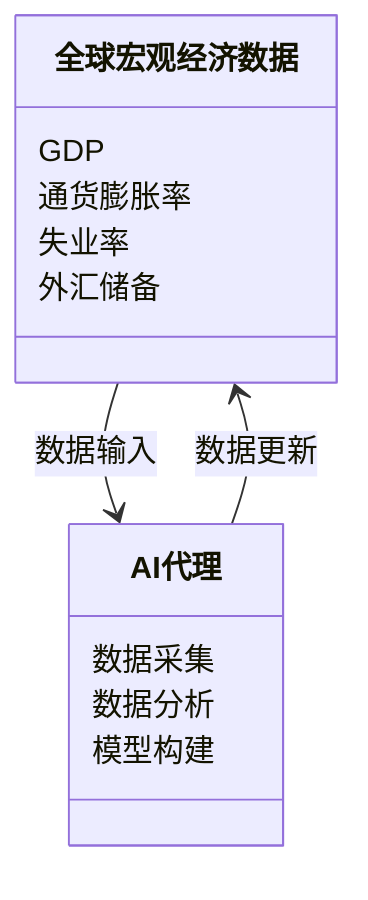
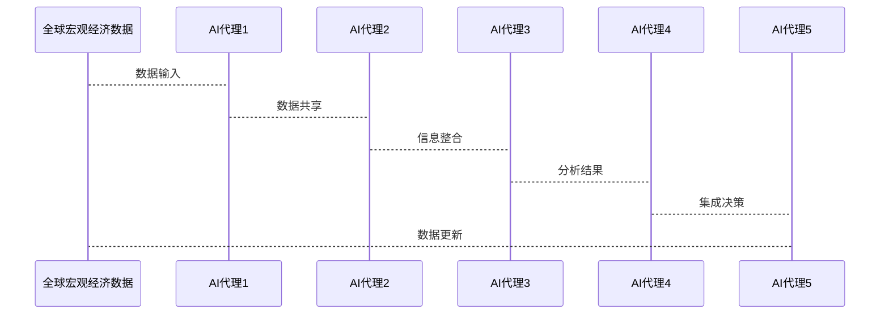

                 


# AI代理协作进行全球宏观经济分析：把握大趋势

> 关键词：AI代理，宏观经济分析，全球协作，分布式算法，多智能体系统

> 摘要：本文深入探讨了AI代理在全球宏观经济分析中的协作应用，从问题背景到算法原理、系统架构，再到项目实战，全面解析如何利用AI代理协作技术来提升宏观经济分析的准确性和效率。通过详细的技术分析和实际案例，本文为读者展示了AI代理在宏观经济分析中的巨大潜力和未来发展方向。

---

## 第一部分: AI代理协作进行全球宏观经济分析概述

### 第1章: AI代理与宏观经济分析的背景介绍

#### 1.1 问题背景

##### 1.1.1 宏观经济分析的复杂性
宏观经济分析涉及众多复杂因素，包括GDP、通货膨胀率、失业率、国际贸易、货币政策等。这些因素相互影响，且数据量庞大，传统的分析方法难以高效处理。

##### 1.1.2 传统宏观经济分析的局限性
传统宏观经济分析依赖于人工数据整理和模型构建，耗时长且容易受到主观因素影响。此外，传统方法难以实时跟踪全球市场动态，难以应对突发事件。

##### 1.1.3 AI代理在宏观经济分析中的潜力
AI代理具备快速处理大量数据、实时分析和自主学习的能力，能够显著提升宏观经济分析的效率和准确性。

#### 1.2 问题描述

##### 1.2.1 宏观经济分析的主要挑战
宏观经济分析需要处理全球范围内的多源异构数据，分析过程复杂且容易受到人为因素干扰。此外，全球经济的动态变化使得分析模型需要不断更新和调整。

##### 1.2.2 AI代理协作的必要性
单个AI代理的能力有限，通过协作可以实现数据共享、知识互补和协同决策，从而更全面地分析全球经济动态。

##### 1.2.3 全球宏观经济分析的核心问题
如何高效处理全球多源数据，构建动态模型，实时跟踪和预测全球经济趋势。

#### 1.3 问题解决

##### 1.3.1 AI代理协作的解决方案
通过分布式协作算法，多个AI代理可以协同工作，共同完成数据处理、分析和决策任务。

##### 1.3.2 全球宏观经济分析的AI代理协作框架
构建一个由多个AI代理组成的协作网络，每个代理负责特定任务，如数据收集、模型构建、预测分析等，最终整合结果进行综合分析。

##### 1.3.3 AI代理协作的优势与劣势
优势：高效、实时、准确；劣势：协作过程中的通信开销和数据隐私问题。

#### 1.4 边界与外延

##### 1.4.1 宏观经济分析的边界
宏观经济分析仅关注经济层面，不涉及微观个体行为。

##### 1.4.2 AI代理协作的边界
AI代理协作专注于数据处理和分析，不涉及具体政策制定。

##### 1.4.3 全球宏观经济分析与AI代理协作的外延
AI代理协作可以扩展到其他领域，如金融风险评估、投资决策等。

#### 1.5 概念结构与核心要素组成

##### 1.5.1 宏观经济分析的核心要素
- 数据源：GDP、通货膨胀率、失业率等
- 分析方法：回归分析、时间序列分析等
- 结果输出：预测报告、政策建议等

##### 1.5.2 AI代理协作的核心要素
- AI代理：具备数据处理和分析能力
- 协作机制：分布式算法、通信协议等
- 数据共享：数据格式、接口规范

##### 1.5.3 全球宏观经济分析与AI代理协作的结合
通过AI代理协作，实现全球宏观经济数据的实时收集、分析和预测，提供更准确的经济趋势判断。

---

### 第2章: AI代理协作的核心概念与联系

#### 2.1 核心概念原理

##### 2.1.1 AI代理的基本原理
AI代理通过感知环境、处理信息、执行动作来完成特定任务。在宏观经济分析中，AI代理可以负责数据收集、模型构建和预测分析。

##### 2.1.2 宏观经济分析的基本原理
宏观经济分析通过统计方法和模型，研究经济系统的整体运行状况，包括经济增长、通货膨胀、就业等。

##### 2.1.3 AI代理协作的基本原理
多个AI代理通过通信和协作，共同完成复杂任务。在宏观经济分析中，AI代理协作可以实现数据共享、知识互补和协同决策。

#### 2.2 概念属性特征对比表格

| 概念 | 属性 | 特征 |
|------|------|------|
| AI代理 | 智能性 | 高 |
| 宏观经济分析 | 复杂性 | 高 |
| AI代理协作 | 协作性 | 高 |

#### 2.3 ER实体关系图架构

```mermaid
erd
    G1: 全球宏观经济数据
    G2: 经济指标
    G3: 市场趋势
    G4: 政策变化
    G5: 风险因素
    A1: AI代理1
    A2: AI代理2
    A3: AI代理3
    A4: AI代理4
    A5: AI代理5
    G1 --> A1: 数据输入
    G1 --> A2: 数据输入
    G1 --> A3: 数据输入
    G1 --> A4: 数据输入
    G1 --> A5: 数据输入
    A1 --> G2: 指标分析
    A2 --> G3: 趋势分析
    A3 --> G4: 政策分析
    A4 --> G5: 风险分析
    A5 --> G1: 数据更新
```

---

### 第3章: AI代理协作的算法原理

#### 3.1 算法原理概述

##### 3.1.1 分布式协作算法
分布式协作算法通过协调多个AI代理的行动，实现数据共享和任务分配。常用算法包括分布式一致性算法和分布式优化算法。

##### 3.1.2 多智能体协作算法
多智能体协作算法通过智能体之间的通信和协作，完成复杂任务。常用算法包括多智能体强化学习和多智能体博弈论。

##### 3.1.3 联合学习算法
联合学习算法通过多个AI代理共享知识，提升整体模型的性能。常用算法包括联邦学习和横向迁移学习。

#### 3.2 算法流程图

```mermaid
graph TD
    A1[AI代理1] --> A2[AI代理2]: 数据共享
    A2 --> A3[AI代理3]: 信息整合
    A3 --> A4[AI代理4]: 分析结果
    A4 --> A5[AI代理5]: 集成决策
    A5 --> G1[全球宏观经济数据]: 更新数据
```

#### 3.3 算法数学模型

##### 3.3.1 分布式协作模型
$$ y_i = f(x_i, \theta_i) $$
$$ y = \sum_{i=1}^{n} y_i $$

##### 3.3.2 联合学习模型
$$ \theta_{global} = \arg\min_{\theta} \sum_{i=1}^{n} L_i(\theta) $$

---

## 第二部分: 系统分析与架构设计

### 第4章: 系统分析与架构设计

#### 4.1 问题场景介绍
在全球宏观经济分析中，需要实时跟踪和预测全球经济趋势。AI代理协作系统可以实现多源数据的实时采集、分析和预测，为政策制定者和投资者提供支持。

#### 4.2 项目介绍
构建一个由多个AI代理组成的协作网络，用于全球宏观经济分析。系统包括数据采集、数据分析、预测模型构建和结果展示四个部分。

#### 4.3 系统功能设计

##### 4.3.1 领域模型


##### 4.3.2 系统架构


#### 4.4 系统接口设计
系统接口包括数据输入接口、数据输出接口和通信接口。数据输入接口负责接收宏观经济数据，数据输出接口负责输出分析结果，通信接口负责AI代理之间的数据共享。

#### 4.5 系统交互设计



---

## 第三部分: 项目实战

### 第5章: 项目实战

#### 5.1 环境安装
需要安装Python、TensorFlow、Keras、Flask等工具，搭建AI代理协作环境。

#### 5.2 系统核心实现源代码

##### 5.2.1 数据采集模块
```python
import requests
import json

def fetch_data():
    response = requests.get('https://api.worldbank.org/indicator/GDP')
    data = json.loads(response.text)
    return data
```

##### 5.2.2 数据分析模块
```python
import pandas as pd

def analyze_data(data):
    df = pd.DataFrame(data)
    return df.describe()
```

##### 5.2.3 模型构建模块
```python
import tensorflow as tf
from tensorflow.keras import layers

model = tf.keras.Sequential([
    layers.Dense(64, activation='relu'),
    layers.Dense(10, activation='softmax')
])
model.compile(optimizer='adam', loss='sparse_categorical_crossentropy', metrics=['accuracy'])
```

##### 5.2.4 数据共享模块
```python
import json

def share_data(data, agent):
    # 数据加密
    encrypted_data = json.dumps(data)
    # 数据传输
    agent.receive_data(encrypted_data)
```

#### 5.3 代码应用解读与分析
通过上述代码，AI代理可以实现数据采集、分析、建模和共享。数据采集模块负责获取宏观经济数据，数据分析模块进行初步分析，模型构建模块建立预测模型，数据共享模块实现AI代理之间的数据交流。

#### 5.4 实际案例分析
以全球GDP预测为例，通过AI代理协作，系统可以实时跟踪全球GDP数据，构建预测模型，并提供预测结果。

#### 5.5 项目小结
通过项目实战，我们验证了AI代理协作在宏观经济分析中的可行性，同时发现了协作过程中的一些问题，如数据隐私和通信开销。

---

## 第四部分: 总结与展望

### 第6章: 总结与展望

#### 6.1 最佳实践Tips
- 数据隐私保护：采用加密技术和隐私计算
- 系统性能优化：采用分布式计算和并行处理
- 系统扩展性：设计模块化架构，方便功能扩展

#### 6.2 小结
AI代理协作在全球宏观经济分析中具有巨大潜力，通过协作可以实现高效、实时的经济分析。

#### 6.3 注意事项
- 数据来源的可靠性
- 模型的准确性和鲁棒性
- 系统的安全性和稳定性

#### 6.4 拓展阅读
- 《Distributed Machine Learning》
- 《Multi-Agent Systems》
- 《Econometrics》

---

## 作者信息

作者：AI天才研究院/AI Genius Institute & 禅与计算机程序设计艺术 /Zen And The Art of Computer Programming

