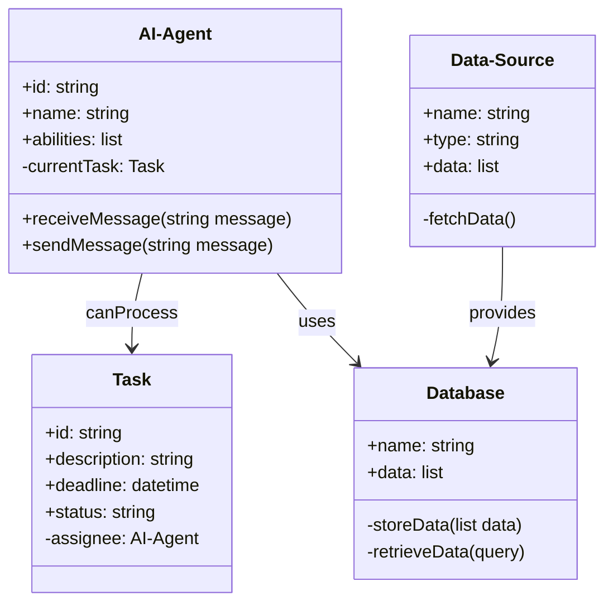

                 


# AI Agents 协作进行全球监管环境分析：评估跨国公司风险

> 关键词：AI代理，全球监管环境，跨国公司，风险管理，算法协作，系统架构

> 摘要：本文探讨了AI代理如何协作进行全球监管环境分析，帮助跨国公司评估和管理风险。通过详细分析AI代理的核心概念、协作算法、系统架构及实际案例，本文展示了AI技术在监管环境分析中的巨大潜力和实际应用。

---

## 第一章：AI代理与全球监管环境分析概述

### 1.1 AI代理的基本概念

#### 1.1.1 AI代理的定义与分类
AI代理（Artificial Intelligence Agents）是指能够感知环境并采取行动以实现目标的智能实体。根据功能和复杂度，AI代理可以分为以下几类：
- **简单反射代理**：基于预定义规则做出反应。
- **基于模型的反射代理**：利用内部模型进行推理和规划。
- **目标驱动代理**：根据明确的目标采取行动。
- **学习型代理**：通过机器学习技术不断优化自身行为。

#### 1.1.2 AI代理的核心特征
- **自主性**：能够在没有外部干预的情况下运行。
- **反应性**：能够实时感知环境并做出反应。
- **协作性**：能够与其他代理或系统协同工作。
- **学习能力**：通过数据和经验不断优化自身性能。

#### 1.1.3 AI代理在企业中的应用潜力
AI代理在企业中的应用潜力巨大，尤其是在数据分析、决策支持和自动化操作等领域。例如，AI代理可以帮助企业实时监控市场动态、优化供应链管理、提升客户服务质量等。

### 1.2 全球监管环境分析的背景

#### 1.2.1 全球化背景下监管环境的复杂性
随着全球化进程的加速，跨国公司面临的监管环境日益复杂。不同国家和地区有不同的法律法规、行业标准和政策要求，企业需要在全球范围内遵守这些规定。

#### 1.2.2 跨国公司面临的监管挑战
跨国公司需要应对的监管挑战包括：
- **法律合规性**：遵守不同国家的法律法规。
- **政策变化**：应对不断变化的政策环境。
- **行业标准**：满足行业的最佳实践和标准。

#### 1.2.3 AI技术在监管环境分析中的作用
AI技术可以帮助企业实时监控和分析监管环境的变化，识别潜在风险，并提供有效的应对策略。例如，AI代理可以自动解析法律文本，识别关键条款，并为企业提供合规建议。

### 1.3 跨国公司风险评估的必要性

#### 1.3.1 跨国经营中的主要风险类型
- **法律风险**：因违反当地法律法规而面临罚款或诉讼。
- **政策风险**：因政策变化而影响企业经营。
- **合规风险**：因未能满足行业标准或最佳实践而影响企业声誉。

#### 1.3.2 监管环境对企业风险的影响
监管环境的不确定性和复杂性直接影响企业的经营风险。例如，税收政策的变化可能影响企业的财务状况，环保法规的收紧可能增加企业的运营成本。

#### 1.3.3 AI代理在风险评估中的优势
AI代理可以帮助企业快速、准确地分析监管环境的变化，并提供个性化的风险评估报告。通过AI代理的协作，企业可以实现全球监管环境的实时监控和动态分析。

---

## 第二章：AI代理协作的理论基础

### 2.1 多智能体系统（MAS）概述

#### 2.1.1 多智能体系统的定义与特点
多智能体系统是由多个智能体组成的协作系统，这些智能体可以独立决策并协同工作以实现共同目标。

#### 2.1.2 MAS中的协作机制
- **分布式计算**：任务分配和资源分配基于分布式计算。
- **通信协议**：智能体之间通过通信协议进行信息交换。
- **协调机制**：通过协调机制确保智能体之间的协作。

#### 2.1.3 MAS在复杂环境中的应用
MAS在复杂环境中的应用广泛，例如在自动驾驶汽车、智能电网和分布式机器人系统等领域。

### 2.2 分布式计算与AI代理协作

#### 2.2.1 分布式计算的基本概念
分布式计算是指在多个计算节点上分布任务和数据，通过协作完成特定目标。

#### 2.2.2 AI代理协作中的分布式任务分配
- **任务分解**：将整体任务分解为多个子任务。
- **任务分配**：根据智能体的能力和资源分配任务。
- **任务执行**：智能体协作完成分配的任务。

#### 2.2.3 分布式计算对监管环境分析的支持
分布式计算可以提高监管环境分析的效率和准确性。例如，多个AI代理可以同时分析不同国家的法律法规，并将结果汇总到一个统一的报告中。

### 2.3 AI代理协作的算法原理

#### 2.3.1 基于博弈论的协作算法
博弈论是一种研究战略互动的数学理论，可以应用于AI代理的协作决策。

#### 2.3.2 基于分布式计算的协作算法
分布式计算算法可以提高AI代理协作的效率和效果。例如，使用分布式并行计算来加速数据处理和分析。

#### 2.3.3 基于规则的协作算法
基于规则的协作算法通过预定义的规则来指导AI代理的协作行为。

---

## 第三章：全球监管环境分析的框架

### 3.1 监管环境分析的核心要素

#### 3.1.1 法律法规的层次结构
- **国际法**：如联合国公约、世界贸易组织规则等。
- **国家法**：如各国的宪法、法律和法规。
- **地方法**：如各地区的地方法律和法规。

#### 3.1.2 监管机构的职责划分
- **中央监管机构**：如国家证监会、银监会等。
- **地方监管机构**：如地方金融监管局等。
- **行业自律组织**：如行业协会、商会等。

#### 3.1.3 行业标准与最佳实践
行业标准和最佳实践是跨国公司需要遵守的重要规范，例如ISO质量管理体系、国际会计准则等。

### 3.2 跨国公司监管环境分析的框架

#### 3.2.1 跨国公司面临的法律环境
- **公司法律**：如公司注册、股权转让等。
- **合同法律**：如商业合同、雇佣合同等。
- **知识产权法律**：如专利、商标、版权等。

#### 3.2.2 跨国公司面临的监管政策
- **货币政策**：如汇率政策、货币政策等。
- **财政政策**：如税收政策、政府补贴等。
- **行业政策**：如行业准入、产品标准等。

#### 3.2.3 跨国公司面临的行业规范
- **行业标准**：如ISO标准、行业认证等。
- **最佳实践**：如行业内的最佳管理实践、可持续发展实践等。

### 3.3 AI代理协作的分析框架

#### 3.3.1 AI代理在监管环境分析中的角色
- **数据收集**：收集全球范围内的法律法规、政策文件等。
- **数据分析**：对收集到的数据进行清洗、处理和分析。
- **风险评估**：根据分析结果评估潜在风险。
- **报告生成**：生成个性化的风险评估报告。

#### 3.3.2 AI代理协作的流程与步骤
1. **数据收集**：AI代理从不同来源收集监管环境数据。
2. **数据处理**：对数据进行清洗、转换和整合。
3. **数据分析**：使用机器学习算法分析数据，识别潜在风险。
4. **风险评估**：根据分析结果评估风险，并提供应对建议。
5. **报告生成**：生成风险评估报告，并提供可视化展示。

#### 3.3.3 AI代理协作的效率与效果评估
- **效率评估**：衡量AI代理协作的速度和资源利用率。
- **效果评估**：衡量AI代理协作的准确性和可靠性。

---

## 第四章：AI代理协作的算法原理

### 4.1 多智能体协作算法

#### 4.1.1 基于博弈论的协作算法
博弈论是一种研究战略互动的数学理论，可以应用于AI代理的协作决策。

#### 4.1.2 基于分布式计算的协作算法
分布式计算算法可以提高AI代理协作的效率和效果。例如，使用分布式并行计算来加速数据处理和分析。

#### 4.1.3 基于规则的协作算法
基于规则的协作算法通过预定义的规则来指导AI代理的协作行为。

### 4.2 监管环境分析的数学模型

#### 4.2.1 监管环境分析的数学模型
- **概率模型**：用于分析监管环境的不确定性。
- **决策树模型**：用于分析不同决策路径的后果。
- **网络流模型**：用于分析任务分配和资源分配。

#### 4.2.2 任务分配算法
任务分配算法可以通过以下步骤实现：
1. **任务分解**：将整体任务分解为多个子任务。
2. **任务分配**：根据AI代理的能力和资源分配任务。
3. **任务执行**：AI代理协作完成分配的任务。

#### 4.2.3 数据分析算法
数据分析算法可以通过以下步骤实现：
1. **数据清洗**：去除噪声数据，确保数据质量。
2. **特征提取**：提取数据中的关键特征，用于后续分析。
3. **模型训练**：使用机器学习算法训练模型，预测潜在风险。

---

## 第五章：系统分析与架构设计

### 5.1 系统功能设计

#### 5.1.1 数据采集模块
数据采集模块负责从不同来源收集监管环境数据，包括法律法规、政策文件、行业标准等。

#### 5.1.2 数据处理模块
数据处理模块负责对收集到的数据进行清洗、转换和整合，确保数据的准确性和一致性。

#### 5.1.3 数据分析模块
数据分析模块负责对数据进行分析，识别潜在风险，并提供应对建议。

#### 5.1.4 报告生成模块
报告生成模块负责根据分析结果生成风险评估报告，并提供可视化展示。

### 5.2 系统架构设计

#### 5.2.1 类图设计


#### 5.2.2 架构图设计


#### 5.2.3 接口设计
接口设计包括：
- **数据接口**：用于数据的输入和输出。
- **通信接口**：用于AI代理之间的通信。
- **用户接口**：用于用户的交互和操作。

#### 5.2.4 交互设计
交互设计包括：
- **用户请求**：用户向系统发送任务请求。
- **系统响应**：系统根据请求分配任务并执行。
- **结果展示**：系统将结果展示给用户。

---

## 第六章：项目实战

### 6.1 环境安装

#### 6.1.1 安装Python
```bash
python --version
pip install --upgrade pip
```

#### 6.1.2 安装依赖库
```bash
pip install numpy
pip install pandas
pip install scikit-learn
pip install matplotlib
pip install networkx
```

### 6.2 核心代码实现

#### 6.2.1 数据采集模块
```python
import requests
from bs4 import BeautifulSoup

def fetch_data(url):
    response = requests.get(url)
    soup = BeautifulSoup(response.text, 'html.parser')
    data = []
    for item in soup.find_all('div', class_='regulation-item'):
        data.append({
            'title': item.find('h3').text,
            'content': item.find('p').text,
            'date': item.find('span').text
        })
    return data
```

#### 6.2.2 数据处理模块
```python
import pandas as pd

def preprocess_data(data):
    df = pd.DataFrame(data)
    df['date'] = pd.to_datetime(df['date'])
    df['content_length'] = df['content'].apply(len)
    return df
```

#### 6.2.3 数据分析模块
```python
from sklearn.tree import DecisionTreeClassifier
from sklearn.model_selection import train_test_split

def train_model(data, target):
    X = data.drop(columns=[target])
    y = data[target]
    X_train, X_test, y_train, y_test = train_test_split(X, y, test_size=0.2)
    model = DecisionTreeClassifier()
    model.fit(X_train, y_train)
    return model
```

#### 6.2.4 报告生成模块
```python
import matplotlib.pyplot as plt

def generate_report(data, model):
    plt.figure(figsize=(10, 6))
    plt.scatter(data['content_length'], data['target'])
    plt.xlabel('Content Length')
    plt.ylabel('Target')
    plt.title('Risk Assessment Report')
    plt.show()
```

### 6.3 案例分析

#### 6.3.1 案例背景
假设某跨国公司面临欧盟的数据隐私法规变化，需要评估其合规风险。

#### 6.3.2 数据采集与处理
使用上述代码从欧盟官方网站采集数据，并进行清洗和预处理。

#### 6.3.3 数据分析与建模
使用决策树模型对数据进行分类，识别潜在风险。

#### 6.3.4 报告生成
根据分析结果生成风险评估报告，并提供可视化展示。

### 6.4 项目小结

---

## 第七章：最佳实践与未来展望

### 7.1 最佳实践

#### 7.1.1 数据隐私保护
在AI代理协作过程中，必须确保数据的隐私和安全。

#### 7.1.2 模型更新策略
定期更新模型，确保其准确性和有效性。

#### 7.1.3 团队协作
AI代理协作需要多学科团队的协作，包括数据科学家、软件工程师、法律专家等。

### 7.2 小结

### 7.3 注意事项

### 7.4 拓展阅读

---

## 作者信息

作者：AI天才研究院/AI Genius Institute & 禅与计算机程序设计艺术 /Zen And The Art of Computer Programming

