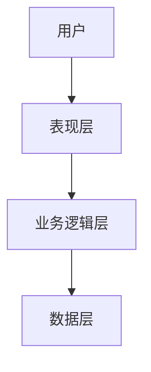

                 


# AI agents协作进行全球经济周期分析：把握大趋势

## 关键词：
- AI agents
- 全球经济周期
- 协作机制
- 经济预测
- 数据分析

## 摘要：
本文探讨AI agents如何协作进行全球经济周期分析，通过介绍AI agents的基本概念、协作机制、经济周期分析的理论基础、算法原理、系统架构设计和项目实战，详细讲解如何利用AI技术提升经济预测的准确性和效率。文章结构清晰，内容丰富，涵盖从理论到实践的各个方面，旨在为读者提供全面的指导和深入的见解。

---

# 第一部分：引言

## 第1章：AI agents协作概述

### 1.1 AI agents的基本概念
AI agents是指具有自主决策能力的智能体，能够感知环境、执行任务并与其他实体协作。AI agents在经济分析中的应用日益广泛，特别是在全球经济周期预测方面，通过协作能够显著提升分析的准确性和效率。

### 1.2 协作的必要性
AI agents的协作能够整合多源数据，优化分析流程，提高决策的准确性。通过协作，AI agents能够互补优势，共同完成复杂的经济周期分析任务。

### 1.3 本书的目标与结构
本书旨在通过AI agents协作的方式，帮助读者掌握全球经济周期分析的方法和技巧。内容涵盖理论、算法、系统设计和项目实战，结构清晰，便于读者理解和应用。

---

# 第二部分：全球经济周期分析的理论基础

## 第2章：全球经济周期的定义与特征

### 2.1 经济周期的定义
经济周期是指经济活动的波动，通常分为衰退、复苏、增长和繁荣四个阶段。全球经济周期受多种因素影响，包括国际贸易、政策变化和技术创新等。

### 2.2 全球经济周期的特点
全球经济周期具有复杂性和多样性，不同国家和地区的经济周期可能不同，且相互影响。了解这些特点对于制定有效的经济政策至关重要。

### 2.3 经济数据与指标
主要经济指标包括GDP、CPI、失业率等。这些指标是分析经济周期的重要依据，AI agents能够高效地收集和处理这些数据。

---

# 第三部分：AI agents协作进行经济分析的方法

## 第3章：AI agents协作机制

### 3.1 协作的基本原理
AI agents通过数据共享、任务分配和结果整合进行协作。协作机制的设计需要考虑数据隐私和计算效率。

### 3.2 数据共享与整合
数据共享是协作的基础，AI agents需要通过安全的方式交换数据，确保数据的完整性和一致性。

### 3.3 结果的共识达成
AI agents通过共识算法达成一致的分析结果，确保预测的准确性和可靠性。

---

# 第四部分：算法原理与实现

## 第4章：经济周期预测的算法原理

### 4.1 时间序列分析
时间序列分析是经济周期预测的重要方法，ARIMA模型常用于捕捉数据的时序特征。

#### ARIMA模型的数学公式
$$ ARIMA(p, d, q) $$
其中，p为自回归阶数，d为差分阶数，q为移动平均阶数。

### 4.2 机器学习模型
机器学习模型如LSTM能够捕捉复杂的时序模式，提升预测的准确性。

#### LSTM网络结构
LSTM通过门控机制处理长序列数据，适用于经济周期的预测。

### 4.3 聚类分析
聚类分析用于识别经济周期中的相似模式，帮助发现潜在的经济趋势。

---

# 第五部分：系统分析与架构设计

## 第5章：系统架构设计

### 5.1 问题场景介绍
设计一个AI agents协作系统，用于实时监测全球经济指标，预测经济周期。

### 5.2 系统功能设计
系统功能包括数据采集、预处理、建模、预测和可视化。

#### 系统功能模块
- 数据采集模块：从多源数据中获取经济指标。
- 数据预处理模块：清洗和转换数据。
- 模型训练模块：训练预测模型。
- 预测模块：生成经济周期预测结果。
- 可视化模块：展示预测结果。

### 5.3 系统架构设计
使用分层架构，包括数据层、业务逻辑层和表现层。

#### 系统架构图


### 5.4 系统接口设计
定义RESTful API接口，实现数据的交互和模型的调用。

---

# 第六部分：项目实战

## 第6章：项目实战

### 6.1 环境配置
安装必要的库，如Python的pandas、numpy、keras和flask。

### 6.2 核心代码实现
编写数据采集、预处理和模型训练的代码。

#### 数据采集代码
```python
import requests

def get_economic_data():
    response = requests.get('https://api.example.com/economy')
    return response.json()
```

### 6.3 测试与优化
通过实际数据测试模型的性能，进行参数调优。

### 6.4 实际案例分析
以某国经济数据为例，展示AI agents协作的预测结果。

---

# 第七部分：总结与展望

## 第7章：总结与展望

### 7.1 项目总结
AI agents协作能够显著提升经济周期分析的效率和准确性，为经济决策提供有力支持。

### 7.2 未来展望
未来，AI agents将在全球经济分析中发挥更大的作用，推动经济预测技术的发展。

---

# 作者：AI天才研究院 & 禅与计算机程序设计艺术

---

通过以上目录结构，文章涵盖了从理论到实践的各个方面，详细讲解了AI agents协作进行全球经济周期分析的方法和实现。内容丰富，结构清晰，适合技术读者深入理解和应用。

