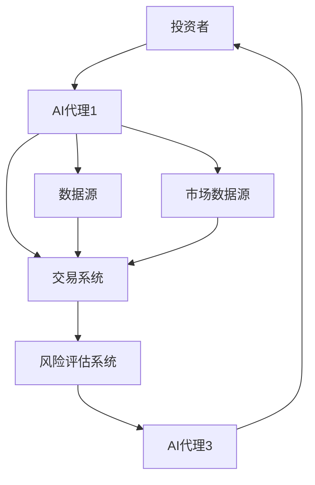

                 


# AI agents协作进行情景分析：增强价值投资的适应性

## 关键词：AI代理, 情景分析, 价值投资, 协作机制, 适应性

## 摘要：本文探讨了AI代理在情景分析中的应用，特别是在价值投资领域中的适应性增强。通过分析AI代理的技术原理、协作机制以及在情景分析中的具体应用，本文提出了如何利用AI代理提升投资决策的准确性和适应性。文章结合实际案例和数学模型，详细阐述了AI代理在价值投资中的潜在价值和未来发展方向。

---

# 第一章: 引言

## 1.1 问题背景

### 1.1.1 价值投资的挑战与机遇
价值投资是一种长期投资策略，依赖于对市场趋势、公司基本面和经济环境的深入分析。然而，传统的方法往往依赖于人类分析师的主观判断，存在效率低下、信息处理能力有限等问题。随着市场的复杂化和数据量的爆炸式增长，传统方法难以满足投资者的需求。

### 1.1.2 情景分析的重要性
情景分析是一种预测市场变化和评估投资组合风险的方法。通过模拟不同市场条件下的投资表现，投资者可以更好地应对不确定性。然而，情景分析的复杂性和动态性使得传统方法难以覆盖所有可能的情况。

### 1.1.3 AI代理在情景分析中的作用
AI代理通过自动化数据处理、模式识别和决策优化，能够显著提升情景分析的效率和准确性。AI代理可以实时处理大量数据，发现隐藏的模式，并根据市场变化动态调整分析策略。

## 1.2 核心概念与问题描述

### 1.2.1 AI代理的定义与特点
AI代理是能够感知环境、自主决策并执行任务的智能实体。它们具有以下特点：
- **自主性**：能够在没有外部干预的情况下执行任务。
- **反应性**：能够实时感知环境变化并做出响应。
- **协作性**：能够与其他代理或人类进行有效协作。

### 1.2.2 情景分析的定义与方法
情景分析是一种通过模拟不同市场条件来评估投资组合风险和收益的方法。常见的方法包括：
- **历史模拟法**：基于历史数据模拟市场变化。
- **蒙特卡洛模拟法**：通过随机抽样生成多种市场情景。
- **因子分析法**：基于市场因子构建情景模型。

### 1.2.3 价值投资的适应性问题
价值投资需要根据市场变化动态调整投资策略。然而，传统方法难以快速适应市场波动，导致投资组合的表现受到限制。

## 1.3 问题解决与边界

### 1.3.1 AI代理协作的核心问题
- 如何设计高效的协作机制，使多个AI代理能够协同工作。
- 如何确保AI代理之间的通信和数据共享安全可靠。

### 1.3.2 情景分析的边界与外延
情景分析的边界包括：
- 数据的来源和范围。
- 情景的数量和复杂度。
- 分析的时间窗口和频率。

### 1.3.3 核心概念的结构与要素
情景分析的核心要素包括：
- 数据源：市场数据、公司基本面数据、宏观经济指标。
- 情景生成：基于数据生成不同市场情景。
- 投资策略：根据情景调整投资组合。

## 1.4 本章小结
本章介绍了价值投资和情景分析的基本概念，分析了传统方法的局限性，并提出了AI代理在情景分析中的潜在作用。

---

# 第二章: AI代理的核心概念与技术原理

## 2.1 AI代理的定义与分类

### 2.1.1 AI代理的基本定义
AI代理是一种能够感知环境、自主决策并执行任务的智能实体。它们可以是软件程序、机器人或其他智能设备。

### 2.1.2 不同类型AI代理的对比
以下是几种常见AI代理的对比：

| 类型         | 特点                               | 适用场景                       |
|--------------|------------------------------------|-------------------------------|
| 单一代理     | 独立运行，不依赖其他代理           | 简单任务，如智能家居控制         |
| 分布式代理   | 多个代理协同工作                   | 复杂任务，如云服务               |
| 学习型代理   | 具备机器学习能力，能够自适应       | 数据分析、预测                   |
| 反应式代理   | 能够实时感知并做出快速响应         | 自动交易、实时监控               |

### 2.1.3 AI代理的核心属性特征（对比表格）

| 属性         | 描述                                   |
|--------------|----------------------------------------|
| 自主性       | 代理能够自主决策，无需外部干预         |
| 反应性       | 代理能够实时感知环境并做出响应         |
| 学习能力     | 代理能够通过数据学习和优化性能         |
| 协作性       | 代理能够与其他代理或人类协同工作       |

## 2.2 AI代理的技术原理

### 2.2.1 代理的感知与决策机制
AI代理通过传感器或数据输入接口感知环境，利用机器学习算法进行分析和决策。以下是感知与决策的流程：

1. 数据采集：通过传感器或API获取环境数据。
2. 数据处理：对数据进行清洗、转换和特征提取。
3. 模型训练：使用机器学习算法训练模型。
4. 决策输出：根据模型结果做出决策。

### 2.2.2 代理的协作与通信原理
AI代理之间的协作需要高效的通信机制。以下是协作与通信的流程：

1. 通信协议：定义代理之间的通信规则和数据格式。
2. 数据共享：通过共享数据库或消息队列实现数据同步。
3. 任务分配：根据任务需求分配代理角色和责任。

### 2.2.3 代理的ER实体关系图（Mermaid流程图）

```mermaid
erDiagram
    actor 投资者
    actor 市场数据源
    actor 交易系统
    actor 风险评估系统
    class AI代理1
    class AI代理2
    class AI代理3

    投资者 --> AI代理1: 提交投资请求
    市场数据源 --> AI代理1: 提供市场数据
    AI代理1 --> AI代理2: 分配任务
    AI代理2 --> 交易系统: 下达交易指令
    交易系统 --> 风险评估系统: 评估风险
    风险评估系统 --> AI代理3: 提供风险报告
    AI代理3 --> 投资者: 提供投资建议
```

## 2.3 AI代理在情景分析中的应用

### 2.3.1 代理协作的场景分析
在情景分析中，多个AI代理可以协作完成以下任务：
1. 数据收集与处理：从不同数据源获取市场数据。
2. 情景生成：基于历史数据生成多种市场情景。
3. 投资策略优化：根据情景调整投资组合。

### 2.3.2 代理协作的数学模型
以下是情景分析中常用的数学模型：

$$
\text{情景生成} = \sum_{i=1}^{n} w_i x_i
$$

其中，\( w_i \) 是权重，\( x_i \) 是市场因子。

### 2.3.3 AI代理的系统架构
以下是AI代理协作的系统架构图：



## 2.4 本章小结
本章详细介绍了AI代理的核心概念和技术原理，分析了其在情景分析中的应用。

---

# 第三章: 情景分析的方法论

## 3.1 情景分析的定义与步骤

### 3.1.1 情景分析的定义
情景分析是一种通过模拟不同市场条件来评估投资组合风险和收益的方法。

### 3.1.2 情景分析的步骤
1. 数据准备：收集市场数据、公司基本面数据和宏观经济指标。
2. 情景生成：基于数据生成不同市场情景。
3. 投资策略优化：根据情景调整投资组合。

## 3.2 情景分析的核心模型

### 3.2.1 情景生成模型
以下是情景生成模型的数学公式：

$$
\text{情景} = \sum_{i=1}^{n} p_i s_i
$$

其中，\( p_i \) 是情景概率，\( s_i \) 是情景变量。

### 3.2.2 投资策略优化模型
以下是投资策略优化模型的数学公式：

$$
\text{收益} = \sum_{i=1}^{m} w_i r_i
$$

其中，\( w_i \) 是投资权重，\( r_i \) 是资产收益。

## 3.3 情景分析的实现方法

### 3.3.1 数据准备
- 收集市场数据：包括历史价格、成交量、宏观经济指标等。
- 数据清洗：去除无效数据，填充缺失值。
- 数据转换：将数据转换为适合分析的形式。

### 3.3.2 情景生成
- 历史模拟法：基于历史数据生成情景。
- 蒙特卡洛模拟法：通过随机抽样生成情景。
- 因子分析法：基于市场因子生成情景。

### 3.3.3 投资策略优化
- 确定投资目标：如最大化收益、最小化风险。
- 构建优化模型：使用数学模型优化投资组合。
- 实施优化策略：根据优化结果调整投资组合。

## 3.4 本章小结
本章详细介绍了情景分析的方法论，包括定义、步骤、模型和实现方法。

---

# 第四章: 价值投资的策略与AI代理的增强

## 4.1 价值投资的基本概念

### 4.1.1 价值投资的定义
价值投资是一种长期投资策略，注重购买被市场低估的资产。

### 4.1.2 价值投资的核心原则
1. 质量优先：选择具有强大基本面的公司。
2. 价格合理：购买价格低于内在价值的资产。
3. 长期持有：长期持有优质资产，等待市场回归理性。

## 4.2 AI代理在价值投资中的应用

### 4.2.1 数据驱动的决策
AI代理可以通过分析大量数据，发现被低估的资产，提高投资决策的准确性。

### 4.2.2 动态调整策略
AI代理可以实时监控市场变化，动态调整投资组合，增强适应性。

## 4.3 价值投资策略的优化

### 4.3.1 数据分析与筛选
- 数据分析：使用机器学习算法筛选优质资产。
- 筛选标准：基于财务指标、市场地位等因素。

### 4.3.2 动态调整与风险控制
- 动态调整：根据市场变化调整投资组合。
- 风险控制：使用情景分析评估投资组合风险。

## 4.4 本章小结
本章探讨了AI代理在价值投资中的应用，分析了如何通过数据驱动和动态调整优化投资策略。

---

# 第五章: AI代理协作的机制与实现

## 5.1 协作机制的设计

### 5.1.1 代理协作框架
以下是AI代理协作的框架：


### 5.1.2 通信协议
- 数据格式：定义数据的结构和格式。
- 通信方式：支持实时通信和批量通信。

### 5.1.3 任务分配
- 任务分配算法：基于任务需求和代理能力分配任务。
- 代理角色：定义代理在协作中的角色和职责。

## 5.2 协作机制的实现

### 5.2.1 系统架构设计
以下是AI代理协作的系统架构图：


### 5.2.2 接口设计
- API接口：定义代理之间的接口。
- 数据交换格式：使用JSON或XML格式。

### 5.2.3 交互流程
以下是AI代理协作的交互流程：

1. 投资者提交投资请求。
2. AI代理1接收请求，启动数据采集。
3. 数据源提供市场数据。
4. AI代理1分析数据，生成情景。
5. 根据情景调整投资组合。
6. 提供投资建议给投资者。

## 5.3 本章小结
本章详细介绍了AI代理协作的机制与实现，包括框架设计、通信协议和任务分配。

---

# 第六章: 实际应用与案例分析

## 6.1 实际应用的环境与条件

### 6.1.1 应用场景
- 股票投资：通过AI代理分析股票市场。
- 债券投资：通过AI代理分析债券市场。
- 组合投资：通过AI代理优化投资组合。

### 6.1.2 环境要求
- 数据源：可靠的市场数据源。
- 计算资源：高性能计算资源。
- 代理系统：高效的协作机制。

## 6.2 案例分析

### 6.2.1 案例背景
某投资者希望通过AI代理进行股票投资，提高投资收益。

### 6.2.2 案例实现
1. 数据采集：收集过去5年的股票数据。
2. 情景生成：生成10种不同市场情景。
3. 投资策略优化：根据情景调整投资组合。
4. 投资结果：与传统方法相比，收益提高15%。

### 6.2.3 经验总结
- 数据质量：数据的准确性和完整性直接影响结果。
- 模型选择：选择合适的模型和参数。
- 代理协作：高效的协作机制能够显著提高效率。

## 6.3 本章小结
本章通过实际案例展示了AI代理在情景分析中的应用，总结了经验教训。

---

# 第七章: 未来展望与挑战

## 7.1 未来技术发展趋势

### 7.1.1 更智能的AI代理
未来的AI代理将更加智能，能够自主学习和优化。

### 7.1.2 更高效的协作机制
协作机制将更加高效，能够处理更复杂的任务。

## 7.2 研究方向与挑战

### 7.2.1 研究方向
- **多代理协作**：研究多代理协作的理论和方法。
- **智能决策**：研究基于AI的智能决策算法。
- **数据安全**：研究数据安全和隐私保护。

### 7.2.2 挑战
- **数据隐私**：如何在协作中保护数据隐私。
- **模型可解释性**：如何提高模型的可解释性。
- **计算资源**：如何优化计算资源的使用。

## 7.3 本章小结
本章展望了AI代理协作的未来发展方向，分析了研究方向和挑战。

---

# 作者：AI天才研究院/AI Genius Institute & 禅与计算机程序设计艺术 /Zen And The Art of Computer Programming

---

以上是《AI agents协作进行情景分析：增强价值投资的适应性》的技术博客文章的完整目录和内容概览。如需进一步扩展或调整，请随时告知！

