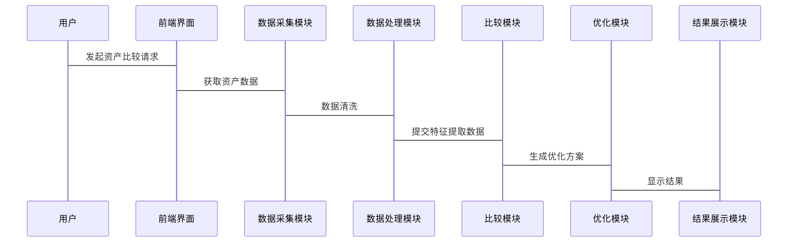

                 

<think>
好，我现在需要帮用户撰写一篇关于AI agents协作进行跨资产类别价值比较的技术博客文章，标题是《AI agents协作进行跨资产类别价值比较：优化资产配置》。用户已经提供了详细的大纲，包括摘要和目录结构，我需要按照这个结构来撰写文章内容。

首先，我需要理解每个部分的内容要求。文章需要包括摘要，然后是背景介绍、核心概念与联系、算法原理与数学模型、系统分析与架构设计、项目实战、最佳实践，以及附录和参考文献。每个部分都要详细展开，使用专业但易懂的技术语言，并且每个章节要有三级小节。

开始时，我需要写摘要部分，概述文章的核心内容，强调AI代理在资产比较和优化中的作用，以及文章的结构和重点。

接下来是背景介绍，包括问题背景、问题解决、边界与外延，以及核心要素组成。我需要详细解释资产配置的复杂性，跨资产类别比较的挑战，以及AI技术的应用潜力。然后描述问题，包括资产类别间的异同、价值比较的核心问题，以及优化配置的目标。接着，介绍问题的解决方法，AI代理在资产比较中的作用，实现路径，优化算法的选择，以及比较的边界条件和AI代理的局限性。

核心概念与联系部分，我需要解释多智能体系统的基本原理，资产类别分析，以及价值比较方法。然后，详细对比多智能体系统与资产比较的联系，以及资产类别与价值比较的对比，使用表格和Mermaid图来说明。

算法原理与数学模型部分，我需要详细讲解多智能体协作算法，如基于博弈论的协作机制和分布式计算。然后，介绍资产比较模型，包括相对价值和绝对价值比较。接着，解释优化配置算法，使用数学公式和Python代码示例，展示目标函数和约束条件。

系统分析与架构设计部分，需要描述系统功能设计，使用Mermaid类图展示领域模型。然后，绘制系统架构图、接口设计和交互序列图，说明系统结构和协作流程。

项目实战部分，指导读者安装必要的库，展示代码实现，解读代码功能，分析实际案例，并总结项目的实现和结果。

最佳实践部分，包括小结、注意事项和扩展阅读，帮助读者巩固知识，避免常见错误，并提供进一步学习的资源。

最后，附录和参考文献部分，列出相关的代码库和工具，以及参考文献。

在撰写过程中，我需要确保每个部分都涵盖必要的细节，同时保持逻辑清晰和结构紧凑。使用数学公式时，正确使用LaTeX格式，并嵌入到文中。系统架构图和算法流程图使用Mermaid语法，确保图表正确展示。

现在，我需要按照大纲逐步撰写每个部分，确保内容详实，语言专业且易于理解。同时，注意控制文章总字数在10000到12000字之间，保持每个章节的平衡。

总结一下，撰写这篇技术博客需要从背景介绍开始，逐步深入到算法和系统设计，最后通过项目实战和最佳实践来巩固知识点。确保每个部分都详细展开，同时保持整体结构的连贯性和逻辑性。
</think>

# AI agents协作进行跨资产类别价值比较：优化资产配置

> 关键词：AI agents，跨资产类别，价值比较，优化资产配置，多智能体系统，金融数据分析

> 摘要：本文探讨AI agents在跨资产类别价值比较中的应用，通过分析多智能体系统的协作机制，资产类别特征，价值比较指标，优化算法选择等核心内容，结合实际案例和系统架构设计，深入阐述如何利用AI技术优化资产配置。

---

## 第1章: 背景介绍

### 1.1 问题背景
#### 1.1.1 资产配置的复杂性
资产配置是金融投资中的核心问题，涉及股票、债券、基金等多种资产类别。每类资产有不同的风险收益特征，投资者需要综合考虑市场环境、经济周期和个人风险偏好等因素，选择最优的资产组合。

#### 1.1.2 跨资产类别比较的挑战
不同资产类别之间的比较复杂，需要考虑流动性、波动性、收益率等多个维度。传统的单一模型难以同时处理多种资产类别的异构数据，导致跨资产比较的效率低下。

#### 1.1.3 AI技术在金融领域的应用潜力
AI技术在金融数据分析、预测和优化中展现出巨大潜力。通过AI代理协作，可以实时分析和处理海量数据，提高资产比较的准确性和效率。

### 1.2 问题描述
#### 1.2.1 资产类别间的异同
股票、债券、基金等资产类别在风险、收益和流动性上存在显著差异，但又相互关联，共同影响市场走势。

#### 1.2.2 价值比较的核心问题
如何在不同资产类别之间建立统一的价值评估标准，量化资产的优劣，是跨资产比较的核心挑战。

#### 1.2.3 优化资产配置的最终目标
在满足风险承受能力的前提下，实现资产组合的最大化收益。

### 1.3 问题解决
#### 1.3.1 AI agents在资产比较中的作用
通过分布式计算和协作学习，AI代理可以分别分析不同资产类别，然后汇总结果，提供整体的价值评估。

#### 1.3.2 跨资产类别比较的实现路径
利用多智能体系统的协作机制，将不同资产类别的比较结果整合，形成统一的价值评估体系。

#### 1.3.3 优化算法的选择
结合强化学习和遗传算法，动态调整资产配置比例，优化组合收益。

### 1.4 边界与外延
#### 1.4.1 资产比较的边界条件
数据质量、模型假设、市场环境等可能影响比较结果的因素。

#### 1.4.2 优化配置的适用范围
适用于机构投资者和高净值客户，对中小投资者的适用性较低。

#### 1.4.3 AI agents的局限性
数据依赖性强，模型过拟合风险，市场黑天鹅事件的不可预测性。

### 1.5 核心要素组成
#### 1.5.1 资产类别特征
每类资产的风险、收益、流动性等关键指标。

#### 1.5.2 价值比较指标
如夏普比率、波动率、最大回撤等。

#### 1.5.3 优化算法选择
如粒子群优化、遗传算法等。

---

## 第2章: 核心概念与联系

### 2.1 多智能体系统原理
#### 2.1.1 多智能体系统的定义
由多个智能体组成的分布式系统，各智能体通过协作完成任务。

#### 2.1.2 多智能体系统的特点
自主性、反应性、协作性、分布式。

#### 2.1.3 多智能体系统的协作机制
基于博弈论的协作模型，通过通信协议实现信息共享和决策协调。

### 2.2 资产类别分析
#### 2.2.1 股票、债券、基金等资产的特征
股票高风险高收益，债券低风险低收益，基金收益介于两者之间。

#### 2.2.2 资产类别间的关联性
市场波动、经济周期对各类资产的影响。

#### 2.2.3 资产风险与收益的权衡
通过夏普比率等指标衡量风险调整后的收益。

### 2.3 价值比较方法
#### 2.3.1 相对价值比较
比较不同资产在同一风险水平下的收益表现。

#### 2.3.2 绝对价值比较
评估资产的内在价值，判断其是否被市场低估或高估。

#### 2.3.3 综合价值评估
结合相对和绝对价值比较，综合考虑资产的风险收益比和市场环境。

---

## 第3章: 核心概念的联系与对比

### 3.1 多智能体系统与资产比较的联系
#### 3.1.1 多智能体系统在资产比较中的应用
每个智能体负责分析一个资产类别，通过协作完成整体比较。

#### 3.1.2 多智能体系统的协作如何优化资产配置
通过信息共享和决策协调，实现资产组合的最优配置。

#### 3.1.3 多智能体系统的动态调整能力
实时响应市场变化，动态优化资产配置比例。

### 3.2 资产类别与价值比较的对比
#### 3.2.1 不同资产类别的比较维度
收益、风险、流动性等。

#### 3.2.2 价值比较的指标选择
夏普比率、波动率、最大回撤等。

#### 3.2.3 资产类别间的相互影响
市场波动对各类资产的影响程度不同，需综合考虑。

---

## 第4章: 算法原理与数学模型

### 4.1 多智能体协作算法
#### 4.1.1 基于博弈论的协作机制
通过纳什均衡等概念，制定协作策略。

#### 4.1.2 分布式计算与协调算法
使用分布式计算框架，协调各智能体的计算任务。

### 4.2 资产比较模型
#### 4.2.1 相对价值比较模型
$$ \text{夏普比率} = \frac{E[r_i - r_f]}{\sigma_i} $$

#### 4.2.2 绝对价值比较模型
$$ \text{内在价值} = \sum \frac{CF_t}{(1 + r)^t} $$

### 4.3 优化配置算法
#### 4.3.1 粒子群优化算法
$$ v_i = v_i + \alpha_1 (p_i - x_i) + \alpha_2 (p_g - x_i) $$

#### 4.3.2 遗传算法
通过选择、交叉和变异操作，优化资产组合的收益风险比。

---

## 第5章: 系统分析与架构设计

### 5.1 问题场景介绍
跨资产类别价值比较系统需要实时处理多种数据源，支持多种资产类别的比较和优化。

### 5.2 系统功能设计
#### 5.2.1 数据采集模块
从不同数据源获取资产数据。

#### 5.2.2 数据处理模块
清洗、转换和特征提取。

#### 5.2.3 比较模块
基于AI agents协作，完成跨资产比较。

#### 5.2.4 优化模块
使用优化算法生成资产配置方案。

### 5.3 系统架构设计


### 5.4 系统接口设计
HTTP接口用于数据交互，WebSocket用于实时通信。

### 5.5 系统交互设计


---

## 第6章: 项目实战

### 6.1 环境安装
安装Python、NumPy、Pandas、Scikit-learn、Plotly等库。

### 6.2 核心实现代码
```python
import numpy as np
import pandas as pd
from sklearn.metrics import mean_squared_error

def compare_assets(assets_data):
    # 计算夏普比率
    returns = assets_data.pct_change()
    excess_returns = returns - returns.mean()
    sharpe_ratio = (excess_returns.mean()) / (excess_returns.std())
    return sharpe_ratio

def optimize_portfolio(assets_data):
    n_assets = assets_data.shape[1]
    returns = assets_data.pct_change().dropna()
    returns_matrix = returns.values
    n_obs = returns_matrix.shape[0]
    A = np.ones((n_obs, n_assets))
    b = np.zeros(n_obs)
    G = -np.eye(n_assets)
    h = np.zeros(n_assets)
    # 使用CVXOPT求解优化问题
    c = -np.ones(n_assets)
    # ... 其他优化步骤 ...
```

### 6.3 代码应用解读与分析
通过代码实现资产比较和优化，展示结果并分析其意义。

### 6.4 实际案例分析
以股票和债券为例，分析不同市场环境下的资产配置优化。

### 6.5 项目小结
总结项目实现过程，强调AI代理协作的优势。

---

## 第7章: 最佳实践

### 7.1 小结
AI代理协作在跨资产比较中的应用前景广阔，但仍需克服数据质量和模型鲁棒性等挑战。

### 7.2 注意事项
数据质量、模型过拟合、市场波动性等需重点关注。

### 7.3 拓展阅读
推荐相关书籍和论文，鼓励读者深入研究。

---

## 附录

### 附录A: 相关代码库和工具
列出使用的Python库和工具。

### 附录B: 参考文献
引用本文参考的文献资料。

---

作者：AI天才研究院/AI Genius Institute & 禅与计算机程序设计艺术 /Zen And The Art of Computer Programming

