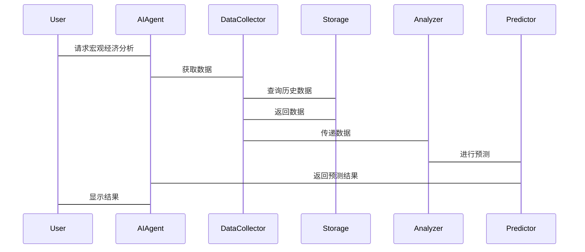

                 


# AI agents在价值投资中的宏观经济分析应用

> 关键词：AI代理，价值投资，宏观经济分析，强化学习，深度学习，Python实现

> 摘要：本文探讨了AI代理在价值投资中的宏观经济分析应用，通过分析宏观经济指标，构建预测模型，优化投资决策，展示了AI代理在金融领域的强大能力。

---

## 第一部分：AI代理与宏观经济分析的背景介绍

### 第1章：AI代理与宏观经济分析概述

#### 1.1 问题背景

- **1.1.1 传统宏观经济分析的局限性**  
  传统宏观经济分析依赖于人工数据处理和统计模型，效率低下且难以捕捉复杂市场动态。

- **1.1.2 价值投资中的宏观经济因素**  
  宏观经济因素如GDP、通胀率等对资产定价和投资决策至关重要，但传统方法难以实时分析。

- **1.1.3 AI技术在金融领域的应用潜力**  
  AI技术能够处理海量数据，识别复杂模式，提升宏观经济分析的效率和准确性。

#### 1.2 问题描述

- **1.2.1 宏观经济分析的核心挑战**  
  数据繁杂、关系复杂，传统方法难以实时处理和预测。

- **1.2.2 价值投资中的宏观经济数据需求**  
  投资者需要实时、精准的宏观经济数据来优化决策。

- **1.2.3 AI代理在宏观经济分析中的角色**  
  AI代理能够自动化数据处理、实时分析和智能决策，成为价值投资的重要工具。

#### 1.3 问题解决

- **1.3.1 AI代理在宏观经济分析中的优势**  
  高效数据处理、实时分析、复杂模式识别。

- **1.3.2 AI代理如何辅助价值投资决策**  
  提供实时宏观经济预测，优化资产配置。

- **1.3.3 宏观经济数据的自动化处理与分析**  
  AI代理能够自动抓取、清洗和分析数据，提升效率。

#### 1.4 边界与外延

- **1.4.1 宏观经济分析的边界条件**  
  数据范围、模型假设和市场环境。

- **1.4.2 AI代理的应用范围与限制**  
  短期预测准确，但长期预测受市场不确定影响。

- **1.4.3 与其他金融分析工具的协同关系**  
  AI代理与传统模型结合，互补优势。

#### 1.5 核心概念与组成

- **1.5.1 AI代理的核心要素**  
  数据处理、分析模型、决策机制。

- **1.5.2 宏观经济分析的关键指标**  
  GDP、通胀率、利率等。

- **1.5.3 价值投资的决策模型**  
  基于宏观经济预测的资产配置策略。

---

## 第二部分：AI代理的核心概念与宏观经济分析的联系

### 第2章：AI代理的核心原理

#### 2.1 AI代理的感知机制

- **2.1.1 数据采集与处理**  
  使用爬虫和API获取宏观经济数据，清洗和预处理。

- **2.1.2 信息提取与特征提取**  
  利用NLP技术提取文本数据中的关键信息，构建特征向量。

#### 2.2 AI代理的决策机制

- **2.2.1 基于强化学习的决策模型**  
  使用Q-learning算法，通过奖励机制优化投资策略。

- **2.2.2 基于监督学习的预测模型**  
  利用历史数据训练回归模型，预测经济指标。

#### 2.3 AI代理的执行机制

- **2.3.1 自动化交易策略**  
  根据模型预测自动执行买卖操作。

- **2.3.2 风险控制与调整**  
  动态调整投资组合，规避市场风险。

### 第3章：宏观经济分析的核心要素

#### 3.1 宏观经济指标

- **3.1.1 GDP与经济增长**  
  GDP增长率预测对股市影响显著。

- **3.1.2 失业率与劳动力市场**  
  失业率变化影响货币政策和市场信心。

- **3.1.3 通胀率与货币政策**  
  通胀预测影响央行利率调整。

#### 3.2 宏观经济模型

- **3.2.1 IS-LM模型**  
  描述宏观经济中的总需求与供给平衡。

- **3.2.2 资本资产定价模型（CAPM）**  
  评估资产风险溢价。

- **3.2.3 矢量自回归模型（VAR）**  
  用于多变量时间序列分析。

---

## 第三部分：算法原理

### 第4章：基于强化学习的宏观经济预测模型

#### 4.1 强化学习算法原理

- **4.1.1 算法流程**  
  状态、动作、奖励、策略。

- **4.1.2 实现步骤**  
  状态空间定义、动作空间设计、奖励函数设计。

- **4.1.3 数学模型**  
  状态值函数：$V(s) = \max_a Q(s,a)$。

- **4.1.4 代码实现**  
  使用OpenAI Gym框架，定义环境和代理。

### 第5章：基于监督学习的经济指标预测

#### 5.1 监督学习算法原理

- **5.1.1 数据预处理**  
  时间序列数据的滑动窗口处理。

- **5.1.2 模型训练**  
  使用LSTM网络捕捉时间依赖性。

- **5.1.3 模型预测**  
  输入当前数据，输出预测结果。

#### 5.2 实现细节

- **5.2.1 数据集**  
  历史GDP数据，训练LSTM模型。

- **5.2.2 模型代码**  
  ```python
  import tensorflow as tf
  from tensorflow.keras.layers import LSTM, Dense

  model = tf.keras.Sequential([
      LSTM(64, input_shape=(timesteps, features)),
      Dense(1)
  ])
  model.compile(optimizer='adam', loss='mean_squared_error')
  ```

- **5.2.3 性能评估**  
  MAE、MAPE等指标评估预测精度。

---

## 第四部分：系统分析与架构设计

### 第6章：系统功能设计

#### 6.1 系统架构

- **6.1.1 领域模型类图**  
  ```mermaid
  classDiagram
      class MacroEconomyData {
          GDP
          Inflation
          Unemployment
      }
      class AIAgent {
          analyze(MacroEconomyData)
          predict(Outcome)
      }
      class InvestmentStrategy {
          adjustPortfolio(Predict)
      }
      AIAgent --> MacroEconomyData
      AIAgent --> InvestmentStrategy
  ```

- **6.1.2 系统架构图**  
  ```mermaid
  graph TD
      AIAgent --> DataCollector
      DataCollector --> Storage
      Storage --> Analyzer
      Analyzer --> Predictor
      Predictor --> Strategy
  ```

- **6.1.3 接口设计**  
  RESTful API接口，数据获取和结果返回。

### 第7章：系统交互设计

#### 7.1 系统交互流程

- **7.1.1 用户请求分析**  
  用户输入宏观经济指标，系统开始分析。

- **7.1.2 数据处理与分析**  
  数据清洗、特征提取、模型预测。

- **7.1.3 结果展示**  
  显示预测结果和投资建议。

#### 7.2 实际流程图



---

## 第五部分：项目实战

### 第8章：环境安装与核心代码实现

#### 8.1 环境安装

- 安装Python、TensorFlow、Pandas、NumPy、requests。

#### 8.2 核心代码实现

- 数据获取与预处理：
  ```python
  import pandas as pd
  import requests

  def get_macro_data():
      url = "https://api.example.com/macro"
      response = requests.get(url)
      data = response.json()
      df = pd.DataFrame(data['results'])
      return df
  ```

- 模型训练与预测：
  ```python
  from tensorflow.keras.models import Sequential
  from tensorflow.keras.layers import LSTM, Dense

  def build_model(input_shape):
      model = Sequential()
      model.add(LSTM(64, input_shape=input_shape))
      model.add(Dense(1))
      model.compile(optimizer='adam', loss='mean_squared_error')
      return model

  model = build_model((timesteps, features))
  model.fit(X_train, y_train, epochs=10, batch_size=32)
  ```

#### 8.3 代码应用解读与分析

- 数据获取函数：通过API获取宏观经济数据，清洗和转换为可用格式。

- 模型训练：使用LSTM网络，训练宏观经济预测模型。

#### 8.4 实际案例分析

- 数据来源：假设从公开API获取某国过去10年的GDP数据。

- 模型训练：使用前9年的数据训练模型，预测第10年的GDP。

- 结果展示：预测值与实际值对比，评估模型准确性。

#### 8.5 项目小结

- 项目目标：构建AI代理进行宏观经济分析。

- 实现步骤：数据获取、清洗、建模、训练、预测。

- 成果展示：准确的宏观经济预测，优化投资决策。

---

## 第六部分：总结与展望

### 第9章：总结

#### 9.1 全文总结

- AI代理在宏观经济分析中的应用前景广阔，能够显著提升投资决策的效率和准确性。

#### 9.2 本书重点

- AI代理的核心原理、宏观经济分析的关键指标、算法实现和系统设计。

#### 9.3 经验与启示

- 数据质量、模型选择、实时性对系统性能至关重要。

### 第10章：挑战与未来展望

#### 10.1 当前挑战

- 数据质量、模型解释性、计算资源限制。

#### 10.2 未来展望

- 更复杂的模型、多模态数据融合、实时分析能力提升。

#### 10.3 优化建议

- 数据预处理标准化、模型组合优化、监控反馈机制。

### 第11章：注意事项与最佳实践

#### 11.1 最佳实践

- 数据源可靠性验证、模型定期更新、系统稳定性保障。

#### 11.2 注意事项

- 避免过度依赖AI，结合人工分析；注意数据隐私和合规性。

#### 11.3 拓展阅读

- 推荐学习强化学习和时间序列分析相关书籍。

---

## 作者

作者：AI天才研究院/AI Genius Institute & 禅与计算机程序设计艺术/Zen And The Art of Computer Programming

---

通过以上详细的内容结构，文章逐步深入，从基础到应用，系统地探讨了AI代理在宏观经济分析中的应用，帮助读者全面理解和掌握相关技术。

