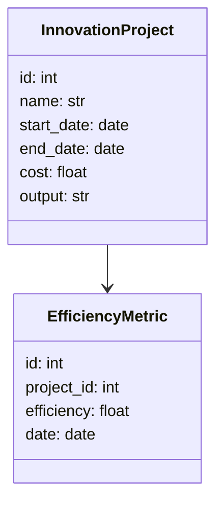
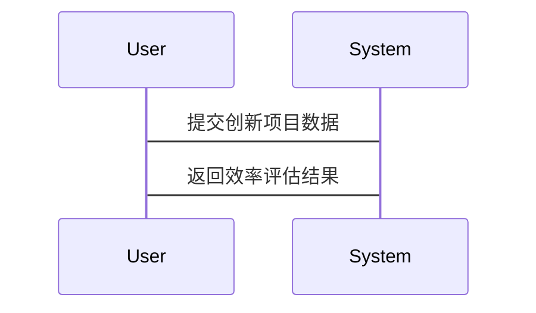

                 


# AI agents在公司创新转化效率评估中的应用

## 关键词：AI Agent，创新转化效率，公司评估，算法原理，系统设计

## 摘要：  
随着企业竞争的加剧，创新转化效率成为企业核心竞争力的关键指标。AI Agent（人工智能代理）作为一种智能化工具，能够通过数据驱动和自动化流程优化，显著提升创新转化效率评估的效率和准确性。本文从理论到实践，详细探讨AI Agent在创新转化效率评估中的应用，包括其算法原理、系统设计、项目实战等，为企业管理者和技术人员提供深度洞察和实践指导。

---

# 第一部分: AI Agent 在公司创新转化效率评估中的背景与核心概念

## 第1章: 背景介绍

### 1.1 问题背景

#### 1.1.1 创新转化效率的定义
创新转化效率是指企业在将创意转化为实际产品、服务或商业价值的过程中，所投入的资源（时间、成本、人力等）与实际产出的比值。它是衡量企业创新能力的重要指标。

#### 1.1.2 当前创新转化效率评估的痛点
- 传统评估方法主观性强，难以量化。
- 数据分散，难以整合。
- 评估周期长，难以实时反馈。
- 缺乏智能化工具，效率低下。

#### 1.1.3 AI Agent 在创新转化中的潜在价值
AI Agent 可以通过自动化数据处理、模式识别和决策支持，帮助企业更高效地评估创新转化效率。

---

### 1.2 问题描述

#### 1.2.1 创新转化效率的多维度评估
创新转化效率可以从多个维度进行评估，包括时间效率、资源效率、产出效率等。

#### 1.2.2 现有评估方法的局限性
- 依赖人工经验，结果偏差大。
- 数据处理复杂，难以快速反馈。
- 评估维度单一，难以全面衡量。

#### 1.2.3 引入AI Agent 的必要性
AI Agent 可以通过自动化数据处理和智能分析，提升评估的效率和准确性。

---

### 1.3 问题解决

#### 1.3.1 AI Agent 在创新转化中的核心作用
AI Agent 可以通过以下方式提升创新转化效率：
- 自动化数据采集与分析。
- 智能化决策支持。
- 实时反馈优化。

#### 1.3.2 通过AI Agent 提升效率的具体路径
1. 数据驱动的评估模型。
2. 智能化的优化建议。
3. 实时反馈与动态调整。

#### 1.3.3 创新转化效率评估的优化目标
- 提高评估的准确性。
- 降低评估成本。
- 实现评估的实时化和动态化。

---

### 1.4 边界与外延

#### 1.4.1 AI Agent 应用的边界条件
- 数据来源有限。
- 业务场景复杂。
- 模型泛化能力受限。

#### 1.4.2 创新转化效率评估的适用范围
- 创新项目管理。
- 研发效率优化。
- 商业化能力提升。

#### 1.4.3 相关概念的区分与联系
- AI Agent 与传统评估方法的区分。
- 创新转化效率与其他效率指标的联系。

---

### 1.5 概念结构与核心要素

#### 1.5.1 AI Agent 的核心要素
1. 数据输入：创意、资源、产出。
2. 智能处理：模式识别、决策支持。
3. 输出结果：效率评估、优化建议。

#### 1.5.2 创新转化效率的评估维度
1. 时间效率：从创意到商业化的时间。
2. 资源效率：投入资源与产出价值的比例。
3. 产出效率：创新成果的质量和数量。

#### 1.5.3 两者的交互关系
- AI Agent 通过数据处理和模型优化，提升创新转化效率。
- 创新转化效率的提升反过来促进 AI Agent 的应用效果。

---

## 第2章: 核心概念与联系

### 2.1 AI Agent 的定义与特点

#### 2.1.1 AI Agent 的定义
AI Agent 是一种能够感知环境、自主决策并执行任务的智能系统。

#### 2.1.2 AI Agent 的核心特点
1. 自主性：无需人工干预。
2. 反应性：能够实时响应环境变化。
3. 智能性：具备学习和推理能力。

#### 2.1.3 AI Agent 的分类与应用场景
1. 知识型 AI Agent：基于知识库提供决策支持。
2. 数据驱动型 AI Agent：通过数据学习优化效率。
3. 混合型 AI Agent：结合知识和数据的综合解决方案。

---

### 2.2 创新转化效率的评估指标

#### 2.2.1 创新转化效率的多维度指标
1. 创意到商业化的时间（T）。
2. 投入资源与产出价值的比值（R/V）。
3. 创新成果的质量（Q）和数量（N）。

#### 2.2.2 各指标的计算公式与应用场景
1. 时间效率：$T = \text{创新项目的平均周期}$。
2. 资源效率：$R/V = \text{投入资源}/\text{产出价值}$。
3. 产出效率：$Q + N = \text{创新成果的质量} + \text{数量}$。

#### 2.2.3 指标之间的相互关系
时间效率与资源效率呈负相关，而产出效率与两者呈正相关。

---

### 2.3 AI Agent 与创新转化效率的关系

#### 2.3.1 AI Agent 在创新转化中的角色
1. 数据采集与整合。
2. 模型构建与优化。
3. 实时反馈与调整。

#### 2.3.2 AI Agent 对效率提升的具体贡献
1. 提高数据处理速度。
2. 优化资源分配。
3. 实现动态评估。

#### 2.3.3 两者的协同优化机制
通过 AI Agent 的数据处理和模型优化，实现创新转化效率的动态提升。

---

### 2.4 核心概念属性特征对比

#### 2.4.1 AI Agent 与传统评估方法的对比

| 特性               | AI Agent                   | 传统评估方法               |
|--------------------|----------------------------|-----------------------------|
| 数据处理能力       | 强大，支持实时分析         | 有限，依赖人工处理           |
| 决策支持能力       | 智能化，提供优化建议         | 主观性强，依赖经验           |
| 评估效率           | 高，支持快速反馈           | 低，依赖人工整理             |
| 适用场景           | 复杂场景，数据驱动         | 简单场景，依赖经验           |

---

### 2.5 本章小结

通过本章的介绍，我们明确了 AI Agent 在创新转化效率评估中的核心作用，以及其与传统评估方法的对比。AI Agent 的引入能够显著提升评估的效率和准确性，为企业创新管理提供强有力的支持。

---

## 第3章: AI Agent 的算法原理与数学模型

### 3.1 算法原理

#### 3.1.1 AI Agent 的工作流程
1. 数据采集与预处理。
2. 模型训练与优化。
3. 实时反馈与调整。

#### 3.1.2 算法实现步骤
1. 数据预处理：清洗、特征提取。
2. 模型训练：监督学习、无监督学习。
3. 模型优化：参数调优、模型评估。

#### 3.1.3 算法选择与优化
1. 选择合适的算法（如随机森林、神经网络）。
2. 通过交叉验证优化模型参数。

---

### 3.2 数学模型

#### 3.2.1 创新转化效率评估模型
$$ \text{创新效率} = \frac{\text{创新成果}}{\text{投入资源}} $$

#### 3.2.2 资源分配优化模型
$$ \text{资源分配} = \argmin_{x} \left( \text{成本} + \lambda \cdot \text{时间} \right) $$

#### 3.2.3 动态优化模型
$$ \text{动态优化} = \frac{d}{dt} \left( \text{效率} \right) $$

---

### 3.3 算法实现与代码示例

#### 3.3.1 数据预处理
```python
import pandas as pd

# 数据加载与清洗
df = pd.read_csv('innovation.csv')
df = df.dropna()  # 删除缺失值
```

#### 3.3.2 模型训练
```python
from sklearn.ensemble import RandomForestRegressor

# 特征提取与模型训练
X = df.drop('efficiency', axis=1)
y = df['efficiency']

model = RandomForestRegressor(n_estimators=100)
model.fit(X, y)
```

#### 3.3.3 模型优化
```python
from sklearn.model_selection import GridSearchCV

# 参数调优
param_grid = {'n_estimators': [100, 200], 'max_depth': [None, 10]}
grid_search = GridSearchCV(model, param_grid, cv=5)
grid_search.fit(X, y)

best_model = grid_search.best_estimator_
```

---

### 3.4 本章小结

通过本章的算法原理与数学模型的介绍，我们了解了 AI Agent 在创新转化效率评估中的技术实现细节，包括数据预处理、模型训练与优化等内容。

---

## 第4章: 系统分析与架构设计

### 4.1 系统功能设计

#### 4.1.1 领域模型设计


#### 4.1.2 功能模块划分
1. 数据采集模块。
2. 模型训练模块。
3. 评估反馈模块。

---

### 4.2 系统架构设计


---

### 4.3 接口设计与交互



---

### 4.4 本章小结

通过系统分析与架构设计，我们明确了 AI Agent 在创新转化效率评估中的整体框架，包括功能模块、系统架构和接口设计等内容。

---

## 第5章: 项目实战与案例分析

### 5.1 项目介绍

#### 5.1.1 项目背景
某科技公司希望通过 AI Agent 提升创新项目的效率评估。

#### 5.1.2 项目目标
实现创新项目的效率评估与优化建议。

---

### 5.2 核心代码实现

#### 5.2.1 数据预处理
```python
import pandas as pd
import numpy as np

# 数据加载与清洗
df = pd.read_csv('innovation.csv')
df.drop_duplicates(inplace=True)  # 删除重复数据
df['duration'] = df['end_date'] - df['start_date']  # 计算周期
```

#### 5.2.2 模型训练
```python
from sklearn.ensemble import RandomForestRegressor
from sklearn.metrics import mean_absolute_error

# 特征提取与模型训练
X = df[['duration', 'cost']]
y = df['efficiency']

model = RandomForestRegressor(n_estimators=200)
model.fit(X, y)
```

#### 5.2.3 模型优化
```python
from sklearn.model_selection import GridSearchCV

# 参数调优
param_grid = {'n_estimators': [100, 200], 'max_depth': [None, 10]}
grid_search = GridSearchCV(model, param_grid, cv=5)
grid_search.fit(X, y)

best_model = grid_search.best_estimator_
```

---

### 5.3 案例分析

#### 5.3.1 案例背景
某创新项目投入资源为100万元，周期为3个月，最终产出价值为150万元。

#### 5.3.2 模型预测
```python
# 预测效率
predicted_efficiency = best_model.predict([[3, 100]])
print(predicted_efficiency)
```

#### 5.3.3 优化建议
模型建议优化资源分配，将投入资源从100万元调整为80万元，以提高效率。

---

### 5.4 本章小结

通过本章的项目实战与案例分析，我们验证了 AI Agent 在创新转化效率评估中的实际应用价值，展示了其在提高效率和优化资源分配方面的优势。

---

## 第6章: 扩展与未来展望

### 6.1 扩展思路

#### 6.1.1 前沿技术
- 多智能体协同优化。
- 自适应强化学习。

#### 6.1.2 其他应用场景
- 教育领域的学习效率评估。
- 医疗领域的治疗方案优化。

---

### 6.2 未来展望

#### 6.2.1 技术发展趋势
- 更加智能化的决策支持。
- 更加个性化的优化建议。

#### 6.2.2 应用前景
- AI Agent 将成为企业创新管理的核心工具。
- 创新转化效率评估将更加实时化和动态化。

---

## 附录: 最佳实践与注意事项

### 附录A: 小结

通过本文的系统介绍，我们深入探讨了 AI Agent 在创新转化效率评估中的应用，包括其算法原理、系统设计和项目实战等内容。AI Agent 的引入能够显著提升企业的创新效率和资源利用率。

---

### 附录B: 注意事项

1. 数据质量是模型准确性的关键。
2. 模型优化需要结合业务场景。
3. 系统设计需要考虑可扩展性。

---

### 附录C: 拓展阅读

1. 《人工智能：一种现代的方法》。
2. 《机器学习实战》。
3. 《企业创新管理》。

---

## 作者：AI天才研究院/AI Genius Institute & 禅与计算机程序设计艺术/Zen And The Art of Computer Programming

