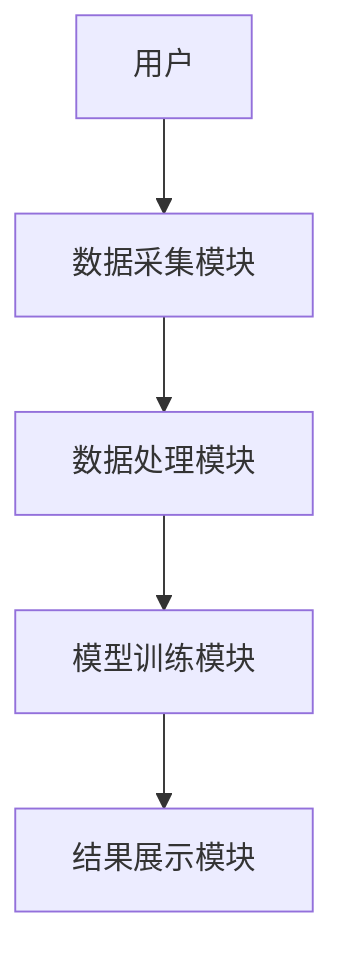

                 

<think>
嗯，用户希望撰写一篇关于AI代理在公司可持续发展目标评估中应用的技术博客。首先，我需要理解这个主题的核心内容，包括AI代理是什么，可持续发展目标如何评估，以及它们如何结合。

首先，我应该确定文章的结构。用户已经提供了大纲，包括摘要、关键词、各章节内容等。我需要确保每个部分都详细且专业，同时使用清晰的技术语言。

接下来，我需要思考每个章节的具体内容。例如，摘要部分需要简明扼要地概括文章的核心内容，关键词要准确反映文章主题。然后，每一章都要有详细的子章节，涵盖背景、原理、应用、算法、系统架构和项目实战。

在写作过程中，要注意使用合适的格式，如使用mermaid图来展示知识图谱和系统架构，用latex公式来解释算法原理。同时，项目实战部分需要提供代码示例，帮助读者理解实现过程。

我还需要确保文章逻辑清晰，结构紧凑，语言简洁易懂。每一部分都要有小结，总结主要观点，帮助读者更好地理解和记忆。

最后，检查文章是否符合字数要求，确保每个部分都详尽且有深度，避免遗漏重要信息。同时，确保结尾有作者信息，符合格式要求。

总之，我需要一步步分析和推理，确保文章内容全面、结构合理，同时满足用户的所有要求。
</think>

# AI代理在公司可持续发展目标进展评估中的应用

> 关键词：AI代理，可持续发展目标，评估方法，人工智能，企业可持续发展

> 摘要：本文探讨了AI代理在公司可持续发展目标进展评估中的应用。通过分析AI代理的核心原理、可持续发展目标的评估框架以及AI代理在评估中的具体应用，本文详细阐述了如何利用AI代理技术提升企业可持续发展目标的评估效率和准确性。文章还结合实际案例，展示了AI代理在数据处理、模型训练与优化、评估结果反馈等环节中的优势，并提出了相关的挑战与解决方案。

---

## 第一部分: AI代理与可持续发展目标评估基础

### 第1章: AI代理与可持续发展目标概述

#### 1.1 AI代理的基本概念

##### 1.1.1 代理的定义与分类
- **定义**：代理（Agent）是指能够感知环境并采取行动以实现目标的实体。
- **分类**：
  - **简单反射代理**：基于当前输入做出反应。
  - **基于模型的反射代理**：利用内部模型进行决策。
  - **目标驱动代理**：根据目标选择行动。
  - **效用驱动代理**：通过最大化效用函数来优化决策。

##### 1.1.2 AI代理的核心特征
- **自主性**：能够在没有外部干预的情况下运作。
- **反应性**：能够感知环境并做出实时响应。
- **目标导向性**：通过设定目标来驱动行为。
- **学习能力**：能够通过数据和经验进行自我优化。

##### 1.1.3 可持续发展目标的基本概念
- **定义**：可持续发展目标是指在经济、社会和环境三个维度上实现平衡发展的长期目标。
- **企业可持续发展**：企业在追求经济效益的同时，关注环境保护和社会责任。
- **重要性**：可持续发展目标是全球关注的焦点，企业需要通过技术手段实现高效评估。

#### 1.2 可持续发展目标评估的背景与意义

##### 1.2.1 可持续发展目标的内涵
- **经济维度**：经济效益的可持续性。
- **社会维度**：社会责任的履行。
- **环境维度**：环境保护与资源高效利用。

##### 1.2.2 企业可持续发展的重要性
- **合规性**：满足相关法律法规的要求。
- **社会责任**：提升企业形象和声誉。
- **竞争优势**：在可持续发展方面表现优异的企业更具竞争力。

##### 1.2.3 AI代理在目标评估中的作用
- **自动化评估**：通过AI代理自动收集和分析数据。
- **实时反馈**：AI代理能够实时监控并提供反馈。
- **优化建议**：基于数据和模型，AI代理可以提供优化建议。

#### 1.3 本章小结
本章介绍了AI代理的基本概念及其在可持续发展目标评估中的作用，为后续章节奠定了基础。

---

## 第二部分: AI代理的核心原理与技术

### 第2章: AI代理的核心原理

#### 2.1 多智能体系统原理

##### 2.1.1 多智能体系统的定义与特点
- **定义**：由多个智能体组成的系统，能够协作完成复杂任务。
- **特点**：
  - **分布性**：智能体独立运作。
  - **协作性**：通过通信和协调完成任务。
  - **反应性**：能够实时感知环境变化。

##### 2.1.2 多智能体系统的协作机制
- **通信协议**：智能体之间通过特定协议进行信息交换。
- **协调算法**：如分布式规划、协商算法等。
- **任务分配**：基于智能体的能力和当前状态分配任务。

##### 2.1.3 多智能体系统的应用场景
- **企业资源管理**：优化资源配置。
- **风险评估**：实时监控并评估潜在风险。
- **决策支持**：辅助企业做出更优决策。

#### 2.2 知识表示与推理

##### 2.2.1 知识表示的基本方法
- **谓词逻辑**：使用谓词和逻辑规则表示知识。
- **语义网络**：通过节点和边表示概念及其关系。
- **知识图谱**：构建结构化的知识库。

##### 2.2.2 推理机制的实现
- **演绎推理**：从一般到特殊的推理。
- **归纳推理**：从具体到一般的推理。
- **溯因推理**：通过假设验证推断原因。

##### 2.2.3 知识图谱的应用
- **数据整合**：将分散的数据整合到统一的知识库中。
- **语义理解**：通过知识图谱实现对数据的深度理解。
- **关联分析**：发现数据之间的潜在关联。

#### 2.3 本章小结
本章详细介绍了多智能体系统和知识表示与推理的核心原理，为后续章节的AI代理应用奠定了理论基础。

---

## 第三部分: 可持续发展目标评估的核心框架

### 第3章: 可持续发展目标评估框架

#### 3.1 可持续发展目标的评估指标

##### 3.1.1 经济、社会、环境三重维度的评估指标
- **经济维度**：如企业利润增长率、员工满意度等。
- **社会维度**：如社会责任履行情况、员工培训投入等。
- **环境维度**：如碳排放量、资源利用率等。

##### 3.1.2 企业可持续发展KPI的定义
- **KPI（关键绩效指标）**：用于衡量企业可持续发展目标的实现情况。
- **KPI的设计原则**：可量化、可测量、可比较。

##### 3.1.3 指标权重的确定方法
- **层次分析法（AHP）**：通过专家打分确定指标权重。
- **熵值法**：基于数据的离散程度确定权重。
- **线性加权法**：根据经验或业务需求设定权重。

#### 3.2 数据来源与处理

##### 3.2.1 数据采集的多源性
- **企业内部数据**：如财务报表、员工数据等。
- **外部数据**：如行业报告、政策文件等。
- **实时数据**：如环境传感器数据、社交媒体数据等。

##### 3.2.2 数据清洗与预处理
- **数据清洗**：去除冗余、重复和错误数据。
- **数据标准化**：将不同量纲的数据进行标准化处理。
- **数据集成**：将分散的数据源进行整合。

##### 3.2.3 数据融合与整合
- **数据融合方法**：如加权融合、特征融合等。
- **数据仓库构建**：将数据组织成易于分析的结构。
- **数据安全与隐私保护**：确保数据处理过程中的安全性和隐私性。

#### 3.3 评估模型的设计

##### 3.3.1 基于AI代理的评估模型
- **模型结构**：基于知识图谱和多智能体系统构建评估模型。
- **模型训练**：使用历史数据对模型进行训练和优化。
- **模型验证**：通过交叉验证等方法评估模型的准确性。

##### 3.3.2 模型的训练与优化
- **监督学习**：使用标注数据进行模型训练。
- **无监督学习**：发现数据中的潜在模式。
- **强化学习**：通过奖励机制优化模型行为。

##### 3.3.3 模型的验证与评估
- **准确率**：模型预测的正确性。
- **召回率**：模型识别目标的能力。
- **F1分数**：综合准确率和召回率的指标。

#### 3.4 本章小结
本章详细介绍了可持续发展目标评估的核心框架，包括指标体系、数据处理和模型设计等内容。

---

## 第四部分: AI代理在可持续发展目标评估中的应用

### 第4章: AI代理在目标评估中的具体应用

#### 4.1 数据收集与处理

##### 4.1.1 基于AI代理的数据采集方法
- **自然语言处理（NLP）**：从文本数据中提取有用信息。
- **计算机视觉（CV）**：从图像数据中获取信息。
- **机器学习模型**：通过模型预测和生成数据。

##### 4.1.2 数据清洗与预处理的自动化
- **自动化脚本**：使用Python脚本自动清洗数据。
- **规则引擎**：基于预定义规则进行数据处理。
- **并行处理**：利用多线程或多进程加速数据处理。

##### 4.1.3 数据融合的优化策略
- **基于图的融合**：利用知识图谱进行数据融合。
- **基于规则的融合**：根据业务规则进行数据整合。
- **基于模型的融合**：使用机器学习模型进行数据融合。

#### 4.2 目标评估与分析

##### 4.2.1 基于AI代理的评估模型实现
- **模型实现**：使用深度学习框架（如TensorFlow、PyTorch）构建评估模型。
- **模型输入**：输入企业相关的数据，如财务数据、员工数据等。
- **模型输出**：输出评估结果，如可持续发展指数、排名等。

##### 4.2.2 多维度指标的权重分配
- **权重分配方法**：如层次分析法、熵值法等。
- **动态权重调整**：根据实际情况动态调整指标权重。
- **权重可视化**：通过图表展示各指标的权重分布。

##### 4.2.3 评估结果的可视化
- **图表展示**：使用折线图、柱状图、雷达图等展示评估结果。
- **仪表盘设计**：构建可视化仪表盘，实时展示评估结果。
- **结果解读**：对评估结果进行深入解读，提出改进建议。

#### 4.3 反馈与优化

##### 4.3.1 评估结果的反馈机制
- **实时反馈**：AI代理实时监控并反馈评估结果。
- **定期报告**：生成定期评估报告，供企业管理层参考。
- **动态调整**：根据反馈结果动态调整评估模型和参数。

##### 4.3.2 模型的优化策略
- **超参数优化**：通过网格搜索、随机搜索等方法优化模型参数。
- **模型集成**：通过集成学习提升模型性能。
- **持续学习**：模型在实际应用中不断学习新的数据，提升性能。

##### 4.3.3 持续改进措施
- **数据增强**：通过数据增强技术提升模型的泛化能力。
- **模型迭代**：定期更新模型，确保其适应新数据和新需求。
- **反馈循环**：建立反馈循环，确保模型持续优化。

#### 4.4 本章小结
本章详细介绍了AI代理在可持续发展目标评估中的具体应用，包括数据处理、模型实现和结果反馈等环节。

---

## 第五章: AI代理在可持续发展目标评估中的算法实现

### 5.1 算法原理与实现

#### 5.1.1 基于强化学习的评估算法
- **算法原理**：通过奖励机制优化评估过程。
- **算法实现**：使用深度强化学习框架（如DQN）实现评估算法。
- **算法优化**：通过网络结构优化、经验回放等方法提升算法性能。

#### 5.1.2 基于遗传算法的参数优化
- **遗传算法原理**：通过模拟自然选择和遗传过程优化参数。
- **算法实现**：使用Python的遗传算法库（如DEAP）实现参数优化。
- **算法应用**：将遗传算法应用于模型参数优化，提升评估结果的准确性。

#### 5.1.3 基于贝叶斯网络的不确定性分析
- **贝叶斯网络原理**：通过概率推理分析评估过程中的不确定性。
- **算法实现**：使用贝叶斯网络工具（如PyMC）构建概率模型。
- **算法应用**：通过概率模型分析评估结果的不确定性，提供更可靠的评估结果。

### 5.2 算法实现代码示例

#### 5.2.1 基于强化学习的评估算法实现
```python
import numpy as np
import tensorflow as tf

# 定义DQN网络
class DQNAgent:
    def __init__(self, state_space, action_space, learning_rate):
        self.state_space = state_space
        self.action_space = action_space
        self.learning_rate = learning_rate
        # 状态空间输入层
        self.inputs = tf.keras.Input(shape=(state_space,))
        # 隐藏层
        self.hidden1 = tf.keras.layers.Dense(24, activation='relu')(self.inputs)
        self.hidden2 = tf.keras.layers.Dense(24, activation='relu')(self.hidden1)
        # 输出层
        self.outputs = tf.keras.layers.Dense(action_space, activation='linear')(self.hidden2)
        # 编译模型
        self.model = tf.keras.Model(inputs=self.inputs, outputs=self.outputs)
        self.model.compile(optimizer=tf.keras.optimizers.Adam(learning_rate), loss='mse')

    # 动作选择
    def act(self, state):
        state = np.array(state)
        prediction = self.model.predict(state[np.newaxis])
        return np.argmax(prediction[0])

    # 模型训练
    def train(self, states, targets):
        self.model.fit(states, targets, epochs=1, verbose=0)
```

#### 5.2.2 基于遗传算法的参数优化实现
```python
from deap import base, creator, tools

# 定义适应度函数
def fitness(individual):
    # individual是一个包含参数的列表
    # 返回适应度值，值越小越好
    return (sum(individual),)

# 初始化种群
population = []
for _ in range(10):
    individual = [np.random.random() for _ in range(5)]
    population.append(individual)

# 定义遗传操作
toolbox = base.Toolbox()
toolbox.register("select", tools.selTournament, k=3)
toolbox.register("mate", tools.crossover, 0.5)
toolbox.register("mutate", tools.mutGaussian, sigma=0.5)

# 进化过程
for generation in range(100):
    # 选择
    selected = toolbox.select(population, 5)
    # 交叉
    offspring = [toolbox.mate(individuals) for individuals in selected]
    # 变异
    offspring = [toolbox.mutate(individual) for individual in offspring]
    # 更新种群
    population = offspring

# 获取最优解
best = min(population, key=lambda x: x[0])
print("最优参数：", best)
```

#### 5.2.3 基于贝叶斯网络的不确定性分析实现
```python
import pymc as pm

# 定义贝叶斯模型
with pm.Model() as model:
    # �先验分布
    alpha = pm.Normal('alpha', mu=0, sigma=10)
    beta = pm.Normal('beta', mu=0, sigma=10)
    # 似然函数
    y_obs = pm.Normal('y_obs', mu=alpha + beta, sigma=1, observed=data)

# 推断参数
with model:
    trace = pm.sample(1000, tune=1000)

# 分析结果
pm.summary(trace)
```

### 5.3 算法实现的详细说明

#### 5.3.1 基于强化学习的评估算法
- **算法特点**：通过奖励机制优化评估过程，适用于动态环境下的评估。
- **实现细节**：使用深度神经网络进行状态和动作的映射，通过经验回放提升算法的稳定性和收敛性。

#### 5.3.2 基于遗传算法的参数优化
- **算法特点**：通过模拟自然选择和遗传过程优化模型参数，适用于多维参数优化问题。
- **实现细节**：定义适应度函数，选择、交叉和变异操作，通过迭代过程优化参数。

#### 5.3.3 基于贝叶斯网络的不确定性分析
- **算法特点**：通过概率推理分析评估过程中的不确定性，提供更可靠的评估结果。
- **实现细节**：构建贝叶斯网络模型，通过马尔可夫链蒙特卡洛方法进行参数推断，分析各变量之间的依赖关系。

### 5.4 本章小结
本章详细介绍了AI代理在可持续发展目标评估中的算法实现，包括强化学习、遗传算法和贝叶斯网络的应用，并通过代码示例展示了具体的实现过程。

---

## 第六章: 可持续发展目标评估的系统架构与设计

### 6.1 系统功能设计

#### 6.1.1 领域模型设计
- **领域模型**：构建企业可持续发展目标评估的领域模型，包括数据采集、数据处理、模型训练和结果展示等功能模块。
- **模块划分**：
  - 数据采集模块：负责从多源数据中采集数据。
  - 数据处理模块：对数据进行清洗、预处理和融合。
  - 模型训练模块：基于训练数据训练评估模型。
  - 结果展示模块：将评估结果以可视化形式展示。

#### 6.1.2 功能模块实现
- **数据采集模块**：使用爬虫、API接口等方式采集数据。
- **数据处理模块**：使用Python的Pandas库进行数据清洗和预处理。
- **模型训练模块**：使用深度学习框架（如TensorFlow、Keras）训练评估模型。
- **结果展示模块**：使用可视化工具（如Matplotlib、Plotly）展示评估结果。

### 6.2 系统架构设计

#### 6.2.1 系统架构图


#### 6.2.2 系统接口设计
- **数据采集接口**：提供API接口供其他系统调用，获取实时数据。
- **模型训练接口**：提供训练接口，接收训练数据并返回训练好的模型。
- **结果展示接口**：提供可视化接口，展示评估结果。

#### 6.2.3 系统交互设计
- **用户交互流程**：
  1. 用户输入评估需求。
  2. 系统调用数据采集模块获取数据。
  3. 数据处理模块对数据进行清洗和预处理。
  4. 模型训练模块训练评估模型。
  5. 结果展示模块展示评估结果。
- **系统反馈机制**：系统根据评估结果提供反馈，优化模型参数和评估过程。

### 6.3 本章小结
本章详细介绍了可持续发展目标评估系统的功能设计和系统架构，为后续章节的项目实战奠定了基础。

---

## 第七章: 项目实战与案例分析

### 7.1 项目环境安装与配置

#### 7.1.1 安装依赖库
- **Python环境**：安装Python 3.8及以上版本。
- **依赖库安装**：使用pip安装以下库：
  ```
  pip install numpy pandas matplotlib scikit-learn tensorflow keras pymc
  ```

#### 7.1.2 系统配置
- **配置文件**：创建配置文件，设置数据源、模型参数等。
- **环境变量**：配置环境变量，如GPU支持、路径设置等。

### 7.2 系统核心实现

#### 7.2.1 数据采集模块实现
```python
import requests

def fetch_data(api_url):
    try:
        response = requests.get(api_url)
        if response.status_code == 200:
            return response.json()
        else:
            return None
    except Exception as e:
        print(f"数据获取失败：{e}")
        return None
```

#### 7.2.2 数据处理模块实现
```python
import pandas as pd

def preprocess_data(data):
    df = pd.DataFrame(data)
    # 删除缺失值
    df.dropna(inplace=True)
    # 标准化处理
    from sklearn.preprocessing import StandardScaler
    scaler = StandardScaler()
    df[['feature1', 'feature2']] = scaler.fit_transform(df[['feature1', 'feature2']])
    return df
```

#### 7.2.3 模型训练模块实现
```python
from tensorflow.keras import layers

def build_model(input_dim, output_dim):
    model = tf.keras.Sequential()
    model.add(layers.Dense(64, activation='relu', input_dim=input_dim))
    model.add(layers.Dense(32, activation='relu'))
    model.add(layers.Dense(output_dim, activation='sigmoid'))
    model.compile(optimizer='adam', loss='binary_crossentropy', metrics=['accuracy'])
    return model
```

#### 7.2.4 结果展示模块实现
```python
import matplotlib.pyplot as plt

def visualize_results(results):
    plt.figure(figsize=(10, 6))
    plt.plot(results.history['accuracy'], label='训练准确率')
    plt.plot(results.history['val_accuracy'], label='验证准确率')
    plt.title('训练与验证准确率对比')
    plt.xlabel('训练轮数')
    plt.ylabel('准确率')
    plt.legend()
    plt.show()
```

### 7.3 项目实战与案例分析

#### 7.3.1 项目实施流程
- **需求分析**：明确评估目标和数据需求。
- **数据采集**：从多源数据中采集相关数据。
- **数据处理**：清洗、预处理和融合数据。
- **模型训练**：基于处理后的数据训练评估模型。
- **结果展示**：将评估结果以可视化形式展示。

#### 7.3.2 案例分析
- **案例背景**：某企业希望评估其可持续发展目标的实现情况。
- **数据来源**：包括财务数据、员工数据、环境数据等。
- **评估过程**：通过AI代理自动采集和处理数据，训练评估模型，生成评估报告。
- **结果解读**：根据评估结果提出改进建议，优化企业的可持续发展战略。

#### 7.3.3 项目小结
本章通过实际案例展示了AI代理在可持续发展目标评估中的应用，详细介绍了项目的实施流程和具体实现方法。

---

## 第八章: 总结与展望

### 8.1 总结

#### 8.1.1 核心内容回顾
- AI代理的核心原理。
- 可持续发展目标评估的核心框架。
- AI代理在评估中的具体应用。

#### 8.1.2 实践中的注意事项
- 数据质量的重要性。
- 模型选择与优化。
- 系统架构设计的合理性。

### 8.2 展望

#### 8.2.1 未来的研究方向
- 更高效的数据处理方法。
- 更智能的模型优化算法。
- 更人性化的结果展示方式。

#### 8.2.2 可能的挑战与解决方案
- **数据隐私问题**：通过加密技术保护数据隐私。
- **模型解释性问题**：通过可解释性模型提升模型的透明度。
- **计算资源限制**：通过分布式计算和边缘计算优化资源利用率。

### 8.3 本章小结
本章总结了全文的主要内容，并展望了未来的研究方向和挑战，为读者提供了进一步学习和研究的参考。

---

## 作者信息

作者：AI天才研究院/AI Genius Institute & 禅与计算机程序设计艺术 /Zen And The Art of Computer Programming

