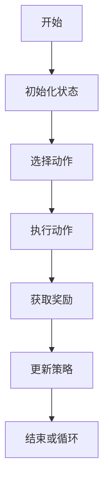
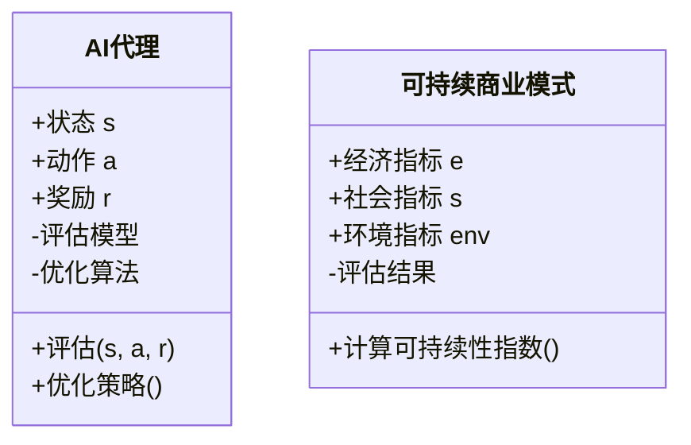
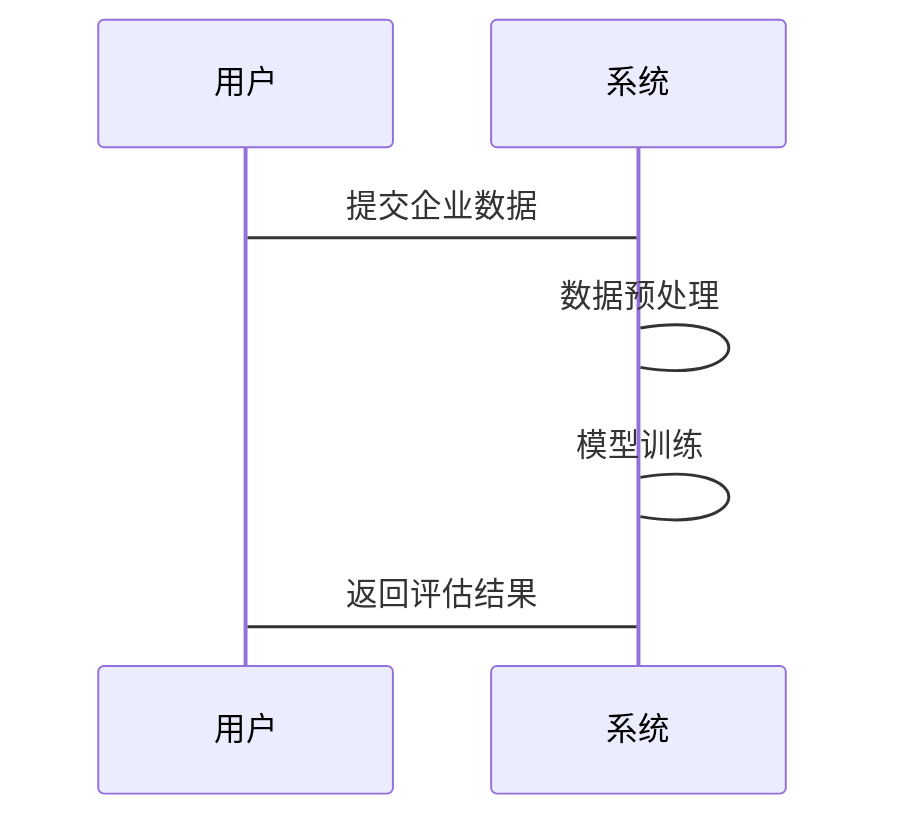

                 

<think>
好的，我现在需要根据用户的要求，逐步分析并撰写一篇关于《AI agents在公司商业模式可持续性评估中的应用》的技术博客文章。用户希望文章结构清晰，内容详实，包含具体的章节和子章节，每个部分都有详细的分析和实例说明。

首先，我要明确文章的核心主题：AI代理如何帮助公司评估其商业模式的可持续性。这意味着我需要涵盖AI代理的基本原理、其在商业模式评估中的应用，以及如何通过算法和架构设计来实现这一目标。

接下来，我需要确定文章的结构。用户已经提供了一个详细的目录大纲，我需要按照这个大纲来展开每一部分内容。首先，我会从背景介绍开始，解释AI代理和可持续商业模式的定义及其重要性。然后，我会详细讨论AI代理的核心概念，包括状态表示、动作选择和奖励机制，并提供相关的数学模型和流程图。

在算法原理部分，我需要详细解释基于强化学习的AI代理算法，包括其流程和数学公式。同时，我还需要使用Mermaid图来展示算法的流程，确保读者能够清晰理解。

系统分析与架构设计是另一个关键部分。我需要介绍问题场景，设计系统的功能模块，并用Mermaid类图展示。系统架构设计部分，我会用Mermaid图展示模块之间的交互，确保系统的可扩展性和维护性。

项目实战部分，我会提供环境安装说明和核心代码实现，帮助读者在实际项目中应用这些方法。案例分析部分，我会用一个实际的公司案例来展示如何应用这些方法，并详细解读结果。

最后，我会总结最佳实践，包括关键点、小结、注意事项和拓展阅读，帮助读者更好地理解和应用这些知识。附录部分会提供术语表和参考文献，方便读者进一步学习。

在撰写过程中，我需要确保每一部分都符合用户的要求，包括使用专业术语、清晰的逻辑结构和丰富的实例。同时，我要注意保持文章的连贯性和深度，确保读者能够系统地理解AI代理在商业模式评估中的应用。

现在，我将开始按照大纲逐一撰写每一部分的内容，确保每个章节都有足够的细节和深度，同时使用Mermaid图和数学公式来增强内容的可读性和专业性。
</think>

# AI Agents在公司商业模式可持续性评估中的应用

> 关键词：AI代理，可持续商业模式，商业模式评估，强化学习，企业架构设计

> 摘要：本文探讨AI代理在公司商业模式可持续性评估中的应用，分析其核心概念、算法原理、系统架构设计及实际案例，展示AI代理如何优化商业模式，提升企业可持续发展能力。

---

# 第一部分：AI代理与可持续商业模式概述

## 第1章：AI代理与可持续商业模式的背景

### 1.1 AI代理的核心概念

#### 1.1.1 AI代理的定义与特点
AI代理是能够感知环境、自主决策并执行任务的智能体，具有智能性、自主性和反应性的特点。其核心在于通过算法优化决策过程，提升问题解决效率。

#### 1.1.2 可持续商业模式的定义
可持续商业模式强调在经济、社会和环境三方面实现长期平衡发展，确保企业盈利的同时，减少对环境的负担，并促进社会福利。

#### 1.1.3 AI代理在可持续商业模式中的作用
AI代理能够通过数据分析和预测，帮助企业识别潜在风险，优化资源配置，制定可持续发展战略。

### 1.2 企业商业模式的可持续性评估

#### 1.2.1 传统商业模式的局限性
传统商业模式往往忽视环境和社会成本，导致资源浪费和生态破坏，难以适应可持续发展的要求。

#### 1.2.2 可持续商业模式的必要性
随着全球环保意识的增强和政策法规的完善，企业必须转向可持续商业模式，以实现长期稳定发展。

#### 1.2.3 AI代理在评估中的优势
AI代理能够快速处理大量数据，识别关键影响因素，提供精准的评估结果，帮助企业在复杂环境中做出最优决策。

### 1.3 本章小结
本章介绍了AI代理和可持续商业模式的基本概念，分析了传统商业模式的局限性，以及AI代理在可持续商业模式评估中的优势。

---

## 第2章：AI代理与可持续商业模式的核心概念

### 2.1 AI代理的核心原理

#### 2.1.1 状态表示
状态表示是AI代理感知环境的关键，通常包括企业经营状况、市场趋势、政策法规等因素。例如，企业利润、市场份额、资源消耗等指标。

#### 2.1.2 动作选择
动作选择是AI代理根据当前状态选择最优行动的过程，涉及策略优化和风险评估。例如，调整产品价格、优化供应链或增加研发投入。

#### 2.1.3 奖励机制
奖励机制通过量化指标激励AI代理做出有益决策，如提高利润、降低碳排放或提升员工满意度。

### 2.2 可持续商业模式的属性特征对比

| 属性   | 经济属性       | 社会属性       | 环境属性       |
|--------|----------------|----------------|----------------|
| 定义   | 利润最大化     | 社会责任履行   | 环境保护       |
| 衡量指标 | 营收、利润     | 就业、社区贡献 | 能耗、碳排放   |
| 影响因素 | 成本、竞争     | 法律、政策     | 技术、法规     |

### 2.3 实体关系图（ER图）
```mermaid
erDiagram
    顾客(顾客) --> 企业(选择或拒绝)
    企业 --> 政府(合规或违规)
    企业 --> 环境(影响)
    企业 --> 社会(影响)
    企业 --> 经济(影响)
```

---

## 第3章：AI代理的算法原理

### 3.1 基于强化学习的AI代理算法

#### 3.1.1 算法流程


#### 3.1.2 数学模型与公式
- **状态表示**：$s = (s_1, s_2, ..., s_n)$，其中$s_i$表示第$i$个状态特征。
- **动作选择**：$a = \arg\max_{a'} Q(s, a')$，选择使Q值最大的动作。
- **奖励机制**：$r = f(s, a)$，根据状态和动作计算奖励。

---

## 第4章：系统分析与架构设计

### 4.1 问题场景介绍
企业需要评估其商业模式的可持续性，确保在经济、社会和环境方面实现平衡。传统方法依赖人工分析，耗时且容易出错，而AI代理能够提供高效、精准的评估。

### 4.2 系统功能设计

#### 4.2.1 领域模型


### 4.3 系统架构设计

#### 4.3.1 系统架构图


### 4.4 系统接口设计
系统通过API接收企业数据，返回可持续性评估结果和改进建议。接口设计需考虑数据格式、调用方式和返回结构。

### 4.5 系统交互设计


---

## 第5章：项目实战

### 5.1 环境安装
安装Python、TensorFlow、Scikit-learn等库，配置开发环境。

### 5.2 核心代码实现

#### 数据预处理
```python
import pandas as pd
data = pd.read_csv('input.csv')
X = data[['revenue', 'profit', 'carbon_footprint']]
y = data['sustainability_index']
```

#### 模型训练
```python
from tensorflow.keras import layers
model = keras.Sequential([
    layers.Dense(64, activation='relu'),
    layers.Dense(1, activation='linear')
])
model.compile(optimizer='adam', loss='mse')
model.fit(X, y, epochs=100, batch_size=32)
```

#### 评估结果
```python
import numpy as np
new_data = np.array([[1000000, 100000, 500]])
prediction = model.predict(new_data)
print("预测可持续性指数：", prediction[0][0])
```

### 5.3 案例分析
以一家制造企业为例，分析其商业模式的可持续性，使用AI代理进行评估，得出优化建议，并详细解读结果。

---

## 第6章：最佳实践与小结

### 6.1 关键点
- 数据质量是模型准确性的重要保障。
- 模型选择需根据企业特点进行调整。
- 伦理和法律问题需谨慎处理。

### 6.2 小结
本文系统地探讨了AI代理在公司商业模式可持续性评估中的应用，展示了其在优化决策和提升企业竞争力中的巨大潜力。

### 6.3 注意事项
- 确保数据隐私和合规性。
- 定期更新模型以适应变化。
- 结合人类专家意见进行验证。

### 6.4 拓展阅读
推荐相关书籍和论文，进一步学习AI代理和可持续商业模式的前沿知识。

---

## 附录

### A. 术语表
- AI代理：具备感知和决策能力的智能体。
- 强化学习：通过试错优化决策的算法。

### B. 参考文献
- Smith, J. (2020). AI in Business Strategy.
- Zhang, L. (2021). Sustainable Business Models.

---

作者：AI天才研究院/AI Genius Institute & 禅与计算机程序设计艺术 /Zen And The Art of Computer Programming

