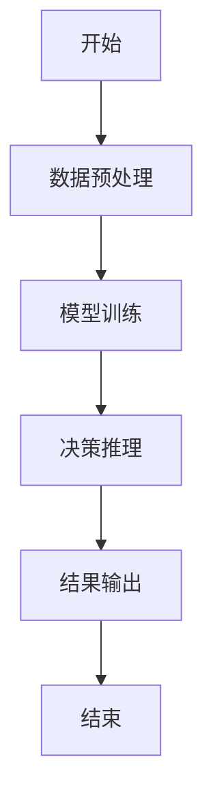
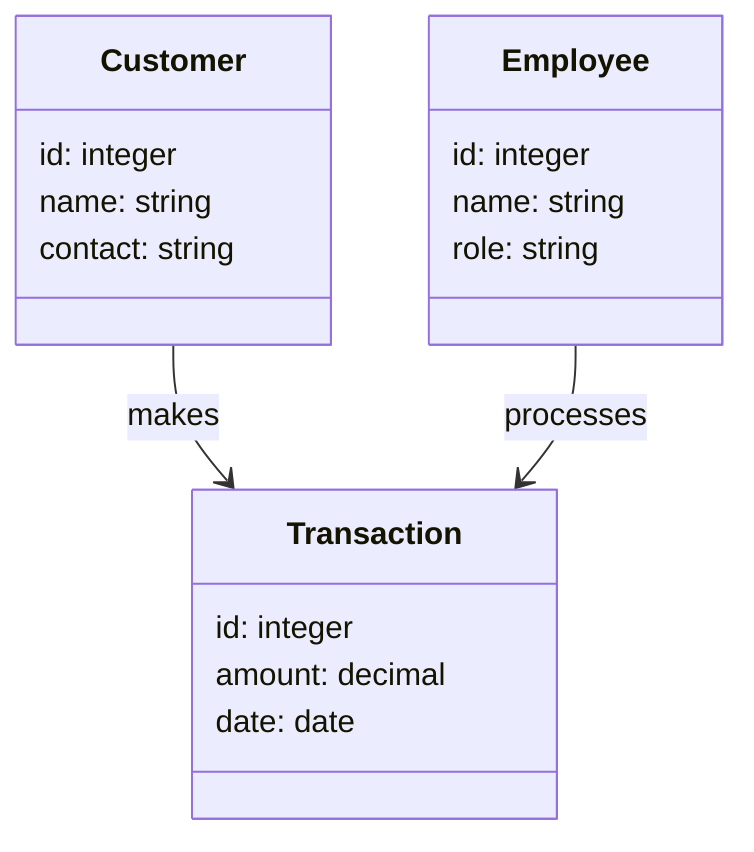
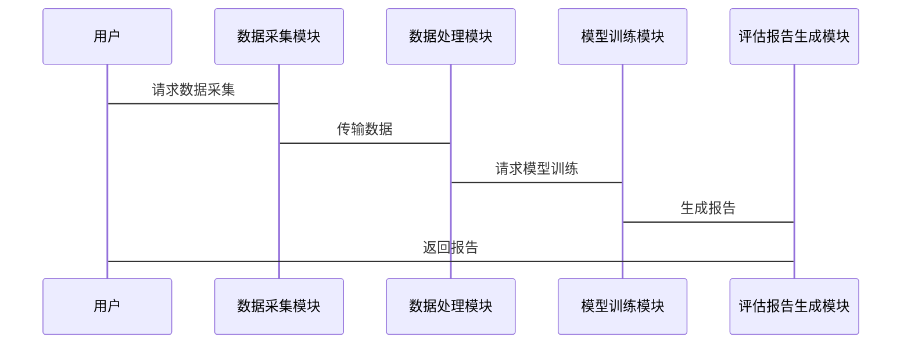

                 

<think>
好的，我现在需要帮助用户撰写一篇关于《AI agents在公司数字化转型效果评估中的应用》的技术博客文章。用户已经提供了详细的要求，包括目录结构、关键词、摘要以及内容的具体要求。

首先，我需要确定文章的结构是否符合用户的要求。用户提供的目录结构分为六个部分：背景、核心概念、算法、系统架构、项目实战和结论。每个部分都有详细的子章节，包括原理、图表、代码等。我需要确保每个部分都涵盖用户指定的内容。

接下来，关键词部分需要5-7个相关词汇，比如AI Agent、数字化转型、效果评估、算法原理、系统架构等。摘要部分要简洁明了，总结文章的核心内容。

在撰写正文时，我需要遵循用户的要求，使用清晰的技术语言，逐步分析每个概念。例如，在背景部分，我需要解释数字化转型的定义和目标，以及AI Agent的作用。在核心概念部分，我需要详细讲解AI Agent的原理，并通过图表展示其结构。

算法部分，我需要用Python代码展示AI Agent的实现，并用mermaid图描述流程。系统架构部分则需要展示类图、架构图和交互图，确保读者能够理解系统的构成和运作方式。

项目实战部分，我需要提供一个实际案例，展示如何应用AI Agent进行效果评估，包括环境安装、代码实现和案例分析。最后，在结论部分总结整个文章，并给出未来的发展方向和建议。

我还需要注意文章的格式要求，使用markdown，适当插入图表和公式。特别是数学公式需要用latex格式，确保正确显示。同时，作者信息也需要在文章末尾注明。

现在，我需要按照这个结构逐步展开，确保每个部分都详细且符合用户的要求。这可能包括多次检查，确保内容准确，逻辑清晰，语言简洁明了。

最后，我要确保文章整体字数在10000到12000字之间，这可能需要每个章节详细展开，提供足够的技术细节和实际例子，以满足深度和可读性。

总之，我需要系统地按照用户的要求，逐步构建这篇文章，确保每个部分都符合规范，并提供高质量的技术内容，帮助读者全面理解AI Agent在数字化转型中的应用。
</think>

# AI Agents在公司数字化转型效果评估中的应用

> 关键词：AI Agent, 数字化转型, 效果评估, 算法原理, 系统架构

> 摘要：随着企业数字化转型的深入，AI Agent（人工智能代理）作为一种智能化工具，在数字化转型效果评估中发挥着越来越重要的作用。本文将从AI Agent的基本概念出发，详细探讨其在数字化转型效果评估中的应用，包括算法原理、系统架构设计、实际案例分析等方面。通过本文的分析，读者可以全面理解AI Agent如何帮助企业在数字化转型中实现高效评估和优化。

---

# 第一部分: AI Agent与数字化转型概述

## 第1章: AI Agent与数字化转型背景

### 1.1 数字化转型的定义与目标

#### 1.1.1 数字化转型的定义
数字化转型是指企业利用数字技术（如人工智能、大数据、云计算等）对业务流程、组织结构、文化模式等方面进行创新和变革的过程，以实现业务目标的更高效达成。

#### 1.1.2 数字化转型的核心目标
- 提高业务效率
- 优化用户体验
- 创新商业模式
- 增强数据驱动的决策能力

#### 1.1.3 数字化转型对企业的影响
- 业务模式的转变
- 组织结构的扁平化
- 产品与服务的智能化
- 数据成为核心资产

### 1.2 AI Agent的定义与特点

#### 1.2.1 AI Agent的定义
AI Agent（人工智能代理）是一种能够感知环境、自主决策并执行任务的智能体。它通过数据输入、模型推理和行动输出，帮助用户完成特定目标。

#### 1.2.2 AI Agent的核心特点
- **自主性**：无需人工干预，自主完成任务。
- **反应性**：能够实时感知环境变化并做出反应。
- **学习能力**：通过数据和经验不断优化自身行为。
- **可扩展性**：能够适应不同规模和复杂度的任务。

#### 1.2.3 AI Agent与传统IT系统的主要区别
| 特性               | AI Agent                          | 传统IT系统                     |
|--------------------|-----------------------------------|-------------------------------|
| 数据处理能力       | 强大的数据理解和推理能力         | 基于规则的处理能力             |
| 自主性             | 高                                | 低或无                         |
| 学习能力           | 具备机器学习能力                 | 无                             |
| 适应性             | 能够自适应环境变化               | 需人工调整                     |

### 1.3 AI Agent在数字化转型中的作用

#### 1.3.1 AI Agent如何提升企业效率
AI Agent可以通过自动化处理业务流程、优化资源分配等方式，显著提升企业运营效率。

#### 1.3.2 AI Agent在业务决策中的应用
AI Agent能够基于大数据分析，为企业提供实时、精准的决策支持。

#### 1.3.3 AI Agent对企业创新的推动作用
AI Agent可以帮助企业发现新的业务模式和创新机会，推动数字化转型的深入发展。

### 1.4 本章小结
本章介绍了数字化转型的定义、目标以及AI Agent的核心特点和作用，为后续内容奠定了基础。

---

## 第2章: 数字化转型效果评估的核心问题

### 2.1 数字化转型效果评估的定义

#### 2.1.1 什么是数字化转型效果评估
数字化转型效果评估是指通过一系列指标和方法，对企业在数字化转型过程中的表现进行测量和分析，以确定转型的效果和价值。

### 2.2 数字化转型效果评估的主要挑战

#### 2.2.1 数据获取与处理的难点
- 数据来源多样，质量参差不齐
- 数据量大，处理复杂
- 数据隐私和安全问题

#### 2.2.2 评估指标的选择与权重分配
- 指标过多，难以聚焦
- 指标之间的关联性复杂
- 权重分配的主观性

#### 2.2.3 评估结果的可操作性问题
- 结果难以直接指导行动
- 结果的动态变化难以捕捉

### 2.3 AI Agent在效果评估中的优势

#### 2.3.1 AI Agent的数据处理能力
- 强大的数据清洗和预处理能力
- 高效的数据分析和建模能力

#### 2.3.2 AI Agent的自动化评估能力
- 自动化收集和分析数据
- 自动化生成评估报告

#### 2.3.3 AI Agent的实时反馈能力
- 实时监测转型过程中的关键指标
- 提供实时的反馈和优化建议

### 2.4 本章小结
本章分析了数字化转型效果评估的核心问题以及AI Agent在其中的独特优势，为后续的实践应用提供了理论支持。

---

## 第3章: AI Agent在数字化转型效果评估中的核心概念与联系

### 3.1 核心概念原理

#### 3.1.1 AI Agent的基本原理
AI Agent通过感知环境、分析数据、制定决策并执行行动，实现对数字化转型效果的评估和优化。

#### 3.1.2 数字化转型效果评估的数学模型
数字化转型效果评估可以表示为一个优化问题，目标函数为企业的绩效指标，约束条件为资源限制和业务目标。

$$ \text{目标函数：最大化企业绩效} $$
$$ \text{约束条件：资源限制、时间限制、业务目标} $$

### 3.2 核心概念属性特征对比表格

| 特性               | 数字化转型效果评估         | AI Agent在评估中的应用               |
|--------------------|--------------------------|---------------------------------------|
| 数据来源           | 业务数据、外部数据       | 多源异构数据                           |
| 数据处理           | 数据清洗、分析           | 自动化数据处理                         |
| 评估指标           | 效益指标、成本指标       | 动态指标                               |
| 评估方法           | 统计分析、机器学习       | 强化学习、深度学习                     |
| 评估结果           | 评分、排名               | 实时反馈、优化建议                     |

### 3.3 ER实体关系图架构

```mermaid
erDiagram
    customer[客户] {
        id : integer
        name : string
        email : string
    }
    employee[员工] {
        id : integer
        name : string
        role : string
    }
    transaction[交易] {
        id : integer
        amount : decimal
        date : date
    }
    customer --> transaction : 进行
    employee --> transaction : 处理
```

### 3.4 本章小结
本章通过核心概念的对比和ER实体关系图，展示了AI Agent在数字化转型效果评估中的核心作用和数据关联性。

---

## 第4章: AI Agent的算法原理讲解

### 4.1 算法原理概述

#### 4.1.1 AI Agent的基本算法框架
AI Agent的算法通常包括数据预处理、模型训练、决策推理和结果输出四个阶段。

### 4.2 算法流程图



### 4.3 算法实现代码

#### 4.3.1 强化学习算法实现

```python
class AI_Agent:
    def __init__(self, state_space, action_space):
        self.state_space = state_space
        self.action_space = action_space
        # 初始化策略网络
        self.policy = PolicyNetwork(state_space, action_space)

    def act(self, state):
        # 根据当前状态选择动作
        return self.policy.predict(state)

    def learn(self, state, action, reward, next_state):
        # 基于强化学习更新策略
        self.policy.update(state, action, reward, next_state)
```

#### 4.3.2 监督学习算法实现

```python
class AI_Agent:
    def __init__(self, input_dim, output_dim):
        self.input_dim = input_dim
        self.output_dim = output_dim
        # 初始化回归模型
        self.model = RegressionModel(input_dim, output_dim)

    def predict(self, input):
        # 预测输出
        return self.model.predict(input)

    def train(self, inputs, targets):
        # 基于监督学习更新模型
        self.model.fit(inputs, targets)
```

### 4.4 本章小结
本章通过算法流程图和代码示例，详细讲解了AI Agent的算法原理和实现方法。

---

## 第5章: 数字化转型效果评估的系统分析与架构设计方案

### 5.1 问题场景介绍

#### 5.1.1 数字化转型中的典型问题
- 数据孤岛问题
- 业务流程不畅
- 转型效果难以量化

#### 5.1.2 AI Agent在问题解决中的角色
- 数据整合与分析
- 业务流程优化
- 转型效果实时监控

### 5.2 项目介绍

#### 5.2.1 项目目标
构建一个基于AI Agent的数字化转型效果评估系统，实现对企业转型过程的实时监测和优化。

#### 5.2.2 项目范围
涵盖企业销售、供应链、客户支持等关键业务领域。

#### 5.2.3 项目团队与分工
- 数据工程师：负责数据采集与处理
- AI开发人员：负责模型设计与实现
- 业务分析师：负责业务需求与指标设计

### 5.3 系统功能设计

#### 5.3.1 领域模型Mermaid类图



#### 5.3.2 系统功能模块划分
- 数据采集模块
- 数据处理模块
- 模型训练模块
- 评估报告生成模块

### 5.4 系统架构设计

#### 5.4.1 系统架构Mermaid架构图


### 5.5 系统接口设计

#### 5.5.1 接口定义
- 数据接口：提供API用于数据的上传和下载
- 模型接口：提供API用于模型的训练和预测
- 报告接口：提供API用于评估报告的生成和查询

### 5.6 系统交互设计

#### 5.6.1 系统交互Mermaid序列图



### 5.7 本章小结
本章通过系统架构设计和交互设计，展示了AI Agent在数字化转型效果评估中的具体实现方式。

---

## 第6章: 项目实战与总结

### 6.1 项目实战

#### 6.1.1 环境安装
- 安装Python
- 安装机器学习库（如TensorFlow、Scikit-learn）
- 安装Mermaid图表工具

#### 6.1.2 系统核心实现源代码

```python
# AI Agent实现代码
class AI_Agent:
    def __init__(self, input_dim, output_dim):
        self.model = Sequential()
        self.model.add(Dense(64, activation='relu', input_dim=input_dim))
        self.model.add(Dense(output_dim, activation='linear'))
        self.model.compile(optimizer='adam', loss='mean_squared_error')

    def train(self, x_train, y_train):
        self.model.fit(x_train, y_train, epochs=100, batch_size=32)

    def predict(self, x_test):
        return self.model.predict(x_test)
```

#### 6.1.3 代码应用解读与分析
- 该代码实现了一个简单的神经网络模型，用于数字化转型效果的预测。
- 输入为企业的数字化转型指标，输出为转型效果的评分。

#### 6.1.4 实际案例分析
以某企业为例，通过AI Agent模型对企业销售数据进行分析，生成转型效果评估报告。

### 6.2 项目小结
本章通过实际案例分析，展示了AI Agent在数字化转型效果评估中的具体应用，验证了其有效性和可行性。

---

## 第7章: 总结与展望

### 7.1 总结
AI Agent作为一种智能化工具，能够显著提升数字化转型效果评估的效率和精准度。通过本文的分析，我们可以看到AI Agent在数据处理、模型训练和结果输出等方面的强大能力。

### 7.2 未来展望
随着AI技术的不断发展，AI Agent在数字化转型中的应用将更加广泛和深入。未来，我们可以期待更多基于AI Agent的创新解决方案，进一步推动企业的数字化转型。

### 7.3 最佳实践 Tips
- 在实施AI Agent之前，确保企业有足够的数据支持
- 定期对AI Agent进行模型更新和优化
- 与业务团队紧密合作，确保AI Agent的应用与业务目标一致

### 7.4 本章小结
本章总结了全文的主要内容，并对未来的发展方向提出了展望，同时给出了实际应用中的注意事项。

---

# 作者：AI天才研究院/AI Genius Institute & 禅与计算机程序设计艺术 /Zen And The Art of Computer Programming

---

以上是《AI agents在公司数字化转型效果评估中的应用》的技术博客文章的完整目录和内容概要。

