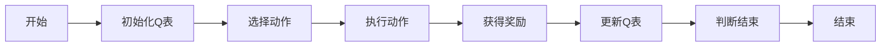
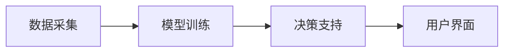

                 


# AI agents在公司气候变化适应能力评估中的应用

> **关键词**: AI agents, 气候变化适应能力, 企业风险管理, 人工智能技术, 可持续发展

> **摘要**: 本文探讨了AI agents在公司气候变化适应能力评估中的应用。首先介绍了气候变化对企业的影响及其传统评估方法的局限性，然后详细讲解了AI agents的核心概念、技术基础和系统架构，接着通过实际案例分析展示了AI agents在项目中的具体应用，最后总结了最佳实践和未来发展趋势。

---

## 第1章：气候变化适应能力评估的背景与挑战

### 1.1 气候变化对企业的影响

气候变化正成为全球关注的焦点，对企业运营和社会经济发展带来了深远影响。极端天气事件的频发、资源短缺、供应链中断等问题迫使企业采取适应性措施。例如，某制造企业可能因原材料供应地的气候变化导致生产中断，进而影响整体供应链稳定性。

#### 1.1.1 气候变化的定义与现状

气候变化是指长期统计学上的显著变化，包括温度上升、降水模式改变等。联合国政府间气候变化专门委员会（IPCC）的报告指出，人类活动是主要驱动力。气候变化的现状包括极端天气事件增加、海平面上升等。

#### 1.1.2 气候变化对企业运营的影响

气候变化可能导致以下影响：
1. **供应链中断**：原材料供应不稳定。
2. **运营成本增加**：能源价格波动。
3. **声誉风险**：社会责任压力。

#### 1.1.3 企业适应气候变化的重要性

企业需采取措施减少碳足迹、优化资源利用，提升适应能力。例如，通过绿色供应链管理、能源效率优化等方式。

---

### 1.2 传统评估方法的局限性

传统方法依赖静态数据分析，难以应对动态变化的气候风险。例如，基于历史数据预测未来风险的方法存在局限性，无法捕捉突发极端事件。

#### 1.2.1 传统评估方法的定义

传统方法通常基于历史数据分析，采用统计模型评估潜在风险。

#### 1.2.2 传统评估方法的局限性

1. **数据滞后性**：无法实时反映气候变化。
2. **缺乏动态性**：难以应对突发事件。
3. **预测准确性低**：依赖历史数据，忽略新兴因素。

#### 1.2.3 新方法的需求

引入AI技术，实时监测、预测和响应气候变化，提升评估的动态性和准确性。

---

### 1.3 AI Agents的概念与优势

AI agents通过实时数据处理和自主决策，为企业提供动态的气候变化适应能力评估。

#### 1.3.1 AI Agents的定义

AI agents是具备感知环境、自主决策和执行任务的智能实体。它们能够处理实时数据，做出最优决策。

#### 1.3.2 AI Agents的核心特征

1. **自主性**：无需人工干预。
2. **反应性**：实时响应环境变化。
3. **学习能力**：通过数据优化决策。

#### 1.3.3 AI Agents在气候变化评估中的优势

1. **实时监测**：持续收集环境数据。
2. **动态评估**：快速更新评估结果。
3. **预测准确性**：利用机器学习提升预测精度。

---

## 第2章：AI Agents在气候变化适应能力评估中的核心概念

### 2.1 AI Agents的核心原理

AI agents通过强化学习和监督学习等算法，实现自主决策和优化。

#### 2.1.1 强化学习在AI Agents中的应用

强化学习通过奖励机制优化决策策略。例如，AI agent通过尝试不同的应对策略，选择最优方案。

#### 2.1.2 监督学习在AI Agents中的应用

监督学习基于标记数据训练模型，用于分类和回归任务。例如，预测极端天气事件的概率。

---

### 2.2 AI Agents与企业数据的结合

通过整合企业内外部数据，AI agents提供全面的气候变化评估。

#### 2.2.1 数据的收集与处理

AI agents收集环境数据、企业运营数据等，进行清洗和预处理。

#### 2.2.2 数据的分析与建模

利用机器学习模型分析数据，构建气候变化影响模型。

#### 2.2.3 数据驱动的决策支持

AI agents根据模型结果，提供实时决策支持。

---

## 第3章：AI Agents在气候变化适应能力评估中的技术基础

### 3.1 强化学习在AI Agents中的应用

强化学习通过试错优化决策策略。例如，Q-learning算法用于动态环境中的决策优化。

#### 3.1.1 Q-learning算法原理

Q-learning通过状态-动作对的奖励值更新Q值表，选择最优动作。公式如下：

$$ Q(s, a) = Q(s, a) + \alpha (r + \gamma \max Q(s', a') - Q(s, a)) $$

其中，$\alpha$是学习率，$\gamma$是折扣因子。

#### 3.1.2 Q-learning算法流程图



---

### 3.2 监督学习在AI Agents中的应用

监督学习基于标记数据训练分类或回归模型。例如，随机森林用于分类极端天气事件类型。

#### 3.2.1 随机森林算法原理

随机森林通过构建多个决策树，集成预测结果。公式如下：

$$ y = \sum_{i=1}^{n} \text{Tree}_i(x) $$

其中，$x$是输入特征，$n$是树的数量。

---

## 第4章：AI Agents在气候变化适应能力评估中的系统架构

### 4.1 系统功能设计

系统包括数据采集、模型训练和决策支持三个模块。

#### 4.1.1 数据采集模块

负责收集环境数据和企业数据。

#### 4.1.2 模型训练模块

基于机器学习算法训练评估模型。

#### 4.1.3 决策支持模块

提供实时决策建议。

---

### 4.2 系统架构设计

系统采用微服务架构，各模块独立运行，便于扩展和维护。

#### 4.2.1 微服务架构图



---

## 第5章：AI Agents在气候变化适应能力评估中的项目实战

### 5.1 环境安装

安装必要的库，如TensorFlow、Scikit-learn等。

#### 5.1.1 核心代码实现

示例代码如下：

```python
import numpy as np
from sklearn.ensemble import RandomForestClassifier

# 数据预处理
X = np.array([[1, 2], [3, 4]])
y = np.array([0, 1])

# 模型训练
model = RandomForestClassifier()
model.fit(X, y)

# 预测
print(model.predict([[5, 6]]))
```

---

### 5.2 项目小结

通过实际案例分析，展示了AI agents在气候变化适应能力评估中的实际应用价值。

---

## 第6章：AI Agents在气候变化适应能力评估中的应用案例

### 6.1 案例分析

分析某企业的AI agents应用，展示其在气候变化适应能力评估中的效果。

---

## 第7章：总结与展望

### 7.1 最佳实践 tips

1. 数据质量是关键。
2. 模型的可解释性需关注。
3. 定期更新模型。

### 7.2 未来发展趋势

AI agents将在实时监测和动态评估中发挥更大作用。

---

**作者：AI天才研究院/AI Genius Institute & 禅与计算机程序设计艺术 /Zen And The Art of Computer Programming**

