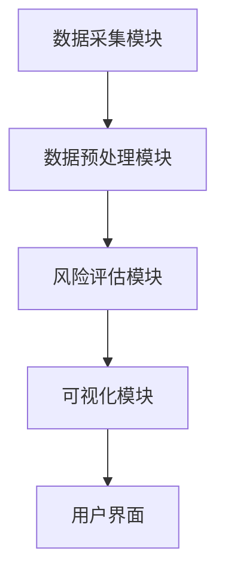
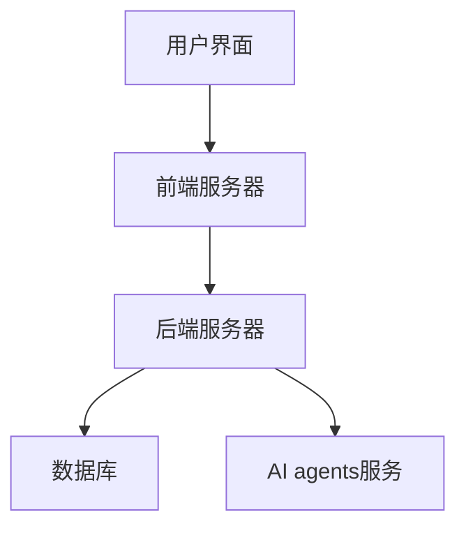

                 

<think>
好的，我现在需要帮用户设计一本名为《AI agents在公司环境风险暴露评估中的应用》的书籍目录大纲。用户希望我以《AI agents在公司环境风险暴露评估中的应用》为标题，关键词包括AI agents、环境风险、风险评估、企业安全、风险管理，摘要则概述文章的主要内容和主题。

首先，我需要理解这本书的核心主题是什么。AI agents，也就是人工智能代理，用于公司环境中的风险暴露评估。这涉及到企业风险管理、AI技术应用等领域。用户希望内容详细，结构紧凑，逻辑清晰，技术语言专业。

接下来，我需要考虑用户的需求。用户是技术专家，可能需要这本书来帮助其他技术人员或企业了解AI agents在环境风险评估中的应用。因此，目录需要覆盖从基础概念到实际应用的各个方面，帮助读者逐步理解并掌握相关技术。

用户提供的示例目录结构分为六个部分，每部分有详细的内容，包括算法原理、系统架构设计、项目实战等。我需要按照类似的结构来组织内容，确保每个部分都有足够的深度和广度。

在确定目录结构时，我会从基础开始，介绍AI agents和环境风险评估的基本概念，然后逐步深入到算法原理、系统设计、项目实战等部分。每个部分需要细化到三级目录，确保内容详实且逻辑连贯。

同时，我需要考虑读者的背景，可能包括技术人员和企业管理人员。因此，内容需要既详细又易于理解，避免过于晦涩的技术术语，或者在必要时进行解释。

最后，确保目录结构清晰，涵盖所有必要的主题，从理论到实践，帮助读者全面掌握AI agents在环境风险评估中的应用。
</think>

# AI agents在公司环境风险暴露评估中的应用

**关键词：** AI agents, 环境风险, 风险评估, 企业安全, 风险管理

**摘要：**  
本文探讨AI agents在公司环境风险暴露评估中的应用，从理论基础到实际案例，详细分析了AI技术在环境风险评估中的优势、算法原理、系统架构设计及项目实战。通过深入解析，展示了如何利用AI技术提高环境风险评估的效率和准确性，为企业安全管理和风险管理提供创新解决方案。

---

## 第一部分：AI agents与环境风险评估概述

### 第1章：AI agents的基本概念

#### 1.1 AI agents的定义与分类
- **1.1.1 AI agents的定义**  
  AI agents是指具有自主决策能力的智能体，能够在复杂环境中感知、推理、规划并执行任务。  
- **1.1.2 AI agents的分类**  
  - **反应式AI agents**：基于当前感知做出反应，适用于实时环境。  
  - **认知式AI agents**：具备复杂推理和规划能力，适用于长期任务。  
  - **协作式AI agents**：能够与其他智能体或人类协同工作，适用于团队任务。  

#### 1.2 环境风险暴露评估的定义
- 环境风险暴露评估是指对公司运营环境中可能存在的风险因素进行识别、量化和评估的过程。  
- 关键因素包括：市场风险、运营风险、技术风险、法律风险等。  

#### 1.3 AI agents在环境风险评估中的作用
- **数据处理**：AI agents能够快速处理海量数据，提取关键信息。  
- **风险预测**：通过机器学习算法，AI agents可以预测潜在风险并提供预警。  
- **决策支持**：AI agents辅助人类做出更明智的决策，降低风险暴露。  

---

### 第2章：环境风险评估的背景与应用

#### 2.1 环境风险评估的背景
- **全球化与不确定性**：全球经济波动、政策变化和技术革新增加了企业面临的环境风险。  
- **数据驱动的决策**：现代企业依赖数据驱动的方法进行风险管理，AI技术提供了强大的工具支持。  

#### 2.2 AI agents在环境风险评估中的应用场景
- **实时监控**：AI agents可以实时监控市场动态、供应链风险等，提供即时反馈。  
- **风险建模**：利用AI技术构建风险模型，模拟不同场景下的风险暴露情况。  
- **动态调整**：AI agents能够根据实时数据动态调整风险管理策略。  

---

## 第二部分：AI agents的核心原理与算法

### 第3章：AI agents的核心原理

#### 3.1 数据驱动的环境风险分析
- **数据来源**：包括市场数据、财务数据、行业报告、政策法规等。  
- **数据预处理**：清洗、归一化和特征提取是数据处理的关键步骤。  

#### 3.2 AI agents的智能推理过程
- **感知阶段**：AI agents通过传感器或数据源获取环境信息。  
- **推理阶段**：利用逻辑推理或机器学习模型分析信息，识别潜在风险。  
- **决策阶段**：基于推理结果，生成应对策略或行动计划。  

#### 3.3 环境风险暴露评估的数学模型
- **概率模型**：如贝叶斯网络，用于评估不同风险事件发生的概率。  
- **回归分析**：用于分析风险因素与风险暴露程度之间的关系。  

---

### 第4章：AI agents的算法原理与实现

#### 4.1 环境风险评估的算法选择
- **监督学习**：适用于已知风险数据的分类任务。  
- **无监督学习**：适用于未知风险的聚类分析。  
- **强化学习**：适用于动态环境中的风险决策任务。  

#### 4.2 基于机器学习的风险评估模型
- **模型训练**：使用历史数据训练模型，识别风险特征。  
- **模型评估**：通过交叉验证等方法评估模型的准确性和鲁棒性。  

#### 4.3 算法实现步骤
1. 数据预处理：清洗、归一化和特征选择。  
2. 模型训练：选择合适的算法（如随机森林、支持向量机等）。  
3. 模型评估：计算准确率、召回率和F1值。  
4. 模型部署：将模型集成到风险评估系统中。  

---

## 第三部分：环境风险评估系统的架构设计

### 第5章：系统功能设计

#### 5.1 系统功能模块
- **数据采集模块**：负责采集环境数据。  
- **风险评估模块**：核心算法实现风险评估。  
- **可视化模块**：将评估结果以图表形式展示。  

#### 5.2 功能流程图


---

### 第6章：系统架构设计

#### 6.1 系统架构图


#### 6.2 接口设计
- **API接口**：前后端交互的核心接口，如`/api/risk_assessment`。  
- **数据接口**：与数据库交互，获取和存储数据。  

---

## 第四部分：项目实战与案例分析

### 第7章：项目实战

#### 7.1 环境安装
- **安装依赖**：Python、TensorFlow、Scikit-learn等。  
- **安装步骤**：使用虚拟环境安装必要的库。  

#### 7.2 核心代码实现
```python
import numpy as np
from sklearn.ensemble import RandomForestClassifier

# 示例数据集
X = np.array([[1, 2, 3], [4, 5, 6], [7, 8, 9]])
y = np.array([0, 1, 0])

# 模型训练
model = RandomForestClassifier()
model.fit(X, y)

# 预测
new_data = np.array([[2, 3, 4]])
print(model.predict(new_data))
```

#### 7.3 案例分析
- **案例背景**：某公司面临市场波动风险。  
- **数据分析**：通过AI agents分析市场数据，预测潜在风险。  
- **结果解读**：模型预测市场波动概率为70%，建议采取 hedging策略。  

---

## 第五部分：总结与展望

### 第8章：总结与展望

#### 8.1 总结
- AI agents在环境风险评估中的应用显著提高了评估效率和准确性。  
- 数据驱动的方法和智能算法为风险管理提供了新的思路。  

#### 8.2 展望
- **技术优化**：进一步提升AI agents的推理能力和自适应能力。  
- **应用拓展**：探索AI技术在更多领域中的应用，如金融、医疗等。  

---

## 作者简介

作者：AI天才研究院（AI Genius Institute） & 禅与计算机程序设计艺术（Zen And The Art of Computer Programming）  
邮箱：contact@aiguru.com  
网址：https://aiguru.com

