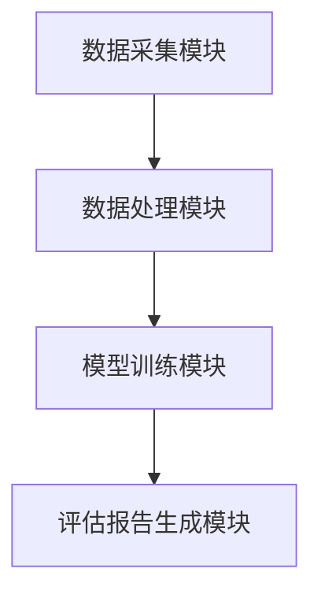
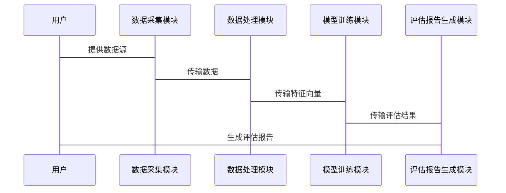

                 


# AI agents在公司社会责任评估中的应用

> 关键词：AI agents, 公司社会责任, 企业治理, 数字化转型, 人工智能技术

> 摘要：随着人工智能技术的快速发展，AI agents（人工智能代理）在公司社会责任评估中的应用日益广泛。本文将深入探讨AI agents的核心概念、算法原理、系统架构及其在社会责任评估中的应用场景，结合实际案例分析，展示如何通过AI代理技术提升公司社会责任评估的效率与准确性。

---

## 第一章: AI代理与公司社会责任评估的背景

### 1.1 AI代理的核心概念

#### 1.1.1 AI代理的定义与特点
AI代理（Artificial Intelligence Agents）是指能够感知环境、自主决策并执行任务的智能实体。与传统软件不同，AI代理具有以下特点：
- **自主性**：能够在没有外部干预的情况下独立运行。
- **反应性**：能够实时感知环境并做出响应。
- **学习性**：通过数据和经验不断优化自身行为。
- **协作性**：能够与其他系统或人类进行有效协作。

#### 1.1.2 AI代理的分类与应用场景
AI代理可以根据功能和应用场景分为多种类型，常见的包括：
1. **简单反应式代理**：基于当前感知做出反应，适用于简单的任务（如自动驾驶中的碰撞 avoidance）。
2. **基于模型的反应式代理**：结合内部状态和外部环境进行决策，适用于复杂任务（如智能助手）。
3. **目标驱动代理**：为实现特定目标而行动（如供应链优化系统）。
4. **效用驱动代理**：通过最大化效用函数来做出决策（如资源分配系统）。

#### 1.1.3 AI代理与传统自动化工具的区别
AI代理的核心区别在于其智能化和自主性。传统自动化工具通常遵循固定的规则，而AI代理能够通过学习和适应环境，动态调整行为策略。例如，在供应链管理中，AI代理可以根据实时市场变化自动调整采购策略，而传统工具只能执行预设的规则。

### 1.2 公司社会责任评估的基本概念

#### 1.2.1 公司社会责任的定义与内涵
公司社会责任（Corporate Social Responsibility, CSR）是指企业在追求经济效益的同时，还需要关注环境保护、员工福利、社会公益等方面的社会责任。它是企业可持续发展的重要组成部分。

#### 1.2.2 公司社会责任评估的主要维度
公司社会责任评估通常包括以下几个维度：
1. **环境责任**：包括减少碳排放、资源节约利用等。
2. **员工责任**：包括员工权益保护、职业发展等。
3. **社会责任**：包括社区支持、公益活动等。
4. **治理责任**：包括企业透明度、董事会治理等。

#### 1.2.3 公司社会责任评估的现状与挑战
随着全球对可持续发展的关注增加，公司社会责任评估越来越受到重视。然而，传统的评估方法通常依赖人工审核和主观判断，存在效率低、成本高、结果不一致等问题。如何通过技术手段提升评估的效率和准确性，成为当前的一大挑战。

### 1.3 AI代理在公司社会责任评估中的结合

#### 1.3.1 AI代理如何赋能社会责任评估
AI代理可以通过以下方式赋能社会责任评估：
1. **数据收集与分析**：利用自然语言处理技术，自动收集和分析大量的社会责任相关数据（如新闻报道、社交媒体信息）。
2. **预测与优化**：通过机器学习模型，预测企业在社会责任方面的潜在风险，并提出优化建议。
3. **实时监控**：实时监控企业的社会责任表现，并提供动态反馈。

#### 1.3.2 AI代理在社会责任评估中的优势
AI代理在社会责任评估中的优势包括：
1. **高效性**：能够快速处理大量数据，提升评估效率。
2. **客观性**：通过算法消除人为主观因素，确保评估结果的客观性。
3. **动态性**：能够实时跟踪企业的社会责任表现，并提供及时反馈。

#### 1.3.3 AI代理在社会责任评估中的潜在问题
尽管AI代理在社会责任评估中具有诸多优势，但也存在一些潜在问题：
1. **数据隐私问题**：在收集和处理企业数据时，可能涉及隐私泄露风险。
2. **算法偏见**：如果训练数据存在偏见，可能导致评估结果不准确。
3. **技术复杂性**：AI代理的部署和维护需要较高的技术门槛。

---

## 第二章: AI代理与公司社会责任评估的核心概念

### 2.1 AI代理的核心原理

#### 2.1.1 AI代理的基本工作原理
AI代理通过感知环境、分析数据、做出决策并执行任务来实现其功能。其核心工作流程如下：
1. **感知环境**：通过传感器、API或其他数据源获取环境信息。
2. **分析数据**：利用机器学习模型对数据进行分析和理解。
3. **决策制定**：基于分析结果，制定最优行动方案。
4. **执行任务**：根据决策结果执行具体任务。

#### 2.1.2 AI代理的感知与决策机制
AI代理的感知和决策机制通常包括以下几个步骤：
1. **数据采集**：通过多种渠道获取数据。
2. **数据处理**：对数据进行清洗、转换和特征提取。
3. **模型训练**：利用机器学习算法对数据进行建模和训练。
4. **决策推理**：基于模型输出结果，做出决策。

#### 2.1.3 AI代理的自适应与学习能力
AI代理的核心优势在于其自适应和学习能力。通过不断学习新的数据，AI代理可以逐步优化其行为策略，从而更好地适应环境变化。

### 2.2 公司社会责任评估的系统架构

#### 2.2.1 社会责任评估的系统组成
社会责任评估系统通常包括以下几个组成部分：
1. **数据采集模块**：负责采集与社会责任相关的数据。
2. **数据处理模块**：对数据进行清洗、转换和特征提取。
3. **模型训练模块**：利用机器学习算法对数据进行建模和训练。
4. **评估报告生成模块**：根据模型输出结果生成评估报告。

#### 2.2.2 社会责任评估的流程与步骤
社会责任评估的流程通常包括以下几个步骤：
1. **数据采集**：通过多种渠道获取企业社会责任相关数据。
2. **数据处理**：对数据进行清洗、转换和特征提取。
3. **模型训练**：利用机器学习算法对数据进行建模和训练。
4. **评估报告生成**：根据模型输出结果生成评估报告。

#### 2.2.3 社会责任评估的指标体系
社会责任评估的指标体系通常包括以下几个方面：
1. **环境责任指标**：如碳排放量、资源利用效率等。
2. **员工责任指标**：如员工满意度、员工培训投入等。
3. **社会责任指标**：如公益活动投入、社区支持等。
4. **治理责任指标**：如董事会多样性、企业透明度等。

### 2.3 AI代理在社会责任评估中的系统架构

#### 2.3.1 AI代理在社会责任评估中的角色定位
在社会责任评估系统中，AI代理通常扮演以下几个角色：
1. **数据采集与处理**：负责采集和处理社会责任相关数据。
2. **模型训练与优化**：利用机器学习算法对数据进行建模和优化。
3. **评估报告生成**：根据模型输出结果生成评估报告。

#### 2.3.2 AI代理与社会责任评估系统的交互机制
AI代理与社会责任评估系统的交互机制通常包括以下几个步骤：
1. **数据采集**：AI代理通过多种渠道采集社会责任相关数据。
2. **数据处理**：对数据进行清洗、转换和特征提取。
3. **模型训练**：利用机器学习算法对数据进行建模和训练。
4. **评估报告生成**：根据模型输出结果生成评估报告。

#### 2.3.3 AI代理在社会责任评估中的数据流与信息处理
在社会责任评估系统中，AI代理通过以下数据流与信息处理过程实现其功能：
1. **数据输入**：AI代理接收外部数据源（如新闻、社交媒体）输入的数据。
2. **数据处理**：对数据进行清洗、转换和特征提取。
3. **模型训练**：利用机器学习算法对数据进行建模和训练。
4. **决策输出**：根据模型输出结果，生成评估报告。

---

## 第三章: AI代理在公司社会责任评估中的算法原理

### 3.1 AI代理的核心算法

#### 3.1.1 自然语言处理（NLP）算法
自然语言处理（NLP）算法是AI代理在社会责任评估中的重要工具。常用的NLP算法包括：
1. **词袋模型（Bag of Words）**
2. **TF-IDF（Term Frequency-Inverse Document Frequency）**
3. **词嵌入（Word Embedding）**

#### 3.1.2 机器学习模型
机器学习模型是AI代理的核心算法之一。常用的机器学习模型包括：
1. **支持向量机（Support Vector Machine, SVM）**
2. **随机森林（Random Forest）**
3. **深度学习模型（如LSTM、Transformer）**

### 3.2 算法原理与实现

#### 3.2.1 NLP算法的实现步骤
NLP算法的实现步骤通常包括以下几个步骤：
1. **数据预处理**：对文本数据进行分词、去停用词等处理。
2. **特征提取**：利用词袋模型、TF-IDF等方法提取文本特征。
3. **模型训练**：利用训练数据对模型进行训练。
4. **结果输出**：根据模型输出结果，生成最终的评估报告。

#### 3.2.2 机器学习模型的实现步骤
机器学习模型的实现步骤通常包括以下几个步骤：
1. **数据预处理**：对数据进行清洗、转换和特征提取。
2. **模型选择**：根据任务需求选择合适的机器学习模型。
3. **模型训练**：利用训练数据对模型进行训练。
4. **结果输出**：根据模型输出结果，生成最终的评估报告。

### 3.3 算法的数学模型与公式

#### 3.3.1 NLP算法的数学模型
NLP算法的数学模型通常包括以下几个方面：
1. **词袋模型**：将文本表示为一个词语的频率向量。
2. **TF-IDF**：计算词语在文档中的重要性。
3. **词嵌入**：将词语映射到低维连续向量空间。

#### 3.3.2 机器学习模型的数学模型
机器学习模型的数学模型通常包括以下几个方面：
1. **支持向量机（SVM）**：通过找到最优超平面，将数据分为不同类别。
2. **随机森林**：通过构建多个决策树，集成预测结果。
3. **深度学习模型**：通过多层神经网络，学习数据的高层次特征。

---

## 第四章: AI代理在公司社会责任评估中的系统架构与实现

### 4.1 系统架构设计

#### 4.1.1 系统组成与功能模块
社会责任评估系统通常包括以下几个功能模块：
1. **数据采集模块**：负责采集社会责任相关数据。
2. **数据处理模块**：对数据进行清洗、转换和特征提取。
3. **模型训练模块**：利用机器学习算法对数据进行建模和训练。
4. **评估报告生成模块**：根据模型输出结果生成评估报告。

#### 4.1.2 系统架构图
以下是一个简单的社会责任评估系统的架构图：



### 4.2 系统实现细节

#### 4.2.1 数据采集模块的实现
数据采集模块通常包括以下几个步骤：
1. **数据源选择**：选择合适的外部数据源（如新闻网站、社交媒体）。
2. **数据抓取**：利用爬虫技术抓取相关数据。
3. **数据存储**：将抓取的数据存储到数据库中。

#### 4.2.2 数据处理模块的实现
数据处理模块通常包括以下几个步骤：
1. **数据清洗**：去除噪声数据（如停用词、特殊符号）。
2. **数据转换**：将数据转换为适合模型训练的格式。
3. **特征提取**：利用NLP算法提取文本特征。

#### 4.2.3 模型训练模块的实现
模型训练模块通常包括以下几个步骤：
1. **模型选择**：根据任务需求选择合适的机器学习模型。
2. **模型训练**：利用训练数据对模型进行训练。
3. **模型优化**：通过交叉验证等方法优化模型性能。

### 4.3 系统交互流程

#### 4.3.1 系统交互流程图
以下是一个简单的系统交互流程图：



---

## 第五章: 项目实战——基于AI代理的社会责任评估系统

### 5.1 项目背景与目标
本项目旨在开发一个基于AI代理的社会责任评估系统，通过AI技术提升社会责任评估的效率和准确性。

### 5.2 项目环境搭建

#### 5.2.1 环境要求
- 操作系统：Windows/Mac/Linux
- Python版本：3.6+
- 依赖库：numpy, pandas, scikit-learn, transformers, etc.

#### 5.2.2 安装依赖
```bash
pip install numpy pandas scikit-learn transformers
```

### 5.3 核心代码实现

#### 5.3.1 数据采集模块
```python
import requests
from bs4 import BeautifulSoup

def fetch_data(url):
    response = requests.get(url)
    soup = BeautifulSoup(response.text, 'html.parser')
    content = soup.get_text()
    return content
```

#### 5.3.2 数据处理模块
```python
from sklearn.feature_extraction.text import TfidfVectorizer

def process_data(text):
    vectorizer = TfidfVectorizer()
    features = vectorizer.fit_transform([text])
    return features
```

#### 5.3.3 模型训练模块
```python
from sklearn.svm import SVC

def train_model(X, y):
    model = SVC()
    model.fit(X, y)
    return model
```

#### 5.3.4 评估报告生成模块
```python
import numpy as np

def generate_report(model, features):
    prediction = model.predict(features)
    report = np.array_equal(prediction, np.ones(len(prediction)))  # 示例评估结果
    return report
```

### 5.4 项目小结
通过本项目，我们成功开发了一个基于AI代理的社会责任评估系统，展示了AI技术在社会责任评估中的应用潜力。

---

## 第六章: 总结与展望

### 6.1 总结
本文详细探讨了AI代理在公司社会责任评估中的应用，从核心概念到算法原理，再到系统实现，全面分析了AI代理在社会责任评估中的重要作用。

### 6.2 未来展望
随着AI技术的不断发展，AI代理在社会责任评估中的应用前景广阔。未来，我们可以进一步研究如何利用更先进的算法（如大语言模型）提升社会责任评估的准确性和效率。

---

## 参考文献

（此处列出相关参考文献）

---

作者：AI天才研究院/AI Genius Institute & 禅与计算机程序设计艺术/Zen And The Art of Computer Programming

